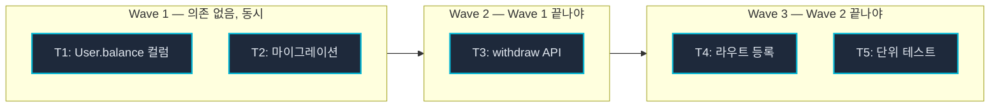
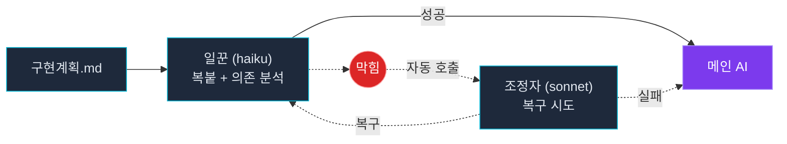
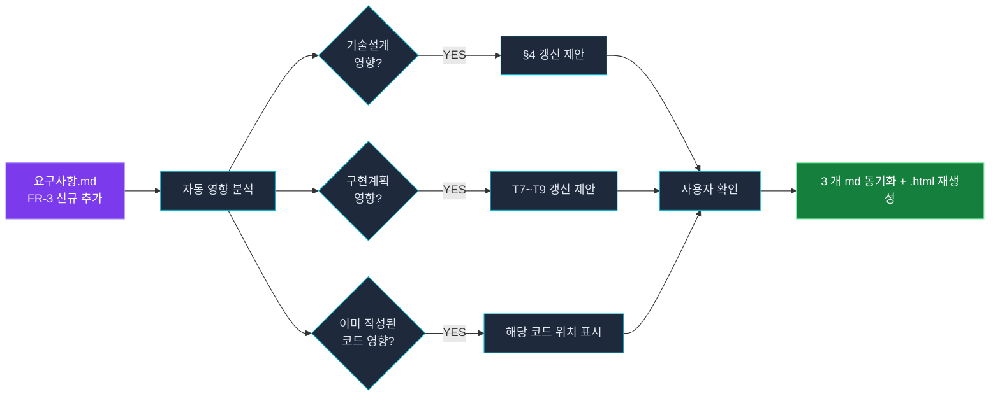
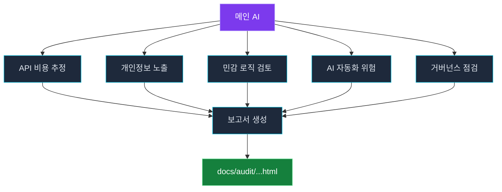

<div align="center">

# dj-superkit

### 프로덕션 코드를 안전하게 만들고 실용적으로 만드는 에이전틱 플러그인

머릿속 아이디어가 실제 코드가 되기까지, 매 단계마다 한 번 더 확인합니다.
**문서와 코드가 따로 놀지 않도록, AI 가 멋대로 진행하지 않도록.**

<br/>

<p>
  
  
  
  
  
</p>

<p>
  
  
  
</p>

<sub>upstream <a href="https://github.com/obra/superpowers">superpowers</a> 5.0.7 (MIT, Jesse Vincent) 의 프로덕션 안전성 확장</sub>

</div>

<br/>

> **계보(Lineage)**: 이 플러그인은 [superpowers](https://github.com/obra/superpowers) v5.0.7 (MIT, Jesse Vincent)의 방법론을 계승해 DJ가 커스텀한 파생 프로젝트입니다.


---

## 왜 만들었나

> AI 코딩 에이전트는 빠릅니다. 그 빠름이 오히려 **검토 · 통제 · 맥락**을 무너뜨립니다.

리뷰해 줄 동료 없이 혼자 AI 로 프로덕션 코드를 짜다 보면, 세 가지가 반복돼요.

<table>
<tr>
<td width="33%" valign="top">

#### 🔍 검토가 벅차다

AI 가 코드를 쏟아내는데, 뭘 왜 그렇게 했는지 따라가기 어려워요.

**→ 단계마다 검토용 문서를 자동으로.** 사람이 읽을 `.md` + 보기 좋은 `.html` 사본. 사람은 `.html` 만 훑고, AI 는 `.md` 만 읽어요.

</td>
<td width="33%" valign="top">

#### 🛑 AI 가 멋대로 간다

되묻지 않고 코드를 갈아엎거나, 중요한 결정을 몰래 내려요.

**→ 단계마다 확인 게이트.** 자잘한 건 알아서, **위험한 결정만 사람에게** 물어봐요 — 자리에 없어도 OS 알람으로 catch.

</td>
<td width="33%" valign="top">

#### 🔗 문서와 코드가 따로 논다

요구사항은 계속 바뀌는데, 설계 · 계획 · 코드가 어긋나요.

**→ 하나 바꾸면 아래로 자동 전파.** 위험한 코드엔 `# RISK` 주석, 문서엔 "왜 · 언제 · 무엇이" 변경이력이 자동으로 쌓여요.

</td>
</tr>
</table>

<div align="center">

**아이디어에서 코드까지를 `기획 → 설계 → 계획 → 실행` 4 단계로 나누고,**
**매 단계에 _검토 문서 · 확인 게이트 · 자동 기록_ 을 끼워 넣은 것 — 그게 dj-superkit 입니다.**

<sub>👤 리뷰해 줄 동료 없이 AI 로 실제 코드를 짜는 <b>1인 개발자</b>를 위해 — 속도와 안전을 혼자 다 챙겨야 하는 사람.</sub>

</div>

<br/>

---

## 전체 흐름 한눈에


각 단계 사이 **확인 게이트** 에서 AI 가 한 번 멈춥니다. 다음 단계로 자동으로 넘어가지 않아요.

<br/>

---

## 1 분이면 시작합니다

**1. 설치** — Claude Code 안에서:

```
/plugin marketplace add deokjinlog/dj-superkit
/plugin install dj-superkit@dj-superkit
```

세션 한 번 재시작하면 끝.

**2. 첫 피처 만들기** — 슬래시 4 줄로:

```
/brainstorming 사용자 잔액 출금 기능
/tech-design
/writing-plans
/executing-plans
```

각 단계가 끝날 때마다 AI 가 한 번씩 물어봐요. 답변에 따라 다음 단계로.

<sub>산출물은 <code>docs/features/2026-05-23-사용자-잔액-출금/</code> 폴더에 3 개 <code>.md</code> + 보기 좋은 <code>.html</code> 사본까지 알아서 만들어 둡니다.</sub>

<br/>

---

## 서브에이전트 모드 — 계획서 그대로 복붙 + 의존그래프 자동 병렬

> *"피처가 커서 task 가 7-8 개인데, 하나씩 하면 시간 너무 걸려요"*
> *"근데 AI 가 코드 새로 짓는 건 더 무서워요. 계획 그대로만 했으면 좋겠어요"*

서브에이전트 모드는 두 가지 강력한 약속을 합니다.

**① 일꾼 AI 는 계획서를 그대로 복붙해요**

구현계획.md 의 task 마다 `**원본**` → `**수정본**` 변경이 적혀 있어요. 일꾼 AI 는 그 변경을 **한 글자도 안 틀리게 복사** 해서 실제 코드에 적용합니다. 자기 머리로 새 코드를 짓지 않아요. 의심스러우면 즉시 멈춥니다.

→ AI 가 계획에 없던 코드를 만들어서 깨지는 사고 **0**.

**② 의존그래프를 자동 분석해 wave 로 묶어 동시 처리**

7 개 task 를 무작정 7 개 동시에 돌리지 않아요. 먼저 task 사이 의존관계를 분석한 뒤 **wave 단위** 로 묶어 단계적으로 dispatch 합니다.



Wave 1 (T1+T2 동시) → Wave 2 (T3) → Wave 3 (T4+T5 동시). 순서가 꼬여서 깨질 일 없이, 안전한 범위에서 최대 병렬.

**③ 일꾼이 막히면 조정자가 먼저 복구 시도해요**



<table>
<tr>
<td width="50%" valign="top">

**이렇게 동작해요**

- 일꾼은 계획서 변경을 **그대로 복붙** — 자기 머리로 코드 X
- task 의존그래프 자동 분석 → **wave 단위 병렬**
- 막혀도 조정자가 **자동 복구 먼저** 시도
- 그래도 안 되면 그제서야 사람에게

</td>
<td width="50%" valign="top">

**그래서 뭐가 좋아요?**

- 7 task → 3 wave 로 묶이면 **체감 시간 ⅓ ~ ½**
- 계획서가 기준 → **AI 멋대로 코드 짓는 사고 0**
- 의존 있는 건 **자동으로 순서대로** → race / 깨짐 차단
- 일꾼 = haiku (저렴) / 조정자 = sonnet (똑똑) → **비용·속도·안전 동시**

</td>
</tr>
</table>

<br/>

---

## 기획자가 새 요구사항을 추가해도, 3 개 문서가 같이 따라옵니다

> *"기획에서 갑자기 FR 하나 추가됐어요. 기술설계랑 구현계획도 다 다시 봐야 해요. 코드는 어디까지 영향 있는지도 모르겠어요"*

스펙은 살아있는 동안 계속 바뀝니다. 그때마다 3 개 문서를 손으로 정합 맞추는 건 사람의 일이 아니에요. **dj-superkit 는 그걸 자동으로**:



<table>
<tr>
<td width="50%" valign="top">

**자동으로 일어나는 일**

- 요구사항 수정 → 기술설계 / 구현계획 **둘 다** 영향 분석
- 이미 작성된 코드가 있다면 **어디서 깨질지** 위치 표시
- 사용자 확인 후 3 개 md 가 **한 번에 정렬**
- `.html` 사본도 stale 표시 → `/sync-html` 로 재생성
- 각 문서 footer 에 **"왜, 언제, 무엇이 바뀌었는지"** 자동 기록

</td>
<td width="50%" valign="top">

**그래서 뭐가 좋아요?**

- 기획자 / PM 이 새 요구사항을 던져도 **3 개 문서가 따로 놀지 않음**
- 한 달 뒤에 본인이 다시 봐도 변경이력 footer 로 **맥락이 살아있음**
- PR 작성 직전, 머지 직전, 운영 중 어느 시점이든 **같은 흐름**
- 깜박하고 한 문서만 고쳐서 3 개 문서가 어긋나는 사고 차단

</td>
</tr>
</table>

<br/>

---

## 매일 쓰는 도구들

### `/auto-brainstorming` — 한 번에 끝까지 자동 진행

> *"4 단계마다 매번 게이트 답하기 무거워요. clarifying Q 만 답하면 끝까지 갔으면 좋겠어요"*

친숙한 영역 / 작은 ~ 중간 피처 / 빠른 prototype 일 때. PRD → 기술설계 → 구현계획 → 실행까지 **4 단계 chain 을 자동으로** 돌리되, 변경이력 / 위험 주석 / 3 개 MD 산출물은 **그대로** 챙겨갑니다.

<table>
<tr>
<td width="50%" valign="top">

**이렇게 쓰세요**

```
/auto-brainstorming 사용자 잔액 출금 기능
```

→ AI 가 Socratic clarifying Q 1~5 개를 물어봐요.
→ 사용자는 답변만. 그 뒤로 모든 단계 자동 진행.

</td>
<td width="50%" valign="top">

**그래서 뭐가 좋아요?**

- 4 단계 게이트 자동 → **답할 게 clarifying Q 만**
- 변경이력 / 위험 주석 / 3 MD 산출물은 **그대로**
- 마지막에 wave-parallel 서브에이전트 자동 실행 → **속도까지**
- 친숙한 영역 / 작은 ~ 중간 피처에 최적

</td>
</tr>
</table>

<br/>

### `/fast-tasks` — 잡일 묶어 처리하기

> *"PRD 부터 만들기엔 너무 작은 일인데, 그냥 시키기엔 변경이력은 남기고 싶어요"*

이슈 트래커에 쌓인 자잘한 fix 들. 의존성 업데이트. 같은 파일 안 작은 refactor 묶음.
**4 단계 풀 워크플로는 무겁고, 그냥 chat 으로 던지자니 흔적이 안 남는** 그 사이를 채웁니다.

<table>
<tr>
<td width="50%" valign="top">

**이렇게 쓰세요**

```
/fast-tasks
- 결제 API 응답 v1 → v2 호환 처리
- 로그인 폼 placeholder 한국어로
- requirements.txt requests 버전 bump
- README 의 v2.3.4 → v2.3.5
```

</td>
<td width="50%" valign="top">

**그래서 뭐가 좋아요?**

- PRD / 기술설계 단계는 건너뜀
- 그래도 **변경이력 / 위험 주석 / 확인 게이트는 그대로**
- 한 task 끝날 때마다 footer 가 어지러워지지 않게, **마지막에 한 번에 정리**

</td>
</tr>
</table>

<br/>

### `/audit-risk` — 배포 직전 한 번 더 훑기

> *"배포 전에 보안 / 비용 한 번 점검하고 싶은데 시간이 없어요"*

5 명의 AI 가 동시에 코드를 다른 각도로 훑고, 한 명이 그걸 모아 보기 좋은 HTML 보고서를 만들어 줍니다. 코드는 **건드리지 않아요**.



- Snyk, Bandit 같은 외부 보안 도구를 **대체하는 게 아니라 보완**합니다 (다른 각도로 catch)
- 보고서는 `.html` 한 장 — gitignored, 사람만 보면 됩니다

<br/>

### 무엇을 부르면 뭐가 뜨나 — 치트시트

dj-superkit 는 **두 가지 방식**으로 움직여요.

- **스킬** — 말로 부르면 알아서 떠요 (`/스킬이름` 슬래시도 가능). 워크플로 4 단계가 전부 스킬이에요.
- **명령어** — 슬래시로만. 자동으로는 안 떠요 (일부러).

#### 스킬 — 이렇게 말하면 떠요

| 스킬 | 자연어 예시 | 결과물 |
|---|---|---|
| `brainstorming` | "새 기능 만들자" · "이거 기획하자" | 요구사항.md |
| `tech-design` | "기술 설계하자" · "어떻게 구현할지 짜줘" | 기술설계.md |
| `writing-plans` | "구현 계획 짜줘" · "plan 작성하자" | 구현계획.md |
| `executing-plans` | "이 계획대로 구현해줘" | 코드 + 변경이력 + 위험 주석 |
| `auto-brainstorming` | "자동으로 끝까지 해줘" | 4 단계 자동 진행 |
| `devlog` | "개발로그로 정리해줘" · "티스토리 글로 써줘" · "이 삽질 기록해줘" | 개발로그.md + 발행용 글 |
| `design-style-explorer` | "디자인 시안 뽑아줘" · "12개 스타일 비교" · "○○ 도메인 디자인 보여줘" | 12스타일 HTML + 비교 갤러리 |
| `systematic-debugging` | "이 버그 왜 이러지" · "테스트 자꾸 실패" | 체계적 디버깅 |
| `requesting-code-review` | "이 코드 리뷰해줘" | 리뷰 |
| `finishing-a-development-branch` | "개발 끝났어 마무리하자" | 테스트 게이트 + 정리 |

> 정확한 주문이 아니라 **의도**로 떠요. "개발로그로 정리해줘"든 "블로그 글로 써줘"든 뜻만 통하면 발동. 100% 확실히 하려면 슬래시 `/devlog` 처럼 직접 부르면 돼요.

#### 명령어 — 슬래시로만 (자동 발동 X)

| 명령 | 하는 일 |
|---|---|
| `/list-skills` · `/new-skill` · `/remove-skill` | 스킬 조회 / 생성 / 정리 |
| `/audit-risk` | 5+1 AI 가 보안·거버넌스 동시 점검 → HTML 보고서 |
| `/api-test` | 구현된 API 자동 테스트 |
| `/fast-tasks` | 잡일 여러 개 묶어 처리 |
| `/sync-html` | `.html` 사본 재생성 |
| `/pretty-md` | `.md` 코드블록 정리 (의미 불변) |
| `/og-brainstorm` · `/og-write-plan` · `/og-execute-plan` | upstream 원본 흐름 |

> 빌더(`/list-skills` · `/new-skill` · `/remove-skill`)가 명령인 이유 — 자동으로 뜨면 실수로 스킬을 만들거나 지울 수 있어서 **일부러 슬래시 전용**으로 뒀어요.

> 워크트리는 Claude Code 내장 `--worktree` 를 사용하세요.

<br/>

---

## 한 가지 작업, 세 가지 얼굴

<table>
<tr>
<td width="33%" valign="top" align="center">

#### `.md` — 진짜 문서

요구사항 / 기술설계 / 구현계획 각자 1 개씩.

문서 하단에 **누가 / 언제 / 왜 바꿨는지** 자동으로 쌓여요.

AI 는 항상 이 `.md` 만 봐요.

</td>
<td width="33%" valign="top" align="center">

#### `.html` — 사람용 사본

같은 내용을 다크 모드로 보기 좋게.

차트 / 다이어그램 / 카드를 알아서 골라 넣어요.

**구현계획에서 코드 변경은 초록(+) / 빨강(−)** 으로 한눈에.

</td>
<td width="33%" valign="top" align="center">

#### 코드 — 위험 주석

```python
# RISK(side-effect):
#   외부 결제 호출
#   by: /writing-plans T5
```

3 가지 카테고리로 자동 부착.

PR 리뷰 시 `grep "# RISK"` 한 줄로 catch.

</td>
</tr>
</table>

<br/>

---

## 더 깊이 알고 싶다면

<details>
<summary><b>3 개의 <code>.md</code> 분리는 왜?</b></summary>

<br/>

한 피처가 한 폴더 안에 세 개의 `.md` 로 나뉘어 있어요.

```
docs/features/2026-05-23-잔액-출금/
├── 잔액-출금-requirements.md      ← /brainstorming
├── 잔액-출금-tech-design.md       ← /tech-design
└── 잔액-출금-implementation-plan.md ← /writing-plans
```

- 날짜는 **생성일** — 작업이 길어져도 폴더명은 안 바뀝니다
- 세 문서가 같은 폴더라 PR 리뷰 한 곳에서 끝
- 각 문서 끝에는 변경이력 footer 가 자동 누적

</details>

<details>
<summary><b>변경이력은 어떻게 생겼나요?</b></summary>

<br/>

```markdown
## 변경이력

### CH-001 [요구사항-추가] 2026-05-23 14:30
- **이유**: 사용자가 출금 한도 추가 요청
- **무엇이**: FR-3 (1 일 출금 한도 100 만원) 신설
- **영향범위**: tech-design §4 / impl-plan T7~T9
- **연관 CH-id**: -
```

- 종류: `[요구사항-추가/수정/삭제]` / `[코드-수정]` / `[검증]` / `[릴리즈]`
- 코드 변경은 commit SHA 만 참조 (문서가 무거워지지 않게)
- 한 작업이 여러 task 로 나뉘어도 **마지막에 한 번에 footer 정리** *(v1.1.7+)*

</details>

<details>
<summary><b>위험 주석 3 종</b></summary>

<br/>

```python
# RISK(side-effect): 외부 결제 호출, 멱등성 미보장 — by /writing-plans T5
def charge(user_id, amount):
    return payment_gateway.charge(user_id, amount)

# RISK(breaking): API v1 응답 구조 변경, v1 클라이언트 깨짐 — by /tech-design §3
def get_balance_v2(user_id) -> dict:
    ...

# RISK(race): 동시 출금 시 잔액 차감 충돌 가능 — by /tech-design §5
def withdraw(user_id, amount):
    balance = db.get_balance(user_id)
    ...
```

| 종류 | 무슨 뜻 |
|---|---|
| `side-effect` | 외부 호출 / DB 쓰기 / 파일 / 로그 |
| `breaking` | API 시그니처 / 응답 / DB 스키마 변경 |
| `race` | 동시성 / 트랜잭션 / 멱등성 |

</details>

<details>
<summary><b><code>.html</code> 사본은 어떻게 만들어지나요?</b></summary>

<br/>

`.md` 가 사용자 리뷰 시점에 들어가면, **백그라운드에서 자동으로** `.html` 이 만들어집니다. 메인 작업은 멈추지 않아요.

- **다크 모드 기본** *(v2.3.4+)* — 깊은 어두운 배경 + 보라/시안 악센트
- **상황에 맞게**: 차트 / 인터랙티브 / 다이어그램 / 카드 (필요하면 사용)
- **구현계획의 코드 변경**: 초록(+) / 빨강(−) 한눈에 비교
- **중요 내용은 펼친 채로** *(v2.3.3+)* — FR / AC 본문은 접지 않음
- `.gitignore` 처리되어 있어요. AI 는 항상 `.md` 만 읽습니다
- `/sync-html` 한 줄로 수동 재생성도 가능

</details>

<details>
<summary><b>확인 게이트 — 어디서 멈추나요?</b></summary>

<br/>

8 곳에서 멈춥니다. 모두 한국어로 묻고, **OS 알람**까지 울려서 자리에 없어도 catch 가능 *(v1.1.10+)*.

| 시점 | 게이트 |
|---|---|
| brainstorm 진입 | PRD / 소크라테스식 |
| 요구사항 확인 | 예 / 아니오 |
| → 기술설계로 | (자동) |
| 기술설계 확인 | 예 / 아니오 |
| → 구현계획으로 | 예 / 아니오 |
| 구현계획 확인 | 예 / 아니오 |
| 실행 방식 | 인라인 / 서브에이전트 |
| 마무리 | 머지 / PR / 그대로 / 폐기 |

**v2.3.5+** — 실행 중에는 사소한 결정 (병렬로 할까? task 묶을까?) 은 자율 진행, **위험한 결정만 사람에게**:
- 실행 모드 변경
- 계획 밖 파일 손대기
- 파괴적 작업 (rm / reset / push --force)
- task 끼리 충돌
- 외부 서비스 호출 (push, PR 생성)
- 약속 안 한 새 의존성

</details>

<details>
<summary><b>개발로그 — 삽질·깨달음 기록 → 티스토리 발행까지</b></summary>

<br/>

개발 워크플로와 별개로, **공부·삽질·깨달음을 개발로그로 쌓아두고** 필요할 때 **티스토리 발행용 글**로 정리할 수 있어요. `"이거 개발로그로 정리해줘"` / `"티스토리 글로 써줘"` 한마디면 됩니다.

- **기록 모드** — 문제·삽질·깨달음·부족한 점을 주제당 하나로 성장하는 로그로 누적 (실패한 시도도 그대로 — 글의 재료)
- **발행 모드** — 쌓인 로그를 **문제→삽질→깨달음→결과→다음** 구조의 개발로그 글로. 결과물 먼저·짧은 문장·태그 추천까지
- **글쓰기 원칙 내장** — `blog-craft.md` 에 잘 읽히는 한국 개발 블로그 문법을 정리 (발행 시 매번 참조)
- **HTML 사본 자동** — `docs/devlog/<날짜>-<주제>/` 에 `.md` + 보기 좋은 `.html`

</details>

<details>
<summary><b>전체 Skill 29 개</b></summary>

<br/>

**워크플로 코어 (4)** — brainstorming / tech-design / writing-plans / executing-plans

**자동 흐름 (4)** *(v1.1.17+)* — auto-brainstorming / auto-tech-design / auto-writing-plans / auto-executing-plans

**upstream 원본 (3)** — og-brainstorming / og-writing-plans / og-executing-plans

**문서·시각화 (3)** — generating-html / code-pretty / change-history

**검증·거버넌스 (4)** — verifying-spec / verification-before-completion / change-propagation / risk-annotation

**서브에이전트 (2)** — dj-superkit-sub-driven / subagent-driven-development

**테스트·디버깅 (2)** — test-driven-development / systematic-debugging

**리뷰·마무리 (3)** — requesting-code-review / receiving-code-review / finishing-a-development-branch

**개발로그 (1)** — devlog

**디자인 (1)** *(신규)* — design-style-explorer

**API 테스트 (1)** — api-auto-testing

**메타 (1)** — using-superpowers

</details>

<br/>

---

## 필요한 도구 (사용자 환경)

| 용도 | 필요한 것 |
|---|---|
| Hook 처리 | `jq` 또는 `python3` (둘 중 하나) |
| Claude Code | 최신 버전 권장 |

> dj-superkit 자체는 **외부 의존성 0**.

<br/>

---

## upstream superpowers 와의 관계

이 저장소는 [superpowers](https://github.com/obra/superpowers) v5.0.7 풀 카피 위에 **프로덕션 안전성 확장** 을 얹은 형태입니다. 단계별 확인 게이트 / 변경이력 자동 footer / 위험 주석 / 서브에이전트 wave-parallel 실행 / `.html` 다크 모드 사본 / 보안·거버넌스 감사 — 실무에서 발생하는 검토 부담 / AI 자동승인 폭주 / 문서·코드 정합 문제를 풀기 위한 확장입니다. 게이트 UI 는 한국어로 노출됩니다. upstream 업데이트는 수동 머지로 따라갑니다.

**`/og-*` — upstream 원본 흐름이 필요할 때**:

| 명령 | 산출물 위치 |
|---|---|
| `/og-brainstorm` | `docs/superpowers/specs/...` |
| `/og-write-plan` | `docs/superpowers/plans/...` |
| `/og-execute-plan` | (코드만) |

og-* 흐름은 변경이력 / 위험 주석 / `.html` 사본 / 검증 게이트가 **안 따라옵니다**. upstream 그대로의 가벼운 흐름.

> **중요** — `/og-*` 와 정식 `/brainstorming` ... 흐름을 **한 피처 안에서 섞지 마세요**. 산출물 경로가 다르게 분리됩니다.

<br/>

---

## 버전 마일스톤

<details>
<summary><b>최근 (v2.x)</b></summary>

<br/>

| 버전 | 무엇이 바뀌었나요 |
|---|---|
| **v3.2** | `learning-notes` → `devlog` 전환 — 공부·삽질·깨달음 로그 누적 + **티스토리 발행용 개발로그 글** 정리 (blog-craft 원칙: 문제→삽질→깨달음→결과→다음, 결과물 먼저, 태그 전략) |
| **v3.1** | `design-style-explorer` — 도메인 하나를 **12가지 디자인 스타일**로 병렬 생성 → 갤러리 비교 → 디자인 시스템 역추출 (린트 게이트 + 서브에이전트 병렬 + 설계 원리 concepts.md) |
| **v3.0** | 껍데기 워크플로 명령 8개 제거 → **스킬 중심** 정리 (원조 superpowers 철학 정렬) + `learning-notes` 자유 구조 |
| **v2.8** | `learning-notes` — 대화·자료를 **학습노트**로 (하이브리드 문서 + HTML 사본) |
| **v2.7** | skill 빌더 3종 고도화 — 생성 스코프(프로젝트 / 전체) + 출처 표식 + `/list-skills` 조회 |
| **v2.6** | `/new-skill` · `/remove-skill` — skill 만들고 정리하기 |
| **v2.5** | `--no-ask` 모드 + `/worktree-remove` 워크트리 정리 |
| **v2.4** | 한국어 친화 안내 톤 + `.html` 백그라운드 생성 신뢰성 |
| **v2.3.5** | 실행 중 자잘한 재질문 줄임, 질문할 땐 알람 보장 |
| **v2.3.4** | `.html` 다크 모드 기본 + 코드 diff 초록/빨강 표시 |
| **v2.3.3** | `.html` 의 핵심 내용 (FR / AC) 펼친 채로 |
| **v2.3.0** | `/audit-risk` 보안·거버넌스 1 회 감사 |
| **v2.2.x** | `.html` 사본을 백그라운드에서 자동 생성 |
| **v2.1.0** | `/fast-tasks` 잡일 묶어 처리 |
| **v2.0.4** | `/worktree-merge-back` 안전한 머지 |
| **v2.0.0** | 서브에이전트 병렬 모드 |

</details>

<details>
<summary><b>이전 (v1.x)</b></summary>

<br/>

| 버전 | 무엇이 바뀌었나요 |
|---|---|
| **v1.1.17** | `/auto-*` 4 개 자동 흐름 |
| **v1.1.10** | 게이트 한국어화 |
| **v1.1.7** | 변경이력 마지막에 한 번에 정리 |
| **v1.1.5** | 워크트리 ↔ 메인 메모리 자동 연결 |
| **v1.1.0** | PRD / 자유 모드 선택 |
| **v1.0.0** | 3-MD 분리 + 변경이력 + 위험 주석 |

</details>

<br/>

---

<div align="center">

### 라이선스

**MIT** (upstream superpowers 와 동일)

<br/>

<sub>버그 / 제안: <a href="https://github.com/deokjinlog/dj-superkit/issues">GitHub Issues</a></sub>

<br/>

<sub>프로덕션 Claude Code 워크플로우를 위해</sub>

</div>
