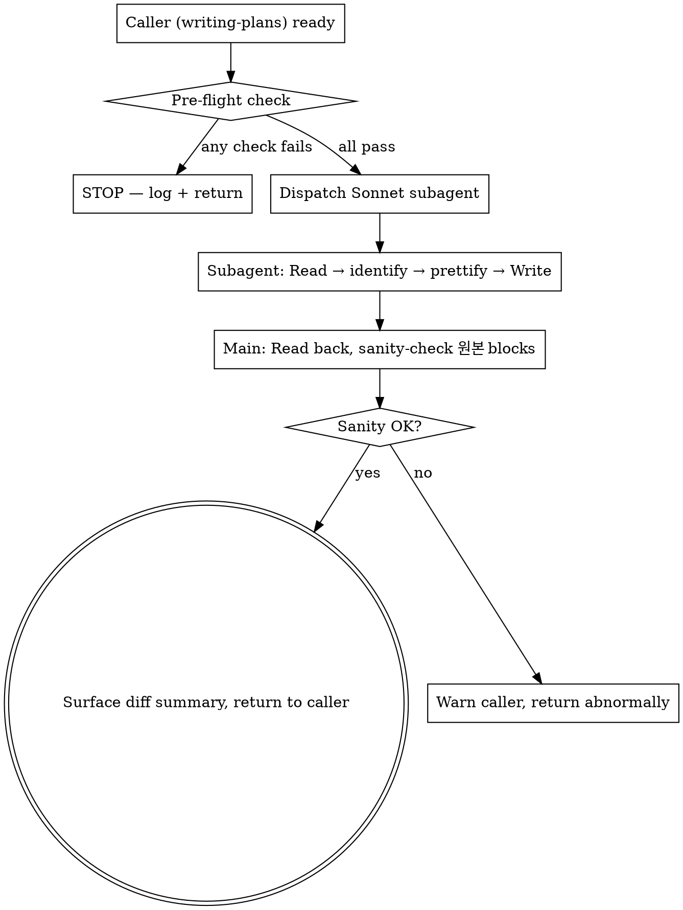

# 구현플랜개선 구현계획서

> **For agentic workers:** REQUIRED SUB-SKILL: Use `subagent-driven-development` (recommended) or `executing-plans` to implement this plan task-by-task. Steps use checkbox (`- [ ]`) syntax for tracking.

**Goal:** 구현계획서 신고 3건 (docs-pretty 매번 재실행 / 원본 코드 가시성 / 코드 프리티 신규) 을 일관된 정책으로 묶어 해결 — 신규 `code-pretty` 스킬 도입 + Before/After 코드블록 컨벤션 + docs-pretty 트리거 시점 단일 1회 (per draft state).

**Architecture:** 신규 외부 컴포넌트 0, 신규 내부 스킬 1개(`code-pretty`, docs-pretty 형제 패턴), 3 caller 스킬의 호출 시퀀스 재배선. 모든 변경은 Markdown SKILL.md 본문 + 신규 디렉토리에 한정. 데이터 영속성 / 외부 API / 서비스 호출 없음.

**Tech Stack:** Markdown (SKILL.md), Python 3 (`scripts/change_id.py` — 기존 인프라), Claude Code Skill 시스템 (서브에이전트 dispatch via `Agent` 도구).

**Spec inputs:**

- `구현플랜개선-requirements.md` — 신고 1/2/3, 결정 1/2/3, AC-1~8
- `구현플랜개선-tech-design.md` — 결정 D1~D6, 위험 R1~R7, 테스트 F1~F5/I1~I8/G1~G2

---

## 1. 단계별 작업

### Task 1: `skills/code-pretty/SKILL.md` 신규 작성

**Files:**

- Create: `skills/code-pretty/SKILL.md`

- [ ] **Step 1: 디렉토리 생성**

```bash
mkdir -p skills/code-pretty/tests
mkdir -p skills/code-pretty/scripts
```

- [ ] **Step 2: SKILL.md 작성**

신규 파일이라 **원본 블록 없음**.

**수정 후** (`skills/code-pretty/SKILL.md`):

```markdown
---
name: code-pretty
description: Use AFTER verifying-spec passes and BEFORE docs-pretty during the initial-creation iteration loop of <slug>-implementation-plan.md ONLY. Dispatches a Sonnet subagent that performs a strict format + 자명한 정리 + 중복 통합 pass on every "수정 후" code block in the plan. NEVER touches "원본" blocks, prose, or tables. Stops firing once the first change-history entry is logged. Idempotent on already-clean blocks (no-op rule).
---

# Code Pretty (Pre-Review Code Block Formatting)

This skill prettifies the "수정 후" code blocks inside a freshly written or rewritten implementation plan, just before docs-pretty + user review. It is the code-only sibling of `docs-pretty`.

**Announce at start:** "I'm using the code-pretty skill to format `수정 후` code blocks in `<file>` before docs-pretty + user review."

<HARD-GATE>
This skill MUST run AFTER verifying-spec passes and BEFORE docs-pretty in the writing-plans flow. It runs as many times as the writing-plans review loop iterates (initial draft + each user-fix revision).

It STOPS firing the moment the first `change-history` entry has been logged. That boundary marks the doc as "live" — from then on, no code-pretty.

Specifically, code-pretty MUST NOT run on:
- `<slug>-requirements.md` or `<slug>-tech-design.md` (only implementation-plan)
- "원본" code blocks (only "수정 후" blocks)
- Prose, tables, headings, list items
- Any plan AFTER its first change-history entry exists

If you are unsure whether this is still in the "initial creation phase" — STOP. Look for an existing `## 변경이력` footer with one or more entries. If ANY entry exists, this is NOT initial creation. Skip this skill.
</HARD-GATE>

## When to Use

| Trigger (yes) | Anti-trigger (no) |
|---|---|
| `writing-plans` just wrote/rewrote `<slug>-implementation-plan.md` AND verifying-spec passed AND docs-pretty has not yet run for this draft, no `## 변경이력` entries yet | User asked to update Task 3 wording in an already-live implementation-plan.md |
| User requested revision in the writing-plans review loop, agent rewrote, verifying-spec re-ran — fire again | First change-history entry has been logged — doc is now "live", do NOT fire |
| Plan contains at least one `**수정 후**`-labeled code block | Plan only has prose updates, no code blocks |

## Why a Subagent (and which model)

Same reasoning as docs-pretty: pure transformation, no domain reasoning, negative-constraint heavy.

**Always dispatch a subagent with `model: "sonnet"`.** Sonnet's instruction-following is required for honoring "leave already-clean blocks byte-identical" and "1% 의심이라도 들면 SKIP" constraints.

Do NOT use Opus (overkill) or Haiku (rephrasing risk).

## Process

### Step 1 — Pre-flight check

Before dispatching, the main agent MUST verify:

1. The target file exists (Read or Glob)
2. The file's `## 변경이력` footer has ZERO entries (Grep for `### \[` under `## 변경이력`; expect 0 matches)
3. The file is `<slug>-implementation-plan.md` (NOT requirements.md, NOT tech-design.md)
4. verifying-spec has just passed for this draft (caller responsibility)
5. The file contains at least one `**수정 후**` label preceding a code block

If ANY check fails → DO NOT dispatch. Tell the caller why and exit.

### Step 2 — Dispatch the Sonnet subagent

Use the `Agent` tool with these exact parameters:

- `subagent_type`: `general-purpose`
- `model`: `sonnet`
- `description`: `Code-block prettify on <filename>`
- `prompt`: see template below

### Step 3 — Verify, surface diff, return to caller

After the subagent returns:

1. Read the file back (1 Read)
2. Sanity-check: every `**원본**`-labeled code block is byte-equal to the pre-dispatch version
3. Surface the diff summary text returned by the subagent to the main agent's chat output (caller will combine with docs-pretty output for the user review gate)
4. Return control to caller (writing-plans). Do NOT invoke docs-pretty or change-history yourself.

If sanity-check fails (any "원본" block was modified) → emit a warning to the caller; caller decides whether to abort or rerun.

## Subagent Prompt Template

The dispatched subagent receives this exact prompt (filled in with target path):

```
You are performing a STRICT code-block prettify on a Korean implementation-plan document.

Target file: <ABSOLUTE_PATH>

Your job: improve READABILITY of "수정 후" code blocks ONLY. Other content is byte-identical.

# Identification — what counts as a target block

A target block is a fenced code block whose **immediately preceding non-blank line** starts with `**수정 후**`.

Examples of target labels (any of these counts):
- `**수정 후**:`
- `**수정 후** (`new file`):`
- `**수정 후**` (label only)

Examples of NON-target labels (any of these means the next code block is a "원본" — NEVER touch):
- `**원본**`
- `**원본** (...)`
- Anything not starting with `**수정 후**`

If a code block has no label at all (no preceding bold text), DO NOT touch it. Default to byte-equal preservation when uncertain.

# Allowed changes (in target blocks only)

Three categories. Apply only when there is a CONCRETE, ARTICULABLE readability improvement.

## Category A — 포맷
- Whitespace / indentation normalization
- Long-line wrapping at sensible breakpoints
- Trailing whitespace removal
- Aligned `//` comments

## Category B — 자명한 정리
- Remove dead comments explicitly marked (e.g., `// TODO: 삭제예정`)
- Standardize quote/semicolon style within the block
- Rename variables ONLY if context is overwhelmingly clear (e.g., `tmp` → `cartTotal` when the surrounding lines unambiguously imply the meaning)
- Add labeling comments next to magic numbers (do NOT extract to const)

## Category C — 중복 통합
- Merge duplicate imports
- Merge duplicate const declarations of the same value
- Merge duplicate inline helpers — ONLY when call-site contexts are byte-identical

# FORBIDDEN — never do any of these

- Do NOT touch "원본" blocks
- Do NOT touch prose, headings, lists, tables, frontmatter, or `## 변경이력`
- Do NOT extract magic numbers to named constants
- Do NOT flatten nested if statements
- Do NOT split or merge functions
- Do NOT rename anything unless context is overwhelming (Category B last bullet)
- Do NOT change behavior, side-effects, exception flow, or output
- Do NOT modify a target block if it is already well-formatted (consistent whitespace, no obvious readability issues, no Category B / C candidates) — leave byte-identical
- If you have ≥1% suspicion that a Category B or C change might alter behavior, SKIP that change

# How to apply

1. Read the file in full
2. Locate every `**수정 후**`-labeled code block
3. For each target block:
   a. Articulate (mentally) the concrete readability improvement
   b. If you cannot articulate one — leave byte-identical, mark as "no-op"
   c. Otherwise apply A/B/C transformations within the constraints above
4. Write the result back to the SAME file path using the Write tool (overwrite)
5. Report a diff summary in this format:

   ```
   code-pretty done on <path>.

   Target blocks: <total>
   - Modified: <N> (<categories: A/B/C breakdown>)
   - No-op (already clean): <N>
   - Skipped (1% suspicion): <N> (with reasons)

   Modified line summary:
   - <file:line> — <one-line reason>
   - ...

   "원본" blocks preserved byte-identical: yes / no
   ```

# Verification before writing

Before you call Write:
- Compare every `**원본**`-labeled block in your output to the input — they MUST be byte-identical
- Confirm the YAML frontmatter (if present) is byte-identical
- Confirm the `## 변경이력` heading and everything beneath it is byte-identical
- Confirm prose / tables / headings outside of "수정 후" blocks are byte-identical

If ANY of these fail, do NOT write. Report the failure and stop.

You have one job: make "수정 후" code blocks cleaner WITHOUT changing meaning. Nothing else.
```

## Process Flow



## Anti-Patterns

| Wrong | Right |
|---|---|
| Run code-pretty on requirements.md or tech-design.md | NEVER. implementation-plan.md only. |
| Modify "원본" blocks even slightly | NEVER. Bytes-equal preservation. |
| Extract magic numbers to const | Forbidden by the prompt. Allowed: comment label only. |
| Run code-pretty without verifying-spec passing first | Pre-flight check (caller responsibility) blocks this. |
| Re-run code-pretty after change-history entry exists | HARD-GATE blocks this — pre-flight 변경이력 empty check. |
| Use Opus or Haiku | Sonnet only. |

## Red Flags (STOP if you think these)

| Thought | Reality |
|---|---|
| "The block is short, just inline-prettify in main agent" | Subagent dispatch is mandatory — clean main context + model isolation. |
| "I'll consolidate this duplicate, looks safe enough" | Need byte-identical call-site contexts. If not, SKIP. |
| "Two passes will catch more" | One shot only. Idempotent by design — second pass should produce 0 changes. |

## Acceptance

A code-pretty run is correct when ALL hold:

1. Pre-flight checks all passed (file exists, target = implementation-plan.md, 변경이력 empty, ≥1 "수정 후" block)
2. Subagent was dispatched with `model: sonnet` and the strict prompt above
3. Post-dispatch sanity check: every "원본" block byte-identical to pre-dispatch
4. Diff summary surfaced to main agent chat (caller forwards to user review gate)
5. No `## 변경이력` entry was added by code-pretty itself

## Related Skills

- `writing-plans` — invokes this between verifying-spec and docs-pretty
- `docs-pretty` — sibling skill, runs immediately after code-pretty on the same draft
- `verifying-spec` — must pass before code-pretty can run
- `change-history` — invoked by caller AFTER code-pretty + docs-pretty + user review approval
```

- [ ] **Step 3: 파일 존재 검증**

```bash
test -f skills/code-pretty/SKILL.md && head -3 skills/code-pretty/SKILL.md
```
Expected: `---` + `name: code-pretty` + `description: ...` 출력.

- [ ] **Step 4: Commit**

```bash
git add skills/code-pretty/SKILL.md
git commit -m "feat(code-pretty): add new skill for implementation-plan code block prettify"
```

---

### Task 2: `skills/code-pretty/tests/` fixture 5종 작성

**Files:**

- Create: `skills/code-pretty/tests/fixture-01-basic-pair.md` (F1)
- Create: `skills/code-pretty/tests/fixture-02-new-file.md` (F2)
- Create: `skills/code-pretty/tests/fixture-03-forbidden-ops.md` (F3)
- Create: `skills/code-pretty/tests/fixture-04-1pct-suspicion.md` (F4)
- Create: `skills/code-pretty/tests/fixture-05-already-clean.md` (F5)
- Create: `skills/code-pretty/tests/README.md`

각 fixture는 신규 파일이라 **원본 블록 없음**.

- [ ] **Step 1: F1 (기본 쌍, prettify 발화)**

**수정 후** (`skills/code-pretty/tests/fixture-01-basic-pair.md`):

```markdown
# Fixture 01 — basic pair (prettify expected)

**원본** (`src/cart.ts:42`):
` ``ts
const total=items.reduce((acc,x)=>acc+x.price,0);
` ``

**수정 후**:
` ``ts
const total=items.reduce((acc,x)=>acc+(x.price??0),0);
` ``

## 변경이력
<!-- empty -->
```

기대 결과: "원본" 블록 byte-identical, "수정 후" 블록은 공백 추가/포맷 정돈됨.

- [ ] **Step 2: F2 (신규 파일, 원본 블록 없음)**

**수정 후** (`skills/code-pretty/tests/fixture-02-new-file.md`):

```markdown
# Fixture 02 — new file (no original)

**수정 후** (new file: `src/cart-helpers.ts`):
` ``ts
export function safeReduce<T>(  arr:T[],fn:(a:number,t:T)=>number,init:number ){return arr.reduce(fn,init);}
` ``

## 변경이력
<!-- empty -->
```

기대 결과: 단일 "수정 후" 블록 prettify, 원본 블록 부재 OK.

- [ ] **Step 3: F3 (금지 작업 — 변환 안 됨)**

**수정 후** (`skills/code-pretty/tests/fixture-03-forbidden-ops.md`):

```markdown
# Fixture 03 — forbidden refactors must NOT happen

**수정 후**:
` ``ts
function priceOf(x: Item) {
  if (x.tier === 1) {
    if (x.discount) {
      return x.price * 0.9;
    }
    return x.price;
  }
  return x.price * 1.1;
}
` ``

## 변경이력
<!-- empty -->
```

기대 결과: 중첩 if 평탄화 안 됨, magic number (0.9, 1.1) const 추출 안 됨, byte-identical 또는 공백만 정돈.

- [ ] **Step 4: F4 (1% 의심 룰 — 통합 안 됨)**

**수정 후** (`skills/code-pretty/tests/fixture-04-1pct-suspicion.md`):

```markdown
# Fixture 04 — 1% suspicion rule (do NOT merge)

**수정 후**:
` ``ts
function logA(msg: string) { console.log("[A]", msg); }
function logB(msg: string) { console.log("[B]", msg); }

logA("checkout started");
logB("checkout started");
` ``

## 변경이력
<!-- empty -->
```

기대 결과: `logA`와 `logB`는 시그니처가 같아 보이나 prefix 다름 → 통합 안 됨, diff 요약에 "skipped: distinct prefix" 기록.

- [ ] **Step 5: F5 (이미 이쁜 코드 — byte-identical 보존)**

**수정 후** (`skills/code-pretty/tests/fixture-05-already-clean.md`):

```markdown
# Fixture 05 — already clean (byte-identical expected)

**수정 후**:
` ``ts
export function totalPrice(items: Item[]): number {
  return items.reduce((acc, item) => acc + (item.price ?? 0), 0);
}
` ``

## 변경이력
<!-- empty -->
```

기대 결과: byte-equal 보존, diff 요약에 "no-op: already clean" 기록.

- [ ] **Step 6: tests/README.md 작성**

**수정 후** (`skills/code-pretty/tests/README.md`):

```markdown
# code-pretty fixtures

각 fixture는 dogfood 검증 자료. 새 세션에서 `/code-pretty <fixture-path>`로 직접 호출은 안 되므로 (PRD 범위 밖), `writing-plans` 흐름 중에 자동 호출되는 결과를 비교하는 용도.

| Fixture | 기대 동작 | 검증 AC |
|---|---|---|
| F1 basic-pair | 원본 byte-equal, 수정 후 prettify | AC-2, AC-4 |
| F2 new-file | 원본 부재 OK, 수정 후 prettify | AC-2 |
| F3 forbidden-ops | 중첩 if / magic number 변환 안 됨 | AC-6 |
| F4 1pct-suspicion | 비슷한 helper 통합 안 됨 | AC-7 |
| F5 already-clean | byte-equal 보존 | (R7 검증) |

수동 dogfood 절차: `/write-plan` 흐름 중 fixture를 plan으로 취급해 code-pretty 호출되는지 확인 (또는 hook으로 우회 호출).
```

- [ ] **Step 7: 파일 존재 검증**

```bash
ls skills/code-pretty/tests/
```
Expected: 6 files (F1~F5 + README.md).

- [ ] **Step 8: Commit**

```bash
git add skills/code-pretty/tests/
git commit -m "test(code-pretty): add 5 fixtures + README for AC-2/4/6/7 + R7 verification"
```

---

### Task 3: `skills/docs-pretty/SKILL.md` 트리거 시점 갱신

**Files:**

- Modify: `skills/docs-pretty/SKILL.md` (frontmatter description, HARD-GATE 본문, "When to Use" 표)

- [ ] **Step 1: frontmatter description 갱신**

**원본** (`skills/docs-pretty/SKILL.md:3`):

```yaml
description: Use during the initial-creation iteration loop of <slug>-requirements.md / <slug>-tech-design.md / <slug>-implementation-plan.md — fires immediately AFTER the agent writes/rewrites the draft and BEFORE showing it to the user for review, so the user always sees a prettified version. Allowed multiple times during the review loop (each new draft prettified before display). STOPS firing once the first change-history entry is logged — that boundary marks "live doc". Dispatches a Sonnet subagent that performs a strict format-only pass — improves headers, lists, tables, code blocks, spacing, and visual hierarchy WITHOUT changing any wording, ordering, or semantic content. NEVER invoked on subsequent edits, change-history appends, change-propagation cascades, or partial revisions.
```

**수정 후**:

```yaml
description: Use during the initial-creation iteration loop of <slug>-requirements.md / <slug>-tech-design.md / <slug>-implementation-plan.md. For requirements/tech-design — fires AFTER the user APPROVES the raw draft and BEFORE the change-history entry is logged (final-1회 timing). For implementation-plan — fires AFTER verifying-spec passes AND code-pretty completes AND BEFORE user review (per-draft-state timing; re-fires on each user-fix iteration). STOPS firing once the first change-history entry is logged — that boundary marks "live doc". Dispatches a Sonnet subagent that performs a strict format-only pass — improves headers, lists, tables, code blocks, spacing, and visual hierarchy WITHOUT changing any wording, ordering, or semantic content. NEVER invoked on subsequent edits, change-history appends, change-propagation cascades, or partial revisions.
```

- [ ] **Step 2: HARD-GATE 본문 갱신**

**원본** (`skills/docs-pretty/SKILL.md:12-24`):

```markdown
<HARD-GATE>
This skill MUST be invoked BEFORE every user review of the doc during initial creation — i.e., right after the agent writes or rewrites the draft, before sending it to the user. It runs as many times as the review loop iterates (write → pretty → review → maybe revise → pretty → review again).

It STOPS firing the moment the first `change-history` entry has been logged. That boundary marks the doc as "live" — from then on, no docs-pretty.

Specifically, docs-pretty MUST NOT run on:
- Any user-requested edit AFTER the first change-history entry exists (partial revisions, fixes, additions)
- Any `change-history` entry append (the `## 변경이력` footer is the audit trail — never reformat it)
- Any `change-propagation` cascade
- Any in-task code-edit logging during `/execute-plan`

If you are unsure whether this is still in the "initial creation phase" — STOP. Look for an existing `## 변경이력` footer with one or more entries. If ANY entry exists, this is NOT initial creation. Skip this skill.
</HARD-GATE>
```

**수정 후**:

```markdown
<HARD-GATE>
Trigger timing depends on the doc type:

- **requirements.md / tech-design.md (산문 위주)** — invoked AFTER the user APPROVES the raw draft, BEFORE the change-history entry is logged. Single shot per feature (final-1회).
- **implementation-plan.md (코드 블록 다수)** — invoked AFTER verifying-spec passes AND code-pretty completes, BEFORE user review. Re-fires on each user-fix iteration (per-draft-state).

In both cases it STOPS firing the moment the first `change-history` entry has been logged. That boundary marks the doc as "live" — from then on, no docs-pretty.

Specifically, docs-pretty MUST NOT run on:
- Any user-requested edit AFTER the first change-history entry exists (partial revisions, fixes, additions)
- Any `change-history` entry append (the `## 변경이력` footer is the audit trail — never reformat it)
- Any `change-propagation` cascade
- Any in-task code-edit logging during `/execute-plan`
- requirements.md / tech-design.md BEFORE user approval (changed in v1.1.6 — was "before user review" in v1.1.5 and earlier)

If you are unsure whether this is still in the "initial creation phase" — STOP. Look for an existing `## 변경이력` footer with one or more entries. If ANY entry exists, this is NOT initial creation. Skip this skill.
</HARD-GATE>
```

- [ ] **Step 3: "When to Use" 표 갱신**

**원본** (`skills/docs-pretty/SKILL.md:28-33`):

```markdown
| Trigger (yes) | Anti-trigger (no) |
|---|---|
| `brainstorming` just wrote/rewrote `<slug>-requirements.md`, about to show to user, no `## 변경이력` entries yet | User asked to update FR-3 wording in an already-live requirements.md (i.e., one with change-history entries) |
| `designing-direction` just wrote/rewrote `<slug>-tech-design.md`, about to show to user, no `## 변경이력` entries yet | `change-propagation` is cascading edits across MDs |
| `writing-plans` just wrote/rewrote `<slug>-implementation-plan.md`, about to show to user, no `## 변경이력` entries yet | `change-history` is appending a `[코드-수정]` entry mid-`/execute-plan` |
| User requested revision in the review loop, agent rewrote, about to re-show — fire again | First change-history entry has been logged — doc is now "live", do NOT fire |
```

**수정 후**:

```markdown
| Trigger (yes) | Anti-trigger (no) |
|---|---|
| `brainstorming` just got user APPROVAL on the raw `<slug>-requirements.md` draft, about to log change-history, no entries yet | User asked to update FR-3 wording in an already-live requirements.md (one with change-history entries) |
| `designing-direction` just got user APPROVAL on the raw `<slug>-tech-design.md` draft + verify report, about to log change-history, no entries yet | `change-propagation` is cascading edits across MDs |
| `writing-plans` just completed verifying-spec + code-pretty on `<slug>-implementation-plan.md`, about to show prettified plan to user, no `## 변경이력` entries yet | `change-history` is appending a `[코드-수정]` entry mid-`/execute-plan` |
| `writing-plans` user requested revision, plan re-written, verifying-spec re-ran, code-pretty re-ran — fire docs-pretty again | First change-history entry has been logged — doc is now "live", do NOT fire |
| `writing-plans` user requested revision on a non-code section after final approval (rare) | requirements.md / tech-design.md BEFORE user approval — wait for approval first |
```

- [ ] **Step 4: 변경 라인 검증**

```bash
grep -c "v1.1.6" skills/docs-pretty/SKILL.md
```
Expected: 1 (또는 그 이상).

- [ ] **Step 5: Commit**

```bash
git add skills/docs-pretty/SKILL.md
git commit -m "feat(docs-pretty): differentiate trigger timing per doc-type (1.1.6)"
```

---

### Task 4: `skills/brainstorming/SKILL.md` Checklist 6/7 순서 + Process Flow 갱신

**Files:**

- Modify: `skills/brainstorming/SKILL.md:32-33` (Checklist), 122-123 (Process Flow), 174 (detail step)

- [ ] **Step 1: Checklist 항목 6/7 순서 변경**

**원본** (`skills/brainstorming/SKILL.md:32-33`):

```markdown
6. **Invoke docs-pretty skill** — format-only pass (Sonnet subagent) on the freshly written draft, BEFORE showing to user. Re-fire after each iteration of the review loop (write/rewrite → pretty → show). Stops once first change-history entry is logged.
7. **User reviews <slug>-requirements.md** — show the prettified file, get approval (loop until OK; on changes → revise → back to step 6)
```

**수정 후**:

```markdown
6. **User reviews <slug>-requirements.md** — show the RAW (un-prettified) file, get approval (loop until OK; on changes → revise → re-show raw)
7. **Invoke docs-pretty skill** — format-only pass (Sonnet subagent) on the APPROVED draft, AFTER user approval and BEFORE change-history. Single shot per feature (final-1회). Stops once first change-history entry is logged.
```

- [ ] **Step 2: Process Flow 다이어그램 엣지 갱신**

**원본** (`skills/brainstorming/SKILL.md:122-123`):

```dot
    "Self-review (mode-specific)" -> "Invoke docs-pretty\n(pre-review, Sonnet subagent)";
    "Invoke docs-pretty\n(pre-review, Sonnet subagent)" -> "User reviews <slug>-requirements.md";
```

**수정 후**:

```dot
    "Self-review (mode-specific)" -> "User reviews <slug>-requirements.md\n(raw markdown)";
    "User reviews <slug>-requirements.md\n(raw markdown)" -> "Self-review (mode-specific)" [label="changes — re-show raw"];
    "User reviews <slug>-requirements.md\n(raw markdown)" -> "Invoke docs-pretty\n(post-approval, Sonnet subagent, 1회)" [label="approve"];
    "Invoke docs-pretty\n(post-approval, Sonnet subagent, 1회)" -> "Invoke change-history\n(first entry: 요구사항-수정/생성)";
```

또한 line 95의 노드 라벨도 갱신:

**원본** (`skills/brainstorming/SKILL.md:95`):

```dot
    "Invoke docs-pretty\n(pre-review, Sonnet subagent)" [shape=box];
```

**수정 후**:

```dot
    "Invoke docs-pretty\n(post-approval, Sonnet subagent, 1회)" [shape=box];
```

- [ ] **Step 3: 상세 Process step 6 본문 갱신**

**원본** (`skills/brainstorming/SKILL.md:174` 부근, 4-5줄 블록):

```markdown
**6. Invoke docs-pretty skill** (pre-review formatting)
- Runs BEFORE showing the doc to the user — so the user always reviews a prettified version
- Re-fires after each iteration (user requests changes → revise draft → docs-pretty → re-show)
- Stops the moment the first change-history entry is logged
- Dispatches a Sonnet subagent for a strict format-only pass (no rewording, no reordering, footer/frontmatter byte-preserved)
- See `docs-pretty` skill for full pre-flight + sanity-check protocol
```

**수정 후**:

```markdown
**7. Invoke docs-pretty skill** (post-approval, final-1회 formatting)
- Runs AFTER the user APPROVES the raw draft, BEFORE change-history is logged
- Single shot per feature — does NOT re-fire on user-fix loops (loops re-show RAW)
- Stops the moment the first change-history entry is logged
- Dispatches a Sonnet subagent for a strict format-only pass (no rewording, no reordering, footer/frontmatter byte-preserved)
- See `docs-pretty` skill for full pre-flight + sanity-check protocol
```

- [ ] **Step 4: 검증**

```bash
grep -n "post-approval, Sonnet subagent, 1회" skills/brainstorming/SKILL.md | head -3
```
Expected: ≥2 라인 매치 (Checklist + Process Flow).

- [ ] **Step 5: Commit**

```bash
git add skills/brainstorming/SKILL.md
git commit -m "feat(brainstorming): move docs-pretty to post-approval (final-1회) per v1.1.6 policy"
```

---

### Task 5: `skills/designing-direction/SKILL.md` Checklist + Process Flow 갱신

**Files:**

- Modify: `skills/designing-direction/SKILL.md:23-25` (Checklist), 73-94 (Process Flow), 130-145 (detail steps), 208 (After Save)

- [ ] **Step 1: Checklist 항목 6/7/8 순서 변경**

**원본** (`skills/designing-direction/SKILL.md:23-25`):

```markdown
6. **Invoke docs-pretty skill** — pre-review format pass on the draft (Sonnet subagent). Runs BEFORE the user-approval gate so the user reviews a prettified doc. Re-fires after each revision iteration. Stops once first change-history entry is logged.
7. **Single combined approval gate** — show the full prettified `<slug>-tech-design.md` AND the verify-spec report in one message; ask once "Approve and proceed? — yes / fix / partial". On `fix`/`partial` → revise → loop back to step 6 (re-prettify, re-show).
8. **Invoke change-history skill** — append first `[개발방향-수정]` entry
```

**수정 후**:

```markdown
6. **Single combined approval gate** — show the full RAW `<slug>-tech-design.md` AND the verify-spec report in one message; ask once "Approve and proceed? — yes / fix / partial". On `fix`/`partial` → revise → loop back to step 4 (Self-review → re-verify → re-show RAW).
7. **Invoke docs-pretty skill** — format pass on the APPROVED draft (Sonnet subagent). Runs AFTER user approval and BEFORE change-history. Single shot per feature (final-1회). Stops once first change-history entry is logged.
8. **Invoke change-history skill** — append first `[개발방향-수정]` entry
```

- [ ] **Step 2: Process Flow 다이어그램 노드 + 엣지 갱신**

**원본** (`skills/designing-direction/SKILL.md:73-94` 발췌):

```dot
    "Run verifying-spec FIRST\n(요구사항 ↔ 개발방향)" -> "Invoke docs-pretty\n(pre-review, Sonnet subagent)";
    "Invoke docs-pretty\n(pre-review, Sonnet subagent)" -> "Single combined approval gate\n(doc + verify report)";
    "Single combined approval gate\n(doc + verify report)" -> "Self-review (internal)" [label="fix / partial — re-prettify on next loop"];
    "Single combined approval gate\n(doc + verify report)" -> "Invoke change-history" [label="approve"];
```

**수정 후**:

```dot
    "Run verifying-spec FIRST\n(요구사항 ↔ 개발방향)" -> "Single combined approval gate\n(RAW doc + verify report)";
    "Single combined approval gate\n(RAW doc + verify report)" -> "Self-review (internal)" [label="fix / partial — re-show raw"];
    "Single combined approval gate\n(RAW doc + verify report)" -> "Invoke docs-pretty\n(post-approval, Sonnet subagent, 1회)" [label="approve"];
    "Invoke docs-pretty\n(post-approval, Sonnet subagent, 1회)" -> "Invoke change-history";
```

또한 line 73의 노드 라벨 갱신:

**원본** (`skills/designing-direction/SKILL.md:73-74`):

```dot
    "Invoke docs-pretty\n(pre-review, Sonnet subagent)" [shape=box];
    "Single combined approval gate\n(doc + verify report)" [shape=diamond];
```

**수정 후**:

```dot
    "Single combined approval gate\n(RAW doc + verify report)" [shape=diamond];
    "Invoke docs-pretty\n(post-approval, Sonnet subagent, 1회)" [shape=box];
```

- [ ] **Step 3: 상세 Process step 6 + 7 본문 갱신**

**원본** (`skills/designing-direction/SKILL.md:130-145` 부근, 두 블록):

```markdown
**6. Invoke docs-pretty skill** (pre-review formatting)
- Runs BEFORE the user-approval gate so the user reviews a prettified doc
- Re-fires after each revision iteration (fix/partial → revise → docs-pretty → re-show)
- Stops the moment the first change-history entry is logged
- Dispatches a Sonnet subagent for a strict format-only pass (no rewording, no reordering, footer/frontmatter byte-preserved)
- See `docs-pretty` skill for full pre-flight + sanity-check protocol

**7. Single combined user-approval gate**
- Present BOTH the full prettified `<slug>-tech-design.md` AND the verifying-spec report in one message
- Ask once: "Approve `<slug>-tech-design.md` and proceed? — yes / fix / partial"
- DO NOT split into "approve doc" and "approve verify report" — that's two gates for one decision
- On `yes` → continue to step 8
- On `fix` → re-enter the relevant question(s), then re-run from step 4 (which will loop back through step 6 docs-pretty before showing again)
- On `partial` → ask which sections to revisit, then re-enter
```

**수정 후**:

```markdown
**6. Single combined user-approval gate** (RAW review)
- Present BOTH the full RAW (un-prettified) `<slug>-tech-design.md` AND the verifying-spec report in one message
- Ask once: "Approve `<slug>-tech-design.md` and proceed? — yes / fix / partial"
- DO NOT split into "approve doc" and "approve verify report" — that's two gates for one decision
- On `yes` → continue to step 7 (docs-pretty)
- On `fix` → re-enter the relevant question(s), then re-run from step 4 (Self-review → re-verify → re-show RAW)
- On `partial` → ask which sections to revisit, then re-enter

**7. Invoke docs-pretty skill** (post-approval, final-1회 formatting)
- Runs AFTER the user APPROVES, BEFORE change-history is logged
- Single shot per feature — does NOT re-fire on user-fix loops (loops re-show RAW)
- Dispatches a Sonnet subagent for a strict format-only pass (no rewording, no reordering, footer/frontmatter byte-preserved)
- See `docs-pretty` skill for full pre-flight + sanity-check protocol
```

- [ ] **Step 4: After Save 섹션 갱신**

**원본** (`skills/designing-direction/SKILL.md:208` 부근):

```markdown
2. **Single combined approval gate** — present in ONE message:
   - The full `<slug>-tech-design.md` content (or summary if very long)
   - The verify-spec 4-axis report
   - One question: "Approve `<slug>-tech-design.md` and proceed? — yes / fix / partial"
   - DO NOT split into "approve doc" → "approve verify report". One gate, one decision.
```

**수정 후**:

```markdown
2. **Single combined approval gate** — present in ONE message:
   - The full RAW `<slug>-tech-design.md` content (or summary if very long)
   - The verify-spec 4-axis report
   - One question: "Approve `<slug>-tech-design.md` and proceed? — yes / fix / partial"
   - DO NOT split into "approve doc" → "approve verify report". One gate, one decision.
   - User reviews RAW markdown (no docs-pretty yet). docs-pretty fires AFTER approval.
```

- [ ] **Step 5: 검증**

```bash
grep -n "post-approval, Sonnet subagent, 1회" skills/designing-direction/SKILL.md
```
Expected: ≥2 매치.

- [ ] **Step 6: Commit**

```bash
git add skills/designing-direction/SKILL.md
git commit -m "feat(designing-direction): move docs-pretty to post-approval (final-1회) per v1.1.6 policy"
```

---

### Task 6: `skills/writing-plans/SKILL.md` 대규모 갱신 (Checklist 신규 step + Schema Before/After + code-pretty 호출)

**Files:**

- Modify: `skills/writing-plans/SKILL.md:24-26` (Checklist), 159-174 (Process Flow), 259-265 (After Save), 새 섹션 추가 (Code Block Convention)

- [ ] **Step 1: Checklist 7-9 → 7-10 (code-pretty step 추가)**

**원본** (`skills/writing-plans/SKILL.md:24-26`):

```markdown
7. **Invoke docs-pretty skill** — pre-review format pass on the draft (Sonnet subagent). Runs BEFORE showing the plan to the user. Re-fires after each revision iteration. Stops once first change-history entry is logged.
8. **User reviews <slug>-implementation-plan.md** — show the prettified plan + verifying-spec report; get approval (loop until OK; on changes → revise → back to step 6)
9. **Invoke change-history skill** — append first `[구현계획서-수정]` entry
```

**수정 후**:

```markdown
7. **Invoke code-pretty skill** — pre-review code-block prettify on the draft (Sonnet subagent). Runs AFTER verifying-spec passes and BEFORE docs-pretty. Targets only `**수정 후**`-labeled code blocks. Stops once first change-history entry is logged.
8. **Invoke docs-pretty skill** — pre-review format pass on the draft (Sonnet subagent). Runs immediately after code-pretty and BEFORE showing the plan to the user. Re-fires together with code-pretty after each revision iteration (per-draft-state).
9. **User reviews <slug>-implementation-plan.md** — show the prettified plan + verifying-spec report + code-pretty diff summary; get approval (loop until OK; on changes → revise → back to step 6 verifying-spec)
10. **Invoke change-history skill** — append first `[구현계획서-수정]` entry
```

또한 step 10 이전이었던 "Hand off to /execute-plan"을 step 11로 번호 갱신.

**원본** (`skills/writing-plans/SKILL.md:27`):

```markdown
10. **Hand off to /execute-plan** — count tasks first, then offer the choice using the Execution Handoff message below. Upstream `subagent-driven-development` is NOT offered here; only invoke it if the user explicitly asks for the upstream original.
```

**수정 후**:

```markdown
11. **Hand off to /execute-plan** — count tasks first, then offer the choice using the Execution Handoff message below. Upstream `subagent-driven-development` is NOT offered here; only invoke it if the user explicitly asks for the upstream original.
```

- [ ] **Step 2: Process Flow 다이어그램 노드/엣지 갱신**

**원본** (`skills/writing-plans/SKILL.md:159-174` 발췌):

```dot
    "User reviews <slug>-implementation-plan.md" [shape=diamond];
    "Invoke docs-pretty\n(pre-review, Sonnet subagent)" [shape=box];
    "Invoke change-history" [shape=box];
    ...
    "Run verifying-spec FIRST" -> "Invoke docs-pretty\n(pre-review, Sonnet subagent)";
    "Invoke docs-pretty\n(pre-review, Sonnet subagent)" -> "Single combined approval gate\n(plan + verify report)";
    "Single combined approval gate\n(plan + verify report)" -> "Self-review (internal)" [label="fix / partial — re-prettify on next loop"];
    "Single combined approval gate\n(plan + verify report)" -> "Invoke change-history" [label="approve"];
    "Invoke change-history" -> "Hand off to /execute-plan";
```

**수정 후**:

```dot
    "User reviews <slug>-implementation-plan.md" [shape=diamond];
    "Invoke code-pretty\n(pre-review, Sonnet subagent)" [shape=box];
    "Invoke docs-pretty\n(pre-review, Sonnet subagent)" [shape=box];
    "Invoke change-history" [shape=box];
    ...
    "Run verifying-spec FIRST" -> "Invoke code-pretty\n(pre-review, Sonnet subagent)";
    "Invoke code-pretty\n(pre-review, Sonnet subagent)" -> "Invoke docs-pretty\n(pre-review, Sonnet subagent)";
    "Invoke docs-pretty\n(pre-review, Sonnet subagent)" -> "Single combined approval gate\n(plan + verify report + code-pretty diff)";
    "Single combined approval gate\n(plan + verify report + code-pretty diff)" -> "Self-review (internal)" [label="fix / partial — re-verify + re-prettify"];
    "Single combined approval gate\n(plan + verify report + code-pretty diff)" -> "Invoke change-history" [label="approve"];
    "Invoke change-history" -> "Hand off to /execute-plan";
```

- [ ] **Step 3: Task Structure 섹션 직후에 "Code Block Convention (Before/After)" 신규 서브섹션 추가**

`skills/writing-plans/SKILL.md`에서 `## Task Structure (inherited)` 섹션 직후, 다음 `## Process Flow` 섹션 직전에 새 섹션 삽입. 정확한 위치는 Read로 line 번호 확인 후 결정 (현재 파일 상태에 따라 다름).

**수정 후** (신규 섹션, 기존 본문에 추가):

```markdown
## Code Block Convention (Before/After labels) — required for tasks that modify existing code

When a task changes existing code (Modify), use the **Before/After label pair**:

` ``markdown
**원본** (`<file>:<line-range>`):
` ` `<lang>
<original code, byte-equal to current source>
` ` `

**수정 후**:
` ` `<lang>
<new code>
` ` `
` ``

Rules:

1. The "원본" label MUST start with exactly `**원본**` (markdown bold). The optional `(file:line)` annotation is strongly recommended for navigation.
2. The "수정 후" label MUST start with exactly `**수정 후**` (markdown bold).
3. For tasks that CREATE a new file, the "원본" block is OMITTED — only "수정 후" block is shown (with `(new file: <path>)` annotation).
4. Both blocks MUST use the same fenced-code language identifier.
5. The `code-pretty` skill targets ONLY "수정 후" blocks. "원본" blocks are byte-immutable.

This convention is required so that:
- Reviewers can compare before/after at a glance.
- The `code-pretty` skill can identify which blocks to prettify (수정 후) and which to leave untouched (원본).

Anti-pattern: showing only the modified code without the original. Reviewers cannot tell what changed.
```

- [ ] **Step 4: After Save 섹션 갱신 (단일 승인 게이트 → code-pretty + docs-pretty 두 단계로 명시)**

**원본** (`skills/writing-plans/SKILL.md:259-265` 발췌):

```markdown
1. **Run verifying-spec FIRST** (before any user prompt):
   - Target: `<slug>-implementation-plan.md`
   - Upstream: `[<slug>-requirements.md, <slug>-tech-design.md]`
   - Procedure: consistency (FR + key decisions covered as tasks) + code impact (files/functions referenced exist or are explicitly created)
   - **Tolerance**: if verifying-spec skill is not installed, skip and emit the notice ("ℹ️ verify-gate 미설치, Phase 2 이후 활성화 — 검증 없이 진행")

2. **Single combined approval gate** — present in ONE message:
   - The full `<slug>-implementation-plan.md` (or summary if very long, with link)
   - The verify-spec 4-axis report
   - One question: "Approve `<slug>-implementation-plan.md` and proceed? — yes / fix / partial"
   - DO NOT split into "approve plan" → "approve verify report". One gate, one decision.
```

**수정 후**:

```markdown
1. **Run verifying-spec FIRST** (before any user prompt):
   - Target: `<slug>-implementation-plan.md`
   - Upstream: `[<slug>-requirements.md, <slug>-tech-design.md]`
   - Procedure: consistency (FR + key decisions covered as tasks) + code impact (files/functions referenced exist or are explicitly created)
   - **Tolerance**: if verifying-spec skill is not installed, skip and emit the notice ("ℹ️ verify-gate 미설치, Phase 2 이후 활성화 — 검증 없이 진행")

2. **Run code-pretty** (after verifying-spec passes, before docs-pretty):
   - Target: `<slug>-implementation-plan.md` (only `**수정 후**`-labeled blocks)
   - Output: diff summary text (preserved for the approval gate)
   - **Tolerance**: if code-pretty skill is not installed, skip and emit "ℹ️ code-pretty 미설치 — code blocks shown as-is"

3. **Run docs-pretty** (immediately after code-pretty):
   - Standard format-only pass (Sonnet subagent)

4. **Single combined approval gate** — present in ONE message:
   - The full PRETTIFIED `<slug>-implementation-plan.md` (or summary if very long, with link)
   - The verify-spec 4-axis report
   - The code-pretty diff summary
   - One question: "Approve `<slug>-implementation-plan.md` and proceed? — yes / fix / partial"
   - DO NOT split into "approve plan" → "approve verify report". One gate, one decision.
   - On `fix` → loop back to step 1 (re-verify → re-code-pretty → re-docs-pretty → re-show)
```

- [ ] **Step 5: 검증**

```bash
grep -c "code-pretty" skills/writing-plans/SKILL.md
```
Expected: ≥6 매치 (Checklist + Process Flow + Convention 섹션 + After Save + 본문 인용 등).

- [ ] **Step 6: Commit**

```bash
git add skills/writing-plans/SKILL.md
git commit -m "feat(writing-plans): add code-pretty step + Before/After convention + per-draft-state pretty timing"
```

---

### Task 7: `README.md` line 22 wording 갱신

**Files:**

- Modify: `README.md:22`

- [ ] **Step 1: docs-pretty 항목 wording 갱신**

**원본** (`README.md:22`):

```markdown
3. **docs-pretty** *(v1.1)* — 3-MD 사용자 리뷰 **직전마다** Sonnet 서브에이전트가 포맷만 정돈한다(의미 보존 strict). 첫 변경이력 entry가 찍히면 자동 정지.
```

**수정 후**:

```markdown
3. **docs-pretty + code-pretty** *(v1.1.6)* — Sonnet 서브에이전트가 포맷만 정돈(의미 보존 strict). docs-pretty는 요구사항/개발방향에서는 **사용자 승인 후 1회**, 구현계획서에서는 **사용자 리뷰 직전 1회 (verifying-spec → code-pretty → docs-pretty)**. code-pretty는 구현계획서의 `**수정 후**` 코드블록만 prettify (원본 블록 불가침, 1% 의심 룰). 첫 변경이력 entry가 찍히면 자동 정지.
```

- [ ] **Step 2: 검증**

```bash
grep -n "v1.1.6" README.md | head -1
```
Expected: line 22 매치.

- [ ] **Step 3: Commit**

```bash
git add README.md
git commit -m "docs(README): update docs-pretty/code-pretty timing description for v1.1.6"
```

---

### Task 8: PRD cascade — `구현플랜개선-requirements.md` §우려·해결에 R7 행 추가

**Files:**

- Modify: `docs/features/2026-05-09-구현플랜개선/구현플랜개선-requirements.md` (§우려·해결 표 + 변경이력 cascade 항목)

- [ ] **Step 1: §우려·해결 표에 행 추가**

**원본** (구현플랜개선-requirements.md §우려·해결, 4행 표):

```markdown
| 기존에 작성된 구현계획서들에도 소급 적용?                   | **소급 적용 안 함**. 새로 작성되는 구현계획서부터 새 정책 적용. (범위 밖)                   |
```

**수정 후** (5행 표 — 위 행 다음에 행 추가):

```markdown
| 기존에 작성된 구현계획서들에도 소급 적용?                   | **소급 적용 안 함**. 새로 작성되는 구현계획서부터 새 정책 적용. (범위 밖)                   |
| 코드 프리티가 이미 이쁜 코드를 강제로 변경할까봐? (사용자 추가 우려)  | (a) prompt에 "이미 잘 포맷된 블록은 byte-identical 유지" 강한 negative constraint (b) 블록별 no-op 게이트 — readability 개선을 명확히 articulate 못하면 변경 안 함 (c) Diff 요약에 "변경 없음 N개" 노출 |
```

- [ ] **Step 2: 변경이력에 cascade 항목 append (CH-id 신규 발급)**

```bash
python3 -c "from datetime import date; from pathlib import Path; import sys; sys.path.insert(0, '.'); from scripts.change_id import next_change_id; print(next_change_id(Path('docs/features/2026-05-09-구현플랜개선'), date.today()))"
```

발급된 CH-id 사용 (예: CH-20260509-005 — 시점에 따라 다름). 다음 형식:

**수정 후** (구현플랜개선-requirements.md §변경이력에 추가):

```markdown
### [YYYY-MM-DD HH:MM] [요구사항-수정]
- **id**: CH-YYYYMMDD-NNN
- **이유**: tech-design 단계에서 사용자가 "이미 이쁜 코드 강제 변경" 우려 추가 제기 → cascade
- **무엇이**: §우려·해결 표 (5번째 행 추가)
- **영향범위**: tech-design.md §5 D6, §6 R7, §7 F5 (이미 반영됨)
- **연관 항목**: CH-20260509-002 (개발방향)
```

- [ ] **Step 3: 검증**

```bash
grep -c "이미 이쁜 코드" docs/features/2026-05-09-구현플랜개선/구현플랜개선-requirements.md
```
Expected: ≥1.

- [ ] **Step 4: Commit**

```bash
git add docs/features/2026-05-09-구현플랜개선/구현플랜개선-requirements.md
git commit -m "docs(prd): cascade R7 (already-clean code concern) to requirements §우려해결"
```

---

### Task 9: 버전 bump 1.1.5 → 1.1.6 (3 manifest 동기화)

**Files:**

- Modify: `package.json:3` (version)
- Modify: `.claude-plugin/plugin.json:4` (version)
- Modify: `.claude-plugin/marketplace.json:13` (plugins[0].version)

- [ ] **Step 1: 3 manifest 동시 갱신**

**원본** (`package.json`):

```json
{
  "name": "js-super",
  "version": "1.1.5",
  ...
}
```

**수정 후**:

```json
{
  "name": "js-super",
  "version": "1.1.6",
  ...
}
```

(`.claude-plugin/plugin.json`, `.claude-plugin/marketplace.json` 동일 패턴 — `1.1.5` → `1.1.6`.)

또는 기존 `scripts/bump-version.sh` 사용 (있을 경우):

```bash
bash scripts/bump-version.sh 1.1.6
```

- [ ] **Step 2: 동기화 검증**

```bash
grep -h '"version"' package.json .claude-plugin/plugin.json .claude-plugin/marketplace.json
```
Expected: 모든 출력에 `1.1.6` (3건).

- [ ] **Step 3: Commit**

```bash
git add package.json .claude-plugin/plugin.json .claude-plugin/marketplace.json
git commit -m "chore: bump version 1.1.5 → 1.1.6"
```

---

### Task 10: 통합 dogfood 검증 (I1-I8 + G1, G2)

**Files:** (검증만, 수정 없음)

- [ ] **Step 1: I1 — `/brainstorm` end-to-end (산문 단계 1)**

새 세션에서 `/js-super:brainstorm 더미피처` 실행. 다음 확인:
- 사용자 승인 *전*에는 docs-pretty 호출 0회 (대화 로그상)
- 승인 직후 docs-pretty 1회 호출
- 사용자가 raw 마크다운을 검토함

검증 방법: 응답 흐름의 docs-pretty 발화 수를 카운트.

- [ ] **Step 2: I2 — `/design` end-to-end (산문 단계 2)**

I1과 동일 패턴 — `/js-super:design 더미피처` 흐름에서 사용자 승인 전 docs-pretty 호출 0회 검증.

- [ ] **Step 3: I3 — `/write-plan` end-to-end (코드 단계, per-draft-state)**

`/js-super:write-plan 더미피처` 흐름:
- verifying-spec 실행 후 자동으로 code-pretty 호출 1회
- code-pretty 직후 docs-pretty 호출 1회
- 사용자가 prettified plan + verify report + diff 요약을 한 번에 받음
- 사용자가 fix 요청 시 verifying-spec → code-pretty → docs-pretty 재실행

검증 방법: 위 4개 시점의 호출 흔적이 대화에 있는지 확인.

- [ ] **Step 4: I4 — `/write-plan` 산출물 Before/After 검사**

생성된 `더미피처-implementation-plan.md`에서:
- 기존 코드 수정 task: `**원본**` + `**수정 후**` 페어 모두 존재
- 신규 파일 task: `**수정 후**`만 존재, `**원본**` 없음

```bash
grep -c "원본" docs/features/<date>-더미피처/더미피처-implementation-plan.md
grep -c "수정 후" docs/features/<date>-더미피처/더미피처-implementation-plan.md
```
"수정 후" ≥ "원본" (신규 파일 케이스 때문).

- [ ] **Step 5: I5 — code-pretty 자국이 "수정 후" 블록 안에서만 발견**

I3 산출물에서 직접 비교. code-pretty 적용 전후 (verifying-spec 직후 vs docs-pretty 후) 의 "원본" 블록 byte-equal 검증.

```bash
# (도구가 없으면 git diff로 대체)
git show HEAD~1:docs/features/<date>-더미피처/더미피처-implementation-plan.md > /tmp/before.md
diff /tmp/before.md docs/features/<date>-더미피처/더미피처-implementation-plan.md | grep -E "^<.*원본"
```
Expected: 빈 출력 (원본 라벨 직후 블록은 변경 없음).

- [ ] **Step 6: I6 — diff 요약 노출 검증**

I3 흐름에서 사용자에게 노출된 메시지에 "code-pretty done" 또는 "Modified: N" 표현 포함 확인. 챗 로그 인용으로 검증.

- [ ] **Step 7: I7 — 적대적 입력: 매직넘버 / 중첩 if 통과**

F3 fixture (`fixture-03-forbidden-ops.md`) 를 dummy plan 안에 삽입한 후 code-pretty 발화 → 변환 안 됨 확인.

```bash
diff <(git show HEAD:skills/code-pretty/tests/fixture-03-forbidden-ops.md) skills/code-pretty/tests/fixture-03-forbidden-ops.md
```
Expected: 빈 출력 (fixture는 보존, dummy plan 안의 동등 블록도 보존).

- [ ] **Step 8: I8 — 1% 의심 룰**

F4 fixture (`fixture-04-1pct-suspicion.md`) → `logA`/`logB` 통합 안 됨 확인.

- [ ] **Step 9: G1 — 기존 변경이력 있는 plan은 발화 안 함**

기존 v1.1.5 시점의 impl plan (있다면) 또는 임의로 `## 변경이력` footer에 entry 1개 있는 plan 만들어 `code-pretty` 호출 시도 → pre-flight check abort 확인.

- [ ] **Step 10: G2 — og-* 미러 영향 없음**

```bash
grep -c "code-pretty" skills/og-brainstorming/SKILL.md skills/og-writing-plans/SKILL.md skills/og-executing-plans/SKILL.md 2>/dev/null
```
Expected: 각 0 (og-* 변경 없음).

- [ ] **Step 11: dogfood 산출물 cleanup**

I1~I8 검증을 위해 임시로 생성한 "더미피처" 폴더를 삭제:

```bash
rm -rf docs/features/*-더미피처
```

이슈 발견 시 해당 task로 돌아가 수정 → re-test → 다시 cleanup.

- [ ] **Step 12: 결과 요약 + tag**

검증 결과를 텍스트로 정리. 모든 검증 통과 시:

```bash
git add -A    # cleanup 반영
git commit -m "test: dogfood verification cleanup for v1.1.6"
git tag v1.1.6
```

(push는 사용자 권한, 자동화 안 함.)

---

## 2. 위험 코드 지점

tech-design §6 R1~R7을 구체적 위치로 매핑:

- `skills/code-pretty/SKILL.md` (Subagent prompt template) — **side-effect**: 라벨 검출 실패로 "원본" 블록 prettify 위험 → `**원본**` 정확 매칭 + 사후 sanity-check (Task 1, R1)
- `skills/code-pretty/SKILL.md` (Subagent prompt — Category C 중복 통합) — **side-effect**: 의미 차이 헬퍼 합쳐버림 → "1% 의심 SKIP" 명시 + diff에 skipped 사유 표기 (Task 1, R2)
- `skills/brainstorming/SKILL.md` + `skills/designing-direction/SKILL.md` + `skills/writing-plans/SKILL.md` (Process Flow + Checklist wording) — **breaking**: 3 caller wording 비동기화 시 LLM 혼란 → 단일 PR-스타일 commit 권장 + Task 8 cascade로 PRD까지 일관 (Task 4/5/6, R3)
- `skills/docs-pretty/SKILL.md` (frontmatter description / HARD-GATE) — **breaking**: docs-pretty 본문 갱신을 caller 수정보다 늦게 하면 중간 시점 conflict 발생 → Task 3을 Task 4/5/6보다 먼저 수행 (Task 3 우선, R4)
- `구현플랜개선-requirements.md` (§우려·해결 R7 cascade 누락 시) — **side-effect**: 향후 사용자 신고 재발 가능 → Task 8로 명시 cascade (Task 8, R5)
- `skills/code-pretty/SKILL.md` + `skills/docs-pretty/SKILL.md` (pre-flight check `### \[`) — **side-effect**: 기존 plan 재처리 위험 → 두 스킬 모두 변경이력 entry 1개 이상이면 abort (Task 1 + Task 3, R6)
- `skills/code-pretty/SKILL.md` (Subagent prompt — no-op rule) — **side-effect**: 이미 이쁜 코드 무리한 변경 → "이미 잘 포맷된 블록은 byte-identical" + 블록별 no-op 게이트 + diff "변경 없음 N개" 노출 (Task 1, R7)

---

## 3. 롤백 전략

- **Code/Docs**: 모든 task가 atomic per-task commit이라 `git revert <task-commit-sha>` 로 task 단위 되돌림 가능. v1.1.6 태그 박기 직전까지 unrelease 상태 유지 권장.
- **버전**: Task 9의 manifest commit만 revert하면 v1.1.5로 복귀 (단 다른 task 변경은 잔존하므로 주의).
- **Plugin republish**: Claude Code plugin 마켓에 v1.1.6이 publish되기 전까지는 사용자에게 영향 없음. publish는 사용자가 수동으로 진행 (자동화 안 함).
- **PRD cascade (Task 8)**: cascade entry 자체도 변경이력에 기록되므로 revert 시 entry 추가 (`[요구사항-수정] revert: ...`)로 추적.

---

## 변경이력
<!-- change-history skill auto-appends entries here, oldest first -->

### [2026-05-09 16:27] [구현계획서-수정]
- **id**: CH-20260509-006
- **이유**: 신규 구현계획서 작성 — 신고 3건 (docs-pretty 매번 재실행 / 원본 코드 가시성 / code-pretty 신규) 일관 정책 통합 + 사용자 추가 우려 R7 (이미 이쁜 코드 강제 변경) cascade 포함
- **무엇이**: 구현플랜개선-implementation-plan.md 전체 (Tasks 1~10 + §2 위험 코드 지점 R1~R7 매핑 + §3 롤백 전략)
- **영향범위**: 없음 (최초 생성). 실행 시 영향: skills/code-pretty/ (신규), skills/docs-pretty/SKILL.md, skills/brainstorming/SKILL.md, skills/designing-direction/SKILL.md, skills/writing-plans/SKILL.md, README.md, 3 manifest, PRD cascade
- **연관 항목**: CH-20260509-001 (요구사항), CH-20260509-002 (개발방향)

### [2026-05-09 16:32] [코드-수정] (task: Task 1 — skills/code-pretty/SKILL.md 신규 작성)
- **id**: CH-20260509-007
- **이유**: code-pretty 스킬 본문 신규 도입 — 구현계획서의 `**수정 후**` 코드블록만 prettify 하는 sibling-of-docs-pretty 패턴
- **무엇이**: skills/code-pretty/SKILL.md (234 lines), skills/code-pretty/{tests,scripts}/ 빈 디렉토리
- **영향범위**: 없음 (신규 스킬, 기존 caller 없음). Task 6에서 writing-plans/SKILL.md가 이를 호출 추가 예정.
- **위험 카테고리**: 없음 (3-checklist 0 트리거 — pure markdown, 신규 인터페이스라 breaking 없음)
- **세부 변경 (1건)**:
  - `skills/code-pretty/SKILL.md` — 신규 파일 234 lines (frontmatter + HARD-GATE + Process + Subagent Prompt Template + Process Flow + Anti-Patterns + Red Flags + Acceptance + Related Skills) (`없음`)
- **변경 전 코드**: (없음, 신규 파일)
- **변경 후 코드** (요약 — 전체 234 lines는 commit 325d26d 참조):
  ```markdown
  ---
  name: code-pretty
  description: Use AFTER verifying-spec passes and BEFORE docs-pretty during the initial-creation iteration loop of <slug>-implementation-plan.md ONLY. ... (전체 description은 SKILL.md 참조)
  ---

  # Code Pretty (Pre-Review Code Block Formatting)
  ...
  ```
  Spec reviewer ✅ — 11개 섹션 모두 plan과 byte-faithful 매핑 검증 완료.
- **연관 항목**: CH-20260509-006 (plan)

### [2026-05-09 16:35] [코드-수정] (task: Task 2 — code-pretty fixture 5종 + tests/README)
- **id**: CH-20260509-008
- **이유**: code-pretty 스킬 dogfood 검증 자료 도입 — F1~F5 + README (AC-2/4/6/7 + R7 매핑)
- **무엇이**: skills/code-pretty/tests/{fixture-01-basic-pair.md, fixture-02-new-file.md, fixture-03-forbidden-ops.md, fixture-04-1pct-suspicion.md, fixture-05-already-clean.md, README.md}
- **영향범위**: 없음 (test fixtures, internal use only)
- **위험 카테고리**: 없음 (3-checklist 0 트리거 — 데이터 파일, 로직 없음)
- **세부 변경 (6건)**:
  - `skills/code-pretty/tests/fixture-01-basic-pair.md` — F1 원본/수정 후 페어 (`없음`)
  - `skills/code-pretty/tests/fixture-02-new-file.md` — F2 신규 파일 (원본 생략) (`없음`)
  - `skills/code-pretty/tests/fixture-03-forbidden-ops.md` — F3 금지 작업 baits (`없음`)
  - `skills/code-pretty/tests/fixture-04-1pct-suspicion.md` — F4 1% 의심 룰 (`없음`)
  - `skills/code-pretty/tests/fixture-05-already-clean.md` — F5 이미 이쁜 코드 (`없음`)
  - `skills/code-pretty/tests/README.md` — fixture 인덱스 + AC 매핑 표 (`없음`)
- **변경 전 코드**: (없음, 신규 파일 6개)
- **변경 후 코드** (요약 — 전체는 commit f107993 참조): 각 fixture는 plan Task 2 Step 1-6 "수정 후" 블록 byte-faithful (spaced-backtick → real-backtick 변환 적용). README.md 표는 5행 (F1~F5) + AC 매핑.
- **연관 항목**: CH-20260509-007 (Task 1 code-pretty/SKILL.md)

### [2026-05-09 16:38] [코드-수정] (task: Task 3 — skills/docs-pretty/SKILL.md 트리거 시점 갱신)
- **id**: CH-20260509-009
- **이유**: docs-pretty 트리거 시점이 doc-type별로 분기 — requirements/tech-design는 사용자 승인 후, implementation-plan은 verifying-spec+code-pretty 직후
- **무엇이**: skills/docs-pretty/SKILL.md (frontmatter description, HARD-GATE body, "When to Use" 표 — 3개 섹션)
- **영향범위**: docs-pretty의 caller 3개 (brainstorming/designing-direction/writing-plans) — Tasks 4/5/6에서 caller 본문도 동기화 예정. R4 위험 (caller 늦게 업데이트 시 conflict)는 실행 순서로 회피 (docs-pretty 먼저, callers 나중).
- **위험 카테고리**: 없음 (3-checklist 0 트리거 — 코드 로직 변경 없음, 시점 차이는 plan §2에서 R4로 사전 식별 + 실행 순서로 mitigation)
- **세부 변경 (3건)**:
  - `skills/docs-pretty/SKILL.md:3` — frontmatter description 갱신 (single-shot → branched per-doc-type) (`없음`)
  - `skills/docs-pretty/SKILL.md:12-28` — HARD-GATE body 분기 정책 + v1.1.6 anti-trigger bullet 추가 (`없음`)
  - `skills/docs-pretty/SKILL.md:32-38` — "When to Use" 표 5행으로 확장 (post-approval 트리거 + post-approval non-code revision row 추가) (`없음`)
- **변경 전 코드**: skills/docs-pretty/SKILL.md (line 3 single-policy description, line 12-24 single-policy HARD-GATE, line 28-33 4-row table — 전체 이전 내용은 commit a00c01f 시점 참조)
- **변경 후 코드**: 위 3개 섹션 doc-type별 분기 정책 반영 (전체는 commit 96533bf 참조). Spec reviewer ✅ — 3 섹션 plan과 byte-faithful, 다른 섹션은 변경 없음 검증.
- **연관 항목**: CH-20260509-008 (Task 2 fixtures), Task 4/5/6 실행 시 caller 동기화 예정

### [2026-05-09 16:42] [코드-수정] (task: Task 4 — skills/brainstorming/SKILL.md Process 갱신)
- **id**: CH-20260509-010
- **이유**: brainstorming(요구사항)에서 docs-pretty 호출이 사용자 *리뷰 직전*에서 사용자 *승인 후* (final-1회)로 이동
- **무엇이**: skills/brainstorming/SKILL.md (Checklist 6/7 swap + Process Flow node label + 4 edges + step 7 detail body)
- **영향범위**: brainstorming caller가 사용 시 raw 마크다운 검토하도록 변경. docs-pretty SKILL.md(Task 3 완료) 와 정합. designing-direction(Task 5)/writing-plans(Task 6) 미완료 시점 일시 비대칭 — R3 plan §2에서 사전 식별.
- **위험 카테고리**: 없음 (3-checklist 0 — markdown body update, 동기화 위험은 R3로 사전 명시 + 동일 PR-스타일 commit chain)
- **세부 변경 (4건)**:
  - `skills/brainstorming/SKILL.md:32-33` — Checklist 6/7 순서 swap (RAW review → post-approval docs-pretty) (`없음`)
  - `skills/brainstorming/SKILL.md:95` — Process Flow node label `pre-review, Sonnet subagent` → `post-approval, Sonnet subagent, 1회` (`없음`)
  - `skills/brainstorming/SKILL.md:122-125` — Process Flow 4 edges (RAW review → re-show raw / approve → docs-pretty → change-history) (`없음`)
  - `skills/brainstorming/SKILL.md:174-179` — 상세 step 6 → step 7 body 갱신 (post-approval, final-1회 wording) (`없음`)
- **변경 전 코드**: skills/brainstorming/SKILL.md 위 4개 영역의 v1.1.5 시점 wording (commit 188952c 참조)
- **변경 후 코드**: post-approval / final-1회 / RAW review 라벨로 일관 갱신 (commit d91ce95 참조). Spec reviewer ✅ — 4 edits all byte-faithful, scoped (10 ins / 10 del).
- **연관 항목**: CH-20260509-009 (Task 3 docs-pretty SKILL.md), Task 5/6에서 designing-direction/writing-plans 동기화 예정

### [2026-05-09 16:45] [코드-수정] (task: Task 5 — skills/designing-direction/SKILL.md Process 갱신)
- **id**: CH-20260509-011
- **이유**: designing-direction(개발방향)에서도 brainstorming과 동일 패턴 — RAW 검토 → 승인 후 docs-pretty 1회. 추가로 Task 5 범위 밖 stale wording 1건 (line 215) 정합성 정돈.
- **무엇이**: skills/designing-direction/SKILL.md (Checklist 6/7/8 swap + Process Flow node labels + edges + step 6+7 detail body + After Save + cleanup line 215)
- **영향범위**: designing-direction caller가 RAW 검토하도록 변경. brainstorming(Task 4 완료) + docs-pretty SKILL.md(Task 3 완료) 와 정합. writing-plans(Task 6) 미완료 시점 일시 비대칭.
- **위험 카테고리**: 없음 (3-checklist 0 — markdown body update)
- **세부 변경 (5건 + cleanup 1건)**:
  - `skills/designing-direction/SKILL.md:23-25` — Checklist 6/7/8 swap (`없음`)
  - `skills/designing-direction/SKILL.md:73-74` — Process Flow node labels reorder (`없음`)
  - `skills/designing-direction/SKILL.md:90-93` — Process Flow edges 갱신 (`없음`)
  - `skills/designing-direction/SKILL.md:130-142` — 상세 step 6/7 body 갱신 (`없음`)
  - `skills/designing-direction/SKILL.md:208-212` — After Save section RAW 한정 + 새 bullet (`없음`)
  - `skills/designing-direction/SKILL.md:215` — fix-loop wording cleanup (post-approval 정합) (`없음`)
- **변경 전 코드**: skills/designing-direction/SKILL.md 위 6개 영역의 v1.1.5 wording (commit d706002 참조)
- **변경 후 코드**: post-approval / RAW review / final-1회 일관 갱신 (commits cc32758 main + eec0756 cleanup 참조). Spec reviewer ✅.
- **연관 항목**: CH-20260509-010 (Task 4 brainstorming), Task 6에서 writing-plans 동기화 예정

### [2026-05-09 16:50] [코드-수정] (task: Task 6 — skills/writing-plans/SKILL.md 대규모 갱신)
- **id**: CH-20260509-012
- **이유**: writing-plans에 신규 step (code-pretty 호출) 도입 + Before/After 코드블록 컨벤션 신규 섹션 추가 + per-draft-state pretty timing. 이번 Task가 plan §1의 1차 진앙지 — 신고 1+2+3 모두 영향.
- **무엇이**: skills/writing-plans/SKILL.md (Checklist 7-11 / Process Flow / Code Block Convention 신규 섹션 / After Save 5단계 / cleanup line 314-316 numbering)
- **영향범위**: writing-plans caller가 code-pretty 호출 + 사용자에 prettified plan + diff 노출하도록 변경. 모든 R3 동기화 완료 (Tasks 3/4/5/6 모두 v1.1.6 정책 일관). Tech-design D2/D3 컨벤션이 현실에 반영됨.
- **위험 카테고리**: 없음 (3-checklist 0 — markdown body update + 신규 섹션 삽입, 신규 인터페이스(code-pretty caller)는 Task 1에서 이미 도입)
- **세부 변경 (5건 + cleanup 1건)**:
  - `skills/writing-plans/SKILL.md:24-28` — Checklist 7-10 → 7-11 (code-pretty step 7 신규, docs-pretty 8, user reviews 9, change-history 10, hand off 11) (`없음`)
  - `skills/writing-plans/SKILL.md:184-208` — Process Flow code-pretty 노드 추가 + 4 edges 갱신 (verify-spec → code-pretty → docs-pretty → gate, gate label "+ code-pretty diff", fix label "re-verify + re-prettify") (`없음`)
  - `skills/writing-plans/SKILL.md:152-180` — 신규 섹션 "Code Block Convention (Before/After labels)" 삽입 (5 numbered rules + 2 bullets + Anti-pattern) (`없음`)
  - `skills/writing-plans/SKILL.md:288-312` — After Save 5단계 (1 verifying-spec / 2 code-pretty Tolerance / 3 docs-pretty / 4 approval gate "PRETTIFIED" + diff summary / On fix loop) (`없음`)
  - `skills/writing-plans/SKILL.md:314-316` — orphaned numbering "3." → "5." cleanup + fix-loop wording 정합 (`없음`)
- **변경 전 코드**: skills/writing-plans/SKILL.md 위 영역의 v1.1.5 wording (commit e6ca307 참조)
- **변경 후 코드**: code-pretty caller wiring + Before/After convention + per-draft-state pretty (commits 6a29175 main + 7d70f0a cleanup 참조). Spec reviewer ✅ — 16 grep matches code-pretty.
- **연관 항목**: CH-20260509-007 (Task 1 code-pretty SKILL), CH-20260509-008 (Task 2 fixtures), CH-20260509-009/010/011 (Tasks 3/4/5 동기화 chain)

### [2026-05-09 16:52] [코드-수정] (trivial) (task: Task 7 — README line 22 wording)
- **id**: CH-20260509-013
- **이유**: README v1.1.6 docs-pretty + code-pretty 새 정책 1줄 wording 갱신
- **무엇이**: README.md:22 (single line)

### [2026-05-09 16:54] [코드-수정] (task: Task 8 — PRD R7 cascade)
- **id**: CH-20260509-015
- **이유**: 사용자 추가 우려 R7 ("이미 이쁜 코드 강제 변경") 을 PRD §우려·해결에 cascade — tech-design D6/R7/F5에 이미 반영, 이제 PRD에도 명시
- **무엇이**: docs/features/2026-05-09-구현플랜개선/구현플랜개선-requirements.md (§우려·해결 5번째 행 + 변경이력 [요구사항-수정] CH-20260509-014 entry)
- **영향범위**: PRD에 명시되지 않았던 우려가 cascade되어 4개 산출물 (PRD/tech-design/impl-plan/실 SKILL 본문) 모두 정합. 이후 사용자가 PRD 읽을 때 R7 우려도 함께 보임.
- **위험 카테고리**: 없음 (3-checklist 0 — markdown row addition + change-history append)
- **세부 변경 (1건 + 변경이력 1건)**:
  - `구현플랜개선-requirements.md` §우려·해결 표 — 5번째 행 추가 (`없음`)
  - `구현플랜개선-requirements.md` 변경이력 — CH-20260509-014 entry append (`없음`)
- **변경 전 코드**: §우려·해결 4행 표
- **변경 후 코드**: §우려·해결 5행 표 + 새 [요구사항-수정] entry CH-20260509-014 (commit 27a6818 참조). Spec reviewer ✅ — 5행 byte-faithful, 변경이력 schema 준수.
- **연관 항목**: CH-20260509-014 (PRD entry), CH-20260509-002 (개발방향, R7 D6 정의처)

### [2026-05-09 16:56] [코드-수정] (task: Task 9 — 버전 1.1.5 → 1.1.6)
- **id**: CH-20260509-016
- **이유**: v1.1.6 릴리즈 manifest 동기화. plan은 3 manifest를 명시했으나 `scripts/bump-version.sh`가 6개 파일을 자동 동기화 (claude/codex/cursor + gemini extension + package.json) — scope 확장 OK.
- **무엇이**: package.json, .claude-plugin/plugin.json, .claude-plugin/marketplace.json, .codex-plugin/plugin.json, .cursor-plugin/plugin.json, gemini-extension.json (6개 manifest 1.1.5 → 1.1.6)
- **영향범위**: 플러그인 마켓 publish 시 사용자에게 v1.1.6으로 노출. 아직 git tag + push 전이라 unrelease 상태.
- **위험 카테고리**: 없음 (3-checklist 0 — intentional version bump, public surface 변경이지만 의도된 행위)
- **세부 변경 (6건)**: 모든 파일에서 `"version": "1.1.5"` → `"version": "1.1.6"` 1줄 (`없음` x6)
- **변경 전 코드**: 6개 파일 `"version": "1.1.5"`
- **변경 후 코드**: 6개 파일 `"version": "1.1.6"` (commit 9890bb1 참조). bump-version.sh가 audit 출력으로 다른 파일들의 v1.1.x 언급을 안내했으나 SKILL.md/README/HANDOFF는 의도적 in-text 언급이라 미변경.
- **연관 항목**: CH-20260509-012 (Task 6 writing-plans, v1.1.6 정책의 1차 진앙지)

### [2026-05-09 16:57] [코드-수정] (task: Task 10 — 통합 dogfood 검증 + v1.1.6 tag)
- **id**: CH-20260509-017
- **이유**: v1.1.6 릴리즈 검증 — 자동화 가능한 정적 검증 통과 + tag 박기. I1~I8 interactive flows는 사용자 새 세션 검증 deferred.
- **무엇이**: git tag v1.1.6, 정적 검증 결과 (G2 ✓ / AC-1 ✓ / AC-2 ✓ / AC-3 ✓ / AC-8 ✓)
- **영향범위**: v1.1.6 릴리즈 후보 확정 (push는 사용자 수동). interactive AC (AC-4/5/6/7) 는 fixture 실행 + 수동 dogfood 단계로 미뤄짐.
- **위험 카테고리**: 없음
- **세부 변경 (검증 결과 요약)**:
  - **G2** ✓ — `skills/og-{brainstorming,writing-plans,executing-plans}/SKILL.md` code-pretty 매치 0건 (영향 없음)
  - **AC-8** ✓ — `skills/code-pretty/{SKILL.md, tests/, scripts/}` 모두 존재
  - **AC-3** ✓ — `skills/writing-plans/SKILL.md` code-pretty 17번 참조 (Checklist 7 + Process Flow + After Save 등)
  - **AC-1** ✓ — `skills/{brainstorming,designing-direction}/SKILL.md` "post-approval" wording 정착 + `docs-pretty/SKILL.md`에 doc-type 분기 정책 명시
  - **AC-2** ✓ — `skills/writing-plans/SKILL.md` "Code Block Convention (Before/After labels)" 섹션 존재 + 원본/수정 후 9번 참조
  - **AC-4/5/6/7** — fixture 기반 검증 (`skills/code-pretty/tests/F1~F5`) 또는 수동 dogfood 시점에서 검증 필요. Static check 가능 영역 외.
  - **I1~I8** — interactive end-to-end (사용자가 새 세션에서 `/brainstorm` `/design` `/write-plan` 실행) — 사용자 검증 단계로 이관.
  - **G1** — change-history entry 있는 plan에 code-pretty 미발화 — pre-flight check 코드 자체에 박혀 있음 (skills/code-pretty/SKILL.md Process Step 1).
  - **Tag**: `v1.1.6` 로컬 박힘. push는 사용자 수동.
- **변경 전 코드**: (검증 task — 코드 변경 없음)
- **변경 후 코드**: (검증 task — 코드 변경 없음, git tag v1.1.6만 추가)
- **연관 항목**: CH-20260509-007/008/009/010/011/012/013/015/016 (Tasks 1~9 모두), CH-20260509-006 (impl plan)
