# 개발방향: 서브에이전트 병렬화

> **For agentic workers:** This document is the technical spec (architecture, components, data, interfaces, decisions, risks, test strategy). It is anchored to `서브에이전트-병렬화-requirements.md` (the PRD) and consumed by `서브에이전트-병렬화-implementation-plan.md` (step-by-step plan). NEXT STEP: invoke `writing-plans` skill (or run `/write-plan`) to produce the implementation plan from this design. Do NOT include step-by-step implementation tasks here — those belong in the plan.

## 1. 아키텍처 개요

### 흐름 변화 (현재 v1.1.13 → 신규)

```dot
digraph subagent_parallel_flow {
    rankdir=TB;

    "Entry: js-super-subagent-driven-development" [shape=box];
    "Entry guard: plan exists?" [shape=diamond];
    "ABORT — /write-plan 안내" [shape=box];

    "Plan analysis (메인)\n- Read plan tasks\n- Build DAG (file + logic deps)\n- Topological sort → waves\n- Read each task의 Model: 필드" [shape=box style=filled fillcolor=lightyellow];

    "Wave loop (Wave i / N)" [shape=box];
    "Wave 시작 안내 (사용자 출력 1회)" [shape=box];

    "Pair-parallel dispatch\nFor each task in wave:\n  - implementer (model from hint)\n  - spec-reviewer (sonnet)" [shape=box style=filled fillcolor=lightcyan];

    "All pairs done?" [shape=diamond];

    "Wave finalization (직렬, plan order)\nFor each task in wave:\n  1. 3-checklist on `git diff HEAD -- <files>`\n  2. RISK annotate if triggered\n  3. git add + commit" [shape=box style=filled fillcolor=lightyellow];

    "Conflict detected\n(post-hoc manifest 비교)?" [shape=diamond];
    "Isolate offender → rollback → next wave 재배치" [shape=box];

    "Failure 격리 (D7)\n- 통과 형제 commit ✓\n- 실패 task의 후행 차단" [shape=box];

    "Wave 완료 요약 (사용자 출력 1회)" [shape=box];
    "More waves?" [shape=diamond];

    "End-of-run consolidator (v1.1.7 그대로)\n- 구현 요약 출력\n- footer 1회 batch entry\n- [log] 단일 commit\n- buffer cleanup" [shape=box style=filled fillcolor=lightcyan];

    "finishing-a-development-branch invoke" [shape=doublecircle];

    "Entry: js-super-subagent-driven-development" -> "Entry guard: plan exists?";
    "Entry guard: plan exists?" -> "ABORT — /write-plan 안내" [label="no"];
    "Entry guard: plan exists?" -> "Plan analysis (메인)\n- Read plan tasks\n- Build DAG (file + logic deps)\n- Topological sort → waves\n- Read each task의 Model: 필드" [label="yes"];
    "Plan analysis (메인)\n- Read plan tasks\n- Build DAG (file + logic deps)\n- Topological sort → waves\n- Read each task의 Model: 필드" -> "Wave loop (Wave i / N)";
    "Wave loop (Wave i / N)" -> "Wave 시작 안내 (사용자 출력 1회)";
    "Wave 시작 안내 (사용자 출력 1회)" -> "Pair-parallel dispatch\nFor each task in wave:\n  - implementer (model from hint)\n  - spec-reviewer (sonnet)";
    "Pair-parallel dispatch\nFor each task in wave:\n  - implementer (model from hint)\n  - spec-reviewer (sonnet)" -> "All pairs done?";
    "All pairs done?" -> "Pair-parallel dispatch\nFor each task in wave:\n  - implementer (model from hint)\n  - spec-reviewer (sonnet)" [label="no — wait"];
    "All pairs done?" -> "Wave finalization (직렬, plan order)\nFor each task in wave:\n  1. 3-checklist on `git diff HEAD -- <files>`\n  2. RISK annotate if triggered\n  3. git add + commit" [label="yes"];
    "Wave finalization (직렬, plan order)\nFor each task in wave:\n  1. 3-checklist on `git diff HEAD -- <files>`\n  2. RISK annotate if triggered\n  3. git add + commit" -> "Conflict detected\n(post-hoc manifest 비교)?";
    "Conflict detected\n(post-hoc manifest 비교)?" -> "Isolate offender → rollback → next wave 재배치" [label="yes"];
    "Conflict detected\n(post-hoc manifest 비교)?" -> "Failure 격리 (D7)\n- 통과 형제 commit ✓\n- 실패 task의 후행 차단" [label="no"];
    "Isolate offender → rollback → next wave 재배치" -> "Failure 격리 (D7)\n- 통과 형제 commit ✓\n- 실패 task의 후행 차단";
    "Failure 격리 (D7)\n- 통과 형제 commit ✓\n- 실패 task의 후행 차단" -> "Wave 완료 요약 (사용자 출력 1회)";
    "Wave 완료 요약 (사용자 출력 1회)" -> "More waves?";
    "More waves?" -> "Wave loop (Wave i / N)" [label="yes"];
    "More waves?" -> "End-of-run consolidator (v1.1.7 그대로)\n- 구현 요약 출력\n- footer 1회 batch entry\n- [log] 단일 commit\n- buffer cleanup" [label="no"];
    "End-of-run consolidator (v1.1.7 그대로)\n- 구현 요약 출력\n- footer 1회 batch entry\n- [log] 단일 commit\n- buffer cleanup" -> "finishing-a-development-branch invoke";
}
```



### 핵심 시프트 (현재 vs 신규)

- **Per-task → Per-wave 흐름**: 현재 한 task 씩 dispatch → 신규는 wave 단위. wave = 1 인 plan 은 자연스럽게 sequential 동작 (backward compat).
- **Implementer 가 commit 안 함**: 현재는 implementer 가 본 commit (multi-commit 가능) → 신규는 implementer 가 working tree 만 수정, **메인이 wave 끝에서 task 순서대로 stage + commit**. 이유: 동시 dispatch 시 commit race 회피 + commit 순서 결정권을 메인이 보유.
- **Implementer 모델 dynamic**: 현재 `model: "sonnet"` 고정 → 신규는 plan 의 task 별 `**Model**:` 필드 (haiku/sonnet/opus). 누락 시 sonnet 디폴트 (backward compat).
- **Spec reviewer 모델 고정**: 현재 sonnet → 신규도 sonnet (변화 없음).

## 2. 영향 받는 컴포넌트/파일

| 파일 | 변경 종류 | 핵심 변경 |
|---|---|---|
| `skills/js-super-subagent-driven-development/SKILL.md` | 대폭 개정 | "Per-task Sequence" → "Per-wave Sequence" 섹션 재작성. DAG 추론 + wave 분할 + finalization 알고리즘 추가. Few-Shot 예시 wave 시나리오로 갱신. |
| `skills/js-super-subagent-driven-development/implementer-prompt.md` | 수정 | `model:` 필드를 `{{MODEL}}` placeholder 로 (메인이 plan 에서 읽어 주입). "Commit your work" 단계 **삭제** (D6 시프트). "Self-review 마치면 working tree 변경만 두고 보고" 로 변경. |
| `skills/js-super-subagent-driven-development/spec-reviewer-prompt.md` | 미세 수정 | `model: "sonnet"` 유지. "git diff 가 아닌 working tree Read 로 검증" 한 줄 명확화. |
| `skills/writing-plans/SKILL.md` | 추가 | task schema 에 `**Model**:` 필드 추가 + 평가 룰 (mechanical→haiku / multi-file→sonnet / Korean prose→sonnet / 설계→opus). Few-Shot 예시에 모델 힌트 노출. |
| `scripts/dag_builder.py` | 신규 | `Task` / `Wave` dataclass + `build_waves(tasks, deps)` (Kahn topological sort) + `detect_conflicts(wave, manifests)` (post-hoc). Pure Python, testable. |
| `scripts/tests/test_dag_builder.py` | 신규 | 단위 테스트 (3 fixtures: 독립 / 선형 / 충돌). |
| `scripts/changelog_buffer.py` | 변경 없음 | 기존 manifest 패턴이 그대로 wave 모델 호환. |
| `skills/executing-plans/SKILL.md` | 변경 없음 | 인라인 모드는 D1 에서 명시적 제외. |
| `CLAUDE.md` | 추가 1줄 | 내부 skill 주의사항에 "writing-plans `Model:` 필드 평가 룰 변경 시 js-super-subagent-driven-development 도 동시 수정" 추가. |

## 3. 데이터 모델/스키마 변경

### Plan task schema (writing-plans)

기존:

```markdown
### Task N: <Component Name>
**Files:**
- Create: `path/to/file.py`
- Modify: `path/to/existing.py:123-145`
- Test: `tests/path/test_file.py`

- [ ] Step 1: ...
```

신규 (필드 1개 추가):

```markdown
### Task N: <Component Name>
**Files:**
- Create: `path/to/file.py`
- Modify: `path/to/existing.py:123-145`
- Test: `tests/path/test_file.py`

**Model**: haiku   ← 신규 (선택, 기본 sonnet)

- [ ] Step 1: ...
```

`**Model**:` 평가 룰 (writing-plans 본문에 명시):

| 신호 | 모델 |
|---|---|
| 1-2 파일 + mechanical implementation + 명확 spec | haiku |
| 다중 파일 통합 / 디버깅 / 패턴 매칭 | sonnet |
| Korean prose 조작 (skill 본문 / MD 편집) | sonnet (Haiku rephrasing 위험) |
| 설계 / 광범위 코드베이스 이해 | opus |
| 누락 / 모호 | sonnet (보수 디폴트) |

### In-memory DAG 표현 (scripts/dag_builder.py)

```python
@dataclass
class Task:
    id: int                      # 1, 2, 3, ...
    name: str
    files: list[str]             # path list (parsed from **Files:** section)
    model: str                   # "haiku" | "sonnet" | "opus", default "sonnet"
    deps: list[int]              # task ids that must finish first

@dataclass
class Wave:
    index: int                   # 1, 2, 3, ...
    tasks: list[Task]            # tasks scheduled in this wave (file/logic-disjoint)
```

`build_waves(tasks: list[Task]) -> list[Wave]` — Kahn topological sort:

1. 모든 task 의 deps 가 빈 set → wave 1 후보
2. 후보들 중 file overlap 검사 → 같은 파일 건드리는 task 들은 plan order 로 후속 wave 분리
3. wave 완료된 task 의 deps edge 제거 → 다시 (1)
4. 모든 task 가 wave 에 배정될 때까지 반복

### Manifest 스키마 (scripts/changelog_buffer.py)

기존 그대로. `commits: []` 가 wave 모델에서는 메인이 채움 (implementer 가 commit 안 함). manifest 의 `files_changed` / `risk_hints` / `concerns` 는 그대로 implementer 가 채움.

## 4. 외부 인터페이스

내부 skill 변경. public API 없음. 사용자 외부 인터페이스:

- 게이트 #14 (실행 모드) 는 그대로 "인라인 / 서브에이전트" 2지선다 — 병렬 옵션 추가 X (D3: 서브에이전트 모드 안에서 자동 결정).
- 사용자가 보는 wave 진행 메시지:

  ```
  📊 DAG 분석: 12 tasks → 4 waves (1: 3개, 2: 5개, 3: 2개, 4: 2개)

  Wave 1/4 시작: task 1, 4, 7 병렬 실행…
  Wave 1/4 완료: 1✓ 4✓ 7✓ (3/3 통과)

  Wave 2/4 시작: task 2, 3, 5, 6, 8 병렬 실행…
  Wave 2/4 완료: 2✓ 3✓ 5✓ 6✗ 8✓ (4/5 통과 — task 6 spec FAIL, 후행 task 11 차단)
  ...
  ```

## 5. 핵심 결정 + 대안 비교

### D-T1. DAG 추론: 메인 LLM 추론 vs 정적 파서

**선택**: 메인 LLM 추론 (plan 의 `**Files:**` 필드 + step 본문 분석)

**대안**:

- (A) 정적 파서 — `**Files:**` Create/Modify/Test 줄을 grep + 정규식. 빠르고 결정적.
- (B) plan frontmatter 에 `dependencies:` map 작성자가 직접 명시. 정확하나 작성 부담.

**왜 LLM 추론**: plan 의 `**Files:**` 는 강제 schema 가 있지만 task 간 논리 의존성 (Task 2 가 Task 1 의 helper 사용 등) 은 step 본문에만 표현됨. 정적 파서로는 깊이 추론 불가. LLM 은 plan 전체 컨텍스트로 두 신호를 모두 본다. 단점은 추론 오류 가능성 — D-T2 의 post-hoc 검증으로 보완.

### D-T2. 충돌 검출: pre-execution 선언 vs post-hoc manifest 비교

**선택**: post-hoc manifest 비교 (구현 끝나고 manifest 읽어서 검증)

**대안**:

- (A) two-phase dispatch — phase 1 implementer "declare files only" → phase 2 "execute". 비용 2x.
- (B) 메인 의존만 — 추론 오류 시 silent overwrite.

**왜 post-hoc**: Agent tool 이 mid-dispatch 통신 미지원 (one-shot 응답). pre-execution 선언은 two-phase 만 가능 → 비용 2x. post-hoc 는 wave finalization 단계에서 manifest `files_changed` 비교 — 같은 파일이 동일 wave 안 두 task manifest 에 동시 등장하면 conflict. 이때 plan order 늦은 task 의 변경을 rollback (BASE_SHA 까지) → 다음 wave 로 재배치. cost 0 (작업이 manifest 작성 시점에 이미 끝남) + 사용자 의사결정 X (PRD D5).

### D-T3. Implementer 가 commit 하나 / 메인이 commit 하나

**선택**: 메인이 wave 끝에서 task 순서대로 commit. Implementer 는 working tree 만 수정.

**대안**:

- (A) Implementer 가 commit (현재 v1.1.13 패턴). 동시 dispatch 시 commit 순서 race + 메인이 commit 순서 통제 못함.
- (B) Implementer 가 worktree 분리해서 commit → 메인이 main 으로 fast-forward merge. PRD D6 에서 명시적 제외 (worktree 격리 X).

**왜 메인**: PRD D6 가 "단일 워킹트리 + wave 단위 직렬 commit" 명시. 동시 dispatch 환경에서 commit 순서를 메인이 plan order 로 강제하려면 implementer 가 commit 하지 않는 게 깔끔. 부수 효과: implementer multi-commit (TDD test commit + impl commit) 패턴이 사라짐 — TDD 의 RED-GREEN 사이클은 working tree 안에서 일어나고 commit 은 wave 끝 1회.

### D-T4. 실패 후 retry: in-run vs no-retry

**선택**: no-retry. 실패 task 격리 + 후행 차단 + 사용자 보고. 다음 세션에서 재개.

**대안**:

- (A) 메인이 1회 retry (impl + review 재dispatch). 성공 시 commit, 2번째 실패 시 격리. 비용 +1 dispatch.
- (B) full abort — 통과 형제도 commit 안 함.

**왜 no-retry**: PRD D7 이 격리만 명시. retry 추가 시 비용 + 복잡도 ↑ (retry context 어디서 가져오나, 무한 루프 방지 등). 1인 개발 + dogfood 사이클 빠르므로 다음 세션 재개가 자연스러움. (B) 는 PRD 가 명시적으로 거부.

### D-T5. wave 안 모델 hint 누락 시 default

**선택**: sonnet (현재 v1.1.13 동작과 동일). plan task block 에 `**Model**:` 줄 없으면 메인이 자동으로 sonnet 사용.

**대안**:

- (A) abort with error — 사용자가 누락 발견 시까지 강제 정지. 너무 엄격.
- (B) haiku — cost optimal 디폴트. 다중 파일 통합 task 에 haiku 강제 적용 위험.

**왜 sonnet**: backward compat (v1.1.13 plans 그대로 작동) + 보수 디폴트 (대부분 task 에 sonnet 이 적정). cost 측면에서 haiku 보다 불리하지만 "잘못된 모델로 silent dispatch" 위험이 더 큼 — 모델 너무 약하면 spec FAIL 빈발.

### D-T6. spec-reviewer 모델: 고정 vs implementer 미러

**선택**: sonnet 고정. (PRD D11 직접 인용)

**대안**:

- (A) implementer hint 미러 (haiku → haiku) — 비용 더 절감.
- (B) opus reviewer (개발-리뷰 비대칭으로 안전망 강화) — 비용 과함.

**왜 고정**: 사용자 의사 (PRD D11) — overengineering 회피. sonnet 으로 일관 처리.

### D-T7. wave 분할 알고리즘: Kahn vs 다른 topological sort

**선택**: Kahn's algorithm (BFS-style indegree-zero peeling).

**대안**:

- (A) DFS-based topological sort — 출력 순서 다름.
- (B) Hand-coded — fragility 위험.

**왜 Kahn**: BFS 특성상 한 wave 가 최대한 wide (병렬도 최대). 표준 알고리즘이라 helpers 테스트 fixture 명료.

### D-T8. helper 위치: scripts/ vs skill 본문 inline

**선택**: `scripts/dag_builder.py` 신규. 단위 테스트 가능.

**대안**:

- (A) skill 본문 산문 — LLM 시뮬레이션. v1.1.5 이후 컨벤션상 회피 (mkdir/sed 같은 산문 금지 룰).
- (B) scripts/changelog_buffer.py 에 합치기 — DAG 와 changelog 는 다른 도메인, SoC 위배.

**왜 scripts/**: v1.1.7 의 changelog_buffer.py 와 동일 패턴 — testable Python helpers. CLAUDE.md 의 "SKILL 본문에 mkdir/ln/sed/encoding sed 산문 금지" 룰에 부합.

## 6. 위험/사이드이펙트 (preliminary)

| ID | 카테고리 | 위험 | 완화 |
|---|---|---|---|
| R1 | side-effect | LLM 이 DAG 추론 오류 → 같은 wave 에 file-conflict 두 task 묶음 → silent overwrite | D-T2 post-hoc manifest 비교. conflict 감지 시 plan order 늦은 task rollback + 다음 wave 재배치. |
| R2 | breaking | Plan task 의 `**Model**:` 필드 누락 (v1.1.13 이전 plan) → silent skip | D-T5 default sonnet (현재 동작과 동일). 한 줄 dispatch log: "Task N model: sonnet (default)" 로 가시성 확보. |
| R3 | race | 병렬 implementer 들이 동시에 buffer manifest 파일 작성 → 파일 시스템 race | manifest 경로가 task NN 별 (`task-01.md`, `task-02.md`, ...) 로 isolation. 같은 파일 동시 쓰기 없음. |
| R4 | breaking | implementer no-commit 시프트 (D-T3) — implementer 가 습관으로 `git commit` 호출하면 메인의 wave-end commit logic 이 깨짐 | implementer-prompt.md 에 "DO NOT commit. 메인이 wave 끝에서 commit 한다" 명시 (negative 제약). prompt 검증 가능 (subagent 의 self-review 단계에서 "Did I avoid git commit?" 항목 추가). |
| R5 | side-effect | Pair-parallel 안에서 task A 의 spec-reviewer 가 코드 Read 시점에 task B 의 implementer 가 미완 → reviewer 가 commingled 워킹트리 상태 봄 | DAG 가 file-disjoint 보장 → reviewer 의 task A 파일 Read 가 task B 변경에 영향받지 않음. R1 발생 시 (DAG 오류) 만 issue → R1 완화 룰이 동시 처리. |
| R6 | side-effect | Wave 안 task 1개 spec FAIL → 후행 task 차단 시 차단된 task 들이 다음 wave 로 미뤄지지 않고 영구 skip 위험 | DAG 의 dependency edge 추적. 차단 task 의 후행만 blocking 상태로 마킹. 차단되지 않은 형제 wave 는 정상 진행. End-of-run 요약에 "blocked tasks: [...]" 노출. |
| R7 | side-effect | implementer 가 working tree 만 수정하고 commit 안 함 → 인터럽트 발생 시 working tree 의 미정리 변경 사항 유실 | wave finalization 에서 메인이 즉시 commit → 인터럽트는 사실상 wave 단위 원자성. wave 진행 중 인터럽트 시 working tree 에 남은 task 변경은 다음 세션의 stale 검출 (기존 §3 패턴) 으로 사용자 안내. |
| R8 | breaking | writing-plans 의 task schema 변경 (`**Model**:` 추가) → og-write-plan 등 upstream mirror 영향 검토 필요 | og-write-plan 은 upstream 그대로 mirror, **변경 X**. js-super 의 writing-plans 만 schema 확장. og- mirror 산출 plan 은 `Model:` 필드 누락 → R2 의 default sonnet 으로 자연스럽게 호환. |

## 7. 테스트 전략

### Unit (scripts/tests/test_dag_builder.py)

| Fixture | 입력 | 기대 출력 |
|---|---|---|
| F1: 모두 독립 | 3 tasks, deps 없음, files 무겁침 | 1 wave (3 tasks 동시) |
| F2: 선형 의존 | task 2 ← task 1, task 3 ← task 2 | 3 waves (각 1 task) |
| F3: 파일 충돌 | task 2 와 task 3 모두 `foo.py` 수정 | task 1 wave1 / task 2 wave2 / task 3 wave3 (file-conflict 직렬화) |
| F4: 혼합 | 5 tasks, 일부 파일 공유 + 일부 deps | 정확한 wave 그룹화 검증 |
| F5: post-hoc conflict 검출 | manifest A: `[a.py, b.py]`, manifest B: `[b.py, c.py]` (같은 wave) | conflict 감지 (b.py overlap) |

### Integration (skills/js-super-subagent-driven-development/tests/)

| Fixture | 시나리오 | 기대 |
|---|---|---|
| G1 | plan 없는 폴더에서 skill 진입 | entry guard 발동, ABORT message |
| G2 | 3 task plan, file-disjoint, model 모두 sonnet | 1 wave 동시 dispatch, 3 commits in plan order |
| G3 | 3 task plan, task 2 가 task 1 helper 사용 (logic dep) | 2 waves (wave1: task1, wave2: task2+task3 if disjoint) |
| G4 | task 1 에 spec FAIL 강제 주입 | task 1 격리, 후행 차단, 형제 commit 정상 |
| G5 | task block 에 `**Model**: haiku` 박힌 plan | 해당 task implementer 가 haiku 로 dispatch (로그 검증) |
| G6 | `**Model**:` 필드 없는 v1.1.13 이전 plan | 모든 task sonnet 디폴트 dispatch |
| G7 | post-hoc conflict scenario (wave 안 두 task manifest 가 같은 파일 보고) | 늦은 task rollback + 다음 wave 재배치 |

### Dogfood

- 본 피처 자체가 dogfood (v1.1.7 self-validation 패턴) — 본 plan 의 task 들을 새 skill 로 직접 실행해보면서 wave 동작 / model 힌트 / 충돌 검출 모두 self-test.
- 다음 외부 피처 (HANDOFF.md "단기 → 진짜 외부 피처 dogfood" 후보) 에서 실전 dispatch.

### 수동 검증 (수용 기준 매핑)

PRD 수용 기준의 6개 항목을 G1~G7 로 커버. 각 fixture 의 PASS/FAIL 가 곧 수용 기준 검증.

---

## 변경이력
<!-- change-history skill auto-appends entries here, oldest first -->

### [2026-05-10] [개발방향-수정]
- **id**: CH-20260510-002
- **이유**: 신규 기술 설계 (요구사항 D1~D11 → tech 결정 D-T1~D-T8 매핑)
- **무엇이**: 서브에이전트-병렬화-tech-design.md 전체 (§1 아키텍처 / §2 영향 파일 8개 / §3 데이터 모델 / §4 외부 인터페이스 / §5 핵심 결정 D-T1~D-T8 / §6 위험 R1~R8 / §7 테스트 전략 F1~F5 + G1~G7)
- **영향범위**: 없음 (최초 생성)
- **연관 항목**: CH-20260510-001 (요구사항 PRD)
