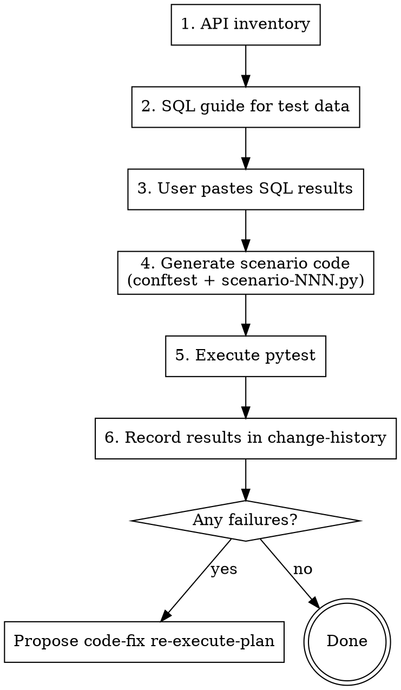

# API Auto-Testing Pipeline

After /executing-plans implements new API endpoints, /api-test orchestrates a 6-step pipeline that generates pytest scenarios with auto-detected auth, runs them, and records results to <slug>-implementation-plan.md change-history.

<HARD-GATE>
Triggered ONLY by explicit /api-test (no auto-run). DB access is via SQL-paste only — NEVER use MCP DB connectors or run SQL through the user's DB credentials directly. The user pastes SQL results into the conversation.
</HARD-GATE>

## When to Invoke

- The user issues `/api-test` for the current feature folder
- <slug>-implementation-plan.md exists and includes new/modified API endpoints (typically just after /executing-plans)

## 6-Step Pipeline



## Step 1 — API Inventory

- Read <slug>-implementation-plan.md `## 1. 단계별 작업` to identify new/modified endpoints introduced by recent tasks
- Grep router decorators in code (`@router.get|post|put|patch|delete`, `@app.get|post|...`, FastAPI/Flask/Django patterns) to confirm endpoints exist in the implementation
- For each endpoint, capture: HTTP method, path, path/query/body params, auth requirement

## Step 2 — SQL Guide for Test Data

For each endpoint, identify the data dependencies (e.g., `user_id`, `product_id`, `order_id`) and present SQL to the user:

```
필요한 테스트 데이터를 백엔드 DB에서 조회 후 결과를 paste 해주세요:

-- active 사용자 1명 (정상 케이스)
SELECT id, email FROM users WHERE status='active' AND deleted_at IS NULL LIMIT 1;

-- 재고 있는 상품 1개
SELECT id, name, stock FROM products WHERE stock > 0 LIMIT 1;

-- (필요 시) 음수 잔액 케이스 — 시뮬용
SELECT id FROM users WHERE balance < 0 LIMIT 1;
```

The exact SQL depends on the inferred schema (read migrations, models, or ask once if unclear).

## Step 3 — User Pastes Results

Wait for user paste. Parse rows into dict-form:
```
{"id": 12345, "email": "test@example.com"}
{"id": 67, "name": "Item A", "stock": 10}
```

Store in working memory for the next step.

## Step 4 — Auto-Detect Auth + Generate Scenario Code

Run auth detection:
```bash
source .venv/bin/activate
python -m scripts.detect_auth .
```

Result branches:
- `jwt-login` → activate Block A in conftest.py (login fixture)
- `static-env-token` → activate Block B (env var fixture)
- `unknown` → ask the user once: "어떻게 인증하나요? 로그인 엔드포인트 / 정적 토큰 / OAuth?"

Files to write under `docs/features/<...>/api-tests/`:

1. **conftest.py** — copy from `templates/api-tests/conftest.py.template`, activate the right block, and append data fixtures matching the user's paste:
   ```python
   @pytest.fixture
   def test_user() -> dict:
       return {"id": 12345, "email": "test@example.com"}
   ```
2. **scenario-001-<endpoint-name>.py** — happy path test
3. **scenario-002-<endpoint-name>-edge.py** — 2~3 edge cases (invalid input / missing perms / non-existent ID)

Example scenario:
```python
def test_withdraw_success(api_client, test_user, test_product):
    r = api_client.post(
        "/api/wallet/withdraw",
        json={"user_id": test_user["id"], "amount": 1000},
    )
    assert r.status_code == 200
    body = r.json()
    assert body["balance"] >= 0
    assert "transaction_id" in body
```

## Step 5 — Execute Pytest

```bash
source .venv/bin/activate
pytest docs/features/<...>/api-tests/scenario-*.py \
       -v --tb=short \
       --json-report \
       --json-report-file=docs/features/<...>/api-tests/results/$(date +%Y-%m-%d-%H%M).json
```

Dependencies are listed in repo-root `requirements-dev.txt`. If a user's project lacks them, instruct: `pip install pytest requests pytest-json-report` and rerun.

## Step 6 — Record Results

Invoke change-history skill to append a [API테스트] entry to <slug>-implementation-plan.md:

```markdown
### [2026-05-02 15:30] [API테스트]
- **id**: CH-20260502-009
- **시나리오 파일**: api-tests/scenario-001-withdraw.py (4 tests)
- **결과**: PASS 3 / FAIL 1 / ERROR 0
- **실패 상세**: test_withdraw_negative_amount → 422 기대, 200 응답
- **결과 파일**: api-tests/results/2026-05-02-1530.json
- **다음 액션**: 음수 amount 검증 누락 → /executing-plans 재진입 권장
```

## Failure Handling

When the JSON report shows failures, surface them to the user:

```
1건 실패 — test_withdraw_negative_amount 가 음수 amount에 대해 422를 기대했으나 200을 받았습니다.
원인: src/wallet/service.py의 withdraw에 음수 검증 누락으로 보입니다.

선택:
A) /executing-plans 재진입 → 수정 후 재테스트
B) 시나리오 자체가 잘못 → 시나리오 코드 수정
C) 무시하고 마무리
```

The user's choice routes back to either /executing-plans (cascading code fix) or scenario edit (scoped to api-tests folder).

## Anti-Patterns

| Wrong | Right |
|---|---|
| Use MCP DB connector to query directly | Forbidden by HARD-GATE. SQL-paste only. |
| Embed secrets in scenario files | Use env vars (`API_BASE_URL`, `API_TOKEN`, `TEST_USER_EMAIL`) loaded from `.env.test` (in .gitignore). |
| Report only PASS counts | Include FAIL/ERROR detail. The whole point is failure visibility. |
| Auto-run on every /executing-plans | Manual trigger only. The user runs /api-test when they want it. |

## Red Flags

| Thought | Reality |
|---|---|
| "Just hardcode test data" | Hardcoded data drifts from prod schema. SQL-paste from real DB. |
| "Skip auth fixture, this is a public endpoint" | Public today, auth-gated tomorrow. Always include the auth fixture (it's no-op for public). |
| "Use prod base URL for testing" | NEVER. local/staging only. If unclear, ask before sending requests. |

## Acceptance

After /api-test completes:
1. ≥ 1 scenario file under `docs/features/<...>/api-tests/`
2. ≥ 1 JSON result file under `docs/features/<...>/api-tests/results/`
3. <slug>-implementation-plan.md `## 변경이력` has a fresh `[API테스트]` entry with PASS/FAIL/ERROR counts
4. Failure cases (if any) surfaced with concrete next-action options

## Related Skills

- `executing-plans` — produced the code under test
- `change-history` — invoked at Step 6 to append [API테스트] entry
- `change-propagation` — invoked when failures lead to code/spec edits

## Helper Scripts

- `scripts/detect_auth.py` — auth pattern detection (called at Step 4)
- `templates/api-tests/conftest.py.template` — fixture skeleton copied into each feature's api-tests folder
