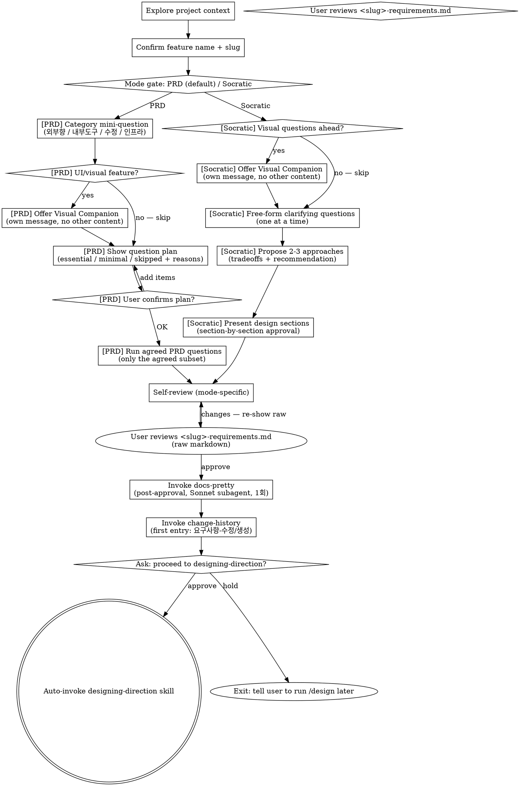

# Brainstorming → <slug>-requirements.md (PRD or Socratic)

js-superpowers' brainstorming is restricted to **planning-level requirements output**. Technical design and implementation plans are handled by `designing-direction` and `writing-plans` skills respectively.

Two modes are offered at the start, both producing the same file path (`<slug>-requirements.md`) so downstream skills work uniformly:

- **PRD mode (default)** — structured 6-section template (배경/목적 → 사용자 스토리 → FR → NFR → 범위 밖 → 수용 기준), with **adaptive question planning** (skip/minimize sections that don't fit the feature category — no over-asking).
- **Socratic mode** — free-form upstream-superpowers-style dialogue: one question at a time, propose 2-3 approaches with tradeoffs, section-by-section approval. Output is free-form prose under the same filename. Use this for internal/exploratory work where the PRD template would be over-structure.

<HARD-GATE>
This skill is for PRD only — NOT writing <slug>-tech-design.md, NOT touching code, NOT writing implementation plans. brainstorming = PRD only.

After <slug>-requirements.md is approved AND change-history is logged, you MUST ask the user explicitly whether to proceed to the technical-design stage. The user can reply in any language; parse intent (approve / hold / unclear). On approval, AUTO-invoke the `designing-direction` skill via the Skill tool — the user does NOT need to manually type `/design`. On hold, exit cleanly and tell the user to run `/design` later. NEVER cross the gate without explicit user approval.
</HARD-GATE>

## Checklist

You MUST create a TaskCreate task for each of these items and complete them in order:

1. **Explore project context** — files, docs, recent commits
2. **Confirm feature name + slug** — one question, then create `docs/features/YYYY-MM-DD-<slug>/`
3. **Mode selection gate** — ask user PRD (default) or Socratic. Parse intent (any language). On ambiguous reply, default to PRD with a one-line note. See "Mode Selection" below.
4. **Run mode-specific dialogue**:
   - **[PRD mode]** Feature category mini-question → **Visual Companion offer** (if UI/layout/visual feature based on category — own message, mode-aware trigger) → Question plan agreement → Adaptive PRD questions (only the agreed subset). See "PRD Adaptive Planning" below.
   - **[Socratic mode]** **Visual Companion offer** (if visual questions ahead — own message) → Free-form upstream-style dialogue: one question at a time, propose 2-3 approaches with tradeoffs, section-by-section approval. See "Socratic Mode" below.
5. **Self-review** — mode-specific (PRD: 6-item PRD scan + 4-item abstract scan; Socratic: 4-item abstract scan only)
6. **User reviews <slug>-requirements.md** — show the RAW (un-prettified) file, get approval (loop until OK; on changes → revise → re-show raw)
7. **Invoke docs-pretty skill** — format-only pass (Sonnet subagent) on the APPROVED draft, AFTER user approval and BEFORE change-history. Single shot per feature (final-1회). Stops once first change-history entry is logged.
8. **Invoke change-history skill** — append first `[요구사항-수정]` entry
9. **Ask user for approval to proceed** — emit a short prompt asking yes/no whether to enter designing-direction
10. **On approval intent → auto-invoke designing-direction via Skill tool. On hold → exit with a one-line notice telling the user to run /design later**

If you find yourself skipping ahead, stop and create the missing task.

## Anti-Pattern: "This is too simple to need a PRD"

Every project goes through this process. A single-function utility, a config change — all of them. "Simple" projects are where unexamined assumptions cause the most wasted work. The PRD can be short (a few sentences), but you MUST write it and get user approval.

## Output

Save path: `docs/features/YYYY-MM-DD-<slug>/<slug>-requirements.md`
- date = the day this brainstorming session started (immutable ID, NOT today's date on later edits)
- slug = feature name from the user's first answer (spaces → hyphens)
- A feature with the same name 6 months later gets a different folder (no collision)

## Document Schema (<slug>-requirements.md)

```markdown
# 요구사항: <feature-name>

> **For agentic workers:** This document is the PRD (planning-level only). NEXT STEP: invoke `designing-direction` skill (or run `/design`) to produce `<slug>-tech-design.md` from this document. Do NOT add tech decisions or implementation details here — those belong in the next two artifacts.

## 1. 배경/목적
## 2. 사용자 스토리 / 시나리오
## 3. 기능 요구사항 (FR)
   - FR-1: ...
   - FR-2: ...
## 4. 비기능 요구사항 (NFR)
## 5. 범위 밖 (Out of Scope)
## 6. 수용 기준 (Acceptance Criteria)

---
## 변경이력
<!-- change-history skill auto-appends entries here, oldest first -->
```

## Process Flow (two modes)



## Process (detail)

**1. Explore project context**
- Skim existing files/docs/recent commits
- Scope check: if the request bundles multiple independent subsystems, propose decomposition before continuing — never bundle multiple features into one PRD.

**2. Confirm feature name + slug** (1 question)
- Ask: "What should we call this feature?" (e.g., '잔액 출금', '회원 보너스 지급')
- Compute slug from the answer (replace spaces with hyphens)
- Create folder: `docs/features/YYYY-MM-DD-<slug>/`

**3. Mode selection gate** — see "Mode Selection" section below for the prompt template and intent parsing rules.

**4. Mode-specific dialogue**
- **PRD** → "PRD Adaptive Planning" (category → plan agreement → adaptive questions)
- **Socratic** → "Socratic Mode" (free-form upstream-style)

Both modes ultimately produce `<slug>-requirements.md` at the same path.

### PRD-mode special handling: 범위 밖 (Out of Scope) — CONSOLIDATE, do not re-ask

Throughout the earlier dialogue (배경/목적, 사용자 스토리, FR, NFR), the user often says things like "X는 제외", "Y는 안 만들어", "Z는 다음 버전에" — track those exclusions as they are mentioned.

When you reach the 범위 밖 step, do NOT ask "what's out of scope?" from scratch. Instead:

1. List every exclusion already collected during the dialogue
2. Show the consolidated list back to the user
3. Ask only: "추가로 §5 범위 밖에 넣을 항목 있나요? 없으면 '없음'."

Template (user-facing):
```
지금까지 명시된 제외 항목:
- 의미검색 (대화 중 언급)
- 다국어 검색 (FR-3 논의 중 보류)

§5 범위 밖에 추가로 넣을 항목이 있나요? 없으면 "없음" 이라고 답해주세요.
```

If the user says "없음" or equivalent, §5 = the consolidated list as-is. If they add more, append. Do NOT start from a blank prompt — that wastes the user's time and can drop earlier-stated exclusions.

**5. Self-review** (mode-specific, see checklist below)

**7. Invoke docs-pretty skill** (post-approval, final-1회 formatting)
- Runs AFTER the user APPROVES the raw draft, BEFORE change-history is logged
- Single shot per feature — does NOT re-fire on user-fix loops (loops re-show RAW)
- Stops the moment the first change-history entry is logged
- Dispatches a Sonnet subagent for a strict format-only pass (no rewording, no reordering, footer/frontmatter byte-preserved)
- See `docs-pretty` skill for full pre-flight + sanity-check protocol

**7. Show the doc + user review gate**
- Show the full prettified document; await approval or change requests
- If changes requested, revise per feedback → loop back to step 6 (self-review again, then docs-pretty, then re-show)
- On approval → continue to step 8

**8. Invoke change-history skill** (first entry: initial creation)
- Tag: `[요구사항-수정]` (use the entry type even on first creation)
- 이유: 신규 피처 brainstorming 결과
- 무엇이: <slug>-requirements.md 전체 (PRD: FR-1..N / Socratic: free-form sections)
- 영향범위: 없음 (최초 생성)

**9. Ask the user for approval to proceed (REQUIRED gate)**

Output a short approval prompt. Default phrasing:

```
✅ <slug>-requirements.md is finalized. Proceed to the designing-direction (technical design) stage now? — yes / no
```

The user may reply in any language (Korean, English, or mixed). Parse intent, do not enumerate accepted reply tokens.

Then wait for the user's reply.

**10. Branch on the user's reply**

- **Approval intent** → invoke the Skill tool with `designing-direction` (or `js-super:designing-direction` depending on the harness namespace). Pass control to that skill — it reads <slug>-requirements.md from the same feature folder and starts the technical-design dialogue.
- **Hold / decline intent** → emit a one-line notice such as `ℹ️ OK. Run /design later when ready.` and stop. Do NOT auto-invoke.
- **Ambiguous reply** → ask once more with a clearer prompt; do not guess.

## Mode Selection

After the slug is set (step 2), ask the user to pick a mode. Default phrasing:

```
이 피처는 어떤 모드로 진행할까요?

  1. PRD (default) — 구조화된 6-섹션 템플릿, 외부 사용자향/제품 기능에 적합. 카테고리에 맞춰 질문은 자동 최적화됨.
  2. Socratic — 자유 탐색 대화, upstream superpowers 방식. 내부 도구/탐색/실험적 작업에 적합. 자유 형식 산출물.

어느 쪽? (잘 모르겠으면 PRD)
```

Parse intent in any language. Heuristics:
- "1" / "PRD" / "구조화" / "기본" → PRD
- "2" / "Socratic" / "소크라테스" / "자유" / "원본" → Socratic
- Anything else → ask once more; if still unclear, default to PRD with a one-line note: "ℹ️ Ambiguous — defaulting to PRD."

Once chosen, the mode is fixed for this brainstorming run.

## PRD Adaptive Planning (PRD mode only)

Goal: avoid asking all 6 PRD questions when the feature category doesn't need them. Two sub-steps before the actual PRD questions begin.

### Step P1 — Feature category mini-question

Ask once:

```
이 피처의 한 줄 요약과 카테고리는?

  (a) 외부 사용자향 기능 (앱/웹의 사용자 노출 기능)
  (b) 내부 도구 / 스크립트 (운영/백오피스/CLI)
  (c) 기존 기능 수정 / 리팩터
  (d) 인프라 / 운영

요약: <한 줄> / 카테고리: a/b/c/d
```

Parse the user's answer to fill the category. Heuristics + `category` is required — if missing, re-ask once.

### Step P1.5 — Visual Companion offer (PRD-stricter trigger)

After the category is set, evaluate whether upcoming questions will involve UI/layout/visual artifacts. The trigger:

- **Offer** if category is (a) 외부 사용자향 AND the one-liner mentions UI/screen/layout/dashboard/form/etc., OR if category is (c) 수정 with explicit visual scope. Examples: "대시보드 화면 추가", "회원가입 폼 리뉴얼", "리포트 레이아웃".
- **Skip** for pure backend / API / data-flow / 내부 도구 / 인프라. PRD work is mostly textual; offering by default just adds noise.

If offering, the offer is its OWN message (no other content). See "Visual Companion" section below for the exact phrasing. If user declines, continue text-only.

### Step P2 — Show the question plan, get explicit confirmation

Compute the plan from this rubric:

| 섹션 | (a) 외부향 | (b) 내부 도구 | (c) 수정 | (d) 인프라 |
|---|---|---|---|---|
| 1. 배경/목적 | ✅ 필수 | ✅ 필수 | ✅ 필수 | ✅ 필수 |
| 2. 사용자 스토리 | ➖ 간소 | ⏭ 스킵 | ⏭ 스킵 | ⏭ 스킵 |
| 3. FR | ✅ 필수 | ✅ 필수 | ✅ 필수 | ✅ 필수 |
| 4. NFR | ➖ 간소 | ⏭ 스킵 | ⏭ 스킵 | ➖ 간소 |
| 5. 범위 밖 | ➖ 간소 | ➖ 간소 | ➖ 간소 | ➖ 간소 |
| 6. 수용 기준 | ➖ 간소* | ➖ 간소* | ➖ 간소* | ➖ 간소* |

Legend: ✅ 필수 (full question) / ➖ 간소 (one-line answer accepted) / ⏭ 스킵 (don't ask, write "해당 없음 — <reason>" in the doc)

\* §6 수용 기준은 ➖ 간소 디폴트. 자동화 테스트 강한 피처(API 명세 분명, 측정 지표 명확)면 사용자가 카테고리 게이트(P2)에서 "수용 기준 풀로" 라고 명시 시 ✅ 로 승격.

Show the plan in user-facing form:

```
[<category>] 카테고리라서 다음 순서로 진행하려고 합니다:

  ✅ 배경/목적 (필수)
  ⏭ 사용자 스토리 — 스킵 (내부 도구라 외부 사용자 없음)
  ✅ FR (필수)
  ⏭ NFR — 스킵 (내부 도구는 NFR 의미 적음)
  ➖ 범위 밖 — 간소 (1줄 또는 "없음")
  ➖ 수용 기준 — 간소 (1줄, 풀로 가려면 "수용 기준 풀로")

이대로 진행할까요? 추가로 깊게 묻고 싶은 항목 있나요?
```

Branches:
- User OK → run only the planned questions
- User wants more (e.g., "NFR 풀로 가자") → upgrade those items to ✅ 필수 and re-show, then run
- User wants less → don't downgrade ✅ 필수 → 스킵 lightly. If they insist (e.g., "FR도 1줄로"), allow but warn once: "ℹ️ FR 간소화는 다음 단계 verify에서 누락 신호로 잡힐 수 있어요."

### Step P3 — Run the agreed questions only

For each section in the agreed plan:
- ✅ 필수 → ask the full PRD question (배경/목적, 사용자 스토리, FR-N, NFR, 수용 기준 — same as before)
- ➖ 간소 → ask "한 줄 요약?" only
- ⏭ 스킵 → don't ask; write `<section>: 해당 없음 — <reason from rubric>` in the doc

The 범위 밖 (Out of Scope) consolidation rule still applies — track exclusions through the dialogue and offer them back. Do NOT ask from a blank prompt.

## Socratic Mode

Free-form upstream-superpowers-style dialogue. The doc is written as free-form prose, not the 6-section PRD template.

### Process (Socratic)

0. **Visual Companion offer (upstream-style trigger)** — evaluate whether upcoming questions will involve visual content (mockups, layouts, diagrams). If yes, offer the companion as its OWN message (no other content). See "Visual Companion" section below for the exact phrasing. If user declines, continue text-only. Skip silently for pure conceptual/code topics.
1. **Clarifying questions** — one at a time. Cover purpose / constraints / success criteria. Prefer multiple choice when possible. Continue until the idea is shaped.
2. **Propose 2-3 approaches** — with tradeoffs and your recommendation.
3. **Present design sections** — section by section, get user approval after each. Section names emerge from the dialogue (no fixed schema).
4. **Write the doc** at `docs/features/YYYY-MM-DD-<slug>/<slug>-requirements.md`:

```markdown
# 요구사항: <feature-name>

> **Mode:** Socratic (free-form). Downstream `designing-direction` reads this prose without expecting fixed PRD section IDs.

<sections that emerged from the dialogue, e.g.:>
## 배경
## 핵심 결정
## 인터랙션 흐름
## 우려/해결
## 다음 단계

---
## 변경이력
<!-- change-history skill auto-appends entries here, oldest first -->
```

Section names are NOT fixed — write whatever sections fit the dialogue. The only fixed parts are: H1 title (`# 요구사항: ...`), the Mode line, and the `## 변경이력` footer.

### Self-review (Socratic — only the abstract scan)

- Placeholder scan (TBD/TODO?)
- Internal consistency
- Scope check (single feature?)
- Ambiguity check

The 6-item PRD-specific scan does NOT apply (no FR-N/NFR template to check).

### When Socratic mode breaks down

If, mid-dialogue, the conversation reveals that the work IS user-facing/productisation in nature, suggest switching to PRD mode once: "ℹ️ 이 피처는 외부 사용자향처럼 보이는데 PRD 모드가 더 안전합니다. 전환할까요?" — if the user agrees, restart with the PRD planning step (step P1). Otherwise stay in Socratic.

## Self-Review

Mode-aware. PRD mode runs both checks; Socratic mode runs only the abstract scan (the PRD-specific items don't apply to free-form prose).

**PRD-specific (6 items, PRD mode only) — applies only to sections marked ✅ 필수 in the agreed plan; ➖ 간소 / ⏭ 스킵 sections are exempt:**
1. Every FR has a unique id (FR-1, FR-2, ...)
2. Every acceptance criterion is measurable (Yes/No answerable)
3. Out-of-scope is explicit (use "없음" if truly empty) AND captures every exclusion the user mentioned during the dialogue — not just answers to step 5 itself
4. No technical/implementation details leak into the body — those belong in <slug>-tech-design.md
5. NFRs are concrete, not vague (e.g., "fast" → "p95 < 200ms")
6. User stories include all three of who/what/why

**Abstract scan (4 items, both modes, fresh-eyes pass):**

7. **Placeholder scan**: Any "TBD", "TODO", incomplete sections, or vague requirements? Fix them.
8. **Internal consistency**: Do any sections contradict each other?
9. **Scope check**: Is this focused enough for a single feature, or does it need decomposition? If yes, split.
10. **Ambiguity check**: Could any requirement be interpreted two different ways? If so, pick one and make it explicit.

Fix any issues inline. No need to re-review — just fix and move on.

## Anti-Patterns

| Wrong | Right |
|---|---|
| Embedding tech decisions ("use Postgres", "REST API") in the PRD | Put those in <slug>-tech-design.md. PRD is tech-agnostic. |
| Writing only "user can do X" without an FR id | `FR-N: <action>` plus a measurable acceptance criterion |
| Asking "범위 밖이 뭔가요?" from scratch when exclusions were stated earlier | Consolidate prior exclusions first; ask only for additions on top |
| Auto-crossing into design without asking | Always ask the approval prompt. On approval, auto-invoke. Without approval, stop. |
| Asking the user to type `/design` manually | Once approved, auto-invoke designing-direction via Skill tool. User shouldn't have to retype. |
| "Skip PRD because it's simple" | Simple cases just produce a shorter PRD, never a missing one. |

## Red Flags (STOP if you think these)

| Thought | Reality |
|---|---|
| "Just go straight to code, the user knows what they want" | Assumptions remain unvalidated. Run the questions. |
| "Intent is obvious, summarize in one line" | Even obvious intent has gaps. Fill all six sections. |
| "spec.md is fine, isn't it?" | js-superpowers separates PRD from technical spec. The file is <slug>-requirements.md, not spec.md. |

## After Save — Invoke change-history

On first save of <slug>-requirements.md, write a `[요구사항-수정]` entry:

- 이유: 신규 피처 brainstorming 결과
- 무엇이: <slug>-requirements.md 전체 (FR-1..N)
- 영향범위: 없음 (최초 생성)

## Visual Companion

A browser-based companion for showing mockups, diagrams, and visual options during brainstorming. Available as a tool — not a mode. Accepting the companion means it's available for questions that benefit from visual treatment; it does NOT mean every question goes through the browser.

**PRD context — stricter trigger:** PRD work is mostly textual. Do NOT offer the companion by default. Offer ONLY when the feature explicitly involves UI/layout/visual artifacts (e.g., "대시보드 화면", "폼 디자인", "리포트 레이아웃"). For pure backend/API/data-flow PRDs, skip the offer entirely.

**Offering the companion (only when triggered):** When upcoming questions will involve visual content (mockups, layouts, diagrams), offer it once for consent:

> "Some of what we're working on might be easier to explain if I can show it to you in a web browser. I can put together mockups, diagrams, comparisons, and other visuals as we go. This feature is still new and can be token-intensive. Want to try it? (Requires opening a local URL)"

**This offer MUST be its own message.** Do not combine it with clarifying questions, context summaries, or any other content. Wait for the user's response before continuing. If they decline, proceed with text-only brainstorming.

**Per-question decision:** Even after the user accepts, decide FOR EACH QUESTION whether to use the browser or the terminal. The test: **would the user understand this better by seeing it than reading it?**

- **Use the browser** for content that IS visual — mockups, wireframes, layout comparisons, side-by-side visual designs
- **Use the terminal** for content that is text — requirements questions, conceptual choices, tradeoff lists, A/B/C/D text options, scope decisions

A question about a UI topic is not automatically a visual question. "What does '관리자 메뉴' include?" is conceptual — use the terminal. "Which of these two layouts works better?" is visual — use the browser.

If they agree to the companion, read the detailed guide before proceeding:
`skills/brainstorming/visual-companion.md`

## Key Principles

- **One question at a time** — never multi-question prompts
- **Multiple choice preferred** — A/B/C is easier to answer than open-ended
- **YAGNI** — drop unnecessary requirements ruthlessly
- **2-3 approaches** — when proposing options, show alternatives plus a recommendation
- **Be flexible** — backtrack and re-ask when an earlier answer no longer holds

## Related Skills

- `designing-direction` — next step (technical spec)
- `change-history` — first PRD entry
- `change-propagation` — when the PRD is later edited, cascades to downstream MDs
