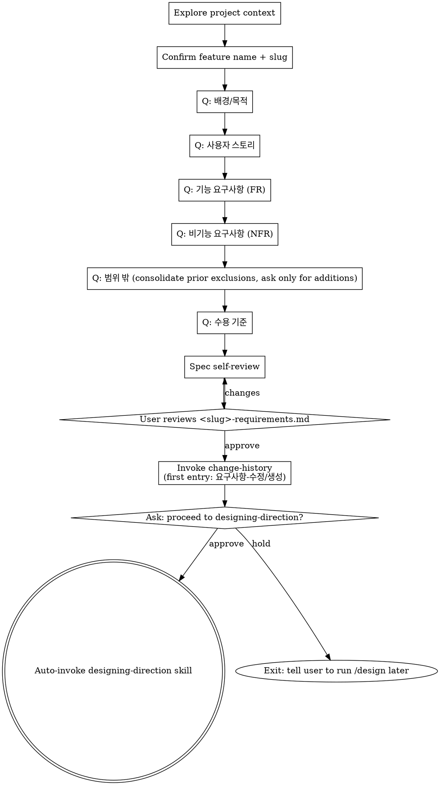

# Brainstorming → <slug>-requirements.md (PRD only)

js-superpowers' brainstorming is restricted to **planning-level PRD output**. Technical design and implementation plans are handled by `designing-direction` and `writing-plans` skills respectively. The upstream superpowers brainstorming patterns (one question at a time, multiple choice preferred, 2-3 approaches with tradeoffs, section-by-section approval) are inherited as-is.

<HARD-GATE>
This skill is for PRD only — NOT writing <slug>-tech-design.md, NOT touching code, NOT writing implementation plans. brainstorming = PRD only.

After <slug>-requirements.md is approved AND change-history is logged, you MUST ask the user explicitly whether to proceed to the technical-design stage. The user can reply in any language; parse intent (approve / hold / unclear). On approval, AUTO-invoke the `designing-direction` skill via the Skill tool — the user does NOT need to manually type `/design`. On hold, exit cleanly and tell the user to run `/design` later. NEVER cross the gate without explicit user approval.
</HARD-GATE>

## Checklist

You MUST create a TaskCreate task for each of these items and complete them in order:

1. **Explore project context** — files, docs, recent commits
2. **Confirm feature name + slug** — one question, then create `docs/features/YYYY-MM-DD-<slug>/`
3. **Run PRD questions** — one at a time: 배경/목적 → 사용자 스토리 → FR → NFR → 범위 밖 → 수용 기준
4. **Self-review** — placeholder/measurability/scope check (see below)
5. **User reviews <slug>-requirements.md** — show the file, get approval (loop until OK)
6. **Invoke change-history skill** — append first `[요구사항-수정]` entry
7. **Ask user for approval to proceed** — emit a short prompt asking yes/no whether to enter designing-direction (see step 7 below for the exact template)
8. **On approval intent → auto-invoke designing-direction via Skill tool. On hold → exit with a one-line notice telling the user to run /design later**

If you find yourself skipping ahead, stop and create the missing task.

## Anti-Pattern: "This is too simple to need a PRD"

Every project goes through this process. A single-function utility, a config change — all of them. "Simple" projects are where unexamined assumptions cause the most wasted work. The PRD can be short (a few sentences), but you MUST write it and get user approval.

## Output

Save path: `docs/features/YYYY-MM-DD-<slug>/<slug>-requirements.md`
- date = the day this brainstorming session started (immutable ID, NOT today's date on later edits)
- slug = feature name from the user's first answer (spaces → hyphens)
- A feature with the same name 6 months later gets a different folder (no collision)

## Document Schema (<slug>-requirements.md)

```markdown
# 요구사항: <feature-name>

> **For agentic workers:** This document is the PRD (planning-level only). NEXT STEP: invoke `designing-direction` skill (or run `/design`) to produce `<slug>-tech-design.md` from this document. Do NOT add tech decisions or implementation details here — those belong in the next two artifacts.

## 1. 배경/목적
## 2. 사용자 스토리 / 시나리오
## 3. 기능 요구사항 (FR)
   - FR-1: ...
   - FR-2: ...
## 4. 비기능 요구사항 (NFR)
## 5. 범위 밖 (Out of Scope)
## 6. 수용 기준 (Acceptance Criteria)

---
## 변경이력
<!-- change-history skill auto-appends entries here, oldest first -->
```

## Process Flow (PRD-only)



## Process (detail)

**1. Explore project context**
- Skim existing files/docs/recent commits
- Scope check: if the request bundles multiple independent subsystems, propose decomposition before continuing — never bundle multiple features into one PRD.

**2. Confirm feature name + slug** (1 question)
- Ask: "What should we call this feature?" (e.g., '잔액 출금', '회원 보너스 지급')
- Compute slug from the answer (replace spaces with hyphens)
- Create folder: `docs/features/YYYY-MM-DD-<slug>/`

**3. Step-by-step PRD questions** (one question at a time, multiple choice when possible)
- 배경/목적 — why build this, what problem does it solve
- 사용자 스토리 — who, what, why
- FR-N — each FR gets a unique id and a measurable behavior
- NFR — performance, security, accessibility, availability ("none" is acceptable if explicit)
- 범위 밖 — see special rule below (consolidate, do not ask from scratch)
- 수용 기준 — Yes/No-answerable acceptance criteria

**3a. Special handling for 범위 밖 (Out of Scope) — CONSOLIDATE, do not re-ask**

Throughout the earlier dialogue (배경/목적, 사용자 스토리, FR, NFR), the user often says things like "X는 제외", "Y는 안 만들어", "Z는 다음 버전에" — track those exclusions as they are mentioned.

When you reach the 범위 밖 step, do NOT ask "what's out of scope?" from scratch. Instead:

1. List every exclusion already collected during the dialogue
2. Show the consolidated list back to the user
3. Ask only: "추가로 §5 범위 밖에 넣을 항목 있나요? 없으면 '없음'."

Template (user-facing):
```
지금까지 명시된 제외 항목:
- 의미검색 (대화 중 언급)
- 다국어 검색 (FR-3 논의 중 보류)

§5 범위 밖에 추가로 넣을 항목이 있나요? 없으면 "없음" 이라고 답해주세요.
```

If the user says "없음" or equivalent, §5 = the consolidated list as-is. If they add more, append. Do NOT start from a blank prompt — that wastes the user's time and can drop earlier-stated exclusions.

**4. Self-review** (see checklist below)

**5. Write PRD + user review gate**
- Show the full document; await approval or change requests
- If changes requested, run self-review again

**6. Invoke change-history skill** (first entry: initial creation)
- Tag: `[요구사항-수정]` (use the entry type even on first creation)
- 이유: 신규 피처 brainstorming 결과
- 무엇이: <slug>-requirements.md 전체 (FR-1..N)
- 영향범위: 없음 (최초 생성)

**7. Ask the user for approval to proceed (REQUIRED gate)**

Output a short approval prompt. Default phrasing:

```
✅ <slug>-requirements.md is finalized. Proceed to the designing-direction (technical design) stage now? — yes / no
```

The user may reply in any language (Korean, English, or mixed). Parse intent, do not enumerate accepted reply tokens.

Then wait for the user's reply.

**8. Branch on the user's reply**

- **Approval intent** → invoke the Skill tool with `designing-direction` (or `js-super:designing-direction` depending on the harness namespace). Pass control to that skill — it reads <slug>-requirements.md from the same feature folder and starts the technical-design dialogue.
- **Hold / decline intent** → emit a one-line notice such as `ℹ️ OK. Run /design later when ready.` and stop. Do NOT auto-invoke.
- **Ambiguous reply** → ask once more with a clearer prompt; do not guess.

## Self-Review

After writing the PRD, run BOTH the PRD-specific check AND the abstract scan:

**PRD-specific (6 items):**
1. Every FR has a unique id (FR-1, FR-2, ...)
2. Every acceptance criterion is measurable (Yes/No answerable)
3. Out-of-scope is explicit (use "없음" if truly empty) AND captures every exclusion the user mentioned during the dialogue — not just answers to step 5 itself
4. No technical/implementation details leak into the body — those belong in <slug>-tech-design.md
5. NFRs are concrete, not vague (e.g., "fast" → "p95 < 200ms")
6. User stories include all three of who/what/why

**Abstract scan (4 items, fresh-eyes pass):**

7. **Placeholder scan**: Any "TBD", "TODO", incomplete sections, or vague requirements? Fix them.
8. **Internal consistency**: Do any sections contradict each other? Do FRs and NFRs align?
9. **Scope check**: Is this focused enough for a single feature, or does it need decomposition? If yes, split.
10. **Ambiguity check**: Could any requirement be interpreted two different ways? If so, pick one and make it explicit.

Fix any issues inline. No need to re-review — just fix and move on.

## Anti-Patterns

| Wrong | Right |
|---|---|
| Embedding tech decisions ("use Postgres", "REST API") in the PRD | Put those in <slug>-tech-design.md. PRD is tech-agnostic. |
| Writing only "user can do X" without an FR id | `FR-N: <action>` plus a measurable acceptance criterion |
| Asking "범위 밖이 뭔가요?" from scratch when exclusions were stated earlier | Consolidate prior exclusions first; ask only for additions on top |
| Auto-crossing into design without asking | Always ask the approval prompt. On approval, auto-invoke. Without approval, stop. |
| Asking the user to type `/design` manually | Once approved, auto-invoke designing-direction via Skill tool. User shouldn't have to retype. |
| "Skip PRD because it's simple" | Simple cases just produce a shorter PRD, never a missing one. |

## Red Flags (STOP if you think these)

| Thought | Reality |
|---|---|
| "Just go straight to code, the user knows what they want" | Assumptions remain unvalidated. Run the questions. |
| "Intent is obvious, summarize in one line" | Even obvious intent has gaps. Fill all six sections. |
| "spec.md is fine, isn't it?" | js-superpowers separates PRD from technical spec. The file is <slug>-requirements.md, not spec.md. |

## After Save — Invoke change-history

On first save of <slug>-requirements.md, write a `[요구사항-수정]` entry:

- 이유: 신규 피처 brainstorming 결과
- 무엇이: <slug>-requirements.md 전체 (FR-1..N)
- 영향범위: 없음 (최초 생성)

## Visual Companion

A browser-based companion for showing mockups, diagrams, and visual options during brainstorming. Available as a tool — not a mode. Accepting the companion means it's available for questions that benefit from visual treatment; it does NOT mean every question goes through the browser.

**PRD context — stricter trigger:** PRD work is mostly textual. Do NOT offer the companion by default. Offer ONLY when the feature explicitly involves UI/layout/visual artifacts (e.g., "대시보드 화면", "폼 디자인", "리포트 레이아웃"). For pure backend/API/data-flow PRDs, skip the offer entirely.

**Offering the companion (only when triggered):** When upcoming questions will involve visual content (mockups, layouts, diagrams), offer it once for consent:

> "Some of what we're working on might be easier to explain if I can show it to you in a web browser. I can put together mockups, diagrams, comparisons, and other visuals as we go. This feature is still new and can be token-intensive. Want to try it? (Requires opening a local URL)"

**This offer MUST be its own message.** Do not combine it with clarifying questions, context summaries, or any other content. Wait for the user's response before continuing. If they decline, proceed with text-only brainstorming.

**Per-question decision:** Even after the user accepts, decide FOR EACH QUESTION whether to use the browser or the terminal. The test: **would the user understand this better by seeing it than reading it?**

- **Use the browser** for content that IS visual — mockups, wireframes, layout comparisons, side-by-side visual designs
- **Use the terminal** for content that is text — requirements questions, conceptual choices, tradeoff lists, A/B/C/D text options, scope decisions

A question about a UI topic is not automatically a visual question. "What does '관리자 메뉴' include?" is conceptual — use the terminal. "Which of these two layouts works better?" is visual — use the browser.

If they agree to the companion, read the detailed guide before proceeding:
`skills/brainstorming/visual-companion.md`

## Key Principles

- **One question at a time** — never multi-question prompts
- **Multiple choice preferred** — A/B/C is easier to answer than open-ended
- **YAGNI** — drop unnecessary requirements ruthlessly
- **2-3 approaches** — when proposing options, show alternatives plus a recommendation
- **Be flexible** — backtrack and re-ask when an earlier answer no longer holds

## Related Skills

- `designing-direction` — next step (technical spec)
- `change-history` — first PRD entry
- `change-propagation` — when the PRD is later edited, cascades to downstream MDs
