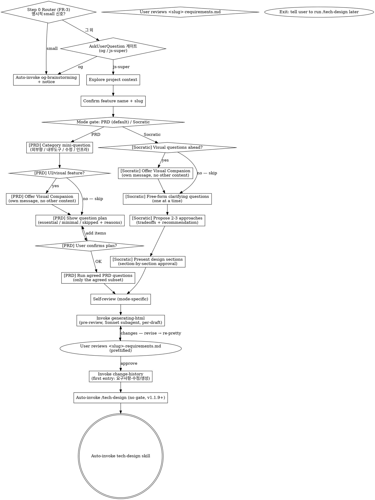

# Brainstorming → <slug>-requirements.md (PRD or Socratic)

## 사용자 질문 룰 (v2.0.3+) — 항상 AskUserQuestion

이 skill 흐름 안에서 사용자에게 질문할 일이 생기면 **반드시** `AskUserQuestion`
도구로 호출한다. 산문으로 "~ 할까요?" 한 줄 던지지 마라.

### Why

Notification 훅 (`elicitation_dialog` 매처) 이 알람을 발화하려면 도구 호출이
실제로 일어나야 함. 산문 질문은 훅이 못 잡아서 사용자가 놓침 (v1.1.8 신고 재발).

### How to apply

- clarifying / Socratic / 모호점 확인 / 게이트 / 모드 선택 — 모두 포함
- 단답 yes/no 도 prose X → `AskUserQuestion` choices `[yes, no]` 사용
- 다중 선택은 enum choices 또는 multi-question batching (의미 결합 시 max 4 questions[])
- **Socratic 자유 응답**: AskUserQuestion 의 question 본문에 "자유롭게 답해주세요. 별도 옵션 선택 불필요" + dummy choice `[알겠음]` 1개 → 트리거만 발화, 응답은 다음 turn prose
- **예외**: 본문 자체의 알람-friendly 안내문 (`ℹ️ Auto-proceeding ...`) 는 질문 아니라 안내 — 도구 호출 불필요

### Other / 모호 응답 처리 (v2.1.1+)

사용자가 "Other" 자유 응답 또는 "모르겠음 / 이해 안 됨" 류 답변 catch 시 → **그 질문만 단독 재호출 + prose 설명 추가**. 다음 단계 자동 진행 X (anchor 질문 강제 X 룰은 명확 yes/no 답변에만 적용).

js-superpowers' brainstorming is restricted to **planning-level requirements output**. Technical design and implementation plans are handled by `tech-design` and `writing-plans` skills respectively.

Two modes are offered at the start, both producing the same file path (`<slug>-requirements.md`) so downstream skills work uniformly:

- **PRD mode (default)** — structured 6-section template (배경/목적 → 사용자 스토리 → FR → NFR → 범위 밖 → 수용 기준), with **adaptive question planning** (skip/minimize sections that don't fit the feature category — no over-asking).
- **Socratic mode** — free-form upstream-superpowers-style dialogue: one question at a time, propose 2-3 approaches with tradeoffs, section-by-section approval. Output is free-form prose under the same filename. Use this for internal/exploratory work where the PRD template would be over-structure.

<HARD-GATE>
This skill is for PRD only — NOT writing <slug>-tech-design.md, NOT touching code, NOT writing implementation plans. brainstorming = PRD only.

After <slug>-requirements.md is approved AND change-history is logged, **automatically invoke** the `tech-design` skill via the Skill tool (v1.1.9+ — the separate "proceed?" gate has been removed). Output a one-line interrupt-notice `ℹ️ /tech-design 단계로 자동 넘어갑니다. 멈추려면 "stop" 입력해주세요.` so the user can pause if needed. If they explicitly type "stop"/"멈춰"/"잠깐", exit cleanly with `ℹ️ 알겠습니다. /tech-design 은 나중에 직접 실행해주세요.`. The original combined approval gate (#8) already captured the user's intent; a separate proceed gate just adds friction.
</HARD-GATE>

### 예외 — `--no-ask` 플래그 (v2.5+)

사용자가 슬래시 명령에 `--no-ask` 토큰을 **명시** 한 경우에만 진입. 메인 자체 판단으로 활성화 X.

- 모든 사용자 질문을 prose (메인 turn 자유 텍스트) 로 처리
- `AskUserQuestion` 도구 호출 **0 보장**
- 게이트 자체는 살아 있음 — 사용자 prose 응답 기다림
- 알람 fire X (사용자가 명시 invoke 했으니 인지 가정)

#### skill 진입 시 1회 boilerplate

skill 진입 직후 다음 한 줄을 prose 로 출력:

> ℹ️ `--no-ask` 모드 진입 — AskUserQuestion 도구 호출 X, 응답 알람 X. 백그라운드 작업 중이면 응답 시점을 직접 체크해주세요.

#### 위험 명령 진입 직전 보강

critical 7 케이스 (파일 삭제 / `git push --force` / DB migration / mass commit / 외부 메시지 등) 실행 직전에는 다음 한 줄을 prose 로 출력:

> ⚠️ 위험 명령 진입 — 응답 기다림. 백그라운드 작업 중이면 직접 catch 해주세요.

`⚠️` 마커 + 별도 줄로 일반 prose 보다 두드러지게.

## Checklist

You MUST create a TaskCreate task for each of these items and complete them in order:

0. **Entry Router (v1.1.15+, FR-3)** — 사용자 입력에 명시적 small 신호 감지 시 즉시 og-brainstorming auto-invoke + notice 한 줄. 그 외 → AskUserQuestion 게이트 (og- / js-super 양자택일). 자세한 룰은 "Entry Router" 섹션 참조.
1. **프로젝트 컨텍스트 탐색** — files, docs, recent commits
2. **피처 이름/슬러그 확인** — one question, then create `docs/features/YYYY-MM-DD-<slug>/`
3. **모드 선택** — ask user PRD (default) or Socratic. Parse intent (any language). On ambiguous reply, default to PRD with a one-line note. See "Mode Selection" below.
4. **모드별 질의응답 진행**:
   - **[PRD mode]** Feature category mini-question → **Visual Companion offer** (if UI/layout/visual feature based on category — own message, mode-aware trigger) → Question plan agreement → Adaptive PRD questions (only the agreed subset). See "PRD Adaptive Planning" below.
   - **[Socratic mode]** **Visual Companion offer** (if visual questions ahead — own message) → Free-form upstream-style dialogue: one question at a time, propose 2-3 approaches with tradeoffs, section-by-section approval. See "Socratic Mode" below.
5. **자체 점검** — mode-specific (PRD: 6-item PRD scan + 4-item abstract scan; Socratic: 4-item abstract scan only)
6. **문서 포맷 정리 (사용자 리뷰 전)** — format-only pass (Sonnet subagent) on the RAW draft BEFORE user review. Re-fires on each user-fix iteration (per-draft). Uses `generating-html` skill.
7. **사용자 검토 (PRD 초안)** — show the prettified file, get approval (loop until OK; on changes → revise → back to step 6 → re-show prettified). Stops once first change-history entry is logged.
8. **변경이력 기록** — append first `[요구사항-수정]` entry via `change-history` skill
9. **개발방향 단계 자동 진행** — Right after the change-history entry is logged, auto-invoke `tech-design` via the Skill tool with a one-line interrupt-notice. On user "stop"/"멈춰"/"잠깐" → exit cleanly with notice telling the user to run /tech-design later.

If you find yourself skipping ahead, stop and create the missing task.

**Before invoking the next skill via Skill tool, mark ALL checklist TaskCreate items as completed (in_progress → completed). The Skill tool transition does NOT auto-complete prior tasks. (v1.1.15+, FR-2)**

## Anti-Pattern: "This is too simple to need a PRD"

Every project goes through this process. A single-function utility, a config change — all of them. "Simple" projects are where unexamined assumptions cause the most wasted work. The PRD can be short (a few sentences), but you MUST write it and get user approval.

## Output

Save path: `docs/features/YYYY-MM-DD-<slug>/<slug>-requirements.md`
- date = the day this brainstorming session started (immutable ID, NOT today's date on later edits)
- slug = feature name from the user's first answer (spaces → hyphens)
- A feature with the same name 6 months later gets a different folder (no collision)

## Document Schema (<slug>-requirements.md)

```markdown
# 요구사항: <feature-name>

> **다음 단계 안내**: 이 문서는 PRD (기획 단계 요구사항만) 입니다. 다음 단계로 `tech-design` skill (또는 `/tech-design` 슬래시) 을 호출해서 `<slug>-tech-design.md` (기술 설계서) 를 만드세요. 기술 결정이나 구현 세부사항은 여기 박지 마세요 — 그건 다음 두 산출물에 들어갑니다.

## 1. 배경/목적
## 2. 사용자 스토리 / 시나리오
## 3. 기능 요구사항 (FR)
   - FR-1: ...
   - FR-2: ...
## 4. 비기능 요구사항 (NFR)
## 5. 범위 밖 (Out of Scope)
## 6. 수용 기준 (Acceptance Criteria)

---
## 변경이력
<!-- change-history skill auto-appends entries here, oldest first -->
```

## Process Flow (two modes)



## Process (detail)

**1. Explore project context**
- Skim existing files/docs/recent commits
- Scope check: if the request bundles multiple independent subsystems, propose decomposition before continuing — never bundle multiple features into one PRD.

**2. Confirm feature name + slug** (1 question)
- Ask: "What should we call this feature?" (e.g., '잔액 출금', '회원 보너스 지급')
- Compute slug from the answer (replace spaces with hyphens)
- Create folder: `docs/features/YYYY-MM-DD-<slug>/`

**3. Mode selection gate** — see "Mode Selection" section below for the prompt template and intent parsing rules.

**4. Mode-specific dialogue**
- **PRD** → "PRD Adaptive Planning" (category → plan agreement → adaptive questions)
- **Socratic** → "Socratic Mode" (free-form upstream-style)

Both modes ultimately produce `<slug>-requirements.md` at the same path.

### PRD-mode special handling: 범위 밖 (Out of Scope) — CONSOLIDATE, do not re-ask

Throughout the earlier dialogue (배경/목적, 사용자 스토리, FR, NFR), the user often says things like "X는 제외", "Y는 안 만들어", "Z는 다음 버전에" — track those exclusions as they are mentioned.

When you reach the 범위 밖 step, do NOT ask "what's out of scope?" from scratch. Instead:

1. List every exclusion already collected during the dialogue
2. Show the consolidated list back to the user
3. Ask only: "추가로 §5 범위 밖에 넣을 항목 있나요? 없으면 '없음'."

Template (user-facing):
```
지금까지 명시된 제외 항목:
- 의미검색 (대화 중 언급)
- 다국어 검색 (FR-3 논의 중 보류)

§5 범위 밖에 추가로 넣을 항목이 있나요? 없으면 "없음" 이라고 답해주세요.
```

If the user says "없음" or equivalent, §5 = the consolidated list as-is. If they add more, append. Do NOT start from a blank prompt — that wastes the user's time and can drop earlier-stated exclusions.

**5. Self-review** (mode-specific, see checklist below)

**6. Invoke generating-html skill** (v1.1.15+ pre-review, per-draft)
- Runs BEFORE user reviews the draft — format-only pass on the RAW content
- Re-fires on each user-fix iteration (per-draft loop): revise RAW → generating-html → show prettified
- Stops the moment the first change-history entry is logged
- Dispatches a Sonnet subagent for a strict format-only pass (no rewording, no reordering, footer/frontmatter byte-preserved)
- See `generating-html` skill for full pre-flight + sanity-check protocol

**7. Show the prettified doc + user review gate**
- Show the full prettified document; await approval or change requests
- If changes requested, revise per feedback → loop back to step 6 (generating-html re-fires → re-show prettified)
- On approval → continue to step 8

**Gate #8 — prettified 산출물 승인**

**Tool form (preferred)**

Call `AskUserQuestion`:

```json
{
  "question": "<slug>-requirements.md 승인?",
  "context": "prettified 산출물 검토 — 승인 시 change-history 진행",
  "choices": [
    {"value": "yes", "label": "예 — 승인하고 change-history 진행"},
    {"value": "no", "label": "아니오 — 사용자 피드백 받아 수정 후 generating-html 재발화"}
  ]
}
```

**Prose fallback**

When `AskUserQuestion` is unavailable, ask in prose:

> Approve `<slug>-requirements.md`? — `yes` / `no`

**8. Invoke change-history skill** (first entry: initial creation)
- Tag: `[요구사항-수정]` (use the entry type even on first creation)
- 이유: 신규 피처 brainstorming 결과
- 무엇이: <slug>-requirements.md 전체 (PRD: FR-1..N / Socratic: free-form sections)
- 영향범위: 없음 (최초 생성)

**9. Auto-proceed to tech-design (v1.1.9+ — no gate)**

After change-history entry is logged, **automatically invoke** the `tech-design` skill (or `js-super:tech-design` depending on harness namespace). NO user gate here.

Output a one-line notice `ℹ️ /tech-design 단계로 자동 넘어갑니다. 멈추려면 "stop" 입력해주세요.` so the user has a chance to interrupt mid-transition if they really want to pause.

If the user explicitly types "stop"/"멈춰"/"잠깐" after the notice, exit cleanly with `ℹ️ 알겠습니다. /tech-design 은 나중에 직접 실행해주세요.` Otherwise auto-invoke.

Rationale: gate #8 (RAW 산출물 승인) 에서 이미 사용자 의도가 다음 단계 진행으로 잡혔어요. 별도 "다음 단계 갈까요?" 게이트는 마찰만 더할 뿐이라 v1.1.9+ 에서 제거됐고, 대신 한 줄 안내로 사용자가 멈출 기회를 줍니다.

## Entry Router (v1.1.15+, FR-3)

js-super:brainstorming 진입 시 1순위 발화. `/brainstorm` slash command 진입 / 자연어 진입 ("…를 만들어 / 브레인스토밍 시작해") 모두 동일 path.

### 라우팅 룰

**1. 명시적 small 신호 감지 → og-brainstorming auto-invoke + notice 한 줄**

다음 중 하나라도 사용자 입력에 명시되면 small 판정:

- **small 키워드**: `간단`, `잠깐`, `한 줄`, `단순`, `og로`, `og-`, `가볍게`
- **단일 파일/단일 함수 변경 명시**: 예 — "`README.md` 한 줄 수정", "`utils.py:foo` 만 수정"
- **메타 워크플로우 / 순수 config 변경 명시**: 예 — "`.gitignore` 추가", "tsconfig 옵션 한 개 추가"

→ 즉시 `og-brainstorming` skill 을 Skill tool 로 invoke. 직전에 한 줄 notice 노출:

```
ℹ️ '<감지된 키워드 / 신호>' 신호로 og-brainstorming 으로 자동 전환합니다. 되돌리려면 "js-super" 라고 답해주세요.
```

사용자가 "js-super" 라고 응답하면 라우터 무시하고 본 skill 의 Checklist 1번 (Explore) 으로 진입.

**2. 그 외 모두 → AskUserQuestion 게이트**

명시적 small 신호 부재 (= 의도파악력 약한 케이스 포함). AI 가 "이건 분명 large 다" 판정할 필요 X. AskUserQuestion 호출:

```json
{
  "question": "이 피처는 og-brainstorming(가벼운 단발) 또는 js-super:brainstorming(3-MD 풀 트랙) 중 어느 모드로 진행할까요?",
  "header": "진입 모드",
  "multiSelect": false,
  "options": [
    {"label": "og-brainstorming", "description": "가벼운 단발 / upstream superpowers 원본 / 자유 탐색"},
    {"label": "js-super:brainstorming", "description": "3-MD 풀 트랙 / PRD + tech-design + plan / 변경이력 + 위험 주석"}
  ]
}
```

사용자 선택 → og 면 og-brainstorming Skill invoke / js-super 면 본 skill Checklist 1번 진입.

### 의도파악력 약해도 됨

AI 가 small/large 분명 판정할 필요 없음. 명시적 small 신호 catch 만 정확하면 나머지는 게이트로 사용자 결정. false positive 안 발생.

### og-brainstorming 본문 unchanged

라우터는 본 skill 진입에만 박힘. og-brainstorming SKILL.md 는 영향 X.

## Mode Selection

After the slug is set (step 2), ask the user to pick a mode. Use the standard Gate Question pattern (see "Asking the User a Gate Question" section).

**Tool form (preferred)**

Call `AskUserQuestion` with:

```json
{
  "question": "이 피처는 어떤 모드로 진행할까요?",
  "context": "잘 모르겠으면 PRD",
  "choices": [
    {"value": "PRD", "label": "PRD (기본) — 구조화 6-섹션, 외부 사용자향/제품 기능"},
    {"value": "Socratic", "label": "소크라테스식 — 자유 탐색, 내부 도구/탐색/실험"}
  ]
}
```

**Prose fallback**

When `AskUserQuestion` is unavailable:

```
이 피처는 어떤 모드로 진행할까요?

  1. PRD (default) — 구조화된 6-섹션 템플릿, 외부 사용자향/제품 기능에 적합. 카테고리에 맞춰 질문은 자동 최적화됨.
  2. Socratic — 자유 탐색 대화, upstream superpowers 방식. 내부 도구/탐색/실험적 작업에 적합. 자유 형식 산출물.

어느 쪽? (잘 모르겠으면 PRD)
```

Parse intent in any language. Heuristics:
- "1" / "PRD" / "구조화" / "기본" → PRD
- "2" / "Socratic" / "소크라테스" / "자유" / "원본" → Socratic
- Anything else → ask once more; if still unclear, default to PRD with a one-line note: "ℹ️ 잘 모르겠어서 PRD 로 기본 진행할게요."

Once chosen, the mode is fixed for this brainstorming run.

## PRD Adaptive Planning (PRD mode only)

Goal: avoid asking all 6 PRD questions when the feature category doesn't need them. Two sub-steps before the actual PRD questions begin.

### Step P1 — Feature category mini-question

Ask once:

```
이 피처의 한 줄 요약과 카테고리는?

  (a) 외부 사용자향 기능 (앱/웹의 사용자 노출 기능)
  (b) 내부 도구 / 스크립트 (운영/백오피스/CLI)
  (c) 기존 기능 수정 / 리팩터
  (d) 인프라 / 운영

요약: <한 줄> / 카테고리: a/b/c/d
```

Parse the user's answer to fill the category. Heuristics + `category` is required — if missing, re-ask once.

### Step P1.5 — Visual Companion offer (PRD-stricter trigger)

After the category is set, evaluate whether upcoming questions will involve UI/layout/visual artifacts. The trigger:

- **Offer** if category is (a) 외부 사용자향 AND the one-liner mentions UI/screen/layout/dashboard/form/etc., OR if category is (c) 수정 with explicit visual scope. Examples: "대시보드 화면 추가", "회원가입 폼 리뉴얼", "리포트 레이아웃".
- **Skip** for pure backend / API / data-flow / 내부 도구 / 인프라. PRD work is mostly textual; offering by default just adds noise.

If offering, the offer is its OWN message (no other content). See "Visual Companion" section below for the exact phrasing. If user declines, continue text-only.

### Step P2 — Show the question plan, get explicit confirmation

Compute the plan from this rubric:

| 섹션 | (a) 외부향 | (b) 내부 도구 | (c) 수정 | (d) 인프라 |
|---|---|---|---|---|
| 1. 배경/목적 | ✅ 필수 | ✅ 필수 | ✅ 필수 | ✅ 필수 |
| 2. 사용자 스토리 | ➖ 간소 | ⏭ 스킵 | ⏭ 스킵 | ⏭ 스킵 |
| 3. FR | ✅ 필수 | ✅ 필수 | ✅ 필수 | ✅ 필수 |
| 4. NFR | ➖ 간소 | ⏭ 스킵 | ⏭ 스킵 | ➖ 간소 |
| 5. 범위 밖 | ➖ 간소 | ➖ 간소 | ➖ 간소 | ➖ 간소 |
| 6. 수용 기준 | ➖ 간소* | ➖ 간소* | ➖ 간소* | ➖ 간소* |

Legend: ✅ 필수 (full question) / ➖ 간소 (one-line answer accepted) / ⏭ 스킵 (don't ask, write "해당 없음 — <reason>" in the doc)

\* §6 수용 기준은 ➖ 간소 디폴트. 자동화 테스트 강한 피처(API 명세 분명, 측정 지표 명확)면 사용자가 카테고리 게이트(P2)에서 "수용 기준 풀로" 라고 명시 시 ✅ 로 승격.

Show the plan in user-facing form:

```
[<category>] 카테고리라서 다음 순서로 진행하려고 합니다:

  ✅ 배경/목적 (필수)
  ⏭ 사용자 스토리 — 스킵 (내부 도구라 외부 사용자 없음)
  ✅ FR (필수)
  ⏭ NFR — 스킵 (내부 도구는 NFR 의미 적음)
  ➖ 범위 밖 — 간소 (1줄 또는 "없음")
  ➖ 수용 기준 — 간소 (1줄, 풀로 가려면 "수용 기준 풀로")

이대로 진행할까요? 추가로 깊게 묻고 싶은 항목 있나요?
```

Branches:
- User OK → run only the planned questions
- User wants more (e.g., "NFR 풀로 가자") → upgrade those items to ✅ 필수 and re-show, then run
- User wants less → don't downgrade ✅ 필수 → 스킵 lightly. If they insist (e.g., "FR도 1줄로"), allow but warn once: "ℹ️ FR 간소화는 다음 단계 verify에서 누락 신호로 잡힐 수 있어요."

### Step P3 — Run the agreed questions only

For each section in the agreed plan:
- ✅ 필수 → ask the full PRD question for that section (full question shapes: 배경/목적, 사용자 스토리, FR-N, NFR, 수용 기준)
- ➖ 간소 → ask "한 줄 요약?" only
- ⏭ 스킵 → don't ask; write `<section>: 해당 없음 — <reason from rubric>` in the doc

The 범위 밖 (Out of Scope) consolidation rule still applies — track exclusions through the dialogue and offer them back. Do NOT ask from a blank prompt.

## Socratic Mode

Free-form upstream-superpowers-style dialogue. The doc is written as free-form prose, not the 6-section PRD template.

### Process (Socratic)

0. **Visual Companion offer (upstream-style trigger)** — evaluate whether upcoming questions will involve visual content (mockups, layouts, diagrams). If yes, offer the companion as its OWN message (no other content). See "Visual Companion" section below for the exact phrasing. If user declines, continue text-only. Skip silently for pure conceptual/code topics.
1. **Clarifying questions** — one at a time. Cover purpose / constraints / success criteria. Prefer multiple choice when possible. Continue until the idea is shaped.
2. **Propose 2-3 approaches** — with tradeoffs and your recommendation.
3. **Present design sections** — section by section, get user approval after each. Section names emerge from the dialogue (no fixed schema).
4. **Write the doc** at `docs/features/YYYY-MM-DD-<slug>/<slug>-requirements.md`:

```markdown
# 요구사항: <feature-name>

> **모드**: Socratic (자유 형식). 다음 단계의 `tech-design` 가 본 문서를 자유 형식 산문으로 읽습니다 (PRD 6 섹션 ID 강제 X).

<sections that emerged from the dialogue, e.g.:>
## 배경
## 핵심 결정
## 인터랙션 흐름
## 우려/해결
## 다음 단계

---
## 변경이력
<!-- change-history skill auto-appends entries here, oldest first -->
```

Section names are NOT fixed — write whatever sections fit the dialogue. The only fixed parts are: H1 title (`# 요구사항: ...`), the Mode line, and the `## 변경이력` footer.

### Self-review (Socratic — only the abstract scan)

- Placeholder scan (TBD/TODO?)
- Internal consistency
- Scope check (single feature?)
- Ambiguity check

The 6-item PRD-specific scan does NOT apply (no FR-N/NFR template to check).

### When Socratic mode breaks down

If, mid-dialogue, the conversation reveals that the work IS user-facing/productisation in nature, suggest switching to PRD mode once: "ℹ️ 이 피처는 외부 사용자향처럼 보이는데 PRD 모드가 더 안전합니다. 전환할까요?" — if the user agrees, restart with the PRD planning step (step P1). Otherwise stay in Socratic.

## Self-Review

Mode-aware. PRD mode runs both checks; Socratic mode runs only the abstract scan (the PRD-specific items don't apply to free-form prose).

**PRD-specific (6 items, PRD mode only) — applies only to sections marked ✅ 필수 in the agreed plan; ➖ 간소 / ⏭ 스킵 sections are exempt:**
1. Every FR has a unique id (FR-1, FR-2, ...)
2. Every acceptance criterion is measurable (Yes/No answerable)
3. Out-of-scope is explicit (use "없음" if truly empty) AND captures every exclusion the user mentioned during the dialogue — not just answers to step 5 itself
4. No technical/implementation details leak into the body — those belong in <slug>-tech-design.md
5. NFRs are concrete, not vague (e.g., "fast" → "p95 < 200ms")
6. User stories include all three of who/what/why

**Abstract scan (4 items, both modes, fresh-eyes pass):**

7. **Placeholder scan**: Any "TBD", "TODO", incomplete sections, or vague requirements? Fix them.
8. **Internal consistency**: Do any sections contradict each other?
9. **Scope check**: Is this focused enough for a single feature, or does it need decomposition? If yes, split.
10. **Ambiguity check**: Could any requirement be interpreted two different ways? If so, pick one and make it explicit.

Fix any issues inline. No need to re-review — just fix and move on.

## Asking the User a Gate Question (v1.1.8+)

For any HARD-GATE asking enum/binary response (yes/no, Inline/Subagent, Merge/PR/Cleanup), use the `AskUserQuestion` tool with this schema:

```json
{
  "question": "<short question, e.g. 'Approve <slug>-tech-design.md and proceed?'>",
  "context": "<optional 1-line context — what was just shown>",
  "choices": [
    {"value": "yes", "label": "예 — 승인하고 다음 단계 진행"},
    {"value": "no", "label": "아니오 — 사용자 피드백 받아 수정 후 재제시"}
  ]
}
```

### Why simple `yes` / `no` (v1.1.10+)

Earlier drafts had `partial` (v1.1.8) → simplified to `yes` / `fix` (v1.1.9) → simplified to `yes` / `no` (v1.1.10+). Each step removed semantic ambiguity: `partial` was indistinguishable from `fix`; `fix` felt awkward in Korean conversation. `no` is the cleanest binary — meaning "don't approve, sends user feedback for revision". Per upstream-original brainstorming pattern, do NOT force a "어디 고칠까?" anchor question — let the user volunteer feedback freely.

### Harness fallback

When `AskUserQuestion` is unavailable (e.g. codex/cursor/gemini harness), fall back to a prose form:

```markdown
**Approve and proceed?** — `yes` / `no`
```

### Rule

Always prefer the tool when available. Detect availability via the harness tool registry; on miss, fall back to the prose form. The skill body for downstream gates (brainstorming/tech-design/writing-plans/finishing-a-development-branch) shows BOTH forms; the executor picks based on environment.

### Why both forms

- Tool form: harness renders a separate prompt UI, making the gate visually obvious and enforcing enum responses
- Prose fallback: backwards-compatible with non-Claude-Code harnesses + provides human-readable inline reference

## Anti-Patterns

| Wrong | Right |
|---|---|
| Embedding tech decisions ("use Postgres", "REST API") in the PRD | Put those in <slug>-tech-design.md. PRD is tech-agnostic. |
| Writing only "user can do X" without an FR id | `FR-N: <action>` plus a measurable acceptance criterion |
| Asking "범위 밖이 뭔가요?" from scratch when exclusions were stated earlier | Consolidate prior exclusions first; ask only for additions on top |
| Auto-crossing into design without asking | Always ask the approval prompt. On approval, auto-invoke. Without approval, stop. |
| Asking the user to type `/tech-design` manually | Once approved, auto-invoke tech-design via Skill tool. User shouldn't have to retype. |
| "Skip PRD because it's simple" | Simple cases just produce a shorter PRD, never a missing one. |

## Red Flags (STOP if you think these)

| Thought | Reality |
|---|---|
| "Just go straight to code, the user knows what they want" | Assumptions remain unvalidated. Run the questions. |
| "Intent is obvious, summarize in one line" | Even obvious intent has gaps. Run the agreed P2 plan instead of skipping it — fill ✅ 필수 fully, ➖ 간소 with a one-line, ⏭ 스킵 with `해당 없음 — <reason>`. Skipping the planning step is the failure mode, not slimming. |
| "spec.md is fine, isn't it?" | js-superpowers separates PRD from technical spec. The file is <slug>-requirements.md, not spec.md. |

## After Save — Invoke change-history

On first save of <slug>-requirements.md, write a `[요구사항-수정]` entry:

- 이유: 신규 피처 brainstorming 결과
- 무엇이: <slug>-requirements.md 전체 (FR-1..N)
- 영향범위: 없음 (최초 생성)

## Visual Companion

A browser-based companion for showing mockups, diagrams, and visual options during brainstorming. Available as a tool — not a mode. Accepting the companion means it's available for questions that benefit from visual treatment; it does NOT mean every question goes through the browser.

**PRD context — stricter trigger:** PRD work is mostly textual. Do NOT offer the companion by default. Offer ONLY when the feature explicitly involves UI/layout/visual artifacts (e.g., "대시보드 화면", "폼 디자인", "리포트 레이아웃"). For pure backend/API/data-flow PRDs, skip the offer entirely.

**Offering the companion (only when triggered):** When upcoming questions will involve visual content (mockups, layouts, diagrams), offer it once for consent:

> "Some of what we're working on might be easier to explain if I can show it to you in a web browser. I can put together mockups, diagrams, comparisons, and other visuals as we go. This feature is still new and can be token-intensive. Want to try it? (Requires opening a local URL)"

**This offer MUST be its own message.** Do not combine it with clarifying questions, context summaries, or any other content. Wait for the user's response before continuing. If they decline, proceed with text-only brainstorming.

**Per-question decision:** Even after the user accepts, decide FOR EACH QUESTION whether to use the browser or the terminal. The test: **would the user understand this better by seeing it than reading it?**

- **Use the browser** for content that IS visual — mockups, wireframes, layout comparisons, side-by-side visual designs
- **Use the terminal** for content that is text — requirements questions, conceptual choices, tradeoff lists, A/B/C/D text options, scope decisions

A question about a UI topic is not automatically a visual question. "What does '관리자 메뉴' include?" is conceptual — use the terminal. "Which of these two layouts works better?" is visual — use the browser.

If they agree to the companion, read the detailed guide before proceeding:
`skills/brainstorming/visual-companion.md`

## Key Principles

- **One question at a time** — never multi-question prompts
- **Multiple choice preferred** — A/B/C is easier to answer than open-ended
- **YAGNI** — drop unnecessary requirements ruthlessly
- **2-3 approaches** — when proposing options, show alternatives plus a recommendation
- **Be flexible** — backtrack and re-ask when an earlier answer no longer holds

## Related Skills

- `tech-design` — next step (technical spec)
- `change-history` — first PRD entry
- `change-propagation` — when the PRD is later edited, cascades to downstream MDs

## 승인 게이트 / multi-choice 결정 = AskUserQuestion 도구 (v2.3.6+)

산출물 (PRD / tech-design / impl-plan) 작성 완료 후 사용자에게 **승인 / 수정 / 다른 방향** 류 multi-choice 결정을 요청할 때 → **반드시 `AskUserQuestion` 도구로 호출**. prose 자연어 멀티 옵션 금지.

### Why

- `Notification.elicitation_dialog` 매처 fire → OS 알람 (사용자 백그라운드 작업 시 catch)
- prose multi-choice 는 알람 X → 응답 멈춤
- "Other" / 자유 응답 / multiSelect / preview 등 도구 기능 활용

### 적용 케이스

- 산출물 ("이대로 진행 / 수정 필요 / 다른 방향") 게이트
- alternatives 2-3 안 사용자 선택
- partial 수정 후 재승인

기존 v2.0.3+ Socratic clarifying Q boilerplate + v2.1.1+ Other / 모호 응답 처리 룰 보존 (변경 X). 본 룰은 그 위에 multi-choice 결정 게이트 시점 명시 보강. CLAUDE.md "AskUserQuestion 도구 우선 (v2.3.5+)" 글로벌 룰의 PRD 흐름 측 boilerplate.

### Anti-Patterns

| 안티 패턴 | 이유 |
|---|---|
| "승인 / 수정 / 다른 방향 — 어느 쪽이신지 알려주십시오." prose | AskUserQuestion options 사용. |
| 마크다운 numbered list (`1. ... 2. ... 3. ...`) 로 선택 유도 | AskUserQuestion options 사용. |
| "Y/N?" / "yes/no?" 한 글자 응답 유도 prose | AskUserQuestion (yes/no) 사용. |
| "어느 쪽?" / "어떤 안?" prose 멀티 옵션 | AskUserQuestion options 사용. |
| 산출물 작성 후 prose "검토 부탁" 만 던지고 응답 대기 | multi-choice 있으면 도구. 단순 보고는 OK. |
