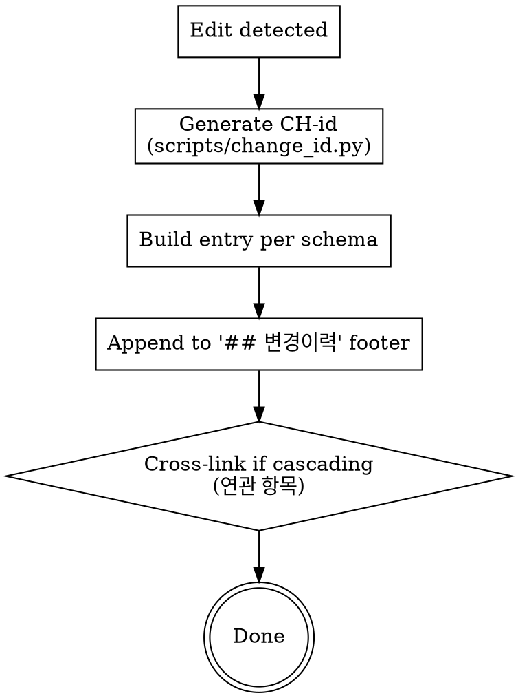

# Change History (Append Structured Entries)

This skill defines the schema and procedure for appending entries to the `## 변경이력` footer of feature MDs. All other workflow skills (`brainstorming`, `designing-direction`, `writing-plans`, `executing-plans`, `change-propagation`, `api-auto-testing`) MUST invoke this skill on every modification.

<HARD-GATE>
You MUST append a 변경이력 entry to the affected MD whenever you:
- Edit/Create/Delete any of <slug>-requirements.md, <slug>-tech-design.md, <slug>-implementation-plan.md
- Modify code as part of /execute-plan
- Run an API test pipeline via /api-test (record results)
NEVER skip this. The history is the only audit trail outside git.
</HARD-GATE>

## When to Use

| Trigger | Append to |
|---|---|
| <slug>-requirements.md edited | <slug>-requirements.md `## 변경이력` |
| <slug>-tech-design.md edited | <slug>-tech-design.md `## 변경이력` |
| <slug>-implementation-plan.md edited | <slug>-implementation-plan.md `## 변경이력` |
| Code edited via /execute-plan | <slug>-implementation-plan.md `## 변경이력` (with [코드-수정] tag, before/after code blocks) |
| API test executed via /api-test | <slug>-implementation-plan.md `## 변경이력` (with [API테스트] tag) |

## Common Entry Schema (all 3 MDs)

```markdown
### [YYYY-MM-DD HH:MM] [요구사항-수정 | 개발방향-수정 | 구현계획서-수정 | 코드-수정 | API테스트]
- **id**: CH-YYYYMMDD-NNN
- **이유**: <why the change>
- **무엇이**: <which section/field/file>
- **영향범위**: <which downstream MDs or code areas were also touched>
- **연관 항목**: CH-... (related entries; omit if none)
```

## Code-Change Entry (only in <slug>-implementation-plan.md)

Adds these fields on top of the common schema:

```markdown
- **위험 카테고리**: side-effect | race | breaking | perf
- **변경 전 코드** (file:line)
  ```<lang>
  <verbatim original code>
  ```
- **변경 후 코드**
  ```<lang>
  <new code, including any RISK comments>
  ```
```

## API-Test Entry (only in <slug>-implementation-plan.md)

```markdown
- **시나리오 파일**: api-tests/scenario-NNN-<name>.py (N tests)
- **결과**: PASS x / FAIL y / ERROR z
- **실패 상세**: <summary>
- **결과 파일**: api-tests/results/<timestamp>.json
- **다음 액션**: <next step if remediation needed>
```

## CH-id Generation

NEVER hand-author the CH-id. Use the helper script:

```bash
source .venv/bin/activate
python -m scripts.change_id docs/features/<date>-<slug>
# example output: CH-20260502-003
```

Or call directly from a Python one-liner:
```bash
python -c "from datetime import date; from pathlib import Path; from scripts.change_id import next_change_id; print(next_change_id(Path('docs/features/<date>-<slug>'), date.today()))"
```

The CH-id MUST be unique across all *.md files in the same feature folder (the script scans every *.md to find the maximum sequence for today and increments).

## Process Flow



## Anti-Patterns

| Wrong | Right |
|---|---|
| "This change is too small to log" | Even tiny edits decay context over time. Log everything. |
| "I'll invent a CH-id manually" | Duplicates and gaps will appear. Always use the helper script. |
| "git log already has the diff" | git log lacks intent, scope, risk category. Full schema in <slug>-implementation-plan.md. |
| "Batch entries at end of session" | Context evaporates. Append immediately after each edit. |

## Red Flags (STOP if you think these)

| Thought | Reality |
|---|---|
| "Skip 변경이력 just this once" | The audit chain breaks. Don't. |
| "I don't know which 위험 카테고리 fits" | Run risk-annotation 6-checklist. If still ambiguous, default to side-effect. |
| "변경 전 코드 block is too long" | Spec §4.1 mandates full block. Compression is v0.2 territory. |

## Acceptance

A new entry is correct when ALL hold:
1. CH-id matches `CH-YYYYMMDD-NNN` and is unique within the feature folder
2. Entry sits at the end of the `## 변경이력` footer (not inserted into the body)
3. [코드-수정] entries include both before/after code blocks AND a 위험 카테고리 value
4. [API테스트] entries include scenario file, pass/fail counts, failure details

## Related Skills

- `risk-annotation` — assigns the 위험 카테고리 for code-edit entries
- `change-propagation` — adds cross-linked entries when one change cascades to multiple MDs
- `verifying-spec` — produces the impact-analysis report whose findings populate the 영향범위 field
