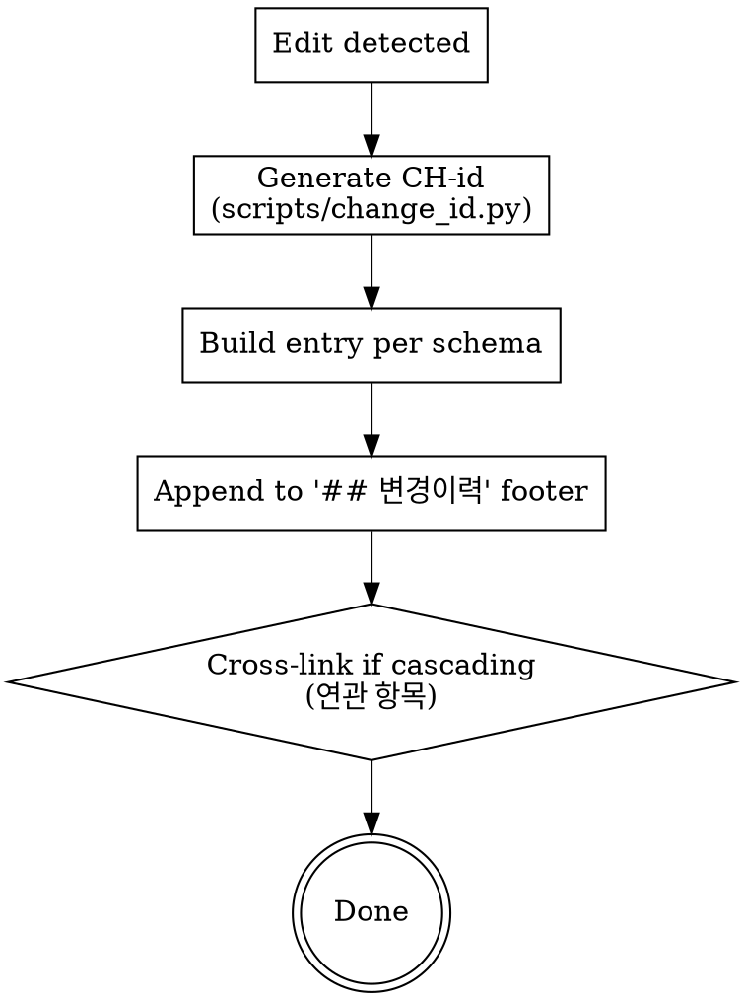

# Change History (Append Structured Entries)

This skill defines the schema and procedure for appending entries to the `## 변경이력` footer of feature MDs. All other workflow skills (`brainstorming`, `tech-design`, `writing-plans`, `executing-plans`, `change-propagation`, `api-auto-testing`) MUST invoke this skill on every modification.

<HARD-GATE>
You MUST append a 변경이력 entry to the affected MD whenever you:
- Edit/Create/Delete any of <slug>-requirements.md, <slug>-tech-design.md, <slug>-implementation-plan.md
- Modify code as part of /execute-plan
- Run an API test pipeline via /api-test (record results)
NEVER skip this. The history is the only audit trail outside git.
</HARD-GATE>

## When to Use

| Trigger | Append to |
|---|---|
| <slug>-requirements.md edited | <slug>-requirements.md `## 변경이력` |
| <slug>-tech-design.md edited | <slug>-tech-design.md `## 변경이력` |
| <slug>-implementation-plan.md edited | <slug>-implementation-plan.md `## 변경이력` |
| Code edited via /execute-plan | <slug>-implementation-plan.md `## 변경이력` (with [코드-수정] tag) |
| Verification-only task (no code change) | <slug>-implementation-plan.md `## 변경이력` (with `[검증]` tag) |
| Release / version bump / git tag | <slug>-implementation-plan.md `## 변경이력` (with `[릴리즈]` tag) |
| API test executed via /api-test | <slug>-implementation-plan.md `## 변경이력` (with [API테스트] tag) |

## Common Entry Schema (all 3 MDs)

```markdown
### [YYYY-MM-DD HH:MM] [요구사항-수정 | 개발방향-수정 | 구현계획서-수정 | 코드-수정 | 검증 | 릴리즈 | API테스트]
- **id**: CH-YYYYMMDD-NNN
- **이유**: <why the change>
- **무엇이**: <which section/field/file>
- **영향범위**: <which downstream MDs or code areas were also touched>
- **연관 항목**: CH-... (related entries; omit if none)
```

## Code-Change Entry (only in <slug>-implementation-plan.md)

`executing-plans` writes ONE consolidated [코드-수정] entry per task (NOT per individual code edit). This batches all code changes within a task into a single 변경이력 entry, drastically reducing 구현계획서.md Read/Edit cost.

### Batched per-task entry (default form)

When a task contains multiple code edits, use this consolidated form:

```markdown
### [YYYY-MM-DD HH:MM] [코드-수정] (task: Task N — <task name>)
- **id**: CH-YYYYMMDD-NNN
- **이유**: <task-level reason — what the task accomplished>
- **무엇이**: <comma-separated list of files touched>
- **영향범위**: <combined scope of all edits in this task — callers, dependencies, etc.>
- **위험 카테고리**: <union of all triggered categories — e.g., "side-effect, perf">
- **세부 변경 (N건)**:
  - `<file:line-range>` — `<short description>` (`<risk-category-or-none>`)
  - `<file:line-range>` — `<short description>` (`<risk-category-or-none>`)
  - …
- **변경 전 코드** (per file)
  ```<lang>
  // file: <path>
  <consolidated before content for the touched ranges>
  ```
- **변경 후 코드** (per file)
  ```<lang>
  // file: <path>
  <consolidated after content, including RISK comments>
  ```
- **연관 항목**: CH-... (related entries; omit if none)
```

The "(task: Task N — ...)" tag right after [코드-수정] makes it obvious this entry covers a whole task's worth of edits, not a single edit.

If a task has only ONE code edit, you may still use this form (single-item 세부 변경 list) for consistency, OR drop the 세부 변경 list and use the simple legacy form below.

### Legacy single-edit form (when task touches one file/range only)

```markdown
- **위험 카테고리**: side-effect | breaking | race
- **변경 전 코드** (file:line)
  ```<lang>
  <verbatim original code>
  ```
- **변경 후 코드**
  ```<lang>
  <new code, including any RISK comments>
  ```
```

### Trivial Code-Change Entry (fast path)

When `executing-plans` Trivial-Edit Exception applies (≤3 lines + no logic change + 0/3 risk triggers), use this **shorter** form. The `(trivial)` tag goes right after the entry-type tag.

```markdown
### [YYYY-MM-DD HH:MM] [코드-수정] (trivial)
- **id**: CH-YYYYMMDD-NNN
- **이유**: <one-line reason>
- **무엇이**: <file:line>
```

No 영향범위, no 위험 카테고리, no before/after code blocks. The `(trivial)` tag makes filtering / spotting these in 변경이력 easy.

If any of the trivial criteria fails, fall back to the full Code-Change Entry above.

## Verification Entry — `[검증]` (v1.1.7+)

For tasks that did NOT change code (static grep, fixture run, release sanity, git tag-only). Use this instead of `[코드-수정]` when 변경 전/후 코드 blocks would be empty.

```markdown
### [YYYY-MM-DD HH:MM] [검증] (task: Task N — <task name>)
- **id**: CH-YYYYMMDD-NNN
- **이유**: <검증 목적 — e.g., 정적 grep 통과 / 릴리즈 전 sanity>
- **무엇이**: <검증한 항목들 — e.g., AC-1 grep / G1 fixture run>
- **결과**: PASS | FAIL | PARTIAL — <상세>
- **연관 commit**: <SHA, 해당 시>
- **연관 항목**: CH-... (omit if none)
```

No 위험 카테고리, no 변경 전/후 code (the task didn't change code).

## Release Entry — `[릴리즈]` (v1.1.7+)

For version bumps, manifest sync, git tag operations.

```markdown
### [YYYY-MM-DD HH:MM] [릴리즈]
- **id**: CH-YYYYMMDD-NNN
- **이유**: <버전 bump 이유>
- **무엇이**: vX.Y.Z 태그 + N개 manifest 동기화
- **연관 commit**: <SHA>, <tag SHA>
```

## End-of-Run Consolidated Batch Entry (v1.1.7+, git-fast mode only)

When `executing-plans` or `js-super-sub-driven` finishes ALL tasks under `commit_policy: per-task` (git-fast mode), the main agent appends ONE consolidated entry covering every task's code edits — instead of N per-task entries. Code blocks are omitted because `git show <commit-SHA>` is the audit trail; the entry references SHAs only.

```markdown
### [YYYY-MM-DD HH:MM] [코드-수정] (batch: tasks N..M)
- **id**: CH-YYYYMMDD-NNN
- **이유**: <feature-level 종합 요약>
- **무엇이**: <comma-separated file list (전체 task 합쳐서)>
- **영향범위**: <combined>
- **위험 카테고리**: <union of all task hits — e.g., "side-effect, breaking" or "none">
- **task별 세부 (M건)**:
  - Task N: `<file:lines>` — <요약> (`<risk-or-none>`) — commits: `<SHA1>`, `<SHA2>`
  - Task N+1: ...
- **연관 commits**: <전체 SHA 리스트, 또는 BASE_SHA..HEAD>
- **변경 전/후 코드**: 생략 — `git show <SHA>` 로 조회
```

`commit_policy: single` / `none` (memory-fallback) modes keep the legacy fat schema (변경 전/후 코드 blocks preserved) — git can't audit those modes, so the entry must.

## API-Test Entry (only in <slug>-implementation-plan.md)

```markdown
- **시나리오 파일**: api-tests/scenario-NNN-<name>.py (N tests)
- **결과**: PASS x / FAIL y / ERROR z
- **실패 상세**: <summary>
- **결과 파일**: api-tests/results/<timestamp>.json
- **다음 액션**: <next step if remediation needed>
```

## CH-id Generation

NEVER hand-author the CH-id. Use the helper script:

```bash
source .venv/bin/activate
python -m scripts.change_id docs/features/<date>-<slug>
# example output: CH-20260502-003
```

Or call directly from a Python one-liner:
```bash
python -c "from datetime import date; from pathlib import Path; from scripts.change_id import next_change_id; print(next_change_id(Path('docs/features/<date>-<slug>'), date.today()))"
```

The CH-id MUST be unique across all *.md files in the same feature folder (the script scans every *.md to find the maximum sequence for today and increments).

## Process Flow



## Anti-Patterns

| Wrong | Right |
|---|---|
| "This change is too small to log" | Even tiny edits decay context over time. Log everything. |
| "I'll invent a CH-id manually" | Duplicates and gaps will appear. Always use the helper script. |
| "git log already has the diff (per-task mode)" | git log lacks intent, scope, risk category. Use slim entry + commit SHA in per-task mode. |
| "Batch entries at end of session" | Applies to manual editing only. Subagent / `/execute-plan` runs MUST batch (end-of-run consolidator) — see "End-of-Run Consolidated Batch Entry" section. |

## Red Flags (STOP if you think these)

| Thought | Reality |
|---|---|
| "Skip 변경이력 just this once" | The audit chain breaks. Don't. |
| "I don't know which 위험 카테고리 fits" | Run risk-annotation 3-checklist. If still ambiguous, default to side-effect. |
| "변경 전 코드 block is too long" | Spec §4.1 mandates full block. Compression is v0.2 territory. |

## Acceptance

A new entry is correct when ALL hold:
1. CH-id matches `CH-YYYYMMDD-NNN` and is unique within the feature folder
2. Entry sits at the end of the `## 변경이력` footer (not inserted into the body)
3. [코드-수정] entries: in `commit_policy: per-task` mode use slim batch form (코드 블록 생략 + commit SHA 참조 + 위험 카테고리); in `single` / `none` mode keep before/after code blocks AND a 위험 카테고리 value. `(trivial)` and `(batch: tasks N..M)` are recognised tag suffixes.
4. `[검증]` entries include 결과 (PASS/FAIL/PARTIAL); they have NO 위험 카테고리 / 코드 블록 by design.
5. `[릴리즈]` entries reference at minimum a 연관 commit (the bump commit) and the tag SHA when applicable.
6. [API테스트] entries include scenario file, pass/fail counts, failure details
7. `(trivial)` is used ONLY when executing-plans Trivial-Edit Exception criteria are all met (≤3 lines + no logic change + 0/3 risk triggers); otherwise full entry is required

## Related Skills

- `risk-annotation` — assigns the 위험 카테고리 for code-edit entries
- `change-propagation` — adds cross-linked entries when one change cascades to multiple MDs
- `verifying-spec` — produces the impact-analysis report whose findings populate the 영향범위 field
