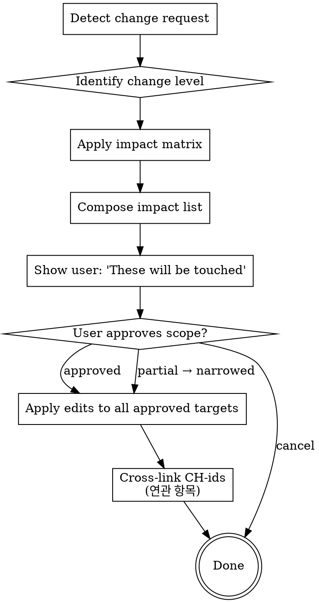

# Change Propagation (Cascading Update)

After the initial 3-MD set is in place, any modification request must check for cascading impact across downstream MDs and code. This skill is the dispatcher for those follow-up edits — it keeps the upstream → downstream chain consistent and writes cross-linked change-history entries.

<HARD-GATE>
NEVER silently update downstream MDs or code without first surfacing the impact list and asking the user to approve scope. Cascading without consent is a data-integrity bug.
</HARD-GATE>

## Trigger Detection

Two ways to enter this skill:

1. **Natural language change request** — the user says something like "FR-3 한도 바꿔", "개발방향 §5 결정 다시", "Task 4 단계 추가". The main agent recognizes the intent and invokes this skill.
2. **Explicit override** — the user says "요구사항만 고쳐, 하위는 건드리지 마". This phrase forces partial-scope behavior; the skill applies the upstream edit but skips the cascading step.

## Change Level Identification

| Phrase signals | Change level |
|---|---|
| FR / NFR / 사용자 시나리오 / 수용 기준 | 요구사항 |
| 아키텍처 / 컴포넌트 / 데이터 모델 / 결정 / 외부 IF / 위험 / 테스트 전략 | 개발방향 |
| Task 추가/순서/단계 코드/롤백 | 구현계획서 |
| 함수 본문 / 버그 수정 / 코드 리팩터 | 코드 |

If the request is ambiguous, ask the user once: "이건 요구사항 변경인가요, 개발방향 변경인가요?" Do NOT guess silently.

## Impact Matrix

| Change at | Auto-cascade targets |
|---|---|
| <slug>-requirements.md | <slug>-tech-design.md + <slug>-implementation-plan.md + code (if implemented) |
| <slug>-tech-design.md | <slug>-implementation-plan.md + code |
| <slug>-implementation-plan.md | code |
| code (direct edit) | <slug>-implementation-plan.md `## 변경이력` only (reverse-direction record) |

Code edits never cascade upward to 요구사항 or 개발방향. The reasoning is unchanged; only the implementation moved.

## Checklist

- [ ] Trigger Detection — 변경 신호 catch
- [ ] Change Level Identification — 어느 레벨 변경 (요구사항 / 개발방향 / 구현계획서 / 코드)
- [ ] Impact Matrix 적용 — 영향 받는 downstream MD 식별
- [ ] Process Flow — cascading 갱신 실행
- [ ] User Approval — 사용자 게이트
- [ ] After Approval — change-history cross-linked entry append

## Process Flow



## User Approval Format

When presenting the impact list, use this structure:

```
변경 요청 감지: <change level> 변경 ("<short summary of the change>")

영향 매트릭스 적용 결과 — 함께 갱신될 항목:
1. <slug>-requirements.md §3 FR-3 (직접 변경)
2. <slug>-tech-design.md §6 위험 (한도 증가에 따른 잔액 검증 강도 재평가)
3. <slug>-implementation-plan.md Task 4 (한도 검증 로직)
4. 코드 src/wallet/service.py:withdraw() (한도 상수)

진행 / 부분 진행(번호 선택) / 취소 중 선택해주세요.
```

The Korean closing line is intentional — that's what the user reads.

## After Approval

For each approved target:

1. Apply the edit (directly via Edit, or by re-entering the relevant skill — `brainstorming` for 요구사항, `tech-design` for 개발방향, `writing-plans` for 구현계획서)
2. Invoke `change-history` to append the entry
3. Cross-link: every entry from the same propagation batch shares the **연관 항목** field listing the other CH-ids in the batch

Example entry skeleton (one of N in a batch):
```markdown
### [2026-05-02 14:30] [요구사항-수정]
- **id**: CH-20260502-007
- **이유**: 사용자 요청, 한도 5만 → 10만
- **무엇이**: <slug>-requirements.md §3 FR-3
- **영향범위**: <slug>-tech-design.md §6 (위험 재평가), <slug>-implementation-plan.md Task 4 (검증 로직)
- **연관 항목**: CH-20260502-008 (개발방향), CH-20260502-009 (구현계획서), CH-20260502-010 (코드)
```

## Anti-Patterns

| Wrong | Right |
|---|---|
| Skipping cascading because "user only mentioned 요구사항" | Apply impact matrix → show downstream → let user decide scope. |
| Guessing change level on ambiguous request | Ask once. Don't silently pick. |
| Editing code directly without <slug>-implementation-plan.md entry | Code edits always log to <slug>-implementation-plan.md (reverse direction). |
| Forgetting to cross-link CH-ids | Cross-link is the audit chain. Every propagation batch shares **연관 항목**. |

## Red Flags

| Thought | Reality |
|---|---|
| "It's a tiny FR tweak, no downstream impact" | Run the matrix anyway. The user can decline cascading. |
| "User said 'just fix the bug'" | Even bug fixes get a [코드-수정] entry in <slug>-implementation-plan.md. |
| "Cross-linking is overkill for 2 entries" | Two entries today, twenty linked entries six months from now. Always link. |

## Acceptance

A propagation run is correct when ALL hold:
1. The user saw the impact list before any downstream edit
2. Every approved target produced a change-history entry
3. All entries in the batch share **연관 항목** with the other CH-ids in the batch
4. Code-only edits did not modify <slug>-requirements.md or <slug>-tech-design.md (reverse-cascade is forbidden)
5. (v2.2.2+) `.html` 동봉본이 존재하는 feature 라면 마지막 단계에서 안내문 출력 → `이 변경으로 .html 이 stale 됐을 수 있음. 필요시 /sync-html <slug>` (자동 호출 X — stale 허용 철학 보존)

## Related Skills

- `change-history` — entry recording (called for each target)
- `brainstorming` / `tech-design` / `writing-plans` — re-entered when an upstream MD edit needs a re-dialogue
- `verifying-spec` — re-runs after upstream MD changes if scope is non-trivial
- `risk-annotation` — invoked again if cascading touches code
- `/sync-html <slug>` (v2.2.2+) — `.html` 동봉본 stale 시 사용자 수동 호출 (자동 호출 X, stale 허용 철학)
