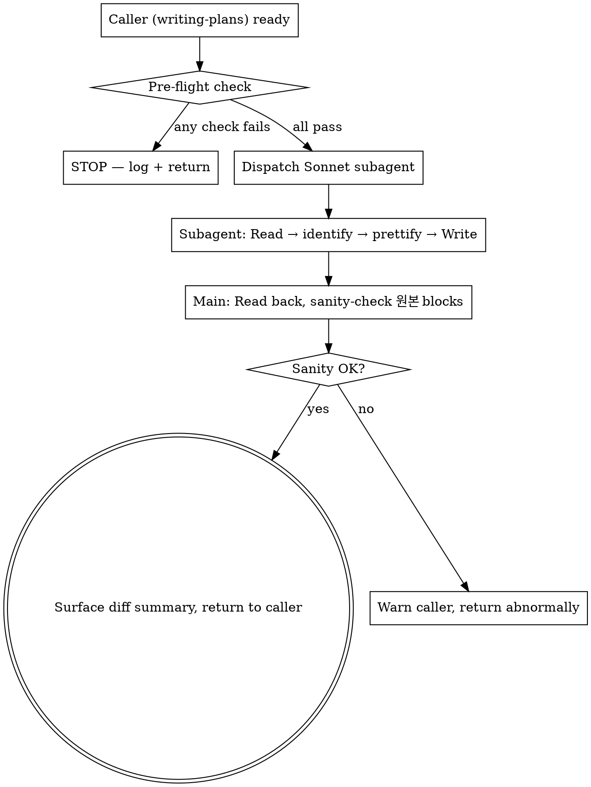

# Code Pretty (Pre-Review Code Block Formatting)

This skill prettifies the "수정 후" code blocks inside a freshly written or rewritten implementation plan, just before docs-pretty + user review. It is the code-only sibling of `docs-pretty`.

**Announce at start:** "I'm using the code-pretty skill to format `수정 후` code blocks in `<file>` before docs-pretty + user review."

<HARD-GATE>
This skill MUST run AFTER verifying-spec passes and BEFORE docs-pretty in the writing-plans flow. It runs as many times as the writing-plans review loop iterates (initial draft + each user-fix revision).

It STOPS firing the moment the first `change-history` entry has been logged. That boundary marks the doc as "live" — from then on, no code-pretty.

Specifically, code-pretty MUST NOT run on:
- `<slug>-requirements.md` or `<slug>-tech-design.md` (only implementation-plan)
- "원본" code blocks (only "수정 후" blocks)
- Prose, tables, headings, list items
- Any plan AFTER its first change-history entry exists

If you are unsure whether this is still in the "initial creation phase" — STOP. Look for an existing `## 변경이력` footer with one or more entries. If ANY entry exists, this is NOT initial creation. Skip this skill.
</HARD-GATE>

## When to Use

| Trigger (yes) | Anti-trigger (no) |
|---|---|
| `writing-plans` just wrote/rewrote `<slug>-implementation-plan.md` AND verifying-spec passed AND docs-pretty has not yet run for this draft, no `## 변경이력` entries yet | User asked to update Task 3 wording in an already-live implementation-plan.md |
| User requested revision in the writing-plans review loop, agent rewrote, verifying-spec re-ran — fire again | First change-history entry has been logged — doc is now "live", do NOT fire |
| Plan contains at least one `**수정 후**`-labeled code block | Plan only has prose updates, no code blocks |

## Why a Subagent (and which model)

Same reasoning as docs-pretty: pure transformation, no domain reasoning, negative-constraint heavy.

**Always dispatch a subagent with `model: "sonnet"`.** Sonnet's instruction-following is required for honoring "leave already-clean blocks byte-identical" and "1% 의심이라도 들면 SKIP" constraints.

Do NOT use Opus (overkill) or Haiku (rephrasing risk).

## Process

### Step 1 — Pre-flight check

Before dispatching, the main agent MUST verify:

1. The target file exists (Read or Glob)
2. The file's `## 변경이력` footer has ZERO entries (Grep for `### \[` under `## 변경이력`; expect 0 matches)
3. The file is `<slug>-implementation-plan.md` (NOT requirements.md, NOT tech-design.md)
4. verifying-spec has just passed for this draft (caller responsibility)
5. The file contains at least one `**수정 후**` label preceding a code block

If ANY check fails → DO NOT dispatch. Tell the caller why and exit.

### Step 2 — Dispatch the Sonnet subagent

Use the `Agent` tool with these exact parameters:

- `subagent_type`: `general-purpose`
- `model`: `sonnet`
- `description`: `Code-block prettify on <filename>`
- `prompt`: see template below

### Step 3 — Verify, surface diff, return to caller

After the subagent returns:

1. Read the file back (1 Read)
2. Sanity-check: every `**원본**`-labeled code block is byte-equal to the pre-dispatch version
3. Surface the diff summary text returned by the subagent to the main agent's chat output (caller will combine with docs-pretty output for the user review gate)
4. Return control to caller (writing-plans). Do NOT invoke docs-pretty or change-history yourself.

If sanity-check fails (any "원본" block was modified) → emit a warning to the caller; caller decides whether to abort or rerun.

## Subagent Prompt Template

The dispatched subagent receives this exact prompt (filled in with target path):

```
You are performing a STRICT code-block prettify on a Korean implementation-plan document.

Target file: <ABSOLUTE_PATH>

Your job: improve READABILITY of "수정 후" code blocks ONLY. Other content is byte-identical.

# Identification — what counts as a target block

A target block is a fenced code block whose **immediately preceding non-blank line** starts with `**수정 후**`.

Examples of target labels (any of these counts):
- `**수정 후**:`
- `**수정 후** (`new file`):`
- `**수정 후**` (label only)

Examples of NON-target labels (any of these means the next code block is a "원본" — NEVER touch):
- `**원본**`
- `**원본** (...)`
- Anything not starting with `**수정 후**`

If a code block has no label at all (no preceding bold text), DO NOT touch it. Default to byte-equal preservation when uncertain.

# Allowed changes (in target blocks only)

Three categories. Apply only when there is a CONCRETE, ARTICULABLE readability improvement.

## Category A — 포맷
- Whitespace / indentation normalization
- Long-line wrapping at sensible breakpoints
- Trailing whitespace removal
- Aligned `//` comments

## Category B — 자명한 정리
- Remove dead comments explicitly marked (e.g., `// TODO: 삭제예정`)
- Standardize quote/semicolon style within the block
- Rename variables ONLY if context is overwhelmingly clear (e.g., `tmp` → `cartTotal` when the surrounding lines unambiguously imply the meaning)
- Add labeling comments next to magic numbers (do NOT extract to const)

## Category C — 중복 통합
- Merge duplicate imports
- Merge duplicate const declarations of the same value
- Merge duplicate inline helpers — ONLY when call-site contexts are byte-identical

# FORBIDDEN — never do any of these

- Do NOT touch "원본" blocks
- Do NOT touch prose, headings, lists, tables, frontmatter, or `## 변경이력`
- Do NOT extract magic numbers to named constants
- Do NOT flatten nested if statements
- Do NOT split or merge functions
- Do NOT rename anything unless context is overwhelming (Category B last bullet)
- Do NOT change behavior, side-effects, exception flow, or output
- Do NOT modify a target block if it is already well-formatted (consistent whitespace, no obvious readability issues, no Category B / C candidates) — leave byte-identical
- If you have ≥1% suspicion that a Category B or C change might alter behavior, SKIP that change

# How to apply

1. Read the file in full
2. Locate every `**수정 후**`-labeled code block
3. For each target block:
   a. Articulate (mentally) the concrete readability improvement
   b. If you cannot articulate one — leave byte-identical, mark as "no-op"
   c. Otherwise apply A/B/C transformations within the constraints above
4. Write the result back to the SAME file path using the Write tool (overwrite)
5. Report a diff summary in this format:

   ```
   code-pretty done on <path>.

   Target blocks: <total>
   - Modified: <N> (<categories: A/B/C breakdown>)
   - No-op (already clean): <N>
   - Skipped (1% suspicion): <N> (with reasons)

   Modified line summary:
   - <file:line> — <one-line reason>
   - ...

   "원본" blocks preserved byte-identical: yes / no
   ```

# Verification before writing

Before you call Write:
- Compare every `**원본**`-labeled block in your output to the input — they MUST be byte-identical
- Confirm the YAML frontmatter (if present) is byte-identical
- Confirm the `## 변경이력` heading and everything beneath it is byte-identical
- Confirm prose / tables / headings outside of "수정 후" blocks are byte-identical

If ANY of these fail, do NOT write. Report the failure and stop.

You have one job: make "수정 후" code blocks cleaner WITHOUT changing meaning. Nothing else.
```

## Process Flow



## Anti-Patterns

| Wrong | Right |
|---|---|
| Run code-pretty on requirements.md or tech-design.md | NEVER. implementation-plan.md only. |
| Modify "원본" blocks even slightly | NEVER. Bytes-equal preservation. |
| Extract magic numbers to const | Forbidden by the prompt. Allowed: comment label only. |
| Run code-pretty without verifying-spec passing first | Pre-flight check (caller responsibility) blocks this. |
| Re-run code-pretty after change-history entry exists | HARD-GATE blocks this — pre-flight 변경이력 empty check. |
| Use Opus or Haiku | Sonnet only. |

## Red Flags (STOP if you think these)

| Thought | Reality |
|---|---|
| "The block is short, just inline-prettify in main agent" | Subagent dispatch is mandatory — clean main context + model isolation. |
| "I'll consolidate this duplicate, looks safe enough" | Need byte-identical call-site contexts. If not, SKIP. |
| "Two passes will catch more" | One shot only. Idempotent by design — second pass should produce 0 changes. |

## Acceptance

A code-pretty run is correct when ALL hold:

1. Pre-flight checks all passed (file exists, target = implementation-plan.md, 변경이력 empty, ≥1 "수정 후" block)
2. Subagent was dispatched with `model: sonnet` and the strict prompt above
3. Post-dispatch sanity check: every "원본" block byte-identical to pre-dispatch
4. Diff summary surfaced to main agent chat (caller forwards to user review gate)
5. No `## 변경이력` entry was added by code-pretty itself

## Related Skills

- `writing-plans` — invokes this between verifying-spec and docs-pretty
- `docs-pretty` — sibling skill, runs immediately after code-pretty on the same draft
- `verifying-spec` — must pass before code-pretty can run
- `change-history` — invoked by caller AFTER code-pretty + docs-pretty + user review approval
