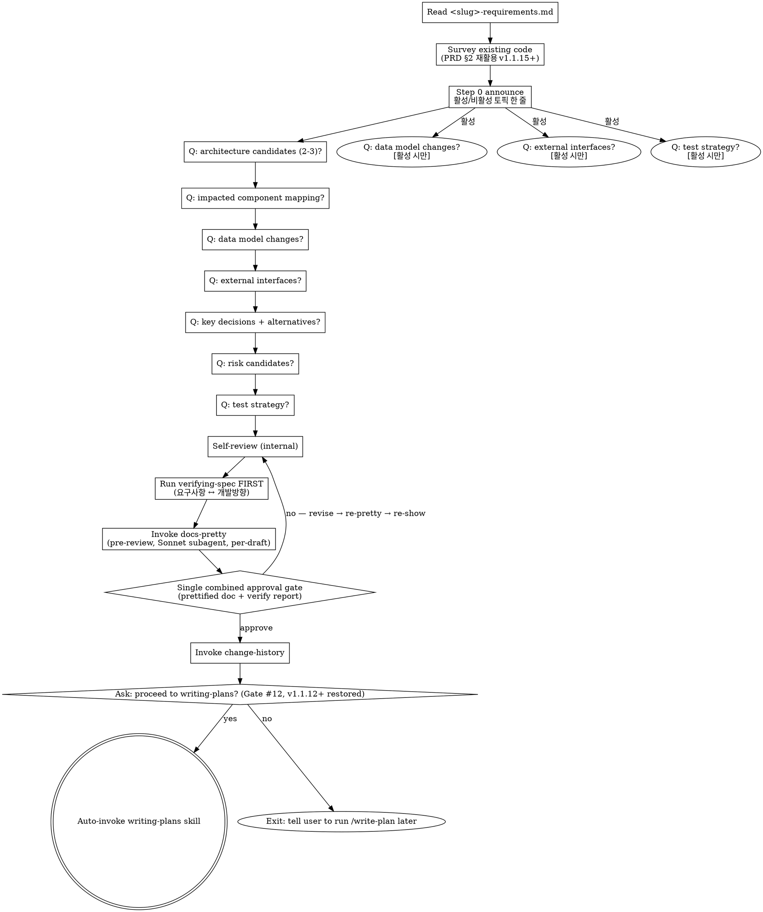

# Designing Direction → <slug>-tech-design.md (Technical Spec)

## 사용자 질문 룰 (v2.0.3+) — 항상 AskUserQuestion

이 skill 흐름 안에서 사용자에게 질문할 일이 생기면 **반드시** `AskUserQuestion`
도구로 호출한다. 산문으로 "~ 할까요?" 한 줄 던지지 마라.

### Why

Notification 훅 (`elicitation_dialog` 매처) 이 알람을 발화하려면 도구 호출이
실제로 일어나야 함. 산문 질문은 훅이 못 잡아서 사용자가 놓침 (v1.1.8 신고 재발).

### How to apply

- clarifying / Socratic / 모호점 확인 / 게이트 / 모드 선택 — 모두 포함
- 단답 yes/no 도 prose X → `AskUserQuestion` choices `[yes, no]` 사용
- 다중 선택은 enum choices 또는 multi-question batching (의미 결합 시 max 4 questions[])
- **Socratic 자유 응답**: AskUserQuestion 의 question 본문에 "자유롭게 답해주세요. 별도 옵션 선택 불필요" + dummy choice `[알겠음]` 1개 → 트리거만 발화, 응답은 다음 turn prose
- **예외**: 본문 자체의 알람-friendly 안내문 (`ℹ️ Auto-proceeding ...`) 는 질문 아니라 안내 — 도구 호출 불필요

### Other / 모호 응답 처리 (v2.1.1+)

사용자가 "Other" 자유 응답 또는 "모르겠음 / 이해 안 됨" 류 답변 catch 시 → **그 질문만 단독 재호출 + prose 설명 추가**. 다음 단계 자동 진행 X (anchor 질문 강제 X 룰은 명확 yes/no 답변에만 적용).

Take <slug>-requirements.md (PRD) as input and produce <slug>-tech-design.md, a technical spec covering architecture, data model, interfaces, key decisions with alternatives, preliminary risks, and test strategy. Step-by-step task decomposition belongs to `writing-plans`, not here.

<HARD-GATE>
You MUST have an existing <slug>-requirements.md in the current feature folder before invoking this skill. If none exists, instruct the user to run /brainstorm first.
</HARD-GATE>

## Checklist

You MUST create a TaskCreate task for each of these items and complete them in order:

1. **입력 확인** — confirm <slug>-requirements.md exists (HARD-GATE if not)
2. **기존 코드 둘러보기** — `<slug>-requirements.md` §2 (영향 컴포넌트) 먼저 Read. 추가 grep/Read 는 tech-design 결정 (아키텍처 / data flow / pattern) 깊이 부족할 때만. (v1.1.15+ slim)
3. **적응형 7-토픽 질의응답** — `<slug>-requirements.md` 읽고 활성/비활성 토픽 판정 후 한 줄 announce. 항상 활성 4개 (1 아키텍처 / 2 컴포넌트 / 5 결정+대안 / 6 위험), 조건부 3개 (3 데이터 모델 / 4 외부 인터페이스 / 7 테스트 전략). 자세한 룰은 "Adaptive Topics" 섹션 참조. (v1.1.15+, FR-1)
4. **자체 점검** — FR mapping coverage, alternatives present, risk categorization (no user prompt yet)
5. **사양 정합성 검증 (사전)** — main agent runs A+C verification via `verifying-spec`, produces 4-axis report internally (Tolerance for missing skill)
6. **문서 포맷 정리 (사용자 리뷰 전)** — format pass on the RAW draft BEFORE user review via `docs-pretty` skill. Re-fires on each user-fix iteration (per-draft). (v1.1.15+)
7. **초안 검토 및 승인** — show the full PRETTIFIED `<slug>-tech-design.md` AND the verify-spec report in one message; ask once "Approve and proceed? — yes / no". On `no` → revise → loop back to step 4 (Self-review → re-verify → re-pretty → re-show prettified). Stops once first change-history entry is logged.
8. **변경이력 기록** — append first `[개발방향-수정]` entry via `change-history` skill
9. **다음 단계 진입 확인** — change-history 직후 사용자에게 명시적 yes/no 게이트. On `yes` → invoke `writing-plans` via Skill tool. On `no` → exit with notice telling the user to run /write-plan later. (v1.1.12+ — restored)

If you find yourself skipping ahead, stop and create the missing task.

**Before invoking the next skill via Skill tool, mark ALL checklist TaskCreate items as completed (in_progress → completed). The Skill tool transition does NOT auto-complete prior tasks. (v1.1.15+, FR-2)**

## Input

`docs/features/YYYY-MM-DD-<slug>/<slug>-requirements.md`

## Output

`docs/features/YYYY-MM-DD-<slug>/<slug>-tech-design.md`

## Schema (<slug>-tech-design.md)

```markdown
# 개발방향: <feature-name>

> **For agentic workers:** This document is the technical spec (architecture, components, data, interfaces, decisions, risks, test strategy). It is anchored to `<slug>-requirements.md` (the PRD) and consumed by `<slug>-implementation-plan.md` (step-by-step plan). NEXT STEP: invoke `writing-plans` skill (or run `/write-plan`) to produce `<slug>-implementation-plan.md` from this design. Do NOT include step-by-step implementation tasks here — those belong in the plan.

## 1. 아키텍처 개요 (diagram + prose)
## 2. 영향 받는 컴포넌트/파일
## 3. 데이터 모델/스키마 변경
## 4. 외부 인터페이스 (API, events)
## 5. 핵심 결정 + 대안 비교 (why this path)
## 6. 위험/사이드이펙트 (preliminary)
## 7. 테스트 전략

---
## 변경이력
```

## Process Flow



## Adaptive Topics (v1.1.15+, FR-1)

Step 3 의 7-topic dialogue 를 사용자 마찰 줄이기 위해 adaptive 진행. 메인 에이전트가 `<slug>-requirements.md` 본문을 읽고 판단.

### 항상 활성 (4개)

- 1 아키텍처
- 2 영향 컴포넌트
- 5 결정+대안 비교
- 6 위험 (preliminary)

### 조건부 활성 (3개) — 메인 판단

- **3 데이터 모델** — DB / 스키마 / 마이그레이션 / 영구 저장 / 외부 시스템 데이터 교환을 implicit/explicit 시사하면 활성. 메타 워크플로우 / 순수 함수 / 산문 처리만이면 비활성.
- **4 외부 인터페이스** — REST / GraphQL / webhook / 이벤트 발행 / 외부 노출 시사하면 활성. 내부 모듈 간 호출만이면 비활성.
- **7 테스트 전략** — FR 수가 많거나 (≥3), 위험 카테고리 다수, 다중 파일 영향이면 활성. trivial 변경 / 단일 함수면 비활성.

### Step 0 announce — 항상 노출

판단 직후 사용자에게 한 줄 노출 (case 무관, 전부 활성이든 비활성 있든):

```
ℹ️ 활성 토픽: 1,2,3,5,6 / 비활성: 4 외부IF, 7 테스트전략 (이유: 내부 모듈 변경, 단일 함수). 추가 활성 필요시 알려주세요.
```

→ white box / override 시점 일관. 사용자가 즉시 catch + 활성 추가 요청 가능.

### 비활성 토픽 처리

`<slug>-tech-design.md` 의 해당 섹션은 다음 형식으로 한 줄만 박음:

```markdown
## 3. 데이터 모델/스키마 변경 — N/A: 본 피처는 DB/스키마 무관 (skill 본문 + Python helper 변경)
## 4. 외부 인터페이스 — N/A: API/event 노출 없음
```

비활성 토픽은 dialogue 자체를 스킵 — 빈 섹션도 아니고 placeholder 도 아님. N/A 한 줄.

### deterministic Python classifier 도입 X

키워드 hardcode list (예: `테이블 / 마이그레이션 / API / 엔드포인트`) 는 brittle (Postgres 만 있고 DB 없는 경우 등 미스매칭). 메인 에이전트의 컨텍스트 이해가 더 정확. 사용자 override 한 줄로 false negative 즉시 catch.

## Process (detail)

**1. Verify input**
- Confirm <slug>-requirements.md exists in the same feature folder. If not, HARD-GATE — instruct the user to run `/brainstorm` first.
- **Detect input mode (PRD vs Socratic)** — read the doc and check:
  - Has `## 3. 기능 요구사항 (FR)` or `FR-` identifiers → **PRD mode** input
  - Has `> **Mode:** Socratic` line near the top, OR no FR-N pattern, OR free-form section names → **Socratic mode** input
- Both inputs are valid. Adapt §2-§3 below accordingly. NEVER reject a Socratic-style input as "missing FRs".

**2. Survey the codebase**
- **PRD input** — for each FR-N, Grep/Read to identify likely impacted code areas
- **Socratic input** — extract the implicit requirements from prose (any sentence describing a behavior the system MUST do is treated as an FR for survey purposes), then Grep/Read those areas
- (Full impact analysis is reserved for verifying-spec.)

**3. Step-by-step questions** (one at a time, multiple choice when possible)
- Architecture candidates (2-3 options + recommendation with reasoning)
- Component/file mapping (FR-N → which file/module)
- Data model changes (tables, schema, migrations)
- External interfaces (REST/GraphQL/events)
- Key decisions (each one with at least one alternative + reason for chosen path)
- Risk/side-effect candidates (categorized using risk-annotation taxonomy)
- Test strategy (unit/integration/api breadth)

**4. Self-review** (see checklist) — internal pass, do NOT prompt the user yet

**5. Run verifying-spec FIRST (before any user-approval gate)**
- Inputs: target = `<slug>-tech-design.md`, upstream = `[<slug>-requirements.md]`
- The main agent runs consistency check + code impact analysis and produces the 4-axis report
- Tolerance: if verifying-spec is not installed, skip and emit the notice (existing tolerance rule)

**6. Invoke docs-pretty skill** (v1.1.15+ pre-review, per-draft)
- Runs BEFORE user reviews the draft — format-only pass on the RAW content
- Re-fires on each user-fix iteration (per-draft loop): revise RAW → docs-pretty → re-show prettified
- Stops the moment the first change-history entry is logged
- Dispatches a Sonnet subagent for a strict format-only pass (no rewording, no reordering, footer/frontmatter byte-preserved)
- See `docs-pretty` skill for full pre-flight + sanity-check protocol

**7. Single combined user-approval gate** (prettified review)
- Present BOTH the full PRETTIFIED `<slug>-tech-design.md` AND the verifying-spec report in one message
- DO NOT split into "approve doc" and "approve verify report" — that's two gates for one decision

**Gate #11 — prettified doc + verify 결합 승인**

**Tool form (preferred)**

Call `AskUserQuestion`:

```json
{
  "question": "<slug>-tech-design.md (+ verify-spec 보고서) 승인하고 진행?",
  "context": "prettified doc + 4축 보고서 한 메시지로 노출됨",
  "choices": [
    {"value": "yes", "label": "예 — 승인하고 change-history + 다음 단계 진행"},
    {"value": "no", "label": "아니오 — 사용자 피드백 받아 수정 후 docs-pretty 재발화"}
  ]
}
```

**Prose fallback**

When `AskUserQuestion` is unavailable, ask once:

> Approve `<slug>-tech-design.md` and proceed? — `yes` / `no`

- On `yes` → continue to step 8 (change-history)
- On `no` → 피드백 받아 수정 후 재제시. anchor 질문 강제 X.

**8. Invoke change-history**
- Entry: `[개발방향-수정] CH-YYYYMMDD-NNN / 이유: 신규 기술 설계 / 무엇이: <slug>-tech-design.md 전체 / 영향범위: 없음 (최초 생성)`

**9. Ask the proceed-to-writing-plans gate (v1.1.12+ — restored)**

After change-history is logged, ask the user explicitly. Tech-design → implementation-plan 전환은 의사결정 깊이가 다른 단계 (구현 계획에 commit 하는 시점) 라서 자동승인보다 명시적 게이트가 안전하다는 사용자 신고 반영.

**Gate #12 — proceed-to-writing-plans**

**Tool form (preferred)**

Call `AskUserQuestion`:

```json
{
  "question": "✅ <slug>-tech-design.md 확정. 다음 단계 (writing-plans, 구현계획서) 로 진행?",
  "choices": [
    {"value": "yes", "label": "예 — /write-plan 자동 invoke"},
    {"value": "no", "label": "아니오 — 종료, 나중에 /write-plan 수동 실행"}
  ]
}
```

**Prose fallback**

```
✅ <slug>-tech-design.md 확정. 다음 단계 (writing-plans, 구현계획서) 로 진행? — yes / no
```

- The user may reply in any language; parse intent.
- On `yes` → invoke the `writing-plans` skill via Skill tool. NEVER cross without approval.
- On `no` → emit `ℹ️ OK. /write-plan 나중에 직접 실행.` and stop.

## Self-Review

- Every FR (PRD input) OR every behavior-implying sentence (Socratic input) in <slug>-requirements.md is mapped to either §2 (impacted components) or §4 (external IF)
- Every key decision in §5 has at least one alternative and a reason for the chosen path
- Risk candidates in §6 are pre-classified using risk-annotation categories (`side-effect | breaking | race`)
- §7 test strategy is consistent with §3 and §4 (DB changes → migration tests, APIs → integration/contract tests)

## Design for Isolation and Clarity

When mapping the architecture in §1 and components in §2, design units that:

- Have one clear purpose
- Communicate through well-defined interfaces
- Can be understood and tested independently

For each unit, you should be able to answer: what does it do, how do you use it, what does it depend on?

- Can someone understand what a unit does without reading its internals?
- Can you change the internals without breaking consumers?

If not, the boundaries need work. Smaller, well-bounded units are also easier for the implementer to work with — code that fits in context produces more reliable edits. When a file grows large, that's often a signal it's doing too much.

## Working in Existing Codebases

- Explore the current structure before proposing changes (this is what step 2 of the Checklist is for). Follow existing patterns.
- Where existing code has problems that affect the work (e.g., a file that's grown too large, unclear boundaries, tangled responsibilities), include targeted improvements as part of the design — the way a good developer improves code they're working in.
- Don't propose unrelated refactoring. Stay focused on what serves the current feature.

## Anti-Patterns

| Wrong | Right |
|---|---|
| Listing step-by-step tasks here | Tasks belong in <slug>-implementation-plan.md. 개발방향 stops at "how it is designed". |
| Missing FR mapping | Every FR must appear in §2 or §4. |
| One decision, no alternatives | Always present at least one alternative + comparison. |
| "Be careful here" without a category | Force one of the four risk-annotation categories. |

## Red Flags

| Thought | Reality |
|---|---|
| "The decision is self-evident, leave §5 blank" | Self-evident means write a one-liner — six months later you'll forget why. |
| "No risks here" | If NFRs or external interfaces change, there are always risk candidates. Reconsider. |

## After Save — docs-pretty → approval gate → proceed-to-next gate

This summarizes the corrected order (matches Process detail steps 5-9 above, v1.1.15+ pre-review):

1. **Run verifying-spec FIRST** (before any user prompt):
   - Target: `<slug>-tech-design.md`
   - Upstream: `[<slug>-requirements.md]`
   - Procedure: consistency (FR mapping coverage) + code impact (Grep for impacted files/callers, side-effect candidates)
   - **Tolerance**: if verifying-spec skill is not installed, skip the call and emit a one-line notice ("ℹ️ verify-gate 미설치, Phase 2 이후 활성화 — 검증 없이 진행")

2. **Invoke docs-pretty** (v1.1.15+ pre-review):
   - Format-only pass on the RAW doc BEFORE user sees it.
   - Re-fires on each user-fix iteration.

3. **Single combined approval gate** — present in ONE message:
   - The full PRETTIFIED `<slug>-tech-design.md` content (or summary if very long)
   - The verify-spec 4-axis report
   - DO NOT split into "approve doc" → "approve verify report". One gate, one decision.
   - User reviews prettified markdown. docs-pretty already fired before this gate.

   **Gate #11 — prettified doc + verify 결합 승인** — see Tool form + Prose fallback above.

4. On `yes` → invoke change-history (`[개발방향-수정]` entry) → continue to step 5.
   On `no` → 피드백 받아 수정 후 docs-pretty 재발화 → 재제시. anchor 질문 강제 X.

5. **Proceed-to-writing-plans gate** (v1.1.12+ restored):

   **Gate #12 — proceed-to-writing-plans** — see Tool form + Prose fallback above (step 9 in the main Process detail).

   On `yes` → invoke writing-plans via Skill tool. On `no` → emit `ℹ️ OK. /write-plan 나중에 직접 실행.` and stop.

## Related Skills

- `brainstorming` — produces the upstream <slug>-requirements.md
- `verifying-spec` — verification gate (active from Phase 2)
- `writing-plans` — next step (<slug>-implementation-plan.md)
- `change-history` — entry recording
- `risk-annotation` — risk category taxonomy
