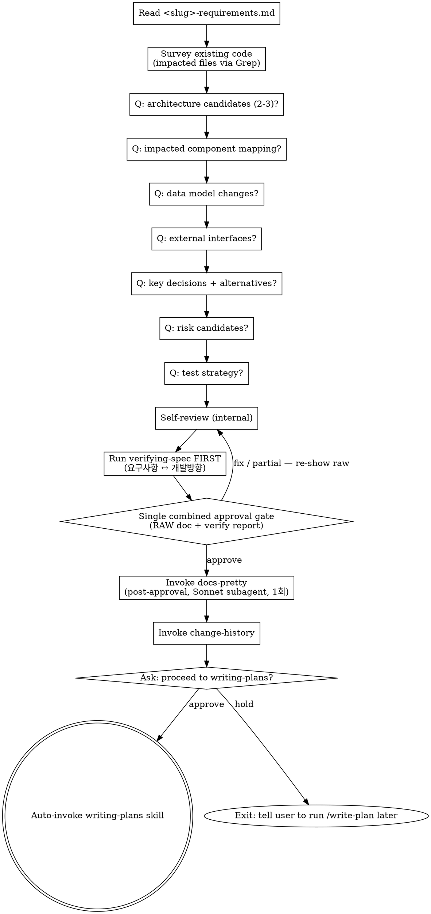

# Designing Direction → <slug>-tech-design.md (Technical Spec)

Take <slug>-requirements.md (PRD) as input and produce <slug>-tech-design.md, a technical spec covering architecture, data model, interfaces, key decisions with alternatives, preliminary risks, and test strategy. Step-by-step task decomposition belongs to `writing-plans`, not here.

<HARD-GATE>
You MUST have an existing <slug>-requirements.md in the current feature folder before invoking this skill. If none exists, instruct the user to run /brainstorm first.
</HARD-GATE>

## Checklist

You MUST create a TaskCreate task for each of these items and complete them in order:

1. **Verify input** — confirm <slug>-requirements.md exists (HARD-GATE if not)
2. **Survey existing code** — Grep/Read impacted areas for each FR
3. **Run technical design questions** — architecture (2-3 candidates) → impacted components → data model → external interfaces → key decisions + alternatives → risk candidates → test strategy
4. **Self-review (internal)** — FR mapping coverage, alternatives present, risk categorization (no user prompt yet)
5. **Run verifying-spec FIRST** (with Tolerance for missing skill) — main agent runs A+C verification, produces 4-axis report internally
6. **Single combined approval gate** — show the full RAW `<slug>-tech-design.md` AND the verify-spec report in one message; ask once "Approve and proceed? — yes / fix / partial". On `fix`/`partial` → revise → loop back to step 4 (Self-review → re-verify → re-show RAW).
7. **Invoke docs-pretty skill** — format pass on the APPROVED draft (Sonnet subagent). Runs AFTER user approval and BEFORE change-history. Single shot per feature (final-1회). Stops once first change-history entry is logged.
8. **Invoke change-history skill** — append first `[개발방향-수정]` entry
9. **Ask proceed-to-writing-plans gate** — emit "✅ ... Proceed to writing-plans? — yes / no", parse intent in any language
10. **On approval → auto-invoke writing-plans via Skill tool. On hold → exit with notice telling the user to run /write-plan later**

If you find yourself skipping ahead, stop and create the missing task.

## Input

`docs/features/YYYY-MM-DD-<slug>/<slug>-requirements.md`

## Output

`docs/features/YYYY-MM-DD-<slug>/<slug>-tech-design.md`

## Schema (<slug>-tech-design.md)

```markdown
# 개발방향: <feature-name>

> **For agentic workers:** This document is the technical spec (architecture, components, data, interfaces, decisions, risks, test strategy). It is anchored to `<slug>-requirements.md` (the PRD) and consumed by `<slug>-implementation-plan.md` (step-by-step plan). NEXT STEP: invoke `writing-plans` skill (or run `/write-plan`) to produce `<slug>-implementation-plan.md` from this design. Do NOT include step-by-step implementation tasks here — those belong in the plan.

## 1. 아키텍처 개요 (diagram + prose)
## 2. 영향 받는 컴포넌트/파일
## 3. 데이터 모델/스키마 변경
## 4. 외부 인터페이스 (API, events)
## 5. 핵심 결정 + 대안 비교 (why this path)
## 6. 위험/사이드이펙트 (preliminary)
## 7. 테스트 전략

---
## 변경이력
```

## Process Flow



## Process (detail)

**1. Verify input**
- Confirm <slug>-requirements.md exists in the same feature folder. If not, HARD-GATE — instruct the user to run `/brainstorm` first.
- **Detect input mode (PRD vs Socratic)** — read the doc and check:
  - Has `## 3. 기능 요구사항 (FR)` or `FR-` identifiers → **PRD mode** input
  - Has `> **Mode:** Socratic` line near the top, OR no FR-N pattern, OR free-form section names → **Socratic mode** input
- Both inputs are valid. Adapt §2-§3 below accordingly. NEVER reject a Socratic-style input as "missing FRs".

**2. Survey the codebase**
- **PRD input** — for each FR-N, Grep/Read to identify likely impacted code areas
- **Socratic input** — extract the implicit requirements from prose (any sentence describing a behavior the system MUST do is treated as an FR for survey purposes), then Grep/Read those areas
- (Full impact analysis is reserved for verifying-spec.)

**3. Step-by-step questions** (one at a time, multiple choice when possible)
- Architecture candidates (2-3 options + recommendation with reasoning)
- Component/file mapping (FR-N → which file/module)
- Data model changes (tables, schema, migrations)
- External interfaces (REST/GraphQL/events)
- Key decisions (each one with at least one alternative + reason for chosen path)
- Risk/side-effect candidates (categorized using risk-annotation taxonomy)
- Test strategy (unit/integration/api breadth)

**4. Self-review** (see checklist) — internal pass, do NOT prompt the user yet

**5. Run verifying-spec FIRST (before any user-approval gate)**
- Inputs: target = `<slug>-tech-design.md`, upstream = `[<slug>-requirements.md]`
- The main agent runs consistency check + code impact analysis and produces the 4-axis report
- Tolerance: if verifying-spec is not installed, skip and emit the notice (existing tolerance rule)

**6. Single combined user-approval gate** (RAW review)
- Present BOTH the full RAW (un-prettified) `<slug>-tech-design.md` AND the verifying-spec report in one message
- Ask once: "Approve `<slug>-tech-design.md` and proceed? — yes / fix / partial"
- DO NOT split into "approve doc" and "approve verify report" — that's two gates for one decision
- On `yes` → continue to step 7 (docs-pretty)
- On `fix` → re-enter the relevant question(s), then re-run from step 4 (Self-review → re-verify → re-show RAW)
- On `partial` → ask which sections to revisit, then re-enter

**7. Invoke docs-pretty skill** (post-approval, final-1회 formatting)
- Runs AFTER the user APPROVES, BEFORE change-history is logged
- Single shot per feature — does NOT re-fire on user-fix loops (loops re-show RAW)
- Dispatches a Sonnet subagent for a strict format-only pass (no rewording, no reordering, footer/frontmatter byte-preserved)
- See `docs-pretty` skill for full pre-flight + sanity-check protocol

**8. Invoke change-history**
- Entry: `[개발방향-수정] CH-YYYYMMDD-NNN / 이유: 신규 기술 설계 / 무엇이: <slug>-tech-design.md 전체 / 영향범위: 없음 (최초 생성)`

**9. Ask the proceed-to-writing-plans gate**
- Emit: `✅ <slug>-tech-design.md is finalized. Proceed to the writing-plans (구현계획서, step-by-step plan) stage now? — yes / no`
- The user may reply in any language; parse intent.
- On approval → auto-invoke `writing-plans` skill via Skill tool. NEVER cross without approval.
- On hold → emit `ℹ️ OK. Run /write-plan later when ready.` and stop.

## Self-Review

- Every FR (PRD input) OR every behavior-implying sentence (Socratic input) in <slug>-requirements.md is mapped to either §2 (impacted components) or §4 (external IF)
- Every key decision in §5 has at least one alternative and a reason for the chosen path
- Risk candidates in §6 are pre-classified using risk-annotation categories (`side-effect | breaking | race`)
- §7 test strategy is consistent with §3 and §4 (DB changes → migration tests, APIs → integration/contract tests)

## Design for Isolation and Clarity

When mapping the architecture in §1 and components in §2, design units that:

- Have one clear purpose
- Communicate through well-defined interfaces
- Can be understood and tested independently

For each unit, you should be able to answer: what does it do, how do you use it, what does it depend on?

- Can someone understand what a unit does without reading its internals?
- Can you change the internals without breaking consumers?

If not, the boundaries need work. Smaller, well-bounded units are also easier for the implementer to work with — code that fits in context produces more reliable edits. When a file grows large, that's often a signal it's doing too much.

## Working in Existing Codebases

- Explore the current structure before proposing changes (this is what step 2 of the Checklist is for). Follow existing patterns.
- Where existing code has problems that affect the work (e.g., a file that's grown too large, unclear boundaries, tangled responsibilities), include targeted improvements as part of the design — the way a good developer improves code they're working in.
- Don't propose unrelated refactoring. Stay focused on what serves the current feature.

## Anti-Patterns

| Wrong | Right |
|---|---|
| Listing step-by-step tasks here | Tasks belong in <slug>-implementation-plan.md. 개발방향 stops at "how it is designed". |
| Missing FR mapping | Every FR must appear in §2 or §4. |
| One decision, no alternatives | Always present at least one alternative + comparison. |
| "Be careful here" without a category | Force one of the four risk-annotation categories. |

## Red Flags

| Thought | Reality |
|---|---|
| "The decision is self-evident, leave §5 blank" | Self-evident means write a one-liner — six months later you'll forget why. |
| "No risks here" | If NFRs or external interfaces change, there are always risk candidates. Reconsider. |

## After Save — single approval gate, then proceed-to-next gate

This summarizes the corrected order (matches Process detail steps 5-9 above):

1. **Run verifying-spec FIRST** (before any user prompt):
   - Target: `<slug>-tech-design.md`
   - Upstream: `[<slug>-requirements.md]`
   - Procedure: consistency (FR mapping coverage) + code impact (Grep for impacted files/callers, side-effect candidates)
   - **Tolerance**: if verifying-spec skill is not installed, skip the call and emit a one-line notice ("ℹ️ verify-gate 미설치, Phase 2 이후 활성화 — 검증 없이 진행")

2. **Single combined approval gate** — present in ONE message:
   - The full RAW `<slug>-tech-design.md` content (or summary if very long)
   - The verify-spec 4-axis report
   - One question: "Approve `<slug>-tech-design.md` and proceed? — yes / fix / partial"
   - DO NOT split into "approve doc" → "approve verify report". One gate, one decision.
   - User reviews RAW markdown (no docs-pretty yet). docs-pretty fires AFTER approval.

3. On `yes` → invoke change-history (`[개발방향-수정]` entry) → continue to step 4.
   On `fix` → re-enter the relevant question(s), then re-run from "Self-review (internal)" — docs-pretty fires again before the next user gate.
   On `partial` → ask which sections to revisit, then re-enter.

4. **Proceed-to-writing-plans gate** (separate, after change-history is logged):
   ```
   ✅ <slug>-tech-design.md is finalized. Proceed to the writing-plans (구현계획서, step-by-step plan) stage now? — yes / no
   ```
   Parse intent in any language.
   - Approval → invoke the Skill tool with `writing-plans`. NEVER cross the gate without explicit approval.
   - Hold → emit `ℹ️ OK. Run /write-plan later when ready.` and stop.
   - Ambiguous → ask once more; do not guess.

## Related Skills

- `brainstorming` — produces the upstream <slug>-requirements.md
- `verifying-spec` — verification gate (active from Phase 2)
- `writing-plans` — next step (<slug>-implementation-plan.md)
- `change-history` — entry recording
- `risk-annotation` — risk category taxonomy
