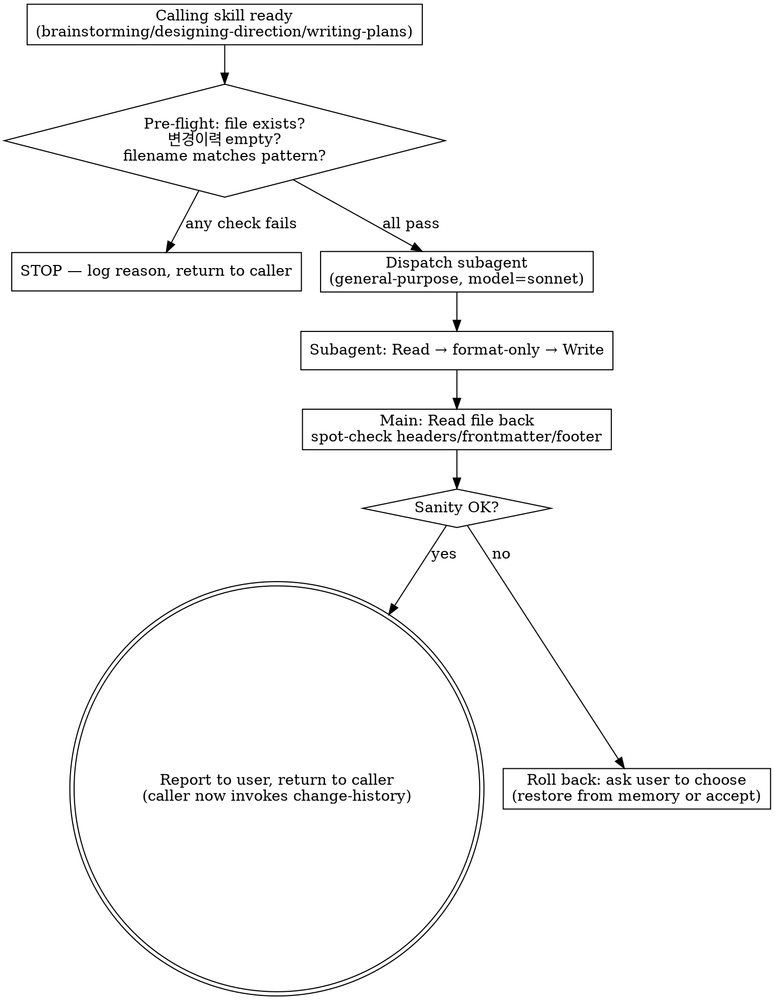

# Docs Pretty (One-Shot Initial Formatting)

This skill prettifies a freshly written feature MD exactly once at the moment it is born. It exists because the agent-authored first draft is content-correct but visually noisy (inconsistent header levels, ad-hoc list bullets, unaligned tables, rough spacing). This pass tightens visual hierarchy WITHOUT touching meaning.

**Announce at start:** "I'm using the docs-pretty skill to do a one-shot initial formatting pass on `<file>`."

<HARD-GATE>
This skill MUST be invoked EXACTLY ONCE per doc, at first creation, after the final user approval and BEFORE the first `change-history` entry. It MUST NOT run on:
- Any subsequent edit (user-requested partial revision, fix, addition)
- Any `change-history` entry append (the `## 변경이력` footer is the audit trail — never reformat it)
- Any `change-propagation` cascade
- Any in-task code-edit logging during `/execute-plan`

If you are unsure whether this is a "first creation" — STOP. Look for an existing `## 변경이력` footer with one or more entries. If ANY entry exists, this is NOT the first creation. Skip this skill.
</HARD-GATE>

## When to Use

| Trigger (yes) | Anti-trigger (no) |
|---|---|
| `brainstorming` finished `<slug>-requirements.md`, user approved, no `## 변경이력` entries yet | User asked to update FR-3 wording in an existing requirements.md |
| `designing-direction` finished `<slug>-tech-design.md`, user approved, no `## 변경이력` entries yet | `change-propagation` is cascading edits across MDs |
| `writing-plans` finished `<slug>-implementation-plan.md`, user approved, no `## 변경이력` entries yet | `change-history` is appending a `[코드-수정]` entry mid-`/execute-plan` |

## Why a Subagent (and which model)

Pretty-formatting is a pure transformation task — no domain reasoning, no decisions. Loading the full doc into the main agent context just to reformat is wasteful, and the main agent's reasoning model is overkill.

**Always dispatch a subagent with `model: "sonnet"`.** Reasoning:

1. The "절대 의미를 잃지 말라" constraint is the user's #1 priority. Sonnet's instruction-following is more reliable than Haiku at honoring negative constraints ("do NOT reword").
2. Per-feature cost is 3 dispatches max — savings from Haiku are negligible vs. the risk of meaning drift.
3. Main context stays clean — the doc body never needs to live in main memory for this task.

Do NOT use Opus (overkill) or Haiku (rephrasing risk on Korean prose). Sonnet is the floor and ceiling here.

## Process

### Step 1 — Pre-flight check

Before dispatching, the main agent MUST verify:

1. The target file exists (Read or Glob)
2. The file's `## 변경이력` footer has ZERO entries (Grep for `### \[` under `## 변경이력` heading; expect 0 matches)
3. The file is one of the three feature MDs (`-requirements.md` / `-tech-design.md` / `-implementation-plan.md`)

If ANY check fails → DO NOT dispatch. Tell the user why and exit.

### Step 2 — Dispatch the Sonnet subagent

Use the `Agent` tool with these exact parameters:

- `subagent_type`: `general-purpose`
- `model`: `sonnet`
- `description`: `Format-only pass on <filename>`
- `prompt`: see template below

### Step 3 — Verify and report

After the subagent returns:
1. Read the file back (1 Read)
2. Spot-check: section headers count unchanged, frontmatter intact, `## 변경이력` footer intact (still empty), no obvious content loss
3. Report to the user: "✨ 포맷 정돈 완료 (`<file>`). 의미 변경 없음."
4. Yield back to the calling skill (which will then invoke `change-history` for the first entry)

## Subagent Prompt Template

The dispatched subagent receives this exact prompt (filled in with the target path):

```
You are performing a STRICT format-only pass on a Korean spec document.

Target file: <ABSOLUTE_PATH>

Your job: improve READABILITY ONLY. The user will trust this pass to never alter meaning.

# Allowed changes (formatting only)

- Normalize Markdown header levels so hierarchy is consistent (e.g., one H1, H2 for top sections, H3 for subsections)
- Convert ad-hoc bullet styles to consistent `-` bullets; align nested list indentation to 2 spaces
- Reformat tables: align column pipes, add header separators if missing
- Tighten spacing: exactly one blank line between sections, no trailing whitespace, no triple-blank-line gaps
- Fix code-block fences (` ``` ` open/close), add language hints where the content makes the language obvious
- Add a blank line before/after lists, tables, code blocks where Markdown rendering benefits
- Convert obvious raw URLs to `<url>` autolinks if they appear standalone
- Standardize emphasis: bold for `**...**`, italic for `*...*` (no underscores for emphasis)

# FORBIDDEN — never do any of these

- Do NOT reword, paraphrase, summarize, expand, or "improve" any sentence
- Do NOT translate Korean ↔ English
- Do NOT reorder sections, list items, table rows, or paragraphs
- Do NOT add new content, examples, or commentary
- Do NOT remove content, even if it looks redundant or unclear
- Do NOT touch the YAML frontmatter (between `---` delimiters at top) — preserve byte-for-byte
- Do NOT touch the `## 변경이력` footer or anything under it — preserve byte-for-byte
- Do NOT change identifier strings: file names, slugs, function names, FR-N / NFR-N / CH-N IDs, Korean section headers (요구사항, 개발방향, 구현계획서, 변경이력, 위험 코드 지점, 롤백 전략, etc.)
- Do NOT change inline code spans (` `...` `) content — only fix fence consistency

# How to apply

1. Read the file in full
2. Apply ONLY allowed transformations
3. Write the result back to the SAME file path using the Write tool (overwrite)
4. Report: "Format pass done on <path>. Sections: <N>. Frontmatter preserved: yes/no. 변경이력 footer preserved: yes/no."

# Verification before writing

Before you call Write:
- Compare your output's section header list (text only, ignoring level) to the input — they MUST match exactly, in the same order
- Confirm the YAML frontmatter block (if present) is byte-identical
- Confirm the `## 변경이력` heading and everything beneath it is byte-identical

If ANY of these fail, do NOT write. Report the failure and stop.

You have one job: make it cleaner to read. Nothing else.
```

## Process Flow



## Sanity-Check Details (post-dispatch)

The main agent's spot-check after the subagent returns:

| Check | How |
|---|---|
| Frontmatter intact | First Read line still `---`; closing `---` present at expected position |
| Section header count unchanged | Grep `^#{1,6} ` → count matches the pre-dispatch count (which the calling skill already knows from generating the doc) |
| `## 변경이력` heading present and footer empty | Grep `^## 변경이력` → 1 match; Grep `^### \[` after that line → 0 matches |
| Korean identifier headers preserved | Grep for the expected Korean section names (`요구사항`, `개발방향`, `구현계획서`, etc. as applicable to the doc type) |

If any check fails, the main agent reports the failure and asks the user whether to (a) accept the prettified version anyway, (b) revert (caller is responsible for restore — typically by re-running the doc-writing step from memory), or (c) skip docs-pretty and proceed.

## Anti-Patterns

| Wrong | Right |
|---|---|
| Run docs-pretty as part of `change-history` entry append | NEVER. docs-pretty fires before the FIRST entry, and never again. |
| Run docs-pretty when user requested a partial revision | NEVER. Partial revisions go through normal Edit + change-history. |
| Skip the pre-flight `변경이력` empty check | The check is what enforces "first creation only". Don't skip. |
| Use Opus / Haiku / main agent for the formatting | Sonnet only — Opus wastes the call, Haiku risks rephrasing Korean. |
| Let the subagent "make the prose flow better" | Forbidden. Pass prompt forbids all rewording. |
| Reformat the `## 변경이력` footer "to match the new style" | The footer is an audit trail with byte-identical preservation. |
| Skip the post-dispatch sanity check | The HARD-GATE on meaning preservation needs verification. |
| Re-run docs-pretty if the user later complains the doc "still looks rough" | One shot only. Subsequent improvements are normal Edit + change-history entries. |

## Red Flags (STOP if you think these)

| Thought | Reality |
|---|---|
| "The doc is short, I'll just format it inline in the main agent" | Subagent dispatch is mandatory — clean main context + model isolation. |
| "The user can always re-run if I mess up" | The audit chain begins at the first 변경이력 entry. Recovering is messy. Don't risk meaning loss. |
| "I'll let the subagent fix that one awkward sentence too" | Forbidden by the prompt. Awkward sentences are addressed via change-propagation if the user actually asks. |
| "Two passes will polish it more" | One shot only. Two passes = compound rephrasing risk. |

## Acceptance

A docs-pretty run is correct when ALL hold:

1. Pre-flight checks all passed (file exists, `## 변경이력` empty, filename pattern matches)
2. Subagent was dispatched with `model: sonnet` and the strict format-only prompt
3. Post-dispatch sanity checks all passed (frontmatter intact, header count unchanged, footer empty, Korean identifiers preserved)
4. The calling skill received control back and is about to invoke `change-history` for the first entry
5. No `## 변경이력` entry was added by docs-pretty itself (logging is the caller's job, with `[<doc-type>-수정]` tag for "신규 ... 결과")

## Related Skills

- `brainstorming` — calls this on first save of `<slug>-requirements.md`
- `designing-direction` — calls this on first save of `<slug>-tech-design.md`
- `writing-plans` — calls this on first save of `<slug>-implementation-plan.md`
- `change-history` — invoked by the caller AFTER docs-pretty returns; logs the first entry on the now-prettified doc
- `change-propagation` — for any post-init revision; docs-pretty is NEVER part of that flow
