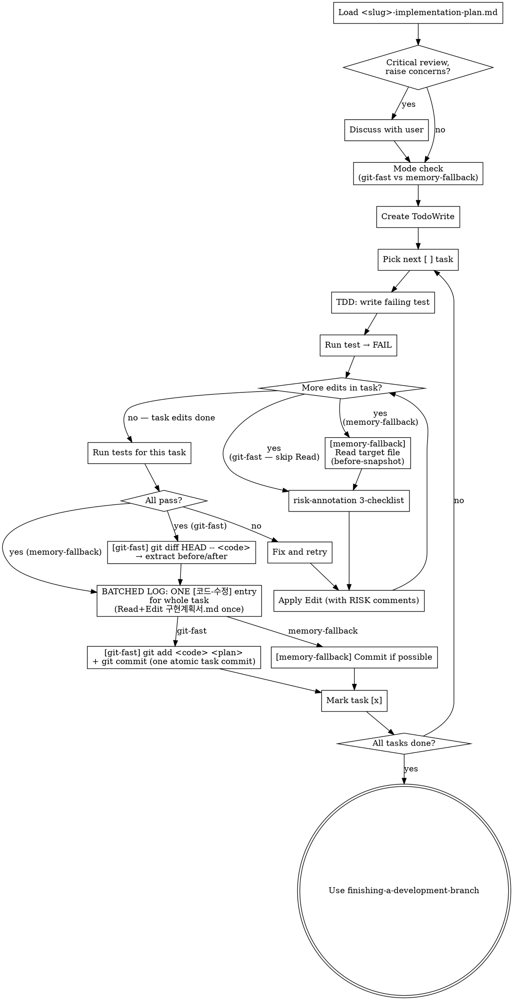

# Executing Plans

## Overview

Load plan, review critically, execute all tasks task-by-task, with strict per-edit discipline that captures before/after code and risk annotations into <slug>-implementation-plan.md change-history.

**Announce at start:** "I'm using the executing-plans skill to implement this plan."

**Note (subagent path):** This skill is the **inline** execution mode. If subagents are available (Claude Code, Codex) AND the user wants to preserve main context for large features, the recommended subagent path is `js-super-sub-driven` (slim 2-stage: implementer + spec reviewer + main post-processing for RISK / 변경이력 / atomic commit). The original upstream `subagent-driven-development` (3-stage: + quality reviewer) is also available for compatibility but duplicates governance js-super already provides via `verifying-spec` + TDD + RISK + 변경이력.

## When to Use

- A <slug>-implementation-plan.md exists in `docs/features/<date>-<slug>/`
- Inline (single-session) execution preferred over per-task subagents
- Each task in the plan follows TDD bite-sized steps

> **Task 이름 가이드 (FR-6 / v1.1.15+):** 구현계획서 §1 의 각 Task 이름은 사용자 친화 한국어로 작성되어야 합니다 (TaskCreate 시 그대로 노출). 내부 용어 (`Invoke ... skill`, `Gate #N`, 영어 식별자) 는 TaskCreate 이름에 노출하지 말 것. CLAUDE.md TaskCreate 명칭 룰 참조.

## Plan Loading

### Step 1: Load and Review Plan
1. Read `docs/features/<date>-<slug>/<slug>-implementation-plan.md`
2. Review critically — list any gaps or concerns
3. If concerns exist: raise them with the user before starting
4. If clean: create TodoWrite tasks (one per plan task) and proceed

## Code Edit Discipline (REQUIRED — js-superpowers extension)

### Two execution modes

This skill picks ONE mode at task start based on git availability + plan policy:

| Mode | Trigger | Before-snapshot source |
|---|---|---|
| **git-fast** (default, optimized) | git repo present AND plan frontmatter `commit_policy: per-task` (or omitted) | `git diff HEAD -- <files>` (working tree vs HEAD) at task end, BEFORE commit |
| **memory-fallback** | git unavailable, OR plan frontmatter `commit_policy: single` / `none` | in-memory Read snapshot before every edit |

<HARD-GATE>
At task start (ONCE per `/execute-plan` run), run the mode check:

1. **Run mode-check helper (v1.1.14+ deterministic)**:

```bash
source .venv/bin/activate && python -c "
import sys
from pathlib import Path
from scripts.preflight import execute_plan_mode_check
result = execute_plan_mode_check(Path('<PLAN_PATH>'))
print(f'ok={result.ok} reason={result.reason}')
sys.exit(0 if result.ok else 1)
"
```

이 helper 가 plan frontmatter 의 `commit_policy` 를 deterministic 으로 읽어 반환.

**exit code 분기 (v1.1.15 user-gate)**:

- **exit 0** → reason 에 `commit_policy=per-task` 형식. 메인은 policy 값으로 모드 분기:
  - `per-task` → candidate mode = git-fast
  - `single` → candidate mode = memory-fallback (all tasks → one commit at end)
  - `none` → candidate mode = memory-fallback (no commits during run)
- **exit 1** (semantic fail — plan not found) → `human_reason` 노출 후 `AskUserQuestion` 게이트:
  - `"수정 후 재시도"` (사용자가 plan 경로 확인) / `"강제 진행 (위험)"` (사용자가 입력한 plan 경로 직접 사용 — 메인이 추가 안내) / `"스킵 (이번만)"` (executing-plans 종료).
- **exit ≠ 0,1** (invocation 실패) → stderr 노출 + `AskUserQuestion` 게이트:
  - `"직접 디버깅"` / `"skill 단계 스킵"`.

기존 LLM 산문 추론 단계 제거 (v1.1.14). frontmatter 파싱 결과를 그대로 신뢰. 자세한 룰은 `scripts/preflight.py:execute_plan_mode_check`.

2. **Check git availability**: `git rev-parse --git-dir` (Bash). If git unavailable, force mode = memory-fallback regardless of frontmatter.

3. **Final mode decision**:
   - Both checks point to git-fast → mode = git-fast
   - Either check forces memory-fallback → mode = memory-fallback. If frontmatter requested `single`/`none` (i.e., user-intentional), proceed silently. If git was unavailable but frontmatter said `per-task`, WARN the user once: "⚠️ git repo 미초기화 → memory-fallback 모드로 진행합니다. 변경 전 코드 보존 비용이 큽니다."

The chosen mode applies to the whole `/execute-plan` run. Do not switch mid-run.

**Why a frontmatter field, not prose detection:** Prose scanning ("commit 생략" 등 키워드 매칭) is unreliable. The frontmatter field is unambiguous, machine-checkable, and lives next to the plan it governs.
</HARD-GATE>

### git-fast mode (default)

**Phase 1 — Per code edit (repeat for each edit in the task):**
1. **Risk check**: Run risk-annotation 3-checklist on the planned change.
2. **Apply edit**: Edit/Write the file (insert `# ⚠️ RISK(...)` comments above risky lines as needed). Trust the Edit tool's success/failure return — do NOT re-Read just to confirm the comment landed.

(Repeat 1-2 for every code edit. Track `(file:line, risk_categories)` tuples in memory — before/after code is recovered from git later, no in-memory snapshot needed.)

**Phase 2 — Once per task, AFTER all task edits + tests pass (commit happens LAST):**

Per task: code-only commit (plan.md untouched). Footer entry is deferred to end-of-run consolidator (v1.1.7+). This batches N tasks into a single consolidated [코드-수정] entry, drastically reducing footer noise + Read/Edit cost.

3. **Capture diff for accumulator** (NOT for footer): `git diff HEAD -- <code files only>` — parse hunks. Append `(task_id, file:line_range, summary, risk_categories, planned_commit_msg)` to in-memory accumulator. Do NOT touch <slug>-implementation-plan.md here.
4. **Commit (scoped, code only)**: `git add <explicit list of code files touched in this task>` then `git commit -m "<task summary>"`. NEVER use `git add -A` or `git add .`. The code-file list MUST come from the in-memory `(file:line, ...)` tuples tracked during Phase 1. plan.md is NOT included in this commit — it gets its own single `[log] all tasks` commit at end-of-run.

**Phase 3 — End-of-Run Consolidator (v1.1.7+, runs ONCE after final task):**

5. **Render "구현 요약" message** to the user: planned tasks vs actual commits (incl. follow-ups), RISK triggers by category, 누락/초과 list, code-zero-change tasks (→ separate `[검증]` entry).
6. **Build consolidated batch entry**: from in-memory accumulator → ONE `[코드-수정] (batch: tasks N..M)` entry per change-history slim schema (코드 블록 생략, 연관 commit SHA 참조). For any code-zero-change task, build a separate `[검증]` entry.
7. **Single footer append + log commit**: Read <slug>-implementation-plan.md once → Edit (append batch entry + 검증 entries) → `git add <slug>-implementation-plan.md` → `git commit -m "[log] all tasks: <one-line summary>"`.
8. **Cleanup**: nothing for inline mode (no buffer dir). Subagent path cleans `.js-super/changelog-buffer/<slug>/` separately — see `js-super-sub-driven` skill §2-4.

This Phase 3 ordering is the **single source of truth for inline mode**. Subagent mode uses the same Phase 3 logic but reads manifests from the buffer directory instead of in-memory accumulator (per `js-super-sub-driven` §2).

### memory-fallback mode

**Phase 1 — Per code edit:**
1. **Before-snapshot**: Read the target file → capture the original code for the affected line range. Hold in memory.
2. **Risk check**: Run risk-annotation 3-checklist.
3. **Apply edit**: Edit/Write (with RISK comments).

(Repeat. Track `(file:line, before, after, risk_categories)` tuples in memory.)

**Phase 2 — Once per task, AFTER all edits + tests pass:**
4. **Batched log**: Read plan ONCE, append ONE consolidated [코드-수정] entry, Edit ONCE. Use in-memory snapshots for 변경 전 / 변경 후.
5. Commit if possible (some plans skip).

<HARD-GATE>
NEVER skip Phase 2 logging. In git-fast mode, **strict ordering is mandatory**: extract diff (while plan.md untouched) → edit plan.md → commit code + plan together. Reversing this (e.g., commit before diff, or edit plan before diff) will pollute future `git diff HEAD` outputs with stale log appends. In memory-fallback mode, before-snapshots must be captured BEFORE each edit (otherwise originals are gone) and held in memory until Phase 2.
</HARD-GATE>

## Trivial-Edit Exception (skip full discipline for tiny changes)

For changes that meet ALL of the following criteria, you MAY substitute a "trivial" path:

- Edit affects ≤ 3 lines
- No logic change (comments / docstrings / typos / unused-import cleanup / import reordering / whitespace only)
- risk-annotation 3-checklist returns 0/3 triggers (no side-effect / breaking / race signal)

When trivial:

1. **Skip before-snapshot** — irrelevant in both modes (git-fast doesn't need it; memory-fallback skips because no full block will be logged)
2. Risk check still runs to confirm 0/3
3. Apply edit runs as usual (typically no RISK comment needed since 0/3)
4. Log writes a **trivial entry** (no `git diff` extraction needed) instead of the full schema:

```markdown
### [YYYY-MM-DD HH:MM] [코드-수정] (trivial)
- **id**: CH-YYYYMMDD-NNN
- **이유**: <one-line reason, e.g. "타이포 수정 (witdraw → withdraw)">
- **무엇이**: <file:line>
```

No 영향범위, no 위험 카테고리, no before/after code blocks.

**git-fast mode: trivial 편집이라도 task당 1 commit은 반드시 유지.** 다음 task의 `git diff HEAD -- <code>` 가 깨끗하게 이번 task만 포함하려면 이번 task가 commit으로 닫혀야 함. "trivial이니 commit 생략"은 다음 task의 변경이력 정확성을 깨뜨림. (memory-fallback 모드는 commit 선택사항 그대로.)

**If ANY criterion is uncertain → fall back to full discipline.** Trivial is a fast path, not a shortcut for "anything that looks small".

<HARD-GATE>
Triviality is determined ONLY by the three criteria above. Logic changes — even one-line ones — are NOT trivial. When in doubt, take the safe path.
</HARD-GATE>

## Process Flow



## When to Stop and Ask for Help

**STOP executing immediately when:**
- Hit a blocker (missing dependency, test fails repeatedly, instruction unclear)
- Plan has critical gaps preventing the next task
- A 위험 카테고리 is genuinely ambiguous AND the trigger seems significant
- Verification fails after two retries

Ask the user rather than guessing.

## When to Revisit Earlier Steps

**Return to Step 1 (Load and Review Plan) when:**
- The user updates the plan based on your feedback
- A fundamental approach in the plan needs rethinking (e.g., chosen library doesn't fit, an FR was misread)
- Mid-execution discoveries invalidate later tasks

**Don't force through blockers** — stop and ask. The plan can be wrong. If it is, route the change through `change-propagation` so <slug>-implementation-plan.md is updated coherently before resuming.

## Anti-Patterns

| Wrong | Right |
|---|---|
| (memory-fallback) Edit first, capture before-snapshot later | Always Read → snapshot → Edit. Otherwise original is gone. |
| (git-fast) Skip the per-task commit | Commit is REQUIRED — without it, the next task's `git diff HEAD` includes both tasks' changes and the log gets fabricated. |
| (git-fast) Edit plan.md BEFORE running `git diff` | The diff would then include the plan log append, polluting "변경 전 코드" with non-code content. Order: diff → edit plan → commit. |
| (git-fast) Commit code first, then edit plan as separate commit | Creates two commits per task; `git diff HEAD` next task is clean but commit history is noisy. The atomic single-commit approach (code + plan together at end) is correct. |
| (git-fast) `git add -A` or `git add .` | Sweeps unrelated untracked files into the commit. Use explicit file list from Phase 1 tuples + plan.md. |
| (git-fast) Include plan.md in the `git diff` extract | Extract scope = code files only. Plan changes are in the same commit but not in the "변경 전 코드" block. |
| Switch modes mid-run | Mode is decided at task-start mode-check. Stick to it. |
| Batch change-history entries at session end | Per-task immediate logging. Context evaporates fast. |
| Skip RISK annotation because "looks safe" | Run the 3-checklist. 0/3 means no annotation, but the check happens. |
| Skip Phase 2 logging | HARD-GATE violation. Revert + redo. |
| Marking a logic-changing edit as "trivial" to skip discipline | Triviality requires zero logic change AND 0/3 risk triggers AND ≤3 lines. Logic changes are NEVER trivial. |
| Force progress through a blocker | Stop. Ask. The plan can be wrong. |
| Inferring commit policy from prose ("commit 안 할게") | Read `commit_policy` from plan frontmatter only. If user wants a different policy, route through change-propagation to update the field, then re-run the mode check. |
| Frontmatter says `per-task` but user verbally says skip commits mid-run | Stop and reconcile the field first (change-propagation). Do not silently switch modes. |

## Red Flags

| Thought | Reality |
|---|---|
| "This is a tiny tweak, skip discipline" | Tiny tweaks are exactly where regressions hide. Run the 4 steps. |
| "User won't notice if I skip the entry" | The user is reviewing 변경이력 later. They'll notice. |
| "Plan said do X, but I think Y is better" | Stop. Update the plan via change-propagation, then proceed. |

## Step 3: Complete Development

After all tasks complete and verified:
- **Final step**: invoke `finishing-a-development-branch` — 테스트 자동 검증 + 종료 메시지 (v1.1.14 슬림화). AskUserQuestion 게이트 X, 사용자가 직접 git/gh 명령 실행.

## Remember
- Review plan critically before starting
- Pick mode (git-fast vs memory-fallback) at task-start mode-check; do not switch
- Follow plan steps exactly
- Per-edit discipline: risk-check → apply (memory-fallback adds before-snapshot Read upfront)
- Per-task discipline: tests pass → (git-fast: commit + git diff) → batched log → mark task done
- Don't skip verifications — if a step says "run X, expect Y", run X and confirm Y
- Reference skills when the plan says to (e.g., "use risk-annotation here")
- Never start implementation on main/master without explicit user consent
- Ask when blocked

## Related Skills

- `risk-annotation` — invoked on every code edit for the 3-checklist
- `change-history` — invoked on every code edit for the [코드-수정] entry
- `change-propagation` — invoked when an in-flight insight requires plan/spec edits
- `js-super-sub-driven` — recommended subagent path (slim 2-stage + main post-processing)
- `subagent-driven-development` — upstream original subagent path (3-stage, kept for compatibility)
- `finishing-a-development-branch` — final wrap-up after all tasks
