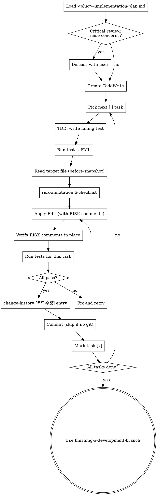

# Executing Plans

## Overview

Load plan, review critically, execute all tasks task-by-task, with strict per-edit discipline that captures before/after code and risk annotations into <slug>-implementation-plan.md change-history.

**Announce at start:** "I'm using the executing-plans skill to implement this plan."

**Note:** This plugin works much better with subagent support. If subagents are available (Claude Code, Codex), prefer `subagent-driven-development` over this skill — fresh subagent per task with two-stage review yields higher quality.

## When to Use

- A <slug>-implementation-plan.md exists in `docs/features/<date>-<slug>/`
- Inline (single-session) execution preferred over per-task subagents
- Each task in the plan follows TDD bite-sized steps

## Plan Loading

### Step 1: Load and Review Plan
1. Read `docs/features/<date>-<slug>/<slug>-implementation-plan.md`
2. Review critically — list any gaps or concerns
3. If concerns exist: raise them with the user before starting
4. If clean: create TodoWrite tasks (one per plan task) and proceed

## Code Edit Discipline (REQUIRED — js-superpowers extension)

<HARD-GATE>
Every code Edit/Write you make during /execute-plan MUST follow this 5-step discipline:
1. **Before-snapshot**: Read the target file → capture the original code for the affected line range
2. **Risk check**: Run risk-annotation 6-checklist on the planned change
3. **Apply edit**: perform the Edit/Write (insert `# ⚠️ RISK(...)` comments above risky lines as needed)
4. **Verify**: Re-Read or Grep to confirm RISK comments are in place
5. **Log**: Invoke change-history → append [코드-수정] entry to <slug>-implementation-plan.md with full schema (id / 이유 / 무엇이 / 영향범위 / 위험 카테고리 / 변경 전 코드 / 변경 후 코드)
NEVER commit code without completing all 5 steps. The before-snapshot must be captured BEFORE the edit, otherwise the original is gone.
</HARD-GATE>

## Process Flow

## When to Stop and Ask for Help

**STOP executing immediately when:**
- Hit a blocker (missing dependency, test fails repeatedly, instruction unclear)
- Plan has critical gaps preventing the next task
- A 위험 카테고리 is genuinely ambiguous AND the trigger seems significant
- Verification fails after two retries

Ask the user rather than guessing.

## When to Revisit Earlier Steps

**Return to Step 1 (Load and Review Plan) when:**
- The user updates the plan based on your feedback
- A fundamental approach in the plan needs rethinking (e.g., chosen library doesn't fit, an FR was misread)
- Mid-execution discoveries invalidate later tasks

**Don't force through blockers** — stop and ask. The plan can be wrong. If it is, route the change through `change-propagation` so <slug>-implementation-plan.md is updated coherently before resuming.

## Anti-Patterns

| Wrong | Right |
|---|---|
| Edit first, capture before-snapshot later | Always Read → snapshot → Edit. Otherwise original is gone. |
| Batch change-history entries at session end | Per-task immediate logging. Context evaporates fast. |
| Skip RISK annotation because "looks safe" | Run the 6-checklist. 0/6 means no annotation, but the check happens. |
| Commit without completing all 5 steps | HARD-GATE violation. Revert + redo. |
| Force progress through a blocker | Stop. Ask. The plan can be wrong. |

## Red Flags

| Thought | Reality |
|---|---|
| "This is a tiny tweak, skip discipline" | Tiny tweaks are exactly where regressions hide. Run the 5 steps. |
| "User won't notice if I skip the entry" | The user is reviewing 변경이력 later. They'll notice. |
| "Plan said do X, but I think Y is better" | Stop. Update the plan via change-propagation, then proceed. |

## Step 3: Complete Development

After all tasks complete and verified:
- Announce: "I'm using the finishing-a-development-branch skill to complete this work."
- **REQUIRED SUB-SKILL:** Use `finishing-a-development-branch`
- Follow that skill to verify tests, present options, execute the user's choice

## Remember
- Review plan critically before starting
- Follow plan steps exactly
- 5-step discipline per code edit (HARD-GATE)
- Don't skip verifications — if a step says "run X, expect Y", run X and confirm Y
- Reference skills when the plan says to (e.g., "use risk-annotation here")
- Never start implementation on main/master without explicit user consent
- Ask when blocked

## Related Skills

- `risk-annotation` — invoked on every code edit for the 6-checklist
- `change-history` — invoked on every code edit for the [코드-수정] entry
- `change-propagation` — invoked when an in-flight insight requires plan/spec edits
- `subagent-driven-development` — alternative execution mode (per-task subagent)
- `finishing-a-development-branch` — final wrap-up after all tasks
