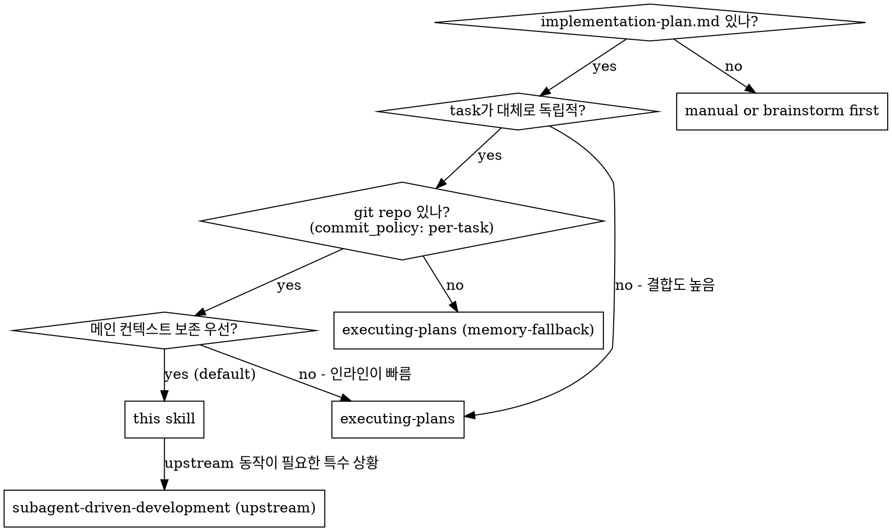
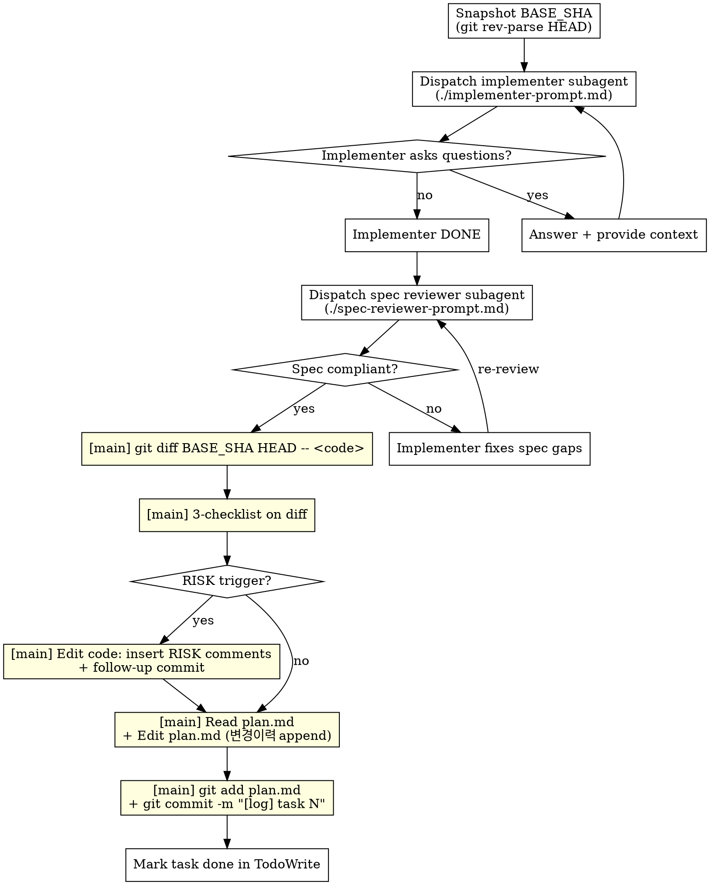

# js-super-subagent-driven-development

js-super 워크플로에 최적화된 서브에이전트 경로. upstream `subagent-driven-development`를 1인 개발 + 사전 검증 게이트 가정에 맞게 슬림화한 변형.

**Announce at start:** "I'm using the js-super-subagent-driven-development skill to execute this plan with subagents + main-agent governance."

## 비교: upstream vs 이 스킬

| 항목 | upstream | this (js-super) |
|---|---|---|
| Implementer subagent | ✅ | ✅ (custom prompt — 거버넌스는 메인이 한다고 명시) |
| Spec reviewer subagent | ✅ | ✅ (upstream과 사실상 동일) |
| Quality reviewer subagent | ✅ | ❌ **제거** |
| 메인 후처리 (RISK + 변경이력 + atomic commit) | ❌ | ✅ **task당 자동** |

### Why drop quality reviewer

- 사전 단계 `/design` / `/write-plan` 끝의 `verifying-spec` 게이트가 정합성 + 코드 임팩트 분석을 메인에서 이미 수행
- bite-sized TDD task가 품질의 1차 baseline (테스트 통과 = 동작 보장)
- `risk-annotation` 3-checklist + 변경이력이 사후 추적 보장
- 1인 개발 가정 — 본인이 `finishing-a-development-branch`에서 최종 검수

### Why keep spec reviewer

- fresh-context 서브에이전트가 implementer 보고서 안 보고 **코드를 직접 line-by-line 대조** 하는 시각은 메인이 못 가지는 가치
- bite-sized task라도 implementer 누락/초과 가능성 0% 아님
- 메인의 `verifying-spec` 게이트는 plan ↔ 상위 산출물 정합성 검증, 이 spec reviewer는 plan task ↔ 실제 코드 정합성 검증 — 결이 다름

## When to Use



기본은 `executing-plans` (인라인). **메인 컨텍스트가 한계에 다다를 큰 피처(20+ task) + 진짜 독립적 task** 일 때 이 스킬이 빛을 발함.

## Mode Compatibility

이 스킬은 **항상 git-fast** 가정. 이유:
- implementer subagent가 commit을 하므로 git 필수
- `commit_policy: single` / `none` 인 plan과는 호환 안 됨 → 이 경우 `executing-plans` (memory-fallback) 사용

`/execute-plan` 진입 시 mode-check (이미 `executing-plans`에 정의됨)에서 `commit_policy != per-task` 면 이 스킬은 후보에서 제외.

## Per-task Sequence



노란색 박스 = 메인 후처리 단계 (이 스킬의 핵심 추가분).

## Detailed Step-by-Step

### 0. 초기 (1회만)
1. Read `<slug>-implementation-plan.md` → task 전체 추출, 본문 + 컨텍스트 in-memory 보관
2. `commit_policy` 확인 → `per-task` 아니면 STOP, 사용자에게 모드 변경 권유
3. `git rev-parse --git-dir` → git 가용성 확인
4. TodoWrite: 모든 task 등록

### 1. Per task

#### 1-1. BASE_SHA 캡처
```bash
BASE_SHA=$(git rev-parse HEAD)
```
**왜 필요한가:** implementer subagent가 multi-commit (test commit + impl commit + refactor commit 등)할 수 있어서 `HEAD~1`로 task 시작점을 찾으면 부정확. BASE_SHA를 미리 잡아둬야 정확한 task 범위 diff 추출 가능.

#### 1-2. Implementer subagent dispatch
- 프롬프트: `./implementer-prompt.md` 템플릿 사용
- 핵심: implementer는 **TDD + 구현 + commit + self-review** 만. RISK 주석 / 변경이력은 메인이 한다고 명시 (프롬프트에 박혀있음).

#### 1-3. Spec reviewer subagent dispatch
- 프롬프트: `./spec-reviewer-prompt.md` (upstream과 사실상 동일)
- 결과: ✅ / ❌ + 누락/초과 리스트
- ❌ → implementer 재호출 → spec reviewer 재검증 (loop)

#### 1-4. ★ 메인 후처리 (이 스킬의 추가분)

```bash
# (a) diff 추출
git diff $BASE_SHA HEAD -- <code 파일들>
```

```
# (b) 3-checklist 적용 (메인 추론)
risk-annotation 스킬 invoke
→ 트리거 카테고리 set 확정
```

```
# (c) RISK 트리거 발생 시
for each risky line:
    Edit <file> — 해당 라인 위에 # ⚠️ RISK(...) 주석 삽입

git add <code 파일들>
git commit -m "[risk-annotate] task N: <요약>"
```

```
# (d) 변경이력 기록
Read <slug>-implementation-plan.md  (1회)
Edit <slug>-implementation-plan.md  (변경이력 [코드-수정] entry 1개 append)

git add <slug>-implementation-plan.md
git commit -m "[log] task N: <요약>"
```

#### 1-5. TodoWrite 체크 → 다음 task

### 2. 모든 task 완료 후
- `finishing-a-development-branch` 스킬 invoke
- 전체 테스트 재실행 + Merge / PR / 정리 옵션 제시

## Commit History 모양 (예시)

```
* [log] task 5: ...
* [risk-annotate] task 5: ...        ← (RISK 트리거 있을 때만)
* task 5: <implementer 본 commit>
* [log] task 4: ...
* task 4: <implementer 본 commit (multi-commit 가능)>
* task 4: <test commit>
* [log] task 3: ...
* task 3: <implementer 본 commit>
...
```

→ task당 commit 2~3개 (구현 + 거버넌스). PR 단계에서 squash 권장. **history rewrite 안 함** (`amend` 사용 금지 — 안전).

## Cost Comparison

| | upstream subagent-driven | this skill | inline (executing-plans) |
|---|---|---|---|
| task당 서브에이전트 호출 | 3개 (impl + spec + quality) + 루프 | **2개** (impl + spec) + 루프 | 0개 |
| 메인 컨텍스트 누적 | 가벼움 (서브에이전트 결과만) | 중간 (+ diff + 3-checklist + 변경이력) | 무거움 (모든 코드) |
| 거버넌스 (RISK / 변경이력) | ❌ | ✅ | ✅ |
| 전용 quality reviewer | ✅ | ❌ | ❌ |

## Anti-Patterns

| Wrong | Right |
|---|---|
| Quality reviewer 흉내 (메인이 사후 quality 리뷰 추가) | 빠진 이유 있음. TDD + RISK + finishing-a-development-branch가 대체. |
| 메인 후처리 스킵 (시간 절약 목적) | RISK / 변경이력이 누락되면 인라인과 격차 발생. 후처리는 HARD-GATE. |
| BASE_SHA 캡처 안 하고 `HEAD~1` 사용 | implementer multi-commit 시 부정확. 항상 BASE_SHA를 task 시작 시 캡처. |
| `commit_policy: single`/`none` plan에 이 스킬 강행 | git 필수 + commit 자유 가정. 호환 안 됨. STOP. |
| RISK 주석을 implementer 프롬프트에 넣어서 시키기 | 옵션 A의 함정 (fresh-context 일관성 약함). 메인이 한다는 게 이 스킬의 본질. |
| amend로 history rewrite | follow-up commit 사용 (안전). amend는 push된 브랜치 깨뜨림. |
| Implementer 보고서 보고 spec reviewer 디스패치 안 함 | spec reviewer는 fresh-context로 코드 직접 본다는 게 가치. 스킵하면 빠진 이유가 사라짐. |

## Red Flags

| Thought | Reality |
|---|---|
| "spec reviewer도 빼자, 사전 게이트가 있잖아" | 사전 게이트는 plan ↔ 상위 정합성, spec reviewer는 plan task ↔ 코드 정합성. 다른 시각. |
| "후처리는 끝에 한꺼번에 하자" | task별 commit 격리가 깨지고 history 더러워짐. task당 즉시. |
| "RISK 트리거 잡으면 implementer한테 재시켜야 하나" | 아니. 메인이 직접 Edit. implementer 재디스패치는 비용↑. |

## Acceptance

A task is complete in this skill only when ALL hold:
1. Implementer reported DONE
2. Spec reviewer reported ✅ (재리뷰 후라도 OK)
3. 메인이 `git diff BASE_SHA HEAD` 추출 완료
4. 3-checklist 결과가 결정됨 (트리거 0이거나 RISK 주석 + commit 완료)
5. 변경이력 [코드-수정] entry append 완료 + commit
6. TodoWrite 체크

## Related Skills

- `subagent-driven-development` (upstream) — 비교 대상, 사용자가 명시적으로 원하면 그쪽으로
- `executing-plans` — 인라인 대안 (메인 컨텍스트 한계 안 갈 때 더 빠름)
- `risk-annotation` — 메인 후처리 §1-4-(b)에서 사용
- `change-history` — 메인 후처리 §1-4-(d)에서 사용
- `finishing-a-development-branch` — 모든 task 완료 후 호출
- `verifying-spec` — `/design`, `/write-plan` 단계에서 사전 게이트로 이미 수행됨 (이 스킬은 그 결과를 신뢰)
