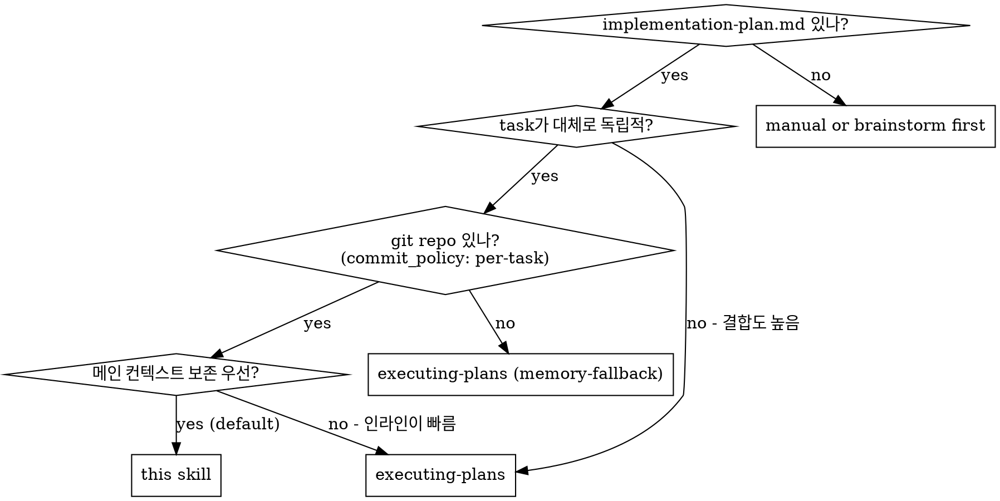
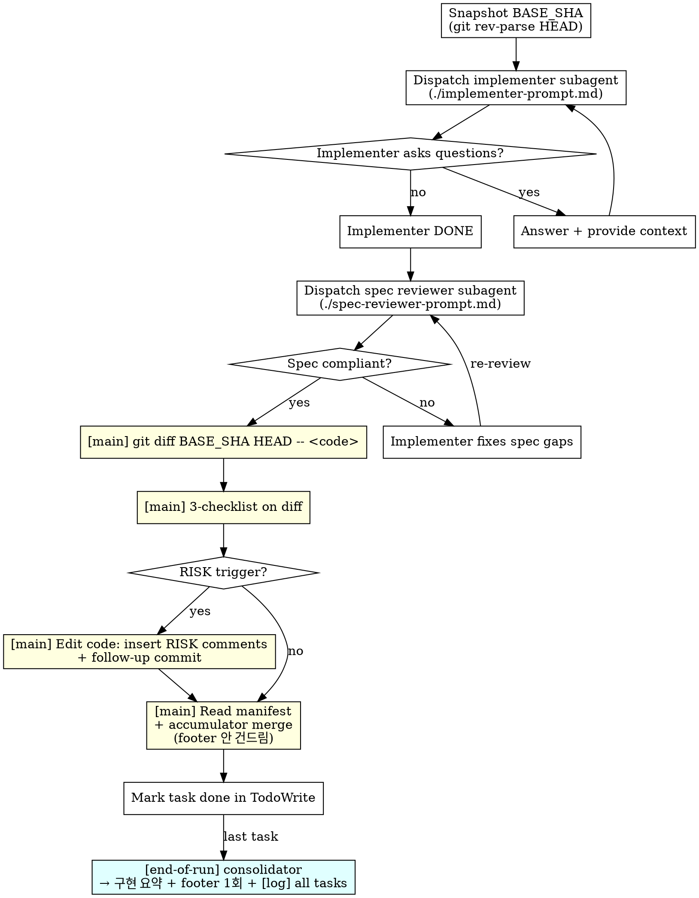

# js-super-subagent-driven-development

js-super 워크플로에 최적화된 서브에이전트 경로. 1인 개발 + 사전 검증 게이트(verifying-spec) 가정.

**Announce at start:** "I'm using the js-super-subagent-driven-development skill to execute this plan with subagents + main-agent governance."

## Why this shape

- **Spec reviewer 유지** — fresh-context 서브에이전트가 implementer 보고서 없이 코드를 line-by-line 대조하는 시각은 메인이 못 가짐. 메인의 `verifying-spec`은 plan ↔ 상위 산출물 정합성, 이 서브에이전트는 plan task ↔ 실제 코드 정합성 — 결이 다름.
- **별도 quality reviewer 없음** — `/design` / `/write-plan` 끝의 `verifying-spec`(코드 임팩트 분석) + bite-sized TDD(테스트 통과 baseline) + `risk-annotation` 3-checklist + 변경이력으로 대체. 1인 개발이 `finishing-a-development-branch`에서 최종 검수.
- **메인 후처리 (RISK + 변경이력 + atomic commit)** — task 종료마다 자동.

## When to Use



기본은 `executing-plans` (인라인). **메인 컨텍스트가 한계에 다다를 큰 피처(20+ task) + 진짜 독립적 task** 일 때 이 스킬이 빛을 발함.

## Mode Compatibility

이 스킬은 **항상 git-fast** 가정. 이유:
- implementer subagent가 commit을 하므로 git 필수
- `commit_policy: single` / `none` 인 plan과는 호환 안 됨 → 이 경우 `executing-plans` (memory-fallback) 사용

`/execute-plan` 진입 시 mode-check (이미 `executing-plans`에 정의됨)에서 `commit_policy != per-task` 면 이 스킬은 후보에서 제외.

## Model Selection

서브에이전트 dispatch 시 **task 복잡도에 맞는 가장 가벼운 모델**을 명시적으로 선택. 명시 안 하면 메인의 모델(보통 Opus)을 상속받아 모든 task가 무겁게 돌아감 → 인라인보다 느려지는 역설 발생.

| Task 신호 | 권장 모델 |
|---|---|
| 1-2 파일 + 명확한 spec, 기계적 구현 (대부분의 task) | **haiku** 또는 **sonnet** |
| 다중 파일 통합 / 패턴 매칭 / 디버깅 | **sonnet** |
| 설계 판단 / 광범위 코드베이스 이해 / 리뷰 | **opus** |

**Spec reviewer 서브에이전트**는 코드 line-by-line 대조라 보통 **sonnet** 충분. 단순 task 기계적 검토면 haiku도 OK.

**Implementer 서브에이전트**는 task 분류 후 위 표대로. Plan 작성 시 task별 모델 힌트를 적어두면 dispatch 비용 누적이 크게 줄어듦.

dispatch 예시:
```
Task tool (general-purpose):
  model: "sonnet"           # ← 명시적 핀
  description: "Implement Task N: ..."
  prompt: <implementer-prompt 템플릿>
```

명시 안 하면 부모 모델 상속 → Opus dispatch가 task당 2회 누적 (implementer + spec-reviewer) → 슬로우니스의 주요 원인.

## Per-task Sequence



노란색 박스 = 메인 후처리 단계 (이 스킬의 핵심 추가분).

## Detailed Step-by-Step

### 0. 초기 (1회만)
1. Read `<slug>-implementation-plan.md` → task 전체 추출, 본문 + 컨텍스트 in-memory 보관
2. `commit_policy` 확인 → `per-task` 아니면 STOP, 사용자에게 모드 변경 권유
3. `git rev-parse --git-dir` → git 가용성 확인
4. TodoWrite: 모든 task 등록

### 1. Per task

#### 1-1. BASE_SHA 캡처
```bash
BASE_SHA=$(git rev-parse HEAD)
```
**왜 필요한가:** implementer subagent가 multi-commit (test commit + impl commit + refactor commit 등)할 수 있어서 `HEAD~1`로 task 시작점을 찾으면 부정확. BASE_SHA를 미리 잡아둬야 정확한 task 범위 diff 추출 가능.

#### 1-2. Implementer subagent dispatch
- 프롬프트: `./implementer-prompt.md` 템플릿 사용
- 핵심: implementer는 **TDD + 구현 + commit + self-review** 만. RISK 주석 / 변경이력은 메인이 한다고 명시 (프롬프트에 박혀있음).

#### 1-3. Spec reviewer subagent dispatch
- 프롬프트: `./spec-reviewer-prompt.md`
- 결과: ✅ / ❌ + 누락/초과 리스트
- ❌ → implementer 재호출 → spec reviewer 재검증 (loop)

#### 1-4. ★ 메인 후처리 (이 스킬의 추가분)

```bash
# (a) diff 추출
git diff $BASE_SHA HEAD -- <code 파일들>
```

```
# (b) 3-checklist 적용 (메인 추론)
risk-annotation 스킬 invoke
→ 트리거 카테고리 set 확정
```

```
# (c) RISK 트리거 발생 시
for each risky line:
    Edit <file> — 해당 라인 위에 # ⚠️ RISK(...) 주석 삽입

git add <code 파일들>
git commit -m "[risk-annotate] task N: <요약>"
```

```
# (d) Buffer 무결성 + accumulator (v1.1.7 — footer 안 건드림)
Read .js-super/changelog-buffer/<slug>/task-NN.md
- validate manifest schema (task_id, status, files_changed, commits, ...)
- if validation fails → ask implementer to re-emit OR raise STOP
- merge into in-memory accumulator (kept until "모든 task 완료 후")

(NOTE) per-task append + [log] commit은 v1.1.7 에서 제거됨.
실제 footer 갱신과 단일 [log] commit은 §2 "모든 task 완료 후" 에서 1회 발화.
```

#### 1-5. TodoWrite 체크 → 다음 task

### 2. 모든 task 완료 후 — End-of-Run Consolidator (v1.1.7+)

이 단계는 1회만 발화. per-task append를 누적했다가 한꺼번에 정리.

#### 2-1. 누적 accumulator + buffer 디렉토리 종합

```bash
# Validate every task has a manifest
python -c "
from pathlib import Path
from scripts.changelog_buffer import list_buffer_files
files = list_buffer_files(Path('.js-super/changelog-buffer/<slug>'))
print(f'Found {len(files)} manifests; expected {len(plan_tasks)}')
"
```

If counts mismatch → STOP, ask user (some task likely BLOCKED or interrupted).

#### 2-2. "구현 요약" 메시지를 메인이 사용자에게 출력 (AC-2)

```
✅ <slug> 모든 task 완료. 구현 요약:
- 계획서 N tasks → 실제 본 commit M개 (follow-up M' 포함)
- RISK 트리거: side-effect=X / breaking=Y / race=Z (총 N건)
- 누락: <list 또는 "없음">
- 초과: <list 또는 "없음">  ← plan에 없던 follow-up commit 의 변경 범위
- 코드 변경 0건 task: <task 번호 list>  ← [검증] entry로 별도 기록
다음 단계: PR 작성 / finishing-a-development-branch
```

이 메시지가 plan ↔ 실제 코드 갭을 한 번에 노출 — 다음 단계(PR / merge) 진입의 자연스러운 게이트.

#### 2-3. footer 1회 일괄 갱신

```bash
# Generate consolidated [코드-수정] (batch: tasks N..M) entry
python -c "
from pathlib import Path
from scripts.changelog_buffer import consolidate_to_entry
print(consolidate_to_entry(
    manifests_dir=Path('.js-super/changelog-buffer/<slug>'),
    ch_id='<from change_id helper>',
    timestamp='<now>',
))
" >> .tmp-batch-entry.md
```

- Read `<slug>-implementation-plan.md` (1회)
- Edit `<slug>-implementation-plan.md` (`.tmp-batch-entry.md` 내용을 footer 끝에 append)
- 코드 변경 0건 task가 있으면 별도 `[검증]` entry도 함께 append (별도 CH-id)
- `rm .tmp-batch-entry.md`

#### 2-4. 단일 log commit + buffer cleanup

```bash
git add <slug>-implementation-plan.md
git commit -m "[log] all tasks: <one-line summary>"
rm -rf .js-super/changelog-buffer/<slug>
```

#### 2-5. finishing-a-development-branch invoke

- 전체 테스트 재실행 + Merge / PR / 정리 옵션 제시

### 3. 다음 세션 시작 시 stale buffer 검출

세션 시작 시 (이 스킬 호출 직후, 0번 단계 직전) `.js-super/changelog-buffer/<slug>/` 잔존 검사:

```bash
python -c "
from pathlib import Path
from scripts.changelog_buffer import detect_stale_buffer
stale = detect_stale_buffer(Path('.js-super/changelog-buffer'), '<slug>')
print(stale or 'no stale buffer')
"
```

발견되면 사용자에게 안내:
> "이전 세션의 미정리 buffer 발견: `.js-super/changelog-buffer/<slug>/task-{N..M}.md`. 복구해서 consolidator 1회만 실행할까요? — yes / no"

yes → §2-1~2-4 만 실행 (이전 task 본 commit은 이미 git에 있음 → 새 task 진입 안 함).
no → 사용자가 직접 정리 또는 삭제.

## Commit History 모양 (예시)

```
* [log] task 5: ...
* [risk-annotate] task 5: ...        ← (RISK 트리거 있을 때만)
* task 5: <implementer 본 commit>
* [log] task 4: ...
* task 4: <implementer 본 commit (multi-commit 가능)>
* task 4: <test commit>
* [log] task 3: ...
* task 3: <implementer 본 commit>
...
```

→ task당 commit 2~3개 (구현 + 거버넌스). PR 단계에서 squash 권장. **history rewrite 안 함** (`amend` 사용 금지 — 안전).

## Example Workflow (Few-Shot)

실제 한 task가 어떻게 흘러가는지 — happy path와 spec 실패 후 재검까지. 메인 에이전트가 패턴을 빠르게 익히도록 예시.

```
You: I'm using js-super-subagent-driven-development to execute this plan.

[Read plan file once: docs/features/2026-05-10-foo/foo-implementation-plan.md]
[Extract all 5 tasks with full text + context, create TodoWrite]
[Verify commit_policy: per-task ✅ + git available ✅]

──────────────────────────────────────
Task 1: Add auth middleware (mechanical, 1 file)
──────────────────────────────────────

[BASE_SHA = git rev-parse HEAD]
[Dispatch implementer (model: sonnet) with full task text + context]

Implementer: "Should the middleware reject unauthenticated requests with 401 or 403?"

You: "401 — see existing pattern in src/auth/legacy.py:45"

Implementer:
  - Wrote test_auth_middleware.py (3 cases) — RED
  - Implemented src/middleware/auth.py — GREEN
  - 3/3 passing
  - Self-review: clean, no governance touched
  - Committed: abc123 (test), def456 (impl)
  - Wrote .js-super/changelog-buffer/foo/task-01.md
  Status: DONE

[Dispatch spec reviewer (model: sonnet)]
Spec reviewer: ✅ Spec compliant — auth.py:1-32 matches Task 1 AC-1/AC-2 line-by-line.

[Main: git diff $BASE_SHA HEAD -- src/middleware/auth.py]
[Main: 3-checklist on diff]
  - side-effect? auth.py:18 raises in middleware → ✅ trigger
  - breaking? no
  - race? no
[Main: Edit auth.py:18 — insert "# ⚠️ RISK(side-effect): middleware raise는 다른 router에 전파됨 — by main"]
[Main: git add + commit "[risk-annotate] task 1: auth middleware"]
[Main: Read task-01.md manifest → merge into accumulator (footer 안 건드림)]
[TodoWrite: Task 1 ✅]

──────────────────────────────────────
Task 2: Refactor user repo (multi-file, integration)
──────────────────────────────────────

[BASE_SHA = git rev-parse HEAD]
[Dispatch implementer (model: sonnet) — multi-file이라 sonnet 유지]

Implementer: [No questions, proceeds]
  - Refactored src/repo/user.py + src/repo/base.py
  - 8/8 tests passing
  - Committed: 789abc
  - Wrote task-02.md manifest
  Status: DONE

[Dispatch spec reviewer]
Spec reviewer: ❌ Issues:
  - Missing: Task 2 AC-3 says "preserve legacy get_user_by_email signature" — base.py:42 changed it
  - Extra: Added unused helper _normalize_email() not in spec

[Re-dispatch implementer with reviewer's findings]
Implementer:
  - Reverted base.py:42 signature
  - Removed _normalize_email
  - Tests still pass (8/8)
  - Committed: 789def

[Re-dispatch spec reviewer]
Spec reviewer: ✅ Spec compliant.

[Main: git diff $BASE_SHA HEAD]
[Main: 3-checklist → no triggers (no risky ops)]
[Main: Read task-02.md → merge accumulator]
[TodoWrite: Task 2 ✅]

──────────────────────────────────────
... (Task 3, 4, 5 동일 패턴) ...
──────────────────────────────────────

[After Task 5 done — End-of-Run Consolidator fires once]

[Main: list .js-super/changelog-buffer/foo/ → 5 manifests, expected 5 ✅]
[Main outputs to user]:
  ✅ foo 모든 task 완료. 구현 요약:
  - 계획서 5 tasks → 실제 본 commit 7개 (follow-up 2개 포함)
  - RISK 트리거: side-effect=2 / breaking=0 / race=0 (총 2건)
  - 누락: 없음
  - 초과: 없음
  - 코드 변경 0건 task: 없음
  다음 단계: PR 작성 / finishing-a-development-branch

[Main: consolidate_to_entry → 1개 batched [코드-수정] entry 생성]
[Main: Read foo-implementation-plan.md (1번)]
[Main: Edit footer에 entry append (1번)]
[Main: git commit "[log] all tasks: foo Task 1~5 완료"]
[Main: rm -rf .js-super/changelog-buffer/foo/]

[finishing-a-development-branch invoke]
```

**핵심 패턴**:
1. dispatch는 항상 **model 명시 (sonnet 기본)** — 부모 모델 상속 회피
2. spec reviewer ❌ → implementer가 fix → reviewer 재검 (loop)
3. spec ✅ 후에만 메인이 RISK 후처리 (잘못된 코드에 RISK 박지 않기)
4. footer는 **end-of-run 1회**, task별로 안 건드림
5. 인터럽트 발생 시 buffer 디렉토리 잔존 → 다음 세션에서 stale detection으로 재개

## Cost Comparison

| | this skill | inline (executing-plans) |
|---|---|---|
| task당 서브에이전트 호출 | **2개** (impl + spec) + 루프 | 0개 |
| 메인 컨텍스트 누적 | 중간 (+ diff + 3-checklist + 변경이력) | 무거움 (모든 코드) |
| 거버넌스 (RISK / 변경이력) | ✅ | ✅ |

## Anti-Patterns

| Wrong | Right |
|---|---|
| Quality reviewer 흉내 (메인이 사후 quality 리뷰 추가) | 빠진 이유 있음. TDD + RISK + finishing-a-development-branch가 대체. |
| 메인 후처리 스킵 (시간 절약 목적) | RISK / 변경이력이 누락되면 인라인과 격차 발생. 후처리는 HARD-GATE. |
| BASE_SHA 캡처 안 하고 `HEAD~1` 사용 | implementer multi-commit 시 부정확. 항상 BASE_SHA를 task 시작 시 캡처. |
| `commit_policy: single`/`none` plan에 이 스킬 강행 | git 필수 + commit 자유 가정. 호환 안 됨. STOP. |
| RISK 주석을 implementer 프롬프트에 넣어서 시키기 | 옵션 A의 함정 (fresh-context 일관성 약함). 메인이 한다는 게 이 스킬의 본질. |
| amend로 history rewrite | follow-up commit 사용 (안전). amend는 push된 브랜치 깨뜨림. |
| Implementer 보고서 보고 spec reviewer 디스패치 안 함 | spec reviewer는 fresh-context로 코드 직접 본다는 게 가치. 스킵하면 빠진 이유가 사라짐. |

## Red Flags

| Thought | Reality |
|---|---|
| "spec reviewer도 빼자, 사전 게이트가 있잖아" | 사전 게이트는 plan ↔ 상위 정합성, spec reviewer는 plan task ↔ 코드 정합성. 다른 시각. |
| "RISK 주석 follow-up commit도 끝에 모아 하자" | 아니. RISK 주석은 task별 즉시 (코드 인접 commit). batch 대상은 변경이력 footer 갱신뿐. |
| "RISK 트리거 잡으면 implementer한테 재시켜야 하나" | 아니. 메인이 직접 Edit. implementer 재디스패치는 비용↑. |

## Acceptance

A task is complete in this skill only when ALL hold:
1. Implementer reported DONE + buffer manifest written (`.js-super/changelog-buffer/<slug>/task-NN.md`)
2. Spec reviewer reported ✅ (재리뷰 후라도 OK)
3. 메인이 `git diff BASE_SHA HEAD` 추출 완료
4. 3-checklist 결과가 결정됨 (트리거 0이거나 RISK 주석 + commit 완료)
5. 메인이 buffer manifest validate + accumulator 갱신 완료 (footer/commit 발화 없음 — §2 에서 1회 처리)
6. TodoWrite 체크

The whole run is complete only when §2 (End-of-Run Consolidator) emits the 구현 요약 message, appends consolidated entries, runs `[log] all tasks` commit, and removes the buffer directory.

## Related Skills

- `executing-plans` — 인라인 대안 (메인 컨텍스트 한계 안 갈 때 더 빠름)
- `risk-annotation` — 메인 후처리 §1-4-(b)에서 사용
- `change-history` — 메인 후처리 §1-4-(d)에서 사용
- `finishing-a-development-branch` — 모든 task 완료 후 호출
- `verifying-spec` — `/design`, `/write-plan` 단계에서 사전 게이트로 이미 수행됨 (이 스킬은 그 결과를 신뢰)
