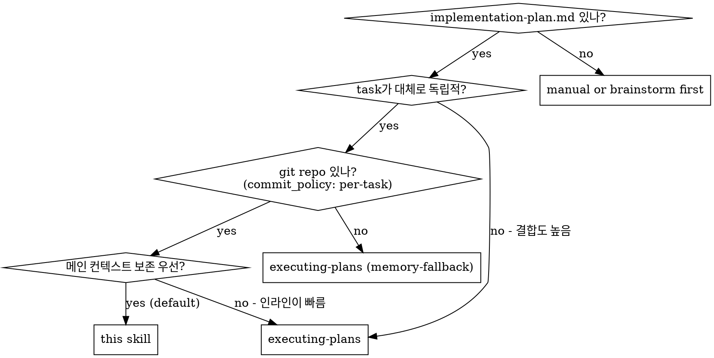

# js-super-subagent-driven-development (v1.1.14 wave-parallel)

js-super 워크플로에 최적화된 서브에이전트 경로. 1인 개발 + 사전 검증 게이트(verifying-spec) 가정. v1.1.14+ 부터 plan task 들이 file-disjoint + dependency-free 조건을 만족하는 그룹은 wave 단위 병렬 dispatch.

**Announce at start:** "I'm using the js-super-subagent-driven-development skill to execute this plan with wave-parallel subagents + main-agent governance."

## Why this shape

- **Spec reviewer 유지** — fresh-context 서브에이전트가 implementer 보고서 없이 코드를 line-by-line 대조하는 시각은 메인이 못 가짐. 메인의 `verifying-spec`은 plan ↔ 상위 산출물 정합성, 이 서브에이전트는 plan task ↔ 실제 코드 정합성 — 결이 다름.
- **별도 quality reviewer 없음** — `/design` / `/write-plan` 끝의 `verifying-spec`(코드 임팩트 분석) + bite-sized TDD(테스트 통과 baseline) + `risk-annotation` 3-checklist + 변경이력으로 대체. 1인 개발이 `finishing-a-development-branch`에서 최종 검수.
- **메인 후처리 (RISK + 변경이력 + atomic commit)** — wave 끝마다 task 순서대로 자동.
- **Wave-parallel (v1.1.14+)** — task 간 file-disjoint + deps-free 보장 시 동시 dispatch. final code reviewer 없는 js-super 의 cross-task 의존이 약한 점을 활용.

## When to Use



기본은 `executing-plans` (인라인). **메인 컨텍스트가 한계에 다다를 큰 피처(13+ task) + 진짜 독립적 task** 일 때 이 스킬이 빛을 발함.

## Mode Compatibility

이 스킬은 **항상 git-fast** 가정. 이유:
- 메인이 wave 끝에서 commit 하므로 git 필수 (v1.1.14+ implementer 가 commit 안 함)
- `commit_policy: single` / `none` 인 plan과는 호환 안 됨 → 이 경우 `executing-plans` (memory-fallback) 사용

`/execute-plan` 진입 시 mode-check (이미 `executing-plans`에 정의됨)에서 `commit_policy != per-task` 면 이 스킬은 후보에서 제외.

## Entry Guard (v1.1.14+)

이 skill 호출 시 메인은 즉시 helper 검사:

```bash
source .venv/bin/activate && python -c "
import sys
from pathlib import Path
from scripts.preflight import subagent_task_entry_check
result = subagent_task_entry_check(Path('<PLAN_PATH>'))
print(f'ok={result.ok} reason={result.reason}')
sys.exit(0 if result.ok else 1)
"
```

- exit code 0 → Plan Analysis 단계 진입
- exit code 1 → 한 줄 안내 후 즉시 종료. 예: `❌ <reason>. /write-plan 먼저 실행하세요.`

이유: helper 가 (a) plan 존재, (b) `commit_policy: per-task` 두 조건 모두 검사 — 단일 호출. plan 없는 dispatch 또는 `single`/`none` mode plan 모두 deterministic 거부.

## Plan Analysis & Wave Build (v1.1.14+, 1회)

Per-wave loop 보다 먼저 1회만 실행. 모든 task 완료까지 wave 구조는 immutable.

1. **Read plan tasks** — `<slug>-implementation-plan.md` 의 §1 단계별 작업 모든 task block.
2. **Parse files + deps** — 각 task block 의 `**Files:**` (Create/Modify/Test) 섹션 + step 본문에서 task ID 참조 추출 (예: "Task 1 의 helper 사용" → deps=[1]).
3. **Parse model hint** — task block 의 `**Model**:` 줄 (`haiku`/`sonnet`/`opus`). 없으면 `sonnet` 디폴트.
4. **Build waves** — `scripts/dag_builder.py:build_waves` 호출:

```bash
source .venv/bin/activate && python -c "
from scripts.dag_builder import Task, build_waves
tasks = [
    Task(id=1, name='Foo', files=['scripts/dag_builder.py'], deps=[], model='haiku'),
    Task(id=2, name='Bar', files=['scripts/dag_builder.py'], deps=[1], model='haiku'),
    # ...
]
waves = build_waves(tasks)
for w in waves:
    print(f'Wave {w.index}: tasks={[t.id for t in w.tasks]}')
"
```

5. **사용자 출력 (1회)**:

```
📊 DAG 분석: <N> tasks → <W> waves
  Wave 1: tasks <list> (모델: <list>)
  Wave 2: tasks <list>
  ...
```

## Model Selection

서브에이전트 dispatch 시 **task 복잡도에 맞는 가장 가벼운 모델** 을 plan 의 `**Model**:` 필드에서 읽어 주입. 명시 안 되면 `sonnet` 디폴트.

| Task 신호 | 권장 모델 |
|---|---|
| 1-2 파일 + 명확한 spec, 기계적 구현 | **haiku** |
| 다중 파일 통합 / 패턴 매칭 / 디버깅 | **sonnet** |
| 설계 판단 / 광범위 코드베이스 이해 / 리뷰 | **opus** |

**Spec reviewer 서브에이전트** 는 항상 **sonnet** 고정 (D11). implementer hint 와 무관.

dispatch 예시:
```
Task tool (general-purpose):
  model: "<plan task의 **Model**: 값, 없으면 sonnet>"
  description: "Implement Task N: ..."
  prompt: <implementer-prompt 템플릿, {{MODEL}} 치환됨>
```

## Per-wave Sequence (v1.1.14+)

For each wave (in order 1..N):

### W-1. Wave 시작 안내 (사용자 출력 1회)

```
Wave i/N 시작: task <list> 병렬 실행…
```

### W-2. Pair-parallel dispatch

For each task in this wave (in plan order), 두 dispatch 를 한 메시지에 묶어 **병렬** 실행 (Agent tool multiple calls in single message):
- Implementer (`./implementer-prompt.md`, `model: <task.model>`, 디폴트 sonnet)
- Spec reviewer 는 implementer 가 `Status: DONE` + manifest 작성 후 dispatch (`./spec-reviewer-prompt.md`, `model: "sonnet"` 고정)

페어 병렬 = wave 안 task **간** 병렬 (task A 와 task B 동시), task **안** 의 impl→review 는 직렬.

### W-3. Spec reviewer ❌ 시 implementer 재dispatch

기존 패턴 그대로. impl 재호출 → reviewer 재검 (working tree 만 갱신, commit 아직 X).

### W-4. Wave finalization (직렬, plan order)

모든 task 의 spec-reviewer ✅ 후 메인이 plan 순서대로:

```bash
# (a) post-hoc conflict detection
source .venv/bin/activate && python -c "
from pathlib import Path
from scripts.dag_builder import detect_conflicts
from scripts.changelog_buffer import read_manifest
manifests_dir = Path('.js-super/changelog-buffer/<slug>')
manifests = {}
for task_id in <wave_task_ids>:
    m = read_manifest(manifests_dir / f'task-{task_id:02d}.md')
    manifests[task_id] = [fc['path'] for fc in m['files_changed']]
conflicts = detect_conflicts(manifests)
print(conflicts)
"
```

- 비어있으면 정상 → step (b) 진행
- 충돌 발견 시: plan order 늦은 task 의 working tree 변경 stash → 다음 wave 로 이동:

```bash
git checkout -- <late_task_files>
# manifest 도 다음 wave 로 이동 (rename task-NN.md → task-NN.md.deferred)
```

```bash
# (b) For each task in plan order:
git diff HEAD -- <task.files>           # 3-checklist 입력
# 메인이 위험 평가 → RISK 주석 Edit
git add <task.files>
git commit -m "task <N>: <task.name>"
# (RISK 트리거 있으면 follow-up commit 별도)
```

### W-5. Wave 완료 요약 (사용자 출력 1회)

```
Wave i/N 완료: <pass list>✓ <fail list>✗ (후행 차단: <list 또는 없음>)
```

### W-6. Failure isolation (D7)

- spec-reviewer ❌ 가 retry loop 종료 후에도 ❌ → task 격리
- 격리 task 의 working tree 변경 `git checkout --` 으로 폐기, manifest 도 삭제
- DAG 에서 격리 task 의 후행 (deps 에 격리 task 포함) 모두 blocked 상태로 마킹
- 다음 wave 진행 시 blocked task 는 dispatch 대상에서 제외

## End-of-Run Consolidator (v1.1.7 그대로)

모든 wave 완료 후 1회 발화. per-wave manifest 들을 누적했다가 한꺼번에 정리.

### §1. 누적 buffer 디렉토리 종합

```bash
# Validate every task has a manifest
source .venv/bin/activate && python -c "
from pathlib import Path
from scripts.changelog_buffer import list_buffer_files
files = list_buffer_files(Path('.js-super/changelog-buffer/<slug>'))
print(f'Found {len(files)} manifests; expected {len(plan_tasks)}')
"
```

If counts mismatch → STOP, ask user (some task likely BLOCKED or interrupted).

### §2. "구현 요약" 메시지를 메인이 사용자에게 출력

```
✅ <slug> 모든 task 완료. 구현 요약:
- 계획서 N tasks → 실제 본 commit M개 (follow-up M' 포함)
- RISK 트리거: side-effect=X / breaking=Y / race=Z (총 N건)
- 누락: <list 또는 "없음">
- 초과: <list 또는 "없음">  ← plan에 없던 follow-up commit 의 변경 범위
- 코드 변경 0건 task: <task 번호 list>  ← [검증] entry로 별도 기록
- Blocked tasks: <list 또는 "없음">  ← failure isolation 결과
다음 단계: PR 작성 / finishing-a-development-branch
```

이 메시지가 plan ↔ 실제 코드 갭을 한 번에 노출 — 다음 단계(PR / merge) 진입의 자연스러운 게이트.

### §3. footer 1회 일괄 갱신

```bash
# Generate consolidated [코드-수정] (batch: tasks N..M) entry
source .venv/bin/activate && python -c "
from pathlib import Path
from scripts.changelog_buffer import consolidate_to_entry
print(consolidate_to_entry(
    manifests_dir=Path('.js-super/changelog-buffer/<slug>'),
    ch_id='<from change_id helper>',
    timestamp='<now>',
))
" >> .tmp-batch-entry.md
```

- Read `<slug>-implementation-plan.md` (1회)
- Edit `<slug>-implementation-plan.md` (`.tmp-batch-entry.md` 내용을 footer 끝에 append)
- 코드 변경 0건 task가 있으면 별도 `[검증]` entry도 함께 append (별도 CH-id)
- `rm .tmp-batch-entry.md`

### §4. 단일 log commit + buffer cleanup

```bash
git add <slug>-implementation-plan.md
git commit -m "[log] all tasks: <one-line summary>"
rm -rf .js-super/changelog-buffer/<slug>
```

### §5. finishing-a-development-branch invoke

- 슬림 finishing skill (v1.1.14+) — 테스트 자동 검증 + 종료 메시지. AskUserQuestion 게이트 X.

## Stale Buffer Detection (다음 세션)

세션 시작 시 (이 스킬 호출 직후, Entry Guard 직전) `.js-super/changelog-buffer/<slug>/` 잔존 검사:

```bash
source .venv/bin/activate && python -c "
from pathlib import Path
from scripts.changelog_buffer import detect_stale_buffer
stale = detect_stale_buffer(Path('.js-super/changelog-buffer'), '<slug>')
print(stale or 'no stale buffer')
"
```

발견되면 사용자에게 안내:
> "이전 세션의 미정리 buffer 발견: `.js-super/changelog-buffer/<slug>/task-{N..M}.md`. 복구해서 consolidator 1회만 실행할까요? — yes / no"

yes → End-of-Run Consolidator §1~§4 만 실행 (이전 task 본 commit은 이미 git 에 있음 → 새 task 진입 안 함).
no → 사용자가 직접 정리 또는 삭제.

## Commit History 모양 (예시, wave 모델)

```
* [log] all tasks: foo Tasks 1-5 완료
* [risk-annotate] task 4: ...        ← (Wave finalization 의 RISK follow-up)
* task 5: <wave-end commit by main>
* task 4: <wave-end commit by main>
* task 3: <wave-end commit by main>   ← Wave 2 finalization
* task 2: <wave-end commit by main>
* task 1: <wave-end commit by main>   ← Wave 1 finalization
```

→ task당 commit 1~2개 (wave-end main commit + RISK follow-up). v1.1.13 의 implementer multi-commit 패턴 사라짐. PR 단계에서 squash 권장. **history rewrite 안 함** (`amend` 사용 금지 — 안전).

## Example Workflow (Few-Shot, v1.1.14 wave 모드)

```
You: I'm using js-super-subagent-driven-development to execute this plan.

[Entry guard: foo-implementation-plan.md exists ✅, commit_policy=per-task ✅]
[Read plan: 5 tasks. Parse Files/deps/Model.]
[Build waves: 3 waves (W1=[1,2], W2=[3,4], W3=[5])]
[User output: 📊 DAG 분석: 5 tasks → 3 waves]

──────────────────────────────────────
Wave 1/3 시작: task 1, 2 병렬 실행…
──────────────────────────────────────

[Single message with 2 Agent tool calls in parallel:
  - Implementer task 1 (model: haiku)
  - Implementer task 2 (model: sonnet)]

[Both return: Status DONE + manifest written to buffer]

[Single message with 2 Agent tool calls:
  - Spec reviewer task 1 (model: sonnet)
  - Spec reviewer task 2 (model: sonnet)]

[Both return: ✅ Spec compliant]

[Wave finalization, plan order]:
  - detect_conflicts(manifests) → []  (no conflict)
  - task 1: git diff HEAD → 3-checklist → no RISK → git add + commit "task 1"
  - task 2: git diff HEAD → 3-checklist → side-effect trigger → Edit RISK comment → git add + commit "task 2" + follow-up "[risk-annotate] task 2"

[Wave 1/3 완료: 1✓ 2✓ (2/2 통과)]

──────────────────────────────────────
Wave 2/3 시작: task 3, 4 병렬 실행…
──────────────────────────────────────

[Pair-parallel dispatch...]

[Spec reviewer task 4 returns ❌: missing AC-3]
[Re-dispatch implementer task 4 with reviewer findings]
[Re-dispatch spec reviewer task 4 → ✅]

[Wave finalization → 2 commits in plan order]

[Wave 2/3 완료: 3✓ 4✓ (2/2 통과)]

──────────────────────────────────────
Wave 3/3 시작: task 5...
──────────────────────────────────────

[End-of-run consolidator (v1.1.7 그대로):]
  ✅ foo 모든 task 완료. 구현 요약: ...
  - footer 1회 batch entry append
  - [log] 단일 commit
  - buffer cleanup

[finishing-a-development-branch invoke (slim, v1.1.14)]
```

**핵심 패턴**:
1. dispatch 는 항상 **plan 의 Model 필드 주입 (없으면 sonnet)** — 부모 모델 상속 회피
2. wave 단위 pair-parallel — task **간** 병렬, task **안** impl→review 직렬
3. wave finalization 단계에서 메인이 plan order 직렬 commit (implementer 는 commit X)
4. post-hoc conflict 검출 → 충돌 시 plan order 늦은 task rollback + 다음 wave 재배치
5. footer 는 **end-of-run 1회**, task / wave 별로 안 건드림
6. 인터럽트 발생 시 buffer 디렉토리 잔존 → 다음 세션에서 stale detection 으로 재개

## Cost Comparison

| | this skill (v1.1.14) | inline (executing-plans) |
|---|---|---|
| task당 서브에이전트 호출 | **2개** (impl + spec) + 루프 | 0개 |
| 메인 컨텍스트 누적 | 중간 (+ DAG + 충돌검사 + 변경이력) | 무거움 (모든 코드) |
| Wall-clock 시간 | wave 단위 병렬 → 큰 피처에서 단축 | 직렬 |
| 거버넌스 (RISK / 변경이력) | ✅ | ✅ |

## Anti-Patterns

| Wrong | Right |
|---|---|
| Quality reviewer 흉내 (메인이 사후 quality 리뷰 추가) | 빠진 이유 있음. TDD + RISK + finishing-a-development-branch 가 대체. |
| 메인 후처리 스킵 (시간 절약 목적) | RISK / 변경이력이 누락되면 인라인과 격차 발생. 후처리는 HARD-GATE. |
| Implementer 가 commit 하도록 두기 (v1.1.13 패턴 그대로) | v1.1.14+ 메인이 wave 끝에서 commit. implementer-prompt 에 명시적 금지. |
| wave 분할 안 하고 task 그대로 직렬 dispatch | wave = 1 인 plan 만 자연스럽게 직렬. 다중 wave plan 에 직렬 강행은 D3 위배. |
| 같은 wave task 들 commit 순서 race 방치 | wave 끝 plan order 직렬 commit 강제. |
| post-hoc conflict 검출 skip | DAG 추론 오류 안전망. 매 wave finalization 첫 단계. |
| `commit_policy: single`/`none` plan 에 이 스킬 강행 | git 필수 + commit 자유 가정. 호환 안 됨. STOP. |
| RISK 주석을 implementer 프롬프트에 넣어서 시키기 | 옵션 A 의 함정 (fresh-context 일관성 약함). 메인이 한다는 게 이 스킬의 본질. |
| amend 로 history rewrite | follow-up commit 사용 (안전). amend 는 push 된 브랜치 깨뜨림. |
| Implementer 보고서 보고 spec reviewer 디스패치 안 함 | spec reviewer 는 fresh-context 로 코드 직접 본다는 게 가치. 스킵하면 빠진 이유가 사라짐. |

## Red Flags

| Thought | Reality |
|---|---|
| "spec reviewer 도 빼자, 사전 게이트가 있잖아" | 사전 게이트는 plan ↔ 상위 정합성, spec reviewer 는 plan task ↔ 코드 정합성. 다른 시각. |
| "RISK 주석 follow-up commit 도 끝에 모아 하자" | 아니. RISK 주석은 wave finalization 즉시 (코드 인접 commit). batch 대상은 변경이력 footer 갱신뿐. |
| "RISK 트리거 잡으면 implementer 한테 재시켜야 하나" | 아니. 메인이 직접 Edit. implementer 재디스패치는 비용↑. |
| "wave 분할 X 한 plan 도 그냥 직렬로 가자" | wave = 1 이면 자연스러운 직렬. 다중 wave 가능한데 강제 직렬은 가치 손실. |

## Acceptance

A wave is complete only when ALL hold:
1. 모든 task 의 implementer Status: DONE + spec reviewer ✅
2. detect_conflicts(wave manifests) == [] 이거나 충돌 task 가 deferred 처리됨
3. plan order 직렬 commit 완료 (RISK follow-up 포함)
4. 사용자에게 wave 완료 요약 출력 (✓/✗ + blocked tasks)

A task within a wave is complete only when ALL hold:
1. Implementer Status: DONE + buffer manifest written (`.js-super/changelog-buffer/<slug>/task-NN.md`)
2. Spec reviewer ✅ (재리뷰 후라도 OK)
3. Wave finalization 의 메인 후처리 완료 (3-checklist + RISK 주석 + plan-order commit)

The whole run is complete only when End-of-Run Consolidator emits the 구현 요약 message, appends consolidated entries, runs `[log] all tasks` commit, and removes the buffer directory.

## Related Skills

- `executing-plans` — 인라인 대안 (메인 컨텍스트 한계 안 갈 때 더 빠름)
- `risk-annotation` — Wave finalization §W-4 (b) 에서 사용
- `change-history` — End-of-Run Consolidator §3 에서 사용
- `finishing-a-development-branch` — 모든 task 완료 후 호출 (slim, v1.1.14+)
- `verifying-spec` — `/design`, `/write-plan` 단계에서 사전 게이트로 이미 수행됨 (이 스킬은 그 결과를 신뢰)
