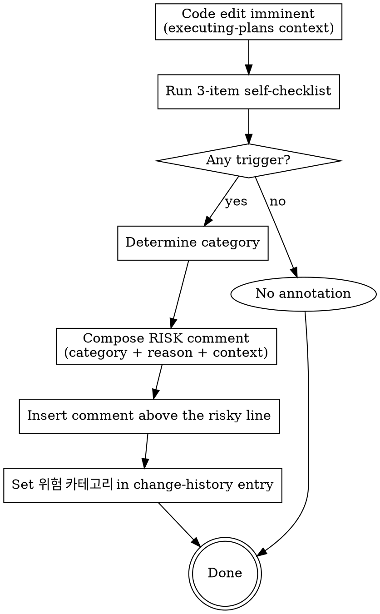

# Risk Annotation (Auto-Attach RISK Comments)

This skill is the source of truth for the three risk categories and the comment format used across the plugin. It is invoked from `executing-plans` (every code edit) and from `verifying-spec` (when surveying existing impacted code).

**Scope policy:** This checklist is intentionally narrow — it captures only "silent regression" risks (changes that quietly break adjacent flows, downstream consumers, or shared state). Performance concerns (N+1, recursion depth) and routine external I/O are NOT annotated here; they are observed via tests/profiling instead.

<HARD-GATE>
Before committing any code edit, you MUST run the 3-item self-checklist below on the changed lines AND the surrounding control flow. If any item triggers, attach a standardized RISK comment to the relevant line BEFORE the commit.
</HARD-GATE>

## Comment Format

```python
# ⚠️ RISK(<category>): <reason> — by <context>
```

Rules:
- `RISK(...)` portion is fixed (grep pattern: `RISK\(`)
- Categories are exactly one of three: `side-effect | breaking | race`
- `<reason>` is free-form Korean (or English where the codebase is English)
- `<context>` is free-form. Default = the current feature slug (e.g., `by 공지사항-개발`). The user may override.
- Once attached, NEVER edit the comment to "update" the context after the feature is done. The comment is historical record.

## Examples

```python
# 1. 복잡 분기 안의 변경
def process_order(order):
    if order.status == "pending":
        if order.amount > 100000:
            # ⚠️ RISK(side-effect): 큰 주문 분기에 결제 게이트웨이 호출 추가 — by 결제-v2
            charge_via_gateway(order)
        ...

# 2. 응답 스키마 변경
def get_user(user_id):
    user = ...
    # ⚠️ RISK(breaking): 응답에 phone 필드 추가, 클라이언트 호환성 확인 — by 회원-정보-확장
    return {"id": user.id, "name": user.name, "phone": user.phone}

# 3. 공유 상태 변경
_CACHE = {}

def set_cached(key, value):
    # ⚠️ RISK(race): 모듈 전역 dict 변경, 동시 호출 시 경합 — by 캐시-도입
    _CACHE[key] = value
```

## 3-Item Self-Checklist

Run this for every code edit. Self-check (don't ask the user). If any trigger fires, attach the RISK comment.

| # | Trigger condition | Category |
|---|---|---|
| 1 | **Complex branching / order dependency** — adding/modifying code inside multi-branch (if/else, switch), early-return, or order-sensitive flow | `side-effect` |
| 2 | **Public function signature / response schema change** — argument/return/exception types modified, REST response field added/removed/renamed | `breaking` |
| 3 | **Global / shared state mutation** — module-level variable, singleton, class variable, lock-free concurrent access | `race` |

Item 1 is the most frequent source of unintended side effects (the user's primary concern). Pay extra attention there.

**What is intentionally NOT in this checklist (and why):**
- *External I/O (DB write, network)* — usually the intended purpose of the function; annotating every I/O = noise.
- *In-loop query / N+1* — performance issue, recoverable; surface via tests/profiling.
- *Recursion* — same; performance/stack concern, not silent regression.

## Process Flow



## Existing-Code Survey (verifying-spec context)

When `verifying-spec` performs §C code impact analysis, it may discover existing code (not just newly edited) that hits the 3-checklist. In that case:

1. Grep impacted callers / functions
2. For each, run the 3-checklist
3. If a trigger fires on existing code, **propose the annotation to the user first** (do NOT silently edit existing code)
4. On approval: attach the comment + write a `[코드-수정]` change-history entry

The "propose first" rule for existing-code annotations distinguishes survey from in-flight edits — survey is reactive, in-flight edits are proactive.

## Anti-Patterns

| Wrong | Right |
|---|---|
| "This change is small, probably no risk" | Always run the 3-checklist. 0/3 means no annotation, but the check happened. |
| Skipping ambiguous category | Default to `side-effect` if truly ambiguous. Refine over time. |
| Adding a doc-link tail (`[<slug>-implementation-plan.md#CH-...]`) to the comment | The user works solo on those docs. Comment stays self-contained. Context tag only. |
| Leaking plan-side identifiers into code comments — `# KD-2: chose async`, `# AC-3 covers this`, `# FR-1 / NFR-2`, `# CH-20260505-007`, `# task 4 of <slug>-implementation-plan.md`, etc. | Code comments must be self-contained — no `(KD\|AC\|FR\|NFR)-\d+`, no `CH-\d{8}-\d{3}`, no `[<slug>-...]` doc references, no "task N of ..." plan references. The ONLY allowed jargon in code comments is the standardized `# ⚠️ RISK(...)` form. Plan/spec identifiers are useful inside `<slug>-implementation-plan.md` for navigation; they have NO place in source files. If a reviewer needs context, the variable/function names + RISK comment + git history must carry it. |
| Editing existing risk comments to "update" context | Historical record — don't edit. Add a new comment if needed. |

## Red Flags

| Thought | Reality |
|---|---|
| "Annotations clutter the code" | Grep `RISK\(` aggregates them when you need them. Worth the noise. |
| "I'll batch RISK comments after committing" | RISK comments live INSIDE the source code (inline). They must be inserted at edit time. Retrofitting after commit forces another Edit + commit cycle (cost ↑); in memory-fallback mode it also loses the before-snapshot. Either way: annotate at edit time. |
| "Item 1 (complex branching) is too vague" | If you're inside any if/else/switch/early-return when adding code — fire item 1. |

## Acceptance

After every code edit during /execute-plan:
1. The 3-checklist was run (silently, no user prompt)
2. If any trigger fired, the matching `# ⚠️ RISK(...)` comment was inserted above the relevant line
3. The change-history `[코드-수정]` entry has its `위험 카테고리` field set (or omitted if 0/3 triggered)
4. `grep -rn "RISK(" <changed file>` finds the new annotations

## Related Skills

- `executing-plans` — invokes this on every code edit
- `verifying-spec` — invokes this during §C impact survey
- `change-history` — uses the chosen category in the `위험 카테고리` field of [코드-수정] entries
