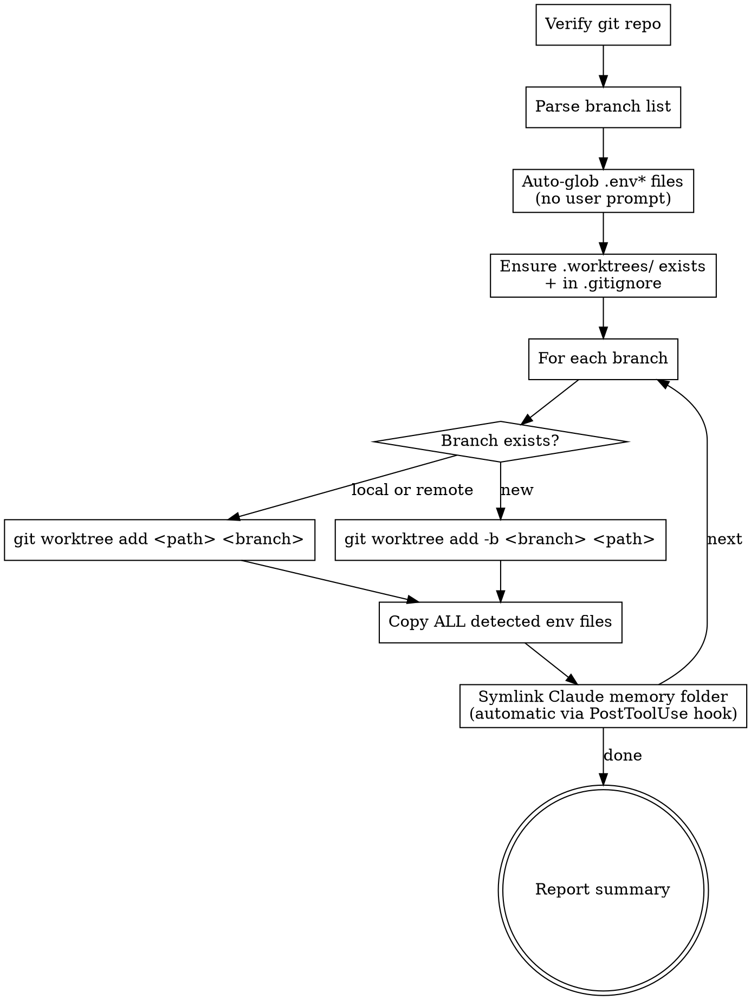

# Setting Up Worktrees (Quick Batch Creation)

User-personal workflow shortcut for spinning up multiple parallel work streams. Each worktree gets its own branch, an automatic copy of every `.env*` file in the project root (so the user can build/run servers concurrently without env-loading fights), AND a symlink to the main repo's Claude Code memory folder (so user/feedback/project memory is immediately available in the worktree's first session).

<HARD-GATE>
This skill MUST be invoked from a git repository. If the current working directory is not inside a git repo (`git rev-parse --is-inside-work-tree` returns false), abort and tell the user to run `git init` first or switch to the target project.
</HARD-GATE>

<HARD-GATE>
NEVER ask the user which env files to copy. ALWAYS auto-glob `.env*` in the project root and copy every match. The user only specifies branch names — env-file selection is automatic. The single exception: if the user EXPLICITLY says "X 파일은 복사하지 마" (exclude pattern), honor that.
</HARD-GATE>

## Trigger Examples

- 단수: `/worktree feature-a`
- 복수: `/worktree feature-a feature-b feature-c`
- 자연어: "워크트리 3개 만들어줘. 브랜치는 feature-a, feature-b, feature-c."

> 사용자가 실제 티켓명(예: `TICKET-123-기능명`)으로 호출하면 그대로 브랜치명에 사용한다. 위 `feature-a` 등은 placeholder.

## Defaults (No User Prompt)

| Knob | Default behavior |
|---|---|
| Worktree root | `<project-root>/.worktrees/` (override only if user explicitly asks) |
| Branch creation | If branch missing → `-b <name>` from current HEAD. Existing local → use as-is. Remote-only → `-B <name> origin/<name>` |
| Env files copied | **Auto-glob `.env*` (excludes `.env.example`, `.env.sample`)**. ALL matches copied to every worktree. |
| Claude memory folder | **Symlink handled by `worktree-memory-symlink` PostToolUse hook** — fires automatically on `git worktree add`. Skips if main has no memory yet or if worktree's memory dir already exists. The skill body does NOT perform this step. |
| `.worktrees/` in `.gitignore` | Auto-add if missing |

## Process



## Procedure (Step-by-Step)

**Step 0 — Verify git context**

```bash
git rev-parse --is-inside-work-tree   # must print "true"
ROOT=$(git rev-parse --show-toplevel)
```

If not in a repo, abort with: "현재 디렉터리가 git repo 아닙니다. `git init` 후 다시 호출해주세요."

**Step 1 — Parse branch names from user's message**

Extract `BRANCHES=(...)` from the user's message. Korean ticket-style names like `<TICKET>-<번호>-<설명>` are fine (UTF-8 OK). Do NOT ask about env files — those are auto-detected.

**Step 2 — Auto-detect `.env*` files (NO user prompt)**

```bash
ENV_FILES=()
for f in "$ROOT"/.env*; do
    [ -f "$f" ] || continue
    name=$(basename "$f")
    # Skip templates (committed examples) — they're already in the worktree via git checkout
    case "$name" in
        .env.example|.env.sample|.env.template) continue ;;
    esac
    ENV_FILES+=("$name")
done
```

If `ENV_FILES` is empty after this, log a notice ("ℹ️ 프로젝트 루트에 .env* 파일 없음 — env 복사 skip") and proceed without copying. Don't abort.

**Step 3 — Ensure `.worktrees/` exists and is gitignored**

```bash
mkdir -p "$ROOT/.worktrees"

if ! grep -qE '^\.worktrees/?$' "$ROOT/.gitignore" 2>/dev/null; then
    echo ".worktrees/" >> "$ROOT/.gitignore"
fi
```

**Step 4 — For each branch, create or attach the worktree**

```bash
for BR in "${BRANCHES[@]}"; do
    WT_PATH="$ROOT/.worktrees/$BR"

    # Already a worktree? Skip with notice
    if [ -d "$WT_PATH" ]; then
        echo "⏭️  $BR — 이미 존재 ($WT_PATH), 건너뜀"
        continue
    fi

    # Branch exists locally?
    if git show-ref --verify --quiet "refs/heads/$BR"; then
        git worktree add "$WT_PATH" "$BR"
    # Exists on remote?
    elif git show-ref --verify --quiet "refs/remotes/origin/$BR"; then
        git worktree add -B "$BR" "$WT_PATH" "origin/$BR"
    # Brand new
    else
        git worktree add -b "$BR" "$WT_PATH"
    fi
done
```

**Step 5 — Copy ALL detected env files into each worktree (no prompts)**

```bash
for BR in "${BRANCHES[@]}"; do
    WT_PATH="$ROOT/.worktrees/$BR"
    [ -d "$WT_PATH" ] || continue   # was skipped earlier
    for EF in "${ENV_FILES[@]}"; do
        cp "$ROOT/$EF" "$WT_PATH/$EF"
        echo "📋 $BR ← $EF 복사 완료"
    done
done
```

**Step 5.5 — Memory symlink (handled automatically by hook)**

Memory-folder symlinking is performed by the `worktree-memory-symlink` PostToolUse hook (see `hooks/hooks.json` + `hooks/worktree-memory-symlink`). It fires automatically whenever any `git worktree add ...` command runs through the Bash tool, parses the worktree path from the command, and invokes `scripts/setup-memory-symlinks.sh`. **Do nothing here.** No mkdir, no ln, no sed — the hook owns this concern entirely. The script's output (e.g. `🔗 <branch> ← Claude 메모리 폴더 심링크 ...`) appears as hook stderr in your tool output and should be forwarded to the user as part of the Step 6 summary if visible.

Behavior summary:
- Main memory dir missing → skip with notice (first-run user, nothing to share yet).
- Worktree memory dir already exists → skip without clobbering (user already ran a session in that path).
- Otherwise → symlink. New memories saved in either side are visible from both.

⚠️ Cleanup note: when the user later removes a worktree, `git worktree remove` will not touch the symlink (lives outside the worktree dir) — no risk to main memory. But `rm -rf <worktree-path>` is also safe because the memory symlink is OUTSIDE the worktree directory (`~/.claude/projects/...`), not inside it. The only thing to watch is users manually `rm -rf $HOME/.claude/projects/<wt-encoded>/memory` — that would delete the LINK, not the target, so still safe; whereas `rm -rf $HOME/.claude/projects/<wt-encoded>/memory/` (with trailing slash on some shells) could traverse into the linked main memory. Add a tiny note in the report so the user knows.

**Step 6 — Report summary**

Print a Korean-friendly summary listing each worktree path + the env files copied:

```
✅ 워크트리 생성 완료 (n개)
감지된 .env* 파일: .env, .env.local, .env.production (3개)
Claude 메모리 폴더: 메인 → 워크트리 심링크 (n개)

- feature-a   → .worktrees/feature-a   (.env ✓ .env.local ✓ .env.production ✓ | 🔗 memory)
- feature-b   → .worktrees/feature-b   (.env ✓ .env.local ✓ .env.production ✓ | 🔗 memory)
- feature-c   → .worktrees/feature-c   (.env ✓ .env.local ✓ .env.production ✓ | 🔗 memory)

각 워크트리에서 바로 빌드·서버 실행 가능합니다.
워크트리 첫 세션부터 메인 레포의 Claude 메모리(user/feedback/project) 즉시 활용됩니다.
정리: `git worktree remove <path>` — 메모리 심링크는 워크트리 디렉터리 밖이라 메인 메모리에 영향 없음.
```

## Anti-Patterns

| Wrong | Right |
|---|---|
| Asking the user "which env files to copy?" | Forbidden by HARD-GATE. Auto-glob `.env*` and copy all (except templates). |
| Skipping env copy because user didn't mention it | Always copy all detected `.env*`. The point is build-ready worktrees. |
| Force-create when worktree path already exists | Detect + skip with notice. Don't clobber user's WIP. |
| Skip `.gitignore` update | Always add `.worktrees/` (idempotent check). |
| Use `git checkout -b` first then `worktree add` | Prefer `worktree add -b <branch> <path>` (atomic). |
| Copy `.env.example` (template, already in git) | Excluded from glob. |
| Performing the memory symlink yourself in this skill | Forbidden — handled by `worktree-memory-symlink` PostToolUse hook. The agent must not run any path-mutating shell command (directory creation, symlink, or string substitution) against the Claude memory location. Past versions failed because agents mentally simulated the encoding rule and produced folder names Claude Code never reads. |
| Clobber worktree's existing memory dir with a symlink | Forbidden. If `$WT_MEMORY` already exists, skip and tell user to migrate manually. |
| Skip the symlink because "user didn't ask for it" | Always attempt. The whole point is zero-friction worktree start. Only skip when main memory missing or WT memory already there. |

## Red Flags

| Thought | Reality |
|---|---|
| "Branch name has Korean — might break" | git handles UTF-8 branch names fine. Don't sanitize unless user asks. |
| "Should I confirm which env files?" | NO. HARD-GATE forbids it. Auto-glob always. |
| ".gitignore is annoying to update" | Idempotent: only append if not already there. One-time cost. |
| "User has secrets in .env, scary to copy automatically" | Files are already on disk; copying within the same machine doesn't expand exposure. The .worktrees/ folder is gitignored. |

## Cleanup (separate operation)

If the user later asks to remove a worktree:

```bash
git worktree remove "$ROOT/.worktrees/<branch>"
git branch -d <branch>   # only if no longer needed
```

This skill does NOT auto-remove. Removal is destructive and must be explicit.

## Acceptance

After running this skill:
1. Each requested branch has a worktree at `<root>/.worktrees/<branch>/`
2. Every `.env*` file from the project root (except `.env.example`/`.env.sample`/`.env.template`) is copied into each worktree
3. `.worktrees/` is in `.gitignore`
4. `git worktree list` shows all created worktrees
5. The `worktree-memory-symlink` PostToolUse hook fired for every `git worktree add` invocation issued by this skill. (The skill itself did NOT mkdir / ln any memory paths.)
6. User got a summary report listing each worktree's path + per-file copy status + memory symlink status (the latter coming from the hook's stderr output).
7. The user was NOT asked which env files to copy, NOR about the memory symlink.

## Related Skills

- `using-git-worktrees` (upstream, broader) — general guidance on worktree workflows
- `executing-plans` — often run inside a freshly-created worktree
