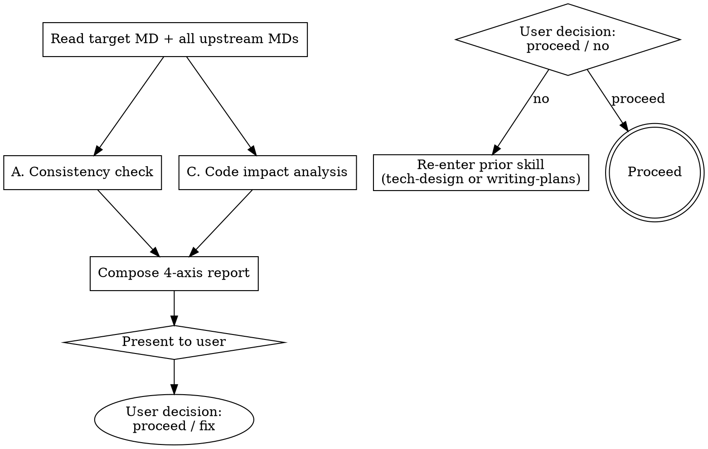

# Verifying Spec (Main-Agent Verification Gate)

This is the verification gate after upstream superpowers' self-review. The user explicitly required main-agent verification (NOT a subagent) for context preservation, transparency, and accuracy.

<HARD-GATE>
You (main agent) execute this directly. NEVER dispatch a code-reviewer subagent for this skill — the user explicitly requires main-agent verification for context preservation.
EXCEPTION: If code impact analysis requires extensive grep across many files (≥10), you MAY dispatch ONE Explore subagent for read-only impact survey, then synthesize the report yourself.
</HARD-GATE>

## When to Invoke

| Phase | Target MD | Upstream MDs |
|---|---|---|
| End of `tech-design` | <slug>-tech-design.md | [<slug>-requirements.md] |
| End of `writing-plans` | <slug>-implementation-plan.md | [<slug>-requirements.md, <slug>-tech-design.md] |

<slug>-requirements.md is the source of truth and is therefore not a verification target.

## Procedure



## A. Consistency Check

Verify every upstream item is reflected in the target. Two failure modes:
- **누락 (gap)**: an upstream FR/decision that does not appear downstream
- **모순 (conflict)**: an upstream constraint contradicted downstream

### Checklist

When target = `<slug>-tech-design.md`:
- Every FR-N from <slug>-requirements.md is mapped to <slug>-tech-design.md §2 (impacted components) or §4 (external interfaces)
- Every NFR is addressed in <slug>-tech-design.md §6 (risks) or §7 (test strategy)
- <slug>-tech-design.md does not contradict <slug>-requirements.md (e.g., out-of-scope items are not added back)

When target = `<slug>-implementation-plan.md`:
- Every key decision in <slug>-tech-design.md §5 maps to at least one task in <slug>-implementation-plan.md §1
- Every risk category from <slug>-tech-design.md §6 has at least one entry in <slug>-implementation-plan.md §2 위험 코드 지점
- Every FR is implementable through the listed tasks (trace FR → decision → task chain)

## C. Code Impact Analysis

For files/functions/endpoints named in the target MD:

1. **File existence** — Read/Glob to confirm the file exists or is explicitly created in a task
2. **Caller mapping** — Grep the function/symbol name to count usage sites
3. **Side-effect candidates** — Apply the risk-annotation 3-checklist (complex branching, public signature/schema changes, shared state) to each touched function
4. **Test coverage** — Check whether the touched files have tests (Glob `test_*.py` or `*.test.*` adjacent or under `tests/`)

When grep results span ≥10 files, optionally dispatch ONE read-only Explore subagent for the impact survey only, then synthesize the report yourself.

## Report Format

Output to the conversation in this exact structure:

```
🔍 verifying-spec 보고서 — 대상: <target>.md (upstream: <list>)

## A. Consistency
✅ Mapped: <count> items (e.g., FR-1, FR-2, FR-3 → §2/§4)
⚠️ Gaps: <count>
   - <upstream item ID> "<title>" → not found in <target> §<section>
❌ Conflicts: <count>
   - <upstream item> says X, <target> says Y

## C. Code Impact
- Impacted files: <list> (<count>)
- Callers: <function> referenced in <count> places (<list>)
- Risk candidates: <category-counts> (e.g., side-effect: 2, breaking: 1)
- Test coverage: <existing test files / coverage gaps>

## 권장 (recommendation)
- <gap or conflict> → suggest <action>
- <risk candidate> → suggest <mitigation or §6 augmentation>

진행 / 수정 중 선택해주세요.
```

The `진행 / 수정` line is in Korean because the user chooses verbally.

## Anti-Patterns

| Wrong | Right |
|---|---|
| "Looks good, proceed" without a structured report | Always emit the 4-axis report. |
| Reporting only gaps | Cover all 4 axes: gaps + conflicts + impact + test coverage. |
| Dispatching a code-reviewer subagent | Forbidden by HARD-GATE. Main agent only. |
| Skipping when "obviously fine" | Run anyway. Obvious has gaps too. |

## Red Flags

| Thought | Reality |
|---|---|
| "Skip the gate, the spec is short" | Short specs miss things just like long ones. Run it. |
| "I'll just trust self-review" | Self-review is a different axis. The gate is additive. |
| "User won't read a long report" | Make it scannable, but emit it. |

## Acceptance

A verification run is complete when ALL hold:
1. Report includes all 4 axes (consistency-gaps, consistency-conflicts, impact-files+callers+risks, test-coverage)
2. Counts are concrete (not "some" or "a few")
3. The closing prompt offers `진행 / 수정` choices to the user

## Related Skills

- `tech-design` — invokes this on save
- `writing-plans` — invokes this on save
- `risk-annotation` — supplies the 3-checklist used in §C
- `change-history` — captures the verification outcome in the next entry's 영향범위 field
