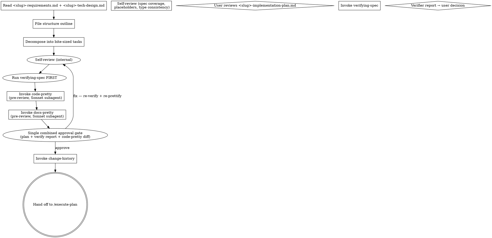

# Writing Plans → <slug>-implementation-plan.md

Take <slug>-requirements.md + <slug>-tech-design.md as inputs and produce a comprehensive implementation plan (`<slug>-implementation-plan.md`) decomposed into bite-sized TDD tasks. The upstream superpowers patterns (exact file paths, complete code in every step, TDD cycle, no placeholders, frequent commits) are inherited as-is. js-superpowers extends them with: change-history footer, structured "위험 코드 지점" section, and a verification gate after save.

<HARD-GATE>
Both <slug>-requirements.md and <slug>-tech-design.md must exist in the current feature folder. If either is missing, instruct the user to run /brainstorm or /design first.
</HARD-GATE>

## Checklist

You MUST create a TaskCreate task for each of these items and complete them in order:

1. **Verify inputs** — confirm both <slug>-requirements.md and <slug>-tech-design.md exist (HARD-GATE if either missing)
2. **Outline file structure** — which files are created/modified, with single-responsibility boundaries
3. **Decompose into bite-sized tasks** — each task = one TDD cycle (test → fail → impl → pass → commit), 2-5 minutes per step
4. **Fill 위험 코드 지점 (§2)** — every risk category from <slug>-tech-design.md §6 mapped to a concrete location + mitigation
5. **Self-review** — spec coverage / placeholder scan / type consistency / 위험 coverage
6. **Invoke verifying-spec** (with Tolerance for missing skill) — main agent runs A+C verification on the plan
7. **Invoke code-pretty skill** — pre-review code-block prettify on the draft (Sonnet subagent). Runs AFTER verifying-spec passes and BEFORE docs-pretty. Targets only `**수정 후**`-labeled code blocks. Stops once first change-history entry is logged.
8. **Invoke docs-pretty skill** — pre-review format pass on the draft (Sonnet subagent). Runs immediately after code-pretty and BEFORE showing the plan to the user. Re-fires together with code-pretty after each revision iteration (per-draft-state).
9. **User reviews <slug>-implementation-plan.md** — show the prettified plan + verifying-spec report + code-pretty diff summary; get approval (loop until OK; on changes → revise → back to step 6 verifying-spec)
10. **Invoke change-history skill** — append first `[구현계획서-수정]` entry
11. **Hand off to /execute-plan** — count tasks first, then offer the choice using the Execution Handoff message below. Upstream `subagent-driven-development` is NOT offered here; only invoke it if the user explicitly asks for the upstream original.

If you find yourself skipping ahead, stop and create the missing task.

## Inputs

- `docs/features/<date>-<slug>/<slug>-requirements.md`
- `docs/features/<date>-<slug>/<slug>-tech-design.md`

## Output

`docs/features/<date>-<slug>/<slug>-implementation-plan.md`

## Schema (<slug>-implementation-plan.md)

```markdown
---
commit_policy: per-task
---

# 구현계획서: <feature-name>

## 1. 단계별 작업
   ### Task 1: <Component>
   **Files:** Create/Modify/Test
   - [ ] Step 1: <action>
   - [ ] Step 2: <action>
   ...
## 2. 위험 코드 지점
   - <file:line>: <category> | <mitigation>
## 3. 롤백 전략

---
## 변경이력
```

### Frontmatter — `commit_policy` field

This field tells `/execute-plan` how to commit work between tasks. It is the **single source of truth** for commit policy; do NOT scatter "no commits" or "single commit" instructions in prose.

| Value | Meaning | executing-plans mode |
|---|---|---|
| `per-task` (**default**) | One atomic commit per task (code + plan log together) | git-fast (if git repo present) |
| `single` | All tasks accumulated into ONE commit at the very end of `/execute-plan` | memory-fallback |
| `none` | No commits during `/execute-plan` (user commits manually after) | memory-fallback |

If the field is omitted, `/execute-plan` assumes `per-task`.

If the user explicitly requests `single` or `none` during planning, set the field accordingly and warn them once: "이 모드에서는 변경이력의 변경 전 코드를 in-memory로 보관해야 해서 토큰 비용이 큽니다. 가능하면 per-task를 권장합니다."

## Bite-Sized Task Granularity (inherited from upstream)

Each step is one action (2-5 minutes):
- "Write the failing test" — step
- "Run it to make sure it fails" — step
- "Implement the minimal code to make the test pass" — step
- "Run the tests and make sure they pass" — step
- "Commit" — step (skip if git is not initialized)

## Plan Document Header (REQUIRED)

Every implementation plan MUST start with:

```markdown
# <Feature Name> 구현계획서

> **For agentic workers:** REQUIRED SUB-SKILL: Use `subagent-driven-development` (recommended) or `executing-plans` to implement this plan task-by-task. Steps use checkbox (`- [ ]`) syntax for tracking.

**Goal:** <one sentence>

**Architecture:** <2-3 sentences from <slug>-tech-design.md §1>

**Tech Stack:** <key technologies>

**Spec inputs:**
- <slug>-requirements.md — <key FRs touched>
- <slug>-tech-design.md — <key decisions/architecture>

---
```

## Task Structure (inherited)

````markdown
### Task N: <Component Name>

**Files:**
- Create: `exact/path/to/file.py`
- Modify: `exact/path/to/existing.py:123-145`
- Test: `tests/exact/path/to/test.py`

- [ ] **Step 1: Write the failing test**

```python
def test_specific_behavior():
    result = function(input)
    assert result == expected
```

- [ ] **Step 2: Run test to verify it fails**

Run: `pytest tests/path/test.py::test_name -v`
Expected: FAIL with "function not defined"

- [ ] **Step 3: Write minimal implementation**

```python
def function(input):
    return expected
```

- [ ] **Step 4: Run test to verify it passes**

Run: `pytest tests/path/test.py::test_name -v`
Expected: PASS

- [ ] **Step 5: Commit (skip if no git)**

```bash
git add tests/path/test.py src/path/file.py
git commit -m "feat: add specific feature"
```
````

## Code Block Convention (Before/After labels) — required for tasks that modify existing code

When a task changes existing code (Modify), use the **Before/After label pair**:

````markdown
**원본** (`<file>:<line-range>`):
```<lang>
<original code, byte-equal to current source>
```

**수정 후**:
```<lang>
<new code>
```
````

Rules:

1. The "원본" label MUST start with exactly `**원본**` (markdown bold). The optional `(file:line)` annotation is strongly recommended for navigation.
2. The "수정 후" label MUST start with exactly `**수정 후**` (markdown bold).
3. For tasks that CREATE a new file, the "원본" block is OMITTED — only "수정 후" block is shown (with `(new file: <path>)` annotation).
4. Both blocks MUST use the same fenced-code language identifier.
5. The `code-pretty` skill targets ONLY "수정 후" blocks. "원본" blocks are byte-immutable.

This convention is required so that:
- Reviewers can compare before/after at a glance.
- The `code-pretty` skill can identify which blocks to prettify (수정 후) and which to leave untouched (원본).

Anti-pattern: showing only the modified code without the original. Reviewers cannot tell what changed.

## Process Flow



## File Structure

Before defining tasks, map out which files will be created or modified and what each one is responsible for. This is where decomposition decisions get locked in.

- Design units with clear boundaries and well-defined interfaces. Each file should have one clear responsibility.
- Smaller, focused files beat large files that do too much.
- Files that change together should live together. Split by responsibility, not by technical layer.
- In existing codebases, follow established patterns. Don't restructure unless an unwieldy file actively blocks the work.

## §2 위험 코드 지점

After tasks are written, fill `## 2. 위험 코드 지점` with concrete entries:

```markdown
## 2. 위험 코드 지점

- `src/wallet/service.py:42-58` — side-effect: 잔액이 -로 갈 수 있음 (mitigation: amount 검증 + 트랜잭션)
- `src/api/wallet_routes.py:withdraw` — breaking: 응답 스키마에 transaction_id 추가 (mitigation: 클라이언트 호환성 확인)
```

Categories MUST come from risk-annotation taxonomy: `side-effect | breaking | race`. Each entry pairs a location with a mitigation strategy.

## §3 롤백 전략

```markdown
## 3. 롤백 전략

- Code: revert commits SHA-A..SHA-B (or stash + reset)
- DB: migration <name> has down(), run `alembic downgrade -1`
- Config: feature flag `wallet.withdraw.v2` defaults off
```

## No Placeholders (inherited)

Every step must contain the actual content an engineer needs. These are **plan failures** — never write them:
- "TBD", "TODO", "implement later", "fill in details"
- "Add appropriate error handling" / "add validation" / "handle edge cases"
- "Write tests for the above" (without actual test code)
- "Similar to Task N" (repeat the code — the engineer may be reading tasks out of order)
- Steps that describe what to do without showing how
- References to types, functions, or methods not defined in any task

## Remember

- **Exact file paths always** — `src/wallet/service.py:42-58`, never "the wallet service"
- **Complete code in every step** — if a step changes code, show the code in a code block
- **Exact commands with expected output** — never "run the tests" without the command + expected outcome
- **DRY, YAGNI, TDD, frequent commits** — these aren't slogans, they're rules

## Self-Review

After writing the complete plan, look at it with fresh eyes:

1. **Spec coverage**: Skim each FR and key decision in <slug>-requirements.md and <slug>-tech-design.md. Can you point to a task that implements it? List any gaps.
2. **Placeholder scan**: Search for any of the patterns from "No Placeholders" above. Fix them.
3. **Type consistency**: Function names, signatures, and property names must match across tasks (e.g., `clearLayers()` in Task 3 vs `clearFullLayers()` in Task 7 is a bug).
4. **위험 코드 지점 coverage**: Every category in <slug>-tech-design.md §6 has at least one corresponding entry in §2.

If you find issues, fix them inline. If you find a spec requirement with no task, add the task.

## Anti-Patterns

| Wrong | Right |
|---|---|
| Steps that say "implement X" without code | Show the actual code in a code block. |
| TODO / TBD / "later" markers | Forbidden. Resolve before saving. |
| Tasks bigger than ~30 minutes | Decompose further. Each TDD cycle should fit one Task. |
| Skipping §2 위험 코드 지점 | Required. Every risk category from <slug>-tech-design.md §6 must appear here. |

## Red Flags

| Thought | Reality |
|---|---|
| "The engineer can figure out the details" | They can't, and shouldn't have to. Spell it out. |
| "Skip TDD for trivial tasks" | TDD is the discipline that catches the surprises. Keep the cycle. |
| "Plan is too long" | Length is fine if every step is concrete. Vague brevity is worse. |

## After Save — single approval gate, then execution-mode choice

This summarizes the corrected order (matches Checklist + Process Flow above):

1. **Run verifying-spec FIRST** (before any user prompt):
   - Target: `<slug>-implementation-plan.md`
   - Upstream: `[<slug>-requirements.md, <slug>-tech-design.md]`
   - Procedure: consistency (FR + key decisions covered as tasks) + code impact (files/functions referenced exist or are explicitly created)
   - **Tolerance**: if verifying-spec skill is not installed, skip and emit the notice ("ℹ️ verify-gate 미설치, Phase 2 이후 활성화 — 검증 없이 진행")

2. **Run code-pretty** (after verifying-spec passes, before docs-pretty):
   - Target: `<slug>-implementation-plan.md` (only `**수정 후**`-labeled blocks)
   - Output: diff summary text (preserved for the approval gate)
   - **Tolerance**: if code-pretty skill is not installed, skip and emit "ℹ️ code-pretty 미설치 — code blocks shown as-is"

3. **Run docs-pretty** (immediately after code-pretty):
   - Standard format-only pass (Sonnet subagent)

4. **Single combined approval gate** — present in ONE message:
   - The full PRETTIFIED `<slug>-implementation-plan.md` (or summary if very long, with link)
   - The verify-spec 4-axis report
   - The code-pretty diff summary
   - **Gate #13 — plan + verify 결합 승인**

     **Tool form (preferred)**

     Call `AskUserQuestion`:

     ```json
     {
       "question": "<slug>-implementation-plan.md (+ verify-spec 보고서) 승인하고 진행?",
       "context": "plan + 4축 보고서 한 메시지로 노출됨",
       "choices": [
         {"value": "yes", "label": "예 — 승인하고 change-history + 실행 모드 선택"},
         {"value": "fix", "label": "수정 필요 — 메인이 follow-up 으로 어느 task/섹션 수정할지 묻기"}
       ]
     }
     ```

     **Prose fallback**

     > Approve `<slug>-implementation-plan.md` and proceed? — `yes` / `fix`
   - DO NOT split into "approve plan" → "approve verify report". One gate, one decision.
   - On `fix` → 메인이 "어느 task/section 수정?" follow-up → 해당 task 재분해 후 step 1 (verifying-spec) 부터 재실행 (code-pretty + docs-pretty per-draft-state 자동 재발화).

5. On `yes` → invoke change-history (`[구현계획서-수정]` entry) → continue to Execution Handoff below.
   On `fix` → 메인이 "어느 task/section 수정?" follow-up → 해당 task 재분해 후 step 1 (verifying-spec) 부터 재실행.

## Execution Handoff

After verification passes and the entry is logged, count plan tasks and offer execution choice:

**Gate #14 — 실행 모드 선택**

**Tool form (preferred)**

Call `AskUserQuestion`:

```json
{
  "question": "Plan에 <N>개 task. 어느 실행 방식?",
  "context": "Inline = ≤12 tasks recommended; Subagent = 13+ tasks recommended",
  "choices": [
    {"value": "Inline", "label": "인라인 — 메인 에이전트가 executing-plans 로 직접 실행 (≤12 task 권장)"},
    {"value": "Subagent", "label": "서브에이전트 — implementer + spec reviewer 디스패치 (13+ task 권장)"}
  ]
}
```

**Prose fallback**

> "Plan complete and saved to `docs/features/<date>-<slug>/<slug>-implementation-plan.md`. Two execution options:
>
> 1. **Inline** (recommended for medium plans, ≤ 12 tasks) — main agent edits directly via `executing-plans`; fast, fewer total tokens; main context accumulates with task count
> 2. **Subagent** (recommended for large plans, 13+ tasks) — implementer + spec reviewer subagents via `js-super-subagent-driven-development`; preserves main context; adds dispatch cost
>
> Plan has <N> tasks. Which approach?"

If Inline chosen → REQUIRED SUB-SKILL: `executing-plans`
If Subagent chosen → REQUIRED SUB-SKILL: `js-super-subagent-driven-development`

The upstream `subagent-driven-development` is NOT offered in this handoff. Invoke it only when the user explicitly requests the upstream original.

## Related Skills

- `brainstorming` — upstream input (<slug>-requirements.md)
- `designing-direction` — upstream input (<slug>-tech-design.md)
- `verifying-spec` — verification gate (active from Phase 2)
- `change-history` — entry recording on save
- `executing-plans` / `subagent-driven-development` — downstream execution
- `risk-annotation` — taxonomy used in §2 위험 코드 지점
