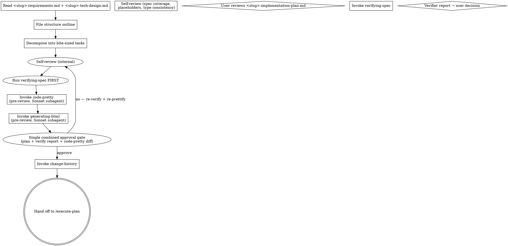

# Writing Plans → <slug>-implementation-plan.md

## 사용자 질문 룰 (v2.0.3+) — 항상 AskUserQuestion

이 skill 흐름 안에서 사용자에게 질문할 일이 생기면 **반드시** `AskUserQuestion`
도구로 호출한다. 산문으로 "~ 할까요?" 한 줄 던지지 마라.

### Why

Notification 훅 (`elicitation_dialog` 매처) 이 알람을 발화하려면 도구 호출이
실제로 일어나야 함. 산문 질문은 훅이 못 잡아서 사용자가 놓침 (v1.1.8 신고 재발).

### How to apply

- clarifying / Socratic / 모호점 확인 / 게이트 / 모드 선택 — 모두 포함
- 단답 yes/no 도 prose X → `AskUserQuestion` choices `[yes, no]` 사용
- 다중 선택은 enum choices 또는 multi-question batching (의미 결합 시 max 4 questions[])
- **Socratic 자유 응답**: AskUserQuestion 의 question 본문에 "자유롭게 답해주세요. 별도 옵션 선택 불필요" + dummy choice `[알겠음]` 1개 → 트리거만 발화, 응답은 다음 turn prose
- **예외**: 본문 자체의 알람-friendly 안내문 (`ℹ️ Auto-proceeding ...`) 는 질문 아니라 안내 — 도구 호출 불필요

### Other / 모호 응답 처리 (v2.1.1+)

사용자가 "Other" 자유 응답 또는 "모르겠음 / 이해 안 됨" 류 답변 catch 시 → **그 질문만 단독 재호출 + prose 설명 추가**. 다음 단계 자동 진행 X (anchor 질문 강제 X 룰은 명확 yes/no 답변에만 적용).

Take <slug>-requirements.md + <slug>-tech-design.md as inputs and produce a comprehensive implementation plan (`<slug>-implementation-plan.md`) decomposed into bite-sized TDD tasks. The upstream superpowers patterns (exact file paths, complete code in every step, TDD cycle, no placeholders, frequent commits) are inherited as-is. js-superpowers extends them with: change-history footer, structured "위험 코드 지점" section, and a verification gate after save.

<HARD-GATE>
Both <slug>-requirements.md and <slug>-tech-design.md must exist in the current feature folder. If either is missing, instruct the user to run /brainstorm or /tech-design first.
</HARD-GATE>

### 예외 — `--no-ask` 플래그 (v2.5+)

사용자가 슬래시 명령에 `--no-ask` 토큰을 **명시** 한 경우에만 진입. 메인 자체 판단으로 활성화 X.

- 모든 사용자 질문을 prose (메인 turn 자유 텍스트) 로 처리
- `AskUserQuestion` 도구 호출 **0 보장**
- 게이트 자체는 살아 있음 — 사용자 prose 응답 기다림
- 알람 fire X (사용자가 명시 invoke 했으니 인지 가정)

#### skill 진입 시 1회 boilerplate

skill 진입 직후 다음 한 줄을 prose 로 출력:

> ℹ️ `--no-ask` 모드 진입 — AskUserQuestion 도구 호출 X, 응답 알람 X. 백그라운드 작업 중이면 응답 시점을 직접 체크해주세요.

#### 위험 명령 진입 직전 보강

critical 7 케이스 (파일 삭제 / `git push --force` / DB migration / mass commit / 외부 메시지 등) 실행 직전에는 다음 한 줄을 prose 로 출력:

> ⚠️ 위험 명령 진입 — 응답 기다림. 백그라운드 작업 중이면 직접 catch 해주세요.

`⚠️` 마커 + 별도 줄로 일반 prose 보다 두드러지게.

## Checklist

You MUST create a TaskCreate task for each of these items and complete them in order:

1. **입력 확인** — confirm both <slug>-requirements.md and <slug>-tech-design.md exist (HARD-GATE if either missing)
2. **파일 구조 윤곽 잡기** — which files are created/modified, with single-responsibility boundaries
3. **구현계획서 task 목록 작성** — each task = one TDD cycle (test → fail → impl → pass → commit), 2-5 minutes per step
4. **위험 코드 지점 (§2) 채우기** — every risk category from <slug>-tech-design.md §6 mapped to a concrete location + mitigation
5. **자체 점검** — spec coverage / placeholder scan / type consistency / 위험 coverage
6. **사양 정합성 검증** — main agent runs A+C verification on the plan via `verifying-spec` (Tolerance for missing skill)
7. **코드 블록 포맷 정리** — pre-review code-block prettify on the draft via `code-pretty` skill (Sonnet subagent). Runs AFTER verifying-spec passes and BEFORE generating-html. Targets only `**수정 후**`-labeled code blocks. Stops once first change-history entry is logged.
8. **문서 포맷 정리 (사용자 리뷰 전)** — pre-review format pass on the draft via `generating-html` skill (Sonnet subagent). Runs immediately after code-pretty and BEFORE showing the plan to the user. Re-fires together with code-pretty after each revision iteration (per-draft-state).
9. **사용자 검토 (구현계획서)** — show the prettified plan + verifying-spec report + code-pretty diff summary; get approval (loop until OK; on changes → revise → back to step 6 verifying-spec)
10. **변경이력 기록** — append first `[구현계획서-수정]` entry via `change-history` skill
11. **구현 단계 핸드오프** — count tasks first, then offer the choice using the Execution Handoff message below (`executing-plans` or `js-super-sub-driven`). Upstream `subagent-driven-development` is NOT offered here; only invoke it if the user explicitly asks for the upstream original.

If you find yourself skipping ahead, stop and create the missing task.

**Before invoking the next skill via Skill tool, mark ALL checklist TaskCreate items as completed (in_progress → completed). The Skill tool transition does NOT auto-complete prior tasks. (v1.1.15+, FR-2)**

## Inputs

- `docs/features/<date>-<slug>/<slug>-requirements.md`
- `docs/features/<date>-<slug>/<slug>-tech-design.md`

## Output

`docs/features/<date>-<slug>/<slug>-implementation-plan.md`

## Schema (<slug>-implementation-plan.md)

```markdown
---
commit_policy: per-task
---

# 구현계획서: <feature-name>

## 1. 단계별 작업
   ### Task 1: <Component>
   **Files:** Create/Modify/Test
   - [ ] Step 1: <action>
   - [ ] Step 2: <action>
   ...
## 2. 위험 코드 지점
   - <file:line>: <category> | <mitigation>
## 3. 롤백 전략

---
## 변경이력
```

### Frontmatter — `commit_policy` field

This field tells `/execute-plan` how to commit work between tasks. It is the **single source of truth** for commit policy; do NOT scatter "no commits" or "single commit" instructions in prose.

| Value | Meaning | executing-plans mode |
|---|---|---|
| `per-task` (**default**) | One atomic commit per task (code + plan log together) | git-fast (if git repo present) |
| `single` | All tasks accumulated into ONE commit at the very end of `/execute-plan` | memory-fallback |
| `none` | No commits during `/execute-plan` (user commits manually after) | memory-fallback |

If the field is omitted, `/execute-plan` assumes `per-task`.

If the user explicitly requests `single` or `none` during planning, set the field accordingly and warn them once: "이 모드에서는 변경이력의 변경 전 코드를 in-memory로 보관해야 해서 토큰 비용이 큽니다. 가능하면 per-task를 권장합니다."

## Bite-Sized Task Granularity (inherited from upstream)

Each step is one action (2-5 minutes):
- "Write the failing test" — step
- "Run it to make sure it fails" — step
- "Implement the minimal code to make the test pass" — step
- "Run the tests and make sure they pass" — step
- "Commit" — step (skip if git is not initialized)

## Same-file mechanical 묶음 룰 (v2.0.1+)

둘 이상의 logical change 가 다음 **세 조건 모두** 만족하면 1 task 의 multi-step 으로 묶는다:

1. **같은 파일** — Files 목록 동일 (Modify 대상 path 동일)
2. **테스트 경계 없음** — 한 통합 test 또는 UI preview 로 같이 검증 가능
3. **mechanical** — 다음 패턴에 해당. 알고리즘 변경 X.
   - modifier / annotation 추가 (예: `Modifier.padding(...)`)
   - handler 등록 (예: `BackHandler { ... }`, click listener)
   - container 옵션 (예: `Scaffold(contentWindowInsets = ...)`)
   - placeholder text / static UI element 추가
   - import / using 추가

세 조건 중 하나라도 어기면 분리. 묶을 때 task 안 step 구조:

- step 1: 통합 test 작성 (한 번)
- step 2~N: 각 변경의 byte-copy Edit (`**원본**` / `**수정 후**` 페어)
- step N+1: test 실행 → pass 확인
- step N+2: self-review

(애매하면 분리 — false negative 회복 비용 < false positive)

**multi-step task 의 byte-copy 정합성 (v2.0.0 D3 가정)**: 각 step 의 `**원본**` 블록은 직전 step 적용 후 파일 상태 기준이지만, mechanical 변경은 대부분 file 의 다른 위치 (independent insertions) 라 자연 byte-equal. 가정 깨지면 implementer Stage 1 BLOCKED → Stage 2 reorder dispatch 가 처리.

## Plan Document Header (REQUIRED)

Every implementation plan MUST start with:

```markdown
# <Feature Name> 구현계획서

> **다음 단계 안내**: 이 계획을 task-by-task 로 실행하려면 `subagent-driven-development` (보조 에이전트 강제 모드, 권장) 또는 `executing-plans` (인라인 모드) 를 사용하세요. 각 step 은 체크박스 (`- [ ]`) 형식이라 진행 상황 추적이 가능합니다.

**Goal:** <one sentence>

**Architecture:** <2-3 sentences from <slug>-tech-design.md §1>

**Tech Stack:** <key technologies>

**Spec inputs:**
- <slug>-requirements.md — <key FRs touched>
- <slug>-tech-design.md — <key decisions/architecture>

---
```

## Task Structure (inherited)

````markdown
### Task N: <Component Name>

**Files:**
- Create: `exact/path/to/file.py`
- Modify: `exact/path/to/existing.py:123-145`
- Test: `tests/exact/path/to/test.py`

**Model**: haiku

- [ ] **Step 1: Write the failing test**

```python
def test_specific_behavior():
    result = function(input)
    assert result == expected
```

- [ ] **Step 2: Run test to verify it fails**

Run: `pytest tests/path/test.py::test_name -v`
Expected: FAIL with "function not defined"

- [ ] **Step 3: Write minimal implementation**

```python
def function(input):
    return expected
```

- [ ] **Step 4: Run test to verify it passes**

Run: `pytest tests/path/test.py::test_name -v`
Expected: PASS

- [ ] **Step 5: Commit (skip if no git)**

```bash
git add tests/path/test.py src/path/file.py
git commit -m "feat: add specific feature"
```
````

## Task Model Hint (v1.1.14+)

Each task block MAY include `**Model**: haiku | sonnet | opus` to tell `js-super-sub-driven` which model to dispatch the implementer with. Spec-reviewer is always sonnet (NOT controlled by this field).

Evaluation rule:

| 신호 | 모델 |
|---|---|
| 1-2 파일 + mechanical implementation + 명확 spec | haiku |
| 다중 파일 통합 / 디버깅 / 패턴 매칭 | sonnet |
| Korean prose 조작 (skill 본문 / MD 편집) | sonnet (Haiku rephrasing 위험) |
| 설계 / 광범위 코드베이스 이해 | opus |
| 누락 / 모호 | sonnet (보수 디폴트) |

Backward compat: If the field is omitted, `js-super-sub-driven` defaults to `sonnet`. Existing plans (v1.1.13 and earlier) work as-is.

Anti-pattern: setting `Model: haiku` for a task that touches Korean prose in skill bodies. Haiku has a known rephrasing risk on Korean text — see `skills/generating-html/SKILL.md:50` for the same constraint.

## Code Block Convention (Before/After labels) — required for tasks that modify existing code

When a task changes existing code (Modify), use the **Before/After label pair**:

````markdown
**원본** (`<file>:<line-range>`):
```<lang>
<original code, byte-equal to current source>
```

**수정 후**:
```<lang>
<new code>
```
````

Rules:

1. The "원본" label MUST start with exactly `**원본**` (markdown bold). The `(file:line-range)` annotation is **REQUIRED for Modify tasks** (v2.0.1+) so that `plan_byte_check` helper can verify the block byte-equal against the actual file at that range. Without a line range, the helper falls back to whole-file compare which fails for partial-file edits.
2. The "수정 후" label MUST start with exactly `**수정 후**` (markdown bold).
3. For tasks that CREATE a new file, the "원본" block is OMITTED — only "수정 후" block is shown (with `(new file: <path>)` annotation).
4. Both blocks MUST use the same fenced-code language identifier.
5. The `code-pretty` skill targets ONLY "수정 후" blocks. "원본" blocks are byte-immutable.

This convention is required so that:
- Reviewers can compare before/after at a glance.
- The `code-pretty` skill can identify which blocks to prettify (수정 후) and which to leave untouched (원본).

Anti-pattern: showing only the modified code without the original. Reviewers cannot tell what changed.

## Process Flow



## File Structure

Before defining tasks, map out which files will be created or modified and what each one is responsible for. This is where decomposition decisions get locked in.

- Design units with clear boundaries and well-defined interfaces. Each file should have one clear responsibility.
- Smaller, focused files beat large files that do too much.
- Files that change together should live together. Split by responsibility, not by technical layer.
- In existing codebases, follow established patterns. Don't restructure unless an unwieldy file actively blocks the work.

## §2 위험 코드 지점

After tasks are written, fill `## 2. 위험 코드 지점` with concrete entries:

```markdown
## 2. 위험 코드 지점

- `src/wallet/service.py:42-58` — side-effect: 잔액이 -로 갈 수 있음 (mitigation: amount 검증 + 트랜잭션)
- `src/api/wallet_routes.py:withdraw` — breaking: 응답 스키마에 transaction_id 추가 (mitigation: 클라이언트 호환성 확인)
```

Categories MUST come from risk-annotation taxonomy: `side-effect | breaking | race`. Each entry pairs a location with a mitigation strategy.

## §3 롤백 전략

```markdown
## 3. 롤백 전략

- Code: revert commits SHA-A..SHA-B (or stash + reset)
- DB: migration <name> has down(), run `alembic downgrade -1`
- Config: feature flag `wallet.withdraw.v2` defaults off
```

## No Placeholders (inherited)

Every step must contain the actual content an engineer needs. These are **plan failures** — never write them:
- "TBD", "TODO", "implement later", "fill in details"
- "Add appropriate error handling" / "add validation" / "handle edge cases"
- "Write tests for the above" (without actual test code)
- "Similar to Task N" (repeat the code — the engineer may be reading tasks out of order)
- Steps that describe what to do without showing how
- References to types, functions, or methods not defined in any task

## Remember

- **Exact file paths always** — `src/wallet/service.py:42-58`, never "the wallet service"
- **Complete code in every step** — if a step changes code, show the code in a code block
- **Exact commands with expected output** — never "run the tests" without the command + expected outcome
- **DRY, YAGNI, TDD, frequent commits** — these aren't slogans, they're rules

## Self-Review

After writing the complete plan, look at it with fresh eyes:

1. **Spec coverage**: Skim each FR and key decision in <slug>-requirements.md and <slug>-tech-design.md. Can you point to a task that implements it? List any gaps.
2. **Placeholder scan**: Search for any of the patterns from "No Placeholders" above. Fix them.
3. **Type consistency**: Function names, signatures, and property names must match across tasks (e.g., `clearLayers()` in Task 3 vs `clearFullLayers()` in Task 7 is a bug).
4. **위험 코드 지점 coverage**: Every category in <slug>-tech-design.md §6 has at least one corresponding entry in §2.
5. **same-file 묶음 룰 위반 검사**: task 들 중 같은 파일만 만지는 chain 이 2건 이상 있는지 확인. 있으면 D1 의 3 조건 (같은 파일 / test 경계 X / mechanical) 재검토 → 묶을지 결정. (v2.0.1+)

If you find issues, fix them inline. If you find a spec requirement with no task, add the task.

### plan_byte_check helper (v2.0.0+)

After all tasks are written and self-review checks pass, run the byte-equal
verifier:

```bash
source .venv/bin/activate && python -c "
import sys
from pathlib import Path
from scripts.plan_byte_check import verify_plan_block_byte_equal
mismatches = verify_plan_block_byte_equal(
    Path('docs/features/<date>-<slug>/<slug>-implementation-plan.md'),
    Path('.'),
)
if mismatches:
    for m in mismatches:
        print(f'MISMATCH #{m.block_index} — {m.reason}')
        print(f'  file: {m.file_path}')
    sys.exit(1)
print('plan_byte_check ✅ all blocks byte-equal')
sys.exit(0)
" 2>&1
```

If exit 1 (mismatches found):
- Mismatch list shown to user.
- Plan is NOT saved. Fix the `**원본**` blocks (they must be byte-identical
  to current file content) and re-run the helper.
- This enforces v2.0.0 byte-copy implementer's precondition: it will
  fail-fast on mismatch with no LLM fuzzy match fallback.

## Anti-Patterns

| Wrong | Right |
|---|---|
| Steps that say "implement X" without code | Show the actual code in a code block. |
| TODO / TBD / "later" markers | Forbidden. Resolve before saving. |
| Tasks bigger than ~30 minutes | Decompose further. Each TDD cycle should fit one Task. |
| Skipping §2 위험 코드 지점 | Required. Every risk category from <slug>-tech-design.md §6 must appear here. |

## Red Flags

| Thought | Reality |
|---|---|
| "The engineer can figure out the details" | They can't, and shouldn't have to. Spell it out. |
| "Skip TDD for trivial tasks" | TDD is the discipline that catches the surprises. Keep the cycle. |
| "Plan is too long" | Length is fine if every step is concrete. Vague brevity is worse. |

## After Save — single approval gate, then execution-mode choice

This summarizes the corrected order (matches Checklist + Process Flow above):

1. **Run verifying-spec FIRST** (before any user prompt):
   - Target: `<slug>-implementation-plan.md`
   - Upstream: `[<slug>-requirements.md, <slug>-tech-design.md]`
   - Procedure: consistency (FR + key decisions covered as tasks) + code impact (files/functions referenced exist or are explicitly created)
   - **Tolerance**: if verifying-spec skill is not installed, skip and emit the notice ("ℹ️ verify-gate 가 설치되지 않았습니다. Phase 2 이후 활성화되며, 지금은 검증 없이 진행합니다.")

2. **Run code-pretty** (after verifying-spec passes, before generating-html):
   - Target: `<slug>-implementation-plan.md` (only `**수정 후**`-labeled blocks)
   - Output: diff summary text (preserved for the approval gate)
   - **Tolerance**: if code-pretty skill is not installed, skip and emit "ℹ️ code-pretty 가 설치되지 않았습니다. 코드 블록은 그대로 표시됩니다."

3. **Run generating-html** (immediately after code-pretty):
   - Standard format-only pass (Sonnet subagent)

4. **Single combined approval gate** — present in ONE message:
   - The full PRETTIFIED `<slug>-implementation-plan.md` (or summary if very long, with link)
   - The verify-spec 4-axis report
   - The code-pretty diff summary
   - **Gate #13 — plan + verify 결합 승인**

     **Tool form (preferred)**

     Call `AskUserQuestion`:

     ```json
     {
       "question": "<slug>-implementation-plan.md (+ verify-spec 보고서) 승인하고 진행?",
       "context": "plan + 4축 보고서 한 메시지로 노출됨",
       "choices": [
         {"value": "yes", "label": "예 — 승인하고 change-history + 실행 모드 선택"},
         {"value": "no", "label": "아니오 — 사용자 피드백 받아 수정 후 재제시"}
       ]
     }
     ```

     **Prose fallback**

     > Approve `<slug>-implementation-plan.md` and proceed? — `yes` / `no`
   - DO NOT split into "approve plan" → "approve verify report". One gate, one decision.
   - On `no` → 피드백 받아 수정 후 재제시. anchor 질문 강제 X.

5. On `yes` → invoke change-history (`[구현계획서-수정]` entry) → continue to Execution Handoff below.
   On `no` → 피드백 받아 수정 후 재제시. anchor 질문 강제 X.

## Execution Handoff

After verification passes and the entry is logged, count plan tasks and offer execution choice:

**Gate #14 — 실행 모드 선택**

**Tool form (preferred)**

Call `AskUserQuestion`:

```json
{
  "question": "Plan에 <N>개 task. 어느 실행 방식?",
  "context": "Inline = ≤12 tasks recommended; Subagent = 13+ tasks recommended",
  "choices": [
    {"value": "Inline", "label": "인라인 — 메인 에이전트가 executing-plans 로 직접 실행 (≤12 task 권장)"},
    {"value": "Subagent", "label": "서브에이전트 — implementer + spec reviewer 디스패치 (13+ task 권장)"}
  ]
}
```

**Prose fallback**

> "Plan complete and saved to `docs/features/<date>-<slug>/<slug>-implementation-plan.md`. Two execution options:
>
> 1. **Inline** (recommended for medium plans, ≤ 12 tasks) — main agent edits directly via `executing-plans`; fast, fewer total tokens; main context accumulates with task count
> 2. **Subagent** (recommended for large plans, 13+ tasks) — implementer + spec reviewer subagents via `js-super-sub-driven`; preserves main context; adds dispatch cost
>
> Plan has <N> tasks. Which approach?"

If Inline chosen → REQUIRED SUB-SKILL: `executing-plans`
If Subagent chosen → REQUIRED SUB-SKILL: `js-super-sub-driven`

The upstream `subagent-driven-development` is NOT offered in this handoff. Invoke it only when the user explicitly requests the upstream original.

## Related Skills

- `brainstorming` — upstream input (<slug>-requirements.md)
- `tech-design` — upstream input (<slug>-tech-design.md)
- `verifying-spec` — verification gate (active from Phase 2)
- `change-history` — entry recording on save
- `executing-plans` / `subagent-driven-development` — downstream execution
- `risk-annotation` — taxonomy used in §2 위험 코드 지점

## 승인 게이트 / multi-choice 결정 = AskUserQuestion 도구 (v2.3.6+)

산출물 (PRD / tech-design / impl-plan) 작성 완료 후 사용자에게 **승인 / 수정 / 다른 방향** 류 multi-choice 결정을 요청할 때 → **반드시 `AskUserQuestion` 도구로 호출**. prose 자연어 멀티 옵션 금지.

### Why

- `Notification.elicitation_dialog` 매처 fire → OS 알람 (사용자 백그라운드 작업 시 catch)
- prose multi-choice 는 알람 X → 응답 멈춤
- "Other" / 자유 응답 / multiSelect / preview 등 도구 기능 활용

### 적용 케이스

- 산출물 ("이대로 진행 / 수정 필요 / 다른 방향") 게이트
- alternatives 2-3 안 사용자 선택
- partial 수정 후 재승인

기존 v2.0.3+ Socratic clarifying Q boilerplate + v2.1.1+ Other / 모호 응답 처리 룰 보존 (변경 X). 본 룰은 그 위에 multi-choice 결정 게이트 시점 명시 보강. CLAUDE.md "AskUserQuestion 도구 우선 (v2.3.5+)" 글로벌 룰의 PRD 흐름 측 boilerplate.

### Anti-Patterns

| 안티 패턴 | 이유 |
|---|---|
| "승인 / 수정 / 다른 방향 — 어느 쪽이신지 알려주십시오." prose | AskUserQuestion options 사용. |
| 마크다운 numbered list (`1. ... 2. ... 3. ...`) 로 선택 유도 | AskUserQuestion options 사용. |
| "Y/N?" / "yes/no?" 한 글자 응답 유도 prose | AskUserQuestion (yes/no) 사용. |
| "어느 쪽?" / "어떤 안?" prose 멀티 옵션 | AskUserQuestion options 사용. |
| 산출물 작성 후 prose "검토 부탁" 만 던지고 응답 대기 | multi-choice 있으면 도구. 단순 보고는 OK. |
